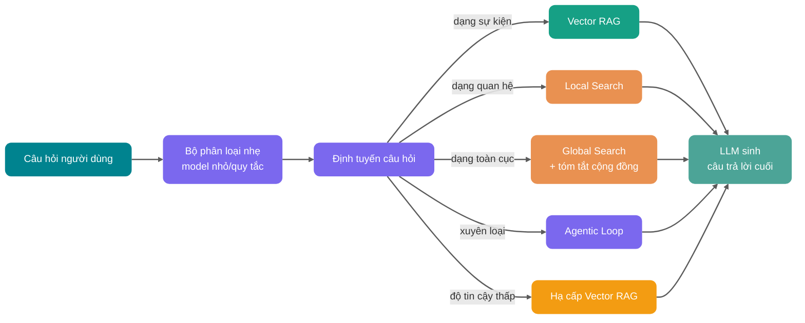

Lần đầu làm hỏi đáp trên knowledge base doanh nghiệp, thường sẽ trải qua một giai đoạn rất giống nhau: chia khối tài liệu, Embedding, vector store, truy vấn Top-K, nhét đoạn vào LLM.

Demo rất suôn sẻ, lãnh đạo hỏi vài câu về quy chế cũng trả lời được. Rồi đồng nghiệp nghiệp vụ đột nhiên hỏi:

> "Nhiều bộ phận này trong nửa năm qua liên tục nhắc tới những điểm rủi ro gì? Chúng có liên quan gì với nhau?"

Vector RAG bắt đầu hết hơi.

Nó có thể tìm thấy vài đoạn tương tự, nhưng rất khó nối các đối tượng "bộ phận" "rủi ro" "dự án" "nhà cung cấp" "dòng thời gian" thành một mạng quan hệ. Phiền phức hơn, câu trả lời thường đến từ suy luận tổ hợp của nhiều tài liệu, chứ không phải một câu có sẵn trong một Chunk nào đó.

Đây là vấn đề GraphRAG cần giải quyết.

Dưới đây Tiểu G sẽ phân rõ các khái niệm cốt lõi và thực hành công nghệ của GraphRAG, trọng điểm đặt ở việc nó và vector RAG truyền thống khác gì, khi nào nên dùng, khi nào đừng đụng vào.

Toàn văn gần 1w chữ, khuyên nên lưu lại trước. Bao phủ chính:

1. Khác biệt giữa RAG và GraphRAG;
2. Quan hệ entity trong knowledge graph và community detection;
3. Global search và local search mỗi loại phù hợp với vấn đề gì;
4. Lộ trình và chi phí triển khai GraphRAG, cùng chỗ thật sự khó triển khai.

## RAG là gì?


RAG (Retrieval-Augmented Generation, sinh tăng cường truy vấn) là framework kết hợp truy vấn thông tin và LLM sinh.

Tư tưởng cốt lõi của nó: trước khi để LLM trả lời câu hỏi hoặc sinh văn bản, trước tiên truy vấn context liên quan từ các nguồn tri thức bên ngoài như database, tập tài liệu, knowledge base doanh nghiệp, rồi đưa "câu hỏi gốc + context truy vấn" cùng giao cho LLM. Như vậy model trả lời chính xác hơn, kịp thời hơn, và phù hợp hơn với tri thức lĩnh vực cụ thể.

Đối tượng truy vấn của RAG truyền thống thường là Chunk, tức từng đoạn văn bản. Nó rất thích hợp để trả lời các câu hỏi kiểu "câu trả lời nằm trong mấy đoạn nào đó", như hỏi đáp quy chế, hỏi đáp tài liệu API, tra cứu sự kiện cục bộ trong knowledge base.

## GraphRAG là gì?


GraphRAG (Graph-based Retrieval-Augmented Generation) có thể hiểu là: **bên ngoài vector retrieval truyền thống, đưa vào knowledge graph, mô hình hóa tường minh entity, quan hệ và context có cấu trúc trong tài liệu. Khi truy vấn, ngoài recall đoạn tương tự, còn dọc theo quan hệ của graph thu thập bằng chứng, rồi giao LLM sinh câu trả lời.**

Lưu ý, trọng điểm của GraphRAG không phải "dùng graph database", mà là **đối tượng truy vấn đã thay đổi**.

Vector RAG truyền thống truy vấn Chunk, tức từng đoạn văn bản. GraphRAG truy vấn node, edge, path, tóm tắt cộng đồng trong một "mạng quan hệ tri thức", kết hợp bằng chứng văn bản gốc để trả lời câu hỏi.

Lấy ví dụ so sánh:

- **Vector RAG** giống như trong thư viện theo ngữ nghĩa tìm vài trang nội dung tương tự.
- **GraphRAG** giống như trước tiên sắp xếp bản đồ quan hệ nhân vật, dòng thời gian sự kiện và mục lục chủ đề, rồi dọc theo manh mối quan hệ tìm bằng chứng.

Vector RAG giỏi phán đoán "đoạn này có giống câu hỏi của tôi không", GraphRAG giỏi hiểu "các đối tượng này thực sự kết nối với nhau thế nào".

## Vector RAG truyền thống có hạn chế gì?


Logic tầng dưới của vector RAG rất trực tiếp:

1. Cắt tài liệu thành Chunk.
2. Dùng model Embedding chuyển Chunk thành vector.
3. Khi người dùng hỏi, chuyển câu hỏi thành vector.
4. Theo độ tương tự recall Top-K Chunk.
5. Nhét Chunk cho LLM sinh câu trả lời.

Bộ giải pháp này rất hữu dụng trong "hỏi đáp sự kiện cục bộ". Ví dụ:

- "Quy trình hoàn tiền là gì?"
- "Quy tắc rate-limit của một API là bao nhiêu?"
- "Trong Spring AI cấu hình vector database như thế nào?"

Vì câu trả lời phần lớn ẩn trong một vài đoạn cục bộ nào đó, chỉ cần recall đủ chính xác, model là sắp xếp được kết quả.

Nhưng vấn đề của hỏi đáp tri thức phức tạp là: **câu trả lời thường không nằm trong một đoạn, mà nằm trong quan hệ giữa các đoạn.**

### 1. Chunk là đảo thông tin

Chia khối là biện pháp công nghệ tất yếu của vector RAG, nhưng nó tự nhiên sẽ cắt đứt context.

Trong một tài liệu, chương một định nghĩa một hệ thống nào đó, chương ba viết người phụ trách, chương năm nhắc đến database nó phụ thuộc, chương bảy ghi lại sự cố gần nhất. Sau khi cắt thành Chunk, những thông tin này nằm rải rác ở các khối văn bản khác nhau.

Vector retrieval chỉ phán đoán được "khối văn bản nào giống câu hỏi nhất", nhưng không biết các khối văn bản này về mặt nghiệp vụ thuộc cùng một đối tượng.

Đây là điểm mù điển hình của vector RAG: **tương đồng ngữ nghĩa không bằng mối quan hệ đầy đủ.**

### 2. Độ tương đồng vector không giỏi suy luận nhiều chặng

Giả sử người dùng hỏi:

> "Người phụ trách của hệ thống A gần đây từng tham gia những lần review sự cố nào liên quan đến chuỗi thanh toán?"

Câu hỏi này ít nhất gồm nhiều tầng chuyển tiếp:

1. Tìm hệ thống A.
2. Tìm người phụ trách hệ thống A.
3. Tìm các buổi review sự cố người này tham gia.
4. Lọc ra các review liên quan đến chuỗi thanh toán.

Vector RAG có thể recall "mô tả hệ thống A" hoặc "review sự cố thanh toán", nhưng nó không tự nhiên có năng lực dọc theo chuỗi quan hệ "hệ thống -> người phụ trách -> review -> chuỗi" để mở rộng bằng chứng.

### 3. Vấn đề toàn cục rất khó trả lời bằng đoạn Top-K

Còn một loại câu hỏi phiền toái hơn:

- "Khiếu nại của nhóm khách hàng này tập trung chủ yếu vào mấy loại vấn đề?"
- "Một năm qua các rủi ro kiến trúc lặp đi lặp lại trong knowledge base công ty là gì?"
- "Chủ đề chiến lược mà mấy báo cáo này cùng hướng tới phía sau là gì?"

Loại câu hỏi này không phải tìm "mấy đoạn giống nhất", mà phải tổng hợp, quy nạp và phân tích chủ đề trên toàn bộ corpus. Truy vấn Top-K chỉ thấy được cửa sổ cục bộ, dễ xuất hiện hai kiểu thất bại:

- Recall quá ít đoạn, không thấy được mô hình tổng thể.
- Recall quá nhiều đoạn, chi phí Token và nhiễu cùng bùng nổ.

Nhiều người lúc này sẽ chỉnh Top-K từ 5 lên 20, thêm rerank, thêm query rewrite. Ngắn hạn có thể giảm bớt, nhưng vấn đề tầng dưới vẫn còn: **bạn vẫn đang dùng độ tương đồng đoạn để giải quyết vấn đề suy luận cấu trúc.**

## Khác biệt bản chất giữa GraphRAG và vector RAG truyền thống


| Chiều   | Vector RAG truyền thống      | GraphRAG                          |
| ------- | ---------------------------- | --------------------------------- |
| Đối tượng truy vấn | Chunk văn bản            | Entity, quan hệ, path, tóm tắt cộng đồng, đoạn văn gốc |
| Năng lực cốt lõi | Recall tương đồng ngữ nghĩa | Suy luận quan hệ, duyệt graph, tổng hợp chủ đề toàn cục |
| Cấu trúc dữ liệu | Chủ yếu chỉ mục vector       | Knowledge graph + chỉ mục vector + chỉ mục toàn văn |
| Bài toán phù hợp | Hỏi đáp sự kiện cục bộ, giải thích đoạn tài liệu | Hỏi đáp quan hệ nhiều chặng, tổng hợp xuyên tài liệu, phân tích nghiệp vụ phức tạp |
| Khả năng giải thích | Chủ yếu dựa vào đoạn trích dẫn | Có thể hiển thị node, quan hệ, path và nguồn |
| Chi phí xây dựng | Trung bình, trọng điểm là chia khối và Embedding | Cao, trọng điểm là trích xuất, khử trùng, mô hình hóa, đánh giá |
| Độ trễ truy vấn | Thường thấp | Phụ thuộc vào duyệt graph, tóm tắt cộng đồng và số lần gọi LLM |
| Chi phí bảo trì | Chỉ cần cập nhật Chunk và vector | Còn phải bảo trì entity, quan hệ, cộng đồng và tóm tắt |
| Rủi ro lớn nhất | Recall đoạn không đầy đủ | Lỗi xây dựng graph gây hiểu sai mang tính hệ thống |

Lời khuyên thực chiến của Tiểu G: **đừng vì đuổi theo công nghệ mới mà vừa lên đã dùng GraphRAG. Trước tiên dùng vector RAG làm baseline, thu gom các trường hợp thất bại; chỉ khi thất bại tập trung ở quan hệ, nhiều chặng, quy nạp toàn cục, mới đưa cấu trúc graph vào.**

Bổ sung một bảng tham chiếu bậc độ lớn (giá trị thực tế có quan hệ chặt với quy mô corpus, mật độ entity, cấu hình):

| Chiều chi phí            | Vector RAG       | GraphRAG (giá trị tham khảo)                                  |
| ------------------------ | ---------------- | ------------------------------------------------------------- |
| **Tiêu hao Token chỉ mục** | Chủ yếu Embedding | Khoảng **5-20 lần** vector RAG (liên quan chặt với số tầng cộng đồng, mật độ entity) |
| **Chi phí lưu trữ**       | Chỉ mục vector   | Vector + Graph + Full-text ba bộ chỉ mục, khoảng **1.5-3 lần** |
| **Độ trễ truy vấn**       | Thường thấp      | Truy vấn graph cục bộ ×1.2-2; truy vấn toàn cục (tổng hợp tóm tắt cộng đồng) có thể đạt **5-10 lần** |
| **Tần suất bảo trì**       | Có thể cập nhật gần thời gian thực | Cập nhật gia tăng graph thường là batch theo ngày/tuần |

Nếu interviewer hỏi "GraphRAG và RAG thông thường khác gì", có thể trả lời như vậy:

> Vector RAG thông thường chủ yếu truy vấn Chunk văn bản, phù hợp hỏi đáp sự kiện cục bộ; GraphRAG sẽ mô hình hóa tường minh entity, quan hệ và cấu trúc chủ đề trong tài liệu thành knowledge graph, khi truy vấn không chỉ tìm đoạn theo ngữ nghĩa, mà còn có thể dọc theo quan hệ graph làm truy vấn nhiều chặng, hoặc dùng tóm tắt cộng đồng trả lời vấn đề toàn cục. Ưu điểm của nó là suy luận quan hệ, quy nạp toàn cục và khả năng giải thích tốt hơn, cái giá là chi phí xây dựng, khử trùng entity, trích xuất quan hệ, cập nhật gia tăng và kiểm soát quyền đều phức tạp hơn.

Nếu interviewer tiếp tục hỏi "khi nào không dùng GraphRAG", có thể bổ sung một câu:

> Nếu vấn đề chủ yếu là hỏi đáp tài liệu đơn giản, hoặc dữ liệu nhỏ, quan hệ không phức tạp, vector RAG cộng hybrid retrieval và rerank thường kinh tế hơn. GraphRAG nên dùng trong kịch bản mà badcase của vector RAG đã chỉ rõ hướng tới quan hệ nhiều chặng, quy nạp xuyên tài liệu và ràng buộc có cấu trúc.

## Các khái niệm cốt lõi của GraphRAG

Muốn hiểu GraphRAG, trước tiên tách mấy từ khóa ra.


### Knowledge graph: biến tri thức thành mạng quan hệ có thể duyệt

**Knowledge Graph (đồ thị tri thức)** về bản chất là một cấu trúc dùng "node + edge" để biểu đạt tri thức.

- **Node (nút)**: biểu thị entity hoặc khái niệm, như người dùng, hệ thống, đơn hàng, sự cố, nhà cung cấp, điều khoản chính sách.
- **Edge (cạnh)**: biểu thị quan hệ giữa các entity, như phụ trách, phụ thuộc, ảnh hưởng, thuộc về, gây ra, trích dẫn.
- **Property (thuộc tính)**: thông tin bổ sung gắn trên node hoặc edge, như thời gian, phiên bản, độ tin cậy, tài liệu nguồn.

Lấy ví dụ:

```text
User service --phụ thuộc--> Redis cluster
Redis cluster --từng xảy ra--> sự cố cạn kiệt connection pool
Sự cố cạn kiệt connection pool --ảnh hưởng--> interface đặt hàng
Trương Tam --phụ trách--> User service
```

Mấy dòng quan hệ này đưa vào graph sau, hệ thống có thể trả lời:

> "Hệ thống mà Trương Tam phụ trách gần đây có những rủi ro nào ảnh hưởng đến chuỗi đặt hàng?"

Vector RAG nhìn thấy là mấy đoạn văn bản; knowledge graph nhìn thấy là kết nối giữa đối tượng và đối tượng.

### Entity: đối tượng nghiệp vụ nhỏ nhất của GraphRAG

**Entity (thực thể)** là node cốt lõi trong graph.

Trong GraphRAG, entity không nhất thiết là "tên người, địa điểm, tổ chức" rất nghiêm ngặt như knowledge graph truyền thống. Nó cũng có thể là:

- Một hệ thống nghiệp vụ, như "trung tâm đơn hàng"
- Một thành phần kỹ thuật, như "Kafka consumer group"
- Một điều khoản quy chuẩn, như "yêu cầu khử nhạy cảm dữ liệu"
- Một chủ đề rủi ro, như "vượt quyền"
- Một sự kiện dự án, như "stress test chuỗi thanh toán"

Việc trích xuất entity tốt hay không, trực tiếp quyết định trần của GraphRAG. Trích quá thô, graph không có chi tiết; trích quá vụn, graph đầy node trùng lặp và nhiễu.

Bước này rất giống làm domain modeling. Vài điểm mấu chốt trong thực hành công nghệ:

- **Dùng JSON Schema ràng buộc chặt format trích xuất**: tránh phân tích văn bản tự do, giảm chi phí hậu xử lý.
- **Few-shot examples phải bao phủ ví dụ đúng, ví dụ sai và ví dụ biên**: cho LLM biết cái gì không nên trích.
- **Đặt giới hạn tối đa số entity**: phòng LLM trích xuất quá mức trong văn bản dài.
- **Mỗi entity bắt buộc có trường `source_text_span`**: dùng để truy nguồn và kiểm tra thủ công.

### Quan hệ: thứ GraphRAG thật sự có thêm so với vector RAG

**Relationship (quan hệ)** là linh hồn của GraphRAG.

Vector RAG có thể bảo bạn "trung tâm đơn hàng" và "sự cố thanh toán" về ngữ nghĩa gần nhau, nhưng nó không tự nhiên bảo bạn giữa hai thứ là "phụ thuộc" "ảnh hưởng" "gây ra" hay "chỉ là xuất hiện cùng lúc".

GraphRAG sẽ cố gắng tường minh hóa quan hệ:

```text
Trung tâm đơn hàng --gọi--> Cổng thanh toán
Cổng thanh toán --phụ thuộc--> Dịch vụ kiểm soát rủi ro
Dịch vụ kiểm soát rủi ro --từng gây ra--> Timeout giao dịch
```

Có quan hệ, retrieval không chỉ là "sắp xếp theo độ tương đồng", mà có thể dọc theo path mở rộng:

- Từ một entity tìm hàng xóm.
- Từ một loại quan hệ tìm thượng nguồn hạ nguồn.
- Từ một sự cố tìm phạm vi ảnh hưởng.
- Từ một chủ đề tìm cộng đồng liên quan.

Đây cũng là chìa khóa để GraphRAG xử lý được vấn đề nhiều chặng.

### Community detection: từ một đống node tìm ra nhóm chủ đề

**Community Detection (phát hiện cộng đồng)** là nhiệm vụ phổ biến trong thuật toán graph, mục tiêu là gộp một nhóm node kết nối chặt hơn trong graph thành một cộng đồng.

Trong GraphRAG, cộng đồng có thể hiểu là "nhóm chủ đề tự nhiên hình thành trong corpus". Ví dụ trong một loạt tài liệu lặp đi lặp lại xuất hiện các node này:

```text
Cổng thanh toán, dịch vụ kiểm soát rủi ro, timeout giao dịch, chiến lược rate-limit, gray release, nâng cấp cảnh báo
```

Giữa chúng quan hệ dày đặc, rất có khả năng tạo thành cộng đồng "tính ổn định thanh toán".

Một cách làm GraphRAG phổ biến: trước tiên từ văn bản trích xuất entity, quan hệ và tuyên bố then chốt, rồi dùng thuật toán **Community Detection** như Leiden để xây dựng cộng đồng phân cấp, cuối cùng sinh tóm tắt cho mỗi cộng đồng. Thuật toán thường gặp gồm Leiden, Louvain... Như vậy khi truy vấn vấn đề toàn cục, không cần nhét toàn bộ tài liệu gốc cho LLM, mà trước tiên xem tóm tắt cộng đồng ở tầng cao hơn.

### Global search và local search

Trong GraphRAG thường thấy hai từ: **Global Search (truy vấn toàn cục)** và **Local Search (truy vấn cục bộ)**.

Chúng tương ứng với hai loại vấn đề hoàn toàn khác nhau.

**Local search** thích hợp trả lời câu hỏi xoay quanh entity cụ thể:

- "Trung tâm đơn hàng phụ thuộc những dịch vụ nào?"
- "Một nhà cung cấp ảnh hưởng đến những dự án nào?"
- "Chuỗi thượng nguồn hạ nguồn của một sự cố là gì?"

Luồng điển hình của nó: trước tiên định vị entity, rồi dọc theo hàng xóm entity, path quan hệ, đoạn văn gốc liên quan mở rộng context.

**Global search** thích hợp trả lời vấn đề tổng thể xuyên corpus:

- "Chủ đề rủi ro lặp đi lặp lại trong loạt báo cáo này là gì?"
- "Khiếu nại của CSKH chủ yếu gom thành mấy loại?"
- "Nút thắt kiến trúc phổ biến nhất trong tài liệu phát triển là gì?"

Luồng điển hình của nó: trước tiên dùng tóm tắt cộng đồng hoặc tóm tắt chủ đề làm tổng hợp, rồi cho LLM quy nạp và sắp xếp.

Một câu để phân biệt:

- **Local search là từ một điểm mở rộng ra ngoài.**
- **Global search là trước tiên xem cấu trúc chủ đề của toàn bộ graph.**

**DRIFT Search**: phiên bản tăng cường của local search, khi mở rộng từ hàng xóm entity đồng thời đưa tóm tắt cộng đồng làm context phụ trợ, cân bằng độ chính xác và tầm nhìn toàn cục. Khi câu hỏi của bạn vừa có trọng tâm entity vừa cần liên kết xuyên cộng đồng, DRIFT có ưu thế hơn local search thuần.

| Chế độ truy vấn  | Kịch bản phù hợp          | Cơ chế cốt lõi               |
| ---------------- | ------------------------- | ---------------------------- |
| Basic Search     | Tra cứu sự kiện thông thường | Truy vấn vector Top-K chuẩn  |
| Local Search     | Hỏi đáp xoay quanh entity cụ thể | Mở rộng từ hàng xóm entity và khái niệm liên quan |
| DRIFT Search     | Trọng tâm entity + liên kết xuyên cộng đồng | Mở rộng cục bộ + context tóm tắt cộng đồng |
| Global Search    | Quy nạp chủ đề toàn cục     | Map-Reduce tóm tắt cộng đồng |

## Quy trình xây dựng và truy vấn của GraphRAG

### Giai đoạn xây dựng: từ tài liệu đến graph

Hình dưới đây minh họa chuỗi cốt lõi của GraphRAG:


Giai đoạn xây dựng của GraphRAG thường gồm các bước:

| Bước       | Làm gì                                        | Rủi ro then chốt                         |
| ---------- | ---------------------------------------------- | ---------------------------------------- |
| Phân giải tài liệu | Từ PDF, trang web, Markdown, bản ghi database trích văn bản | Lỗi OCR, bảng mất cấu trúc, lộn xộn phiên bản tài liệu |
| Tách văn bản | Cắt tài liệu dài thành TextUnit hoặc Chunk     | Chia quá vụn mất quan hệ, chia quá to tăng chi phí trích xuất |
| Trích xuất entity | Nhận diện hệ thống, người, tổ chức, khái niệm, sự kiện trong tài liệu | Entity trùng tên, biệt hiệu, viết tắt, entity nhiễu |
| Trích xuất quan hệ | Nhận diện quan hệ phụ thuộc, bao gồm, ảnh hưởng, nhân quả giữa entity | Hướng quan hệ sai, loại quan hệ quá khái quát, độ tin cậy không đủ |
| Chuẩn hóa graph | Gộp entity trùng lặp, bổ sung thuộc tính và nguồn | Chi phí khử trùng entity cao, cần quy tắc thủ công và đánh giá |
| Community detection | Tìm nhóm chủ đề kết nối dày đặc | Graph quá thưa hoặc quá bẩn thì chất lượng cộng đồng giảm |
| Sinh tóm tắt | Sinh tóm tắt cho cộng đồng, entity, quan hệ | Tóm tắt LLM có thể mất ràng buộc hoặc đưa hallucination |
| Index vào kho | Ghi vào graph database, vector store, full-text index | Cập nhật gia tăng và lọc quyền phức tạp |

Đây cũng là nguyên nhân gốc khiến chi phí triển khai GraphRAG cao: nó nâng "tiền xử lý retrieval" từ việc chia khối văn bản đơn giản lên thành một công trình mô hình hóa tri thức và quản trị dữ liệu.

### Giai đoạn truy vấn: trước tiên phán đoán loại câu hỏi

Bước quan trọng nhất trong giai đoạn truy vấn của GraphRAG là **query routing (định tuyến truy vấn)**.

Câu hỏi của người dùng khác nhau, cách truy vấn cũng khác:

| Loại câu hỏi | Cách truy vấn phù hợp hơn    | Ví dụ                                   |
| ------------ | ----------------------------- | --------------------------------------- |
| Sự kiện cục bộ | Vector retrieval hoặc truy vấn graph cục bộ | "Thời gian timeout của một interface là bao nhiêu?" |
| Quan hệ entity | Truy vấn graph cục bộ        | "Trung tâm đơn hàng phụ thuộc những dịch vụ nào?" |
| Suy luận nhiều chặng | Duyệt graph + bổ sung bằng chứng vector | "Người phụ trách X tham gia những sự cố nào ảnh hưởng chuỗi thanh toán?" |
| Quy nạp toàn cục | Tóm tắt cộng đồng + truy vấn toàn cục | "Chủ đề rủi ro chính của loạt báo cáo này là gì?" |
| Lọc chính xác | Truy vấn graph hoặc truy vấn có cấu trúc | "Quý 4 2025 những dự án nào phụ thuộc nhà cung cấp A?" |

Hình dưới đây minh họa ánh xạ từ loại câu hỏi đến chế độ truy vấn:


Một hệ thống trưởng thành sẽ không ném tất cả câu hỏi cho GraphRAG. Nhiều câu hỏi đơn giản, dùng vector retrieval rẻ hơn, nhanh hơn, ổn định hơn.

## GraphRAG phù hợp với kịch bản nào? Không phù hợp với kịch bản nào?

GraphRAG phù hợp nhất với kịch bản "quan hệ quan trọng hơn độ tương đồng văn bản".

Nó không phải gói nâng cấp mặc định của vector RAG, mà là một kiến trúc truy vấn và quản trị dữ liệu nặng hơn. Phán đoán có nên dùng GraphRAG hay không, cốt lõi không phải "công nghệ mới hay không", mà xem nguyên nhân thất bại của vấn đề có tập trung ở quan hệ, path, chủ đề toàn cục và quy nạp xuyên tài liệu.

Kịch bản điển hình phù hợp dùng GraphRAG:

- **Hỏi đáp phức tạp trên knowledge base doanh nghiệp**: câu hỏi cần xuyên bộ phận, xuyên quy chế, xuyên dự án nối thông tin, ví dụ "quy trình này liên quan đến những bộ phận nào? mỗi bộ phận đảm nhận trách nhiệm gì?" "một quy chế nào đó xung đột với những quy chế lịch sử nào?".
- **Phân tích kiến trúc IT và ảnh hưởng sự cố**: giữa service, interface, database, message queue, người phụ trách, cảnh báo, sự cố tự nhiên có quan hệ phụ thuộc, ví dụ "Redis cluster bất thường ảnh hưởng đến những interface cốt lõi nào?" "những hệ thống nào đồng thời phụ thuộc một thành phần rủi ro cao?".
- **Tài chính, kiểm soát rủi ro, tuân thủ, chuỗi cung ứng**: những lĩnh vực này quan tâm hơn đến quan hệ giữa đối tượng, thay vì đoạn văn bản có tương tự, ví dụ quan hệ giữa khách hàng với tài khoản, doanh nghiệp với người kiểm soát thực tế, nhà cung cấp với dự án, điều khoản hợp đồng với quy tắc giám sát.
- **Quy nạp chủ đề xuyên tài liệu**: khi bạn muốn phân tích mô hình tổng thể của biên bản phỏng vấn, báo cáo nghiên cứu, ticket CSKH, review sự cố, tóm tắt cộng đồng có thể trước tiên gom corpus thành nhóm chủ đề, rồi cho LLM quy nạp toàn cục.

Trường hợp không phù hợp dùng GraphRAG cũng rất rõ:

- **Dữ liệu nhỏ, câu hỏi đơn giản**: nếu knowledge base chỉ có vài chục tài liệu, câu hỏi hầu như là "một quy tắc nào đó là gì", vector RAG cộng hybrid retrieval và rerank thường kinh tế hơn.
- **Chất lượng tài liệu quá kém**: nếu tài liệu nguồn thiếu chủ ngữ, lộn xộn phiên bản, thuật ngữ không thống nhất, lỗi phân giải bảng nghiêm trọng, graph trích ra cũng rất bẩn. Lỗi của vector RAG thường là "tìm nhầm vài đoạn văn bản", lỗi của GraphRAG có thể là "cả mạng quan hệ đi sai hướng".
- **Yêu cầu thời gian thực cực cao**: trích xuất quan hệ entity, community detection, sinh tóm tắt đều làm tăng chi phí cập nhật. Nếu dữ liệu phải hiển thị trong thời gian giây, phải thận trọng đánh giá chi phí cập nhật graph gia tăng và làm mới tóm tắt.
- **Team thiếu năng lực mô hình hóa graph và đánh giá**: GraphRAG cần liên tục trả lời "những entity nào đáng mô hình, loại quan hệ thiết kế thế nào, entity khử trùng ra sao, lỗi graph đánh giá thế nào, lọc quyền đặt ở đâu". Nếu không ai phụ trách những vấn đề này, nó rất dễ thành hộp đen đắt tiền nhưng không kiểm soát được.

Tóm một câu: nếu nguyên nhân thất bại chỉ là "không tìm thấy đoạn văn đó", trước tiên tối ưu retrieval; nếu nguyên nhân thất bại là "tìm thấy nhiều đoạn, nhưng hệ thống không hiểu quan hệ giữa chúng", mới cân nhắc GraphRAG.

## Neo4j GraphRAG phù hợp giải quyết vấn đề gì?

GraphRAG không chỉ có một cách triển khai. Nói chính xác hơn, nó là một loại "đưa cấu trúc graph vào tăng cường retrieval" theo hướng công nghệ. So với việc tạo ra một bộ tóm tắt graph lớn và đầy đủ offline, Neo4j GraphRAG thiên về "kiến trúc truy vấn trực tuyến lấy graph database làm trung tâm", phù hợp nối LLM vào mạng quan hệ doanh nghiệp đã có.

Tư tưởng cốt lõi của nó: đặt knowledge graph trong graph database như Neo4j, đồng thời kết hợp vector index, full-text index và truy vấn Cypher. Khi truy vấn có thể trước tiên qua vector retrieval tìm node khởi điểm, rồi dọc theo quan hệ graph mở rộng hàng xóm, path và bằng chứng thượng nguồn hạ nguồn.

Mô hình điển hình:

1. Câu hỏi người dùng trước tiên làm Embedding hoặc keyword retrieval.
2. Trong graph tìm entity hoặc node tài liệu liên quan làm khởi điểm.
3. Dùng Cypher dọc theo quan hệ duyệt, tìm node hàng xóm, path và thuộc tính.
4. Lắp ráp path, thuộc tính node, đoạn văn gốc thành context.
5. Cho LLM dựa trên bằng chứng có cấu trúc này trả lời.

Neo4j chính thức cung cấp gói Python `neo4j-graphrag`, gồm xây dựng knowledge graph, vector index, luồng sinh GraphRAG và nhiều loại retriever. Nó không chỉ làm được "vector recall + duyệt graph", mà có thể theo loại câu hỏi chọn chế độ truy vấn khác nhau.

| Chế độ truy vấn                            | Cách làm                                                              | Câu hỏi phù hợp                                   |
| ------------------------------------------- | --------------------------------------------------------------------- | ------------------------------------------------- |
| **VectorRetriever**                         | Dựa trên vector index của Neo4j làm truy vấn độ tương đồng, trả về node và điểm khớp | Truy vấn ngữ nghĩa thông thường, tìm entity ứng viên |
| **VectorCypherRetriever**                   | Trước tiên vector retrieval trúng node, rồi thực thi truy vấn Cypher mở rộng context | "Sau khi tìm được tài liệu tương tự, mang theo entity, path, thuộc tính liên quan" |
| **HybridRetriever / HybridCypherRetriever** | Kết hợp vector index và full-text index, khi cần thiết dùng Cypher bổ sung context graph | Knowledge base doanh nghiệp mà từ khóa và ngữ nghĩa đều quan trọng |
| **Text2Cypher**                             | LLM theo graph Schema sinh Cypher, kết quả truy vấn rồi giao LLM tổ chức câu trả lời | Lọc có cấu trúc chính xác, truy vấn nhiều điều kiện, hỏi đáp dạng báo cáo |
| **ToolsRetriever**                          | Bọc nhiều retriever thành tool, cho LLM theo ý định câu hỏi chọn       | Định tuyến câu hỏi phức tạp, tổ hợp nhiều retriever |
| **Vector store ngoài + Neo4j**              | Vector lưu trong Weaviate, Pinecone, Qdrant... rồi ánh xạ về node Neo4j | Đã có hạ tầng vector, không muốn chuyển toàn bộ vector vào Neo4j |

Trong đó có giá trị công nghệ nhất là **VectorCypherRetriever** và **Text2Cypher**.

Ưu thế của VectorCypherRetriever là ổn định: vector retrieval chỉ chịu trách nhiệm tìm khởi điểm, context thật sự do truy vấn Cypher kiểm soát được bổ sung. Ví dụ trúng node "cổng thanh toán" rồi, dọc theo các quan hệ `[:DEPENDS_ON]`, `[:AFFECTS]`, `[:OWNER]` lấy thượng nguồn hạ nguồn, phạm vi ảnh hưởng và người phụ trách, kết quả dễ giải thích hơn.

Ưu thế của Text2Cypher là chính xác: nó có thể chuyển câu hỏi như "Quý 4 2025 những dự án ưu tiên cao nào phụ thuộc nhà cung cấp A?" thành truy vấn có cấu trúc. Nhưng loại mô hình này nhất định phải kiểm soát ranh giới, ít nhất phải làm Schema whitelist, kiểm tra truy vấn, quyền chỉ đọc, giới hạn số lượng kết quả và kiểm soát timeout. Trong kịch bản rủi ro cao, khuyến nghị dùng query template hoặc công cụ semantic layer trước, thay vì thả lỏng hoàn toàn cho LLM tự do viết Cypher.

Ví dụ kiểm soát rủi ro tài chính, chuỗi cung ứng, quản lý tài sản IT, quản trị quyền, phân tích ảnh hưởng sự cố, quan hệ đối tượng trong những lĩnh vực này vốn rất quan trọng. Ưu thế của Neo4j GraphRAG là: **cho LLM kết nối quan hệ nghiệp vụ đã có, thay vì mỗi lần đoán quan hệ tạm bợ từ văn bản.**

## Còn những triển khai GraphRAG nào khác?

Ngoài Neo4j, còn vài hướng phổ biến đáng tìm hiểu.

| Hướng triển khai                    | Tư tưởng cốt lõi                                                                                           | Trường hợp phù hợp                                                            |
| ----------------------------------- | ---------------------------------------------------------------------------------------------------------- | ----------------------------------------------------------------------------- |
| **LangChain + Neo4j**               | Dùng `Neo4jGraph` kết nối Neo4j, dùng các component như `GraphCypherQAChain` chuyển ngôn ngữ tự nhiên thành Cypher, rồi dựa trên kết quả truy vấn sinh câu trả lời | Đã dùng LangChain / LangGraph, muốn nhanh chóng kết nối graph database vào chuỗi Agent hoặc RAG |
| **LlamaIndex PropertyGraphIndex**   | Thông qua `kg_extractors` từ Chunk tài liệu trích xuất entity và quan hệ, xây dựng chỉ mục property graph có thể truy vấn | Việc ingestion, chỉ mục và truy vấn tài liệu vốn đã trong hệ sinh thái LlamaIndex |
| **FalkorDB GraphRAG SDK**           | Dựa trên graph database hỗ trợ OpenCypher, full-text index, vector similarity và range index làm GraphRAG  | Muốn thử graph database ngoài Neo4j, hoặc quan tâm hơn đến truy vấn graph độ trễ thấp, đa tenant |
| **Graph nhẹ tự xây + vector store** | Dùng bảng nghiệp vụ hoặc bảng edge lưu vài quan hệ entity cốt lõi, vector store chỉ chịu trách nhiệm recall văn bản ứng viên, rồi dùng bảng quan hệ bổ sung context | Xác minh phiên bản đầu GraphRAG có giá trị không, không muốn ngay từ đầu đưa graph database đầy đủ |

Khác biệt của những hướng này không nằm ở "ai cấp cao hơn", mà ở chỗ bạn muốn đặt mức phức tạp vào đâu.

Nếu bạn đã có graph nghiệp vụ ổn định, quan hệ entity rõ ràng và nhu cầu truy vấn có cấu trúc mạnh, Neo4j GraphRAG là tuyến chính tự nhiên nhất. Nếu engineering stack của bạn đã đặt cược vào LangChain hoặc LlamaIndex, ưu tiên tái sử dụng component truy vấn graph của chúng sẽ tiết kiệm chi phí tích hợp hơn. Nếu chỉ muốn xác minh "mở rộng quan hệ có cải thiện câu trả lời không", graph nhẹ tự xây ngược lại phù hợp hơn cho phiên bản đầu.

## GraphRAG thật sự khó triển khai ở đâu?

Thứ GraphRAG dễ bị đánh giá thấp nhất, không phải bản thân graph database, mà là sau khi "biến một đống văn bản thành mạng quan hệ dùng được", còn phải bảo trì nó lâu dài.

Công việc cốt lõi của vector RAG thông thường là phân giải tài liệu, cắt Chunk, ghi vector, làm recall. GraphRAG có thêm cả một bộ công trình quan hệ: entity phải trích chính xác, hướng quan hệ không được sai, graph phải cập nhật được, quyền không được rò rỉ, hiệu quả còn phải đánh giá được.

### 1. Entity dễ trích trùng, trích sai, trích quá vụn

Cùng một entity có thể có nhiều tên:

```text
Trung tâm đơn hàng, dịch vụ đơn hàng, order-service, OMS
```

Chúng rốt cuộc có phải cùng một entity không? Khi nào gộp, khi nào tách?

Việc này không thể hoàn toàn dựa vào LLM đoán. Trong production thường phải trang bị:

- Từ điển thuật ngữ
- Bảng biệt hiệu
- Khớp quy tắc
- Kiểm tra thủ công
- Ngưỡng độ tin cậy
- Tập đánh giá

Khử trùng entity làm không tốt, graph sẽ thành một đống node trùng lặp, path truy vấn cũng đứt.

### 2. Hướng quan hệ sai một cái, câu trả lời lệch mang tính hệ thống

Quan hệ còn dễ sai hơn entity.

"A phụ thuộc B" và "B phụ thuộc A" chỉ khác một hướng, nhưng ý nghĩa công trình hoàn toàn ngược nhau. Quan hệ nhân quả, quan hệ ảnh hưởng, quan hệ bao gồm cũng rất dễ bị LLM trích sai.

Trong môi trường production, khuyến nghị thêm các trường này cho quan hệ:

| Trường                    | Vai trò                            |
| ------------------------- | ---------------------------------- |
| `source_doc_id`           | Truy nguồn tài liệu                |
| `source_span`             | Truy nguồn vị trí văn bản gốc      |
| `confidence`              | Ghi độ tin cậy trích xuất          |
| `relation_type`           | Kiểm soát loại quan hệ             |
| `updated_at`              | Hỗ trợ cập nhật gia tăng           |
| `extraction_model_version`| Sau khi LLM nâng cấp làm trích lại chênh lệch và so sánh A/B |

Graph không có nguồn truy nguồn, không nên dùng trực tiếp cho hỏi đáp rủi ro cao.

### 3. Tóm tắt cộng đồng không miễn phí

Giải pháp GraphRAG lấy tóm tắt cộng đồng làm cốt lõi, điểm mạnh là quy nạp toàn cục, nhưng tóm tắt không miễn phí.

Giai đoạn xây dựng cần gọi LLM:

- Trích xuất entity và quan hệ.
- Sinh mô tả entity.
- Sinh tóm tắt cộng đồng.
- Khi cập nhật phiên bản sau làm mới tóm tắt liên quan.

Nếu corpus lớn, chi phí chỉ mục có thể cao hơn rõ rệt so với vector RAG thông thường. Khuyến nghị trước tiên dùng corpus nhỏ xác minh lợi ích, rồi mới quyết định có đưa tóm tắt cộng đồng đa tầng và truy vấn toàn cục không.

### 4. Cập nhật một tài liệu, có thể khuấy động cả một vùng graph

Vector RAG thông thường cập nhật một tài liệu, thường là xóa Chunk cũ, rồi ghi Chunk và vector mới.

GraphRAG cập nhật một tài liệu, có thể ảnh hưởng:

- Node entity
- Edge quan hệ
- Phân chia cộng đồng
- Tóm tắt cộng đồng
- Tóm tắt entity
- Chỉ mục vector
- Chỉ mục quyền

Nếu mỗi lần đều rebuild toàn bộ, chi phí cao; nếu làm cập nhật gia tăng, độ phức tạp công trình cao.

Đây cũng là chỗ GraphRAG giống data engineering hơn RAG thông thường: nó không chỉ bảo trì chỉ mục, mà đang bảo trì một cấu trúc tri thức thay đổi liên tục.

### 5. Lọc quyền không thể chỉ nhìn cấp tài liệu

Knowledge base doanh nghiệp không tránh được chuyện quyền.

Trong vector RAG, cách làm phổ biến là trước hoặc trong khi truy vấn làm lọc metadata. Trong GraphRAG còn phải xem xét:

- Người dùng xem được một node, nhưng có xem được hàng xóm của nó không?
- Người dùng xem được một edge, nhưng có xem được entity khác mà edge kết nối không?
- Tóm tắt cộng đồng có lẫn thông tin của tài liệu không có quyền không?
- Tóm tắt toàn cục có rò rỉ chủ đề nhạy cảm không?

Đặc biệt là tóm tắt cộng đồng, nó có thể do nhiều tài liệu cùng sinh ra. Nếu một phần tài liệu không hiển thị với người dùng hiện tại, tóm tắt có thể thành điểm rò rỉ ngầm. Chiến lược ứng phó:

- **Tóm tắt cộng đồng sinh theo nhóm quyền**: mỗi nhóm quyền sinh tóm tắt độc lập, khi truy vấn chỉ trả về tóm tắt cộng đồng mà người dùng có quyền.
- **Trường truy nguồn tóm tắt giữ tất cả ID tài liệu nguồn**: khi truy vấn kiểm tra giao của quyền người dùng với ID tài liệu nguồn, lọc bỏ bằng chứng không có quyền.
- **Corpus nhạy cảm cao không tham gia tổng hợp cộng đồng**: đi riêng kênh truy vấn cục bộ, tránh rò rỉ xuyên tài liệu.

## Bạn sẽ triển khai GraphRAG vào project như thế nào?

Tiểu G không khuyến nghị ngay từ đầu dùng GraphRAG hoàn chỉnh. Đường an toàn hơn là tiến hóa theo từng giai đoạn.

### Giai đoạn một: trước tiên làm tốt baseline vector RAG

Trước tiên làm chắc năng lực cơ bản:

- Phân giải tài liệu ổn định.
- Chiến lược Chunk đánh giá được.
- Vector retrieval + BM25 hybrid retrieval.
- Rerank có thể cắm thay.
- Nguồn trích dẫn truy nguồn được.
- Lọc quyền đáng tin.

Nếu những thứ này chưa làm tốt, dùng GraphRAG chỉ làm phức tạp thêm vấn đề.

### Giai đoạn hai: thu gom trường hợp thất bại dạng quan hệ

Đừng theo cảm giác phán đoán có cần GraphRAG không. Khuyến nghị phân loại Badcase của RAG:

| Loại Badcase            | Có phù hợp GraphRAG không            |
| ----------------------- | ------------------------------------ |
| Đơn thuần không recall được từ khóa | Trước tiên tối ưu BM25 và query rewrite |
| Chunk chia không hợp lý  | Trước tiên tối ưu Chunking           |
| Cần suy luận quan hệ xuyên entity | Phù hợp đưa cấu trúc graph vào       |
| Cần quy nạp chủ đề toàn cục       | Phù hợp đưa tóm tắt cộng đồng vào    |
| Cần lọc chính xác và ràng buộc quyền | Phù hợp kết hợp truy vấn có cấu trúc |

Chỉ khi badcase tập trung rõ vào quan hệ và quy nạp toàn cục, GraphRAG mới có hiệu quả kinh tế.

### Giai đoạn ba: bắt đầu từ graph nhẹ

Phiên bản đầu không nhất thiết phải làm knowledge graph đầy đủ.

Có thể trước tiên làm một bản nhẹ:

- Chỉ trích xuất entity cốt lõi, như hệ thống, interface, người phụ trách, sự cố, điều khoản quy chế.
- Chỉ giữ ít quan hệ giá trị cao, như phụ thuộc, phụ trách, ảnh hưởng, thuộc về, trích dẫn.
- Graph chỉ dùng để mở rộng truy vấn, không trực tiếp dùng cho phán đoán sự kiện cuối cùng.
- Mỗi quan hệ đều giữ bằng chứng văn bản gốc.

Như vậy có thể dùng chi phí thấp xác minh GraphRAG có thật sự cải thiện chỉ số nghiệp vụ không.

### Giai đoạn bốn: rồi mới đưa community detection và truy vấn toàn cục

Khi quy mô corpus lớn lên, và vấn đề toàn cục nhiều lên, mới cân nhắc community detection và tóm tắt cộng đồng.

Giai đoạn này phải trọng điểm đánh giá:

- Việc phân chia cộng đồng có khớp trực giác nghiệp vụ không.
- Tóm tắt cộng đồng có bỏ sót ràng buộc then chốt không.
- Câu trả lời toàn cục có trích dẫn ổn định không.
- Tóm tắt mà người dùng quyền khác nhau thấy được có an toàn không.

Nếu đánh giá không theo kịp, đừng mở truy vấn toàn cục cho kịch bản rủi ro cao.

### Giai đoạn năm: đưa Hybrid RAG routing (hình thái cuối tùy chọn)

Sau giai đoạn bốn, hệ thống trưởng thành thường không phải GraphRAG thuần, mà là kiến trúc hybrid định tuyến động theo loại câu hỏi:



Điểm thiết kế then chốt: bộ phân loại đầu vào phải giải thích được, chiến lược hạ cấp phải rõ ràng, log định tuyến phải truy vết được.

## Đánh giá GraphRAG triển khai thế nào?

Toàn văn nhấn mạnh tầm quan trọng của "vòng đánh giá khép kín", nhưng cụ thể đánh giá thế nào? Khuyến nghị ba tầng:

### Chỉ số tầng truy vấn

- **Entity recall rate / Relationship recall rate**: đánh giá kết quả truy vấn có bao phủ entity và quan hệ cần cho câu trả lời không
- **Community consistency**: việc phân chia cộng đồng có khớp trực giác nghiệp vụ không, có thể dùng kiểm tra thủ công lấy mẫu

### Chỉ số tầng sinh

- **Faithfulness (độ trung thành)**: câu trả lời sinh ra có trung thành với context truy vấn được không, khuyến nghị dùng framework RAGAS
- **Answer Relevance (độ liên quan câu trả lời)**, **Context Precision (độ chính xác ngữ cảnh)**

### Chỉ số tầng nghiệp vụ

- **Tỷ lệ chấp nhận người dùng, tỷ lệ chuyển người, tỷ lệ click trích dẫn**: hiệu quả nghiệp vụ cuối cùng
- **Tập test hồi quy**: khuyến nghị mỗi tuần thêm 20-50 câu hỏi thực tế nghiệp vụ, lâu dài tích lũy đến hàng nghìn

## So sánh với các hướng tăng cường RAG khác

GraphRAG không phải hướng tăng cường RAG duy nhất, hiểu tọa độ ngang sẽ giúp lựa chọn công nghệ:

| Giải pháp                             | Vấn đề giải quyết            | Vấn đề chưa giải quyết |
| -------------------------------------- | ---------------------------- | ---------------------- |
| **Multi-vector (ColBERT/Late Interaction)** | Khớp chi tiết hạt trong Chunk | Vấn đề quan hệ         |
| **HyDE / Query Rewriting**             | Khác biệt diễn đạt query và doc | Suy luận nhiều chặng   |
| **Self-RAG / Corrective RAG**          | Độ tin cậy câu trả lời       | Cấu trúc truy vấn      |
| **GraphRAG**                           | Quan hệ + quy nạp toàn cục   | Chi phí cao nhất       |

GraphRAG hiện là giải pháp duy nhất giải quyết có hệ thống "suy luận quan hệ + quy nạp toàn cục", nhưng cái giá cũng cao nhất.

<!-- @include: @rag-project.snippet.md -->

## Tổng kết

Giá trị của GraphRAG không nằm ở chỗ nghe có vẻ cấp cao, mà nằm ở chỗ nó bù vào một điểm yếu mang tính cấu trúc của vector RAG truyền thống: **vector retrieval giỏi tìm đoạn tương tự, nhưng không giỏi hiểu quan hệ giữa các đoạn.**

GraphRAG mở rộng đối tượng truy vấn từ Chunk văn bản sang entity, quan hệ, path, tóm tắt cộng đồng. Nó phù hợp suy luận nhiều chặng, phân tích ảnh hưởng, phân tích quy nguyên nhân và hỏi đáp nghiệp vụ phức tạp, nhưng cái giá là chi phí quản trị dữ liệu cao hơn. Neo4j GraphRAG phù hợp kịch bản đã có quan hệ nghiệp vụ; LangChain/LlamaIndex... phù hợp tích hợp vào tech stack hiện có. Chọn hướng nào, xem tech stack của bạn, độ phức tạp graph model và năng lực vận hành.

Cuối cùng cho một tiêu chuẩn phán đoán rất thực dụng: nếu nguyên nhân thất bại RAG của bạn chỉ là "không tìm thấy đoạn văn đó", trước tiên tối ưu retrieval; nếu nguyên nhân thất bại là "tìm thấy nhiều đoạn, nhưng hệ thống không hiểu quan hệ giữa chúng", mới cân nhắc GraphRAG.

## Tài liệu tham khảo

- [Neo4j: What Is GraphRAG?](https://neo4j.com/blog/genai/what-is-graphrag/)
- [Neo4j GraphRAG Python Package](https://neo4j.com/docs/neo4j-graphrag-python/current/)
- [Neo4j GraphRAG RAG User Guide](https://neo4j.com/docs/neo4j-graphrag-python/current/user_guide_rag.html)
- [LangChain Neo4j Integration](https://docs.langchain.com/oss/python/integrations/graphs/neo4j_cypher)
- [LlamaIndex PropertyGraphIndex](https://developers.llamaindex.ai/python/framework/module_guides/indexing/lpg_index_guide/)
- [FalkorDB Docs](https://docs.falkordb.com/)
- [GraphRAG: Thực hành truy vấn tri thức doanh nghiệp từ RAG đến GraphRAG](https://juejin.cn/post/7618261670406438964)
- [Framework đánh giá RAGAS](https://docs.ragas.io/)