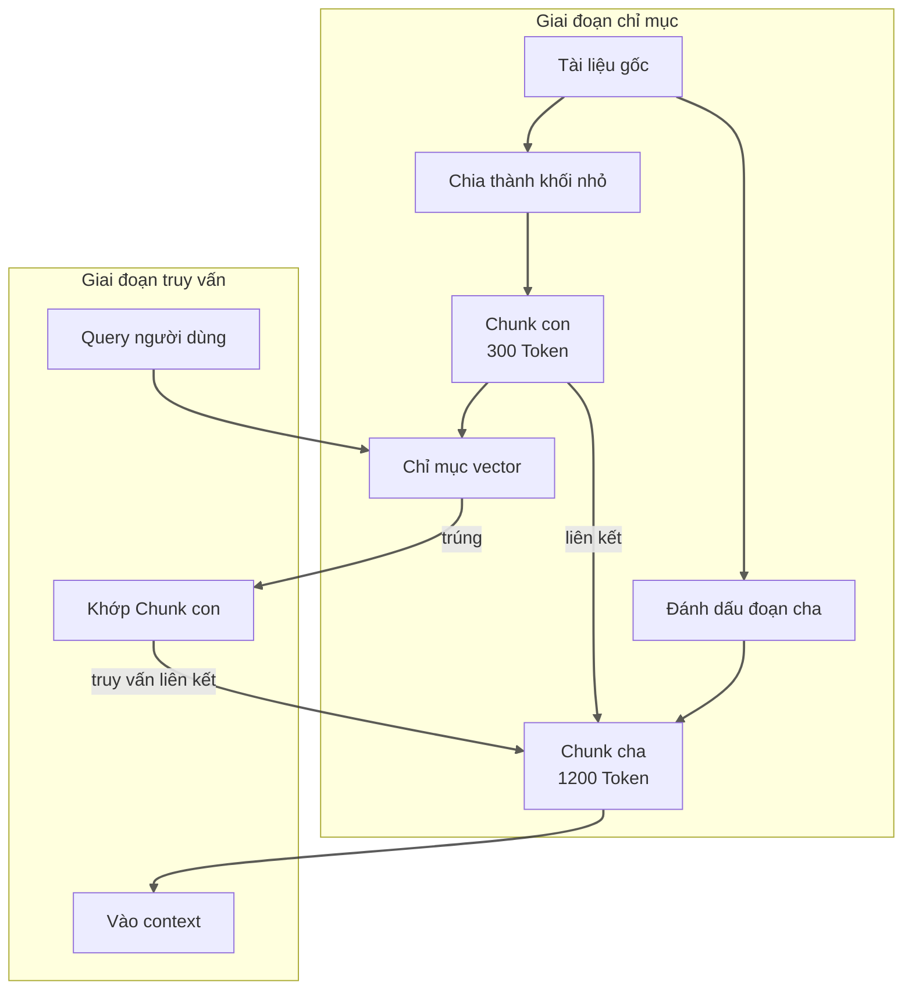
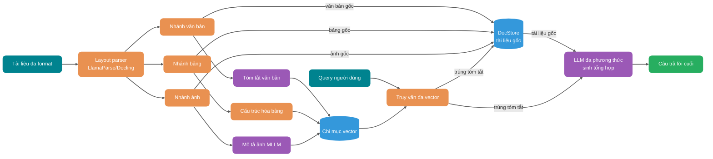

> **Quy ước thuật ngữ**: trong bài này "Chunking" và "phân đoạn", "Embedding" và "nhúng", "Chunk" và "khối" có nghĩa như nhau, thống nhất dùng cách diễn đạt tiếng Việt để giữ tính dễ đọc.

Nhiều team lần đầu dựng hệ thống RAG, đều trải qua một giai đoạn rất thú vị: mua vector database đắt nhất, chỉnh model embedding xịn nhất, lên production rồi phát hiện câu trả lời vẫn tệ hết sức.

Nguyên nhân gốc thường không nằm ở khâu truy vấn, mà ở thượng nguồn hơn — tài liệu căn bản không được phân giải đúng, khi chia khối tách rời cột bảng, Chunk cắt điều kiện và kết luận làm hai nửa, đầu cuối trang bị coi là nội dung chính đưa vào chỉ mục.

Nói cách khác: **nút thắt của RAG thường không nằm ở tầng truy vấn, mà nằm ở đoạn pipeline trước khi tài liệu vào chỉ mục.**

Vấn đề này đặc biệt nổi bật trong kịch bản PDF bố cục nhiều cột, cấp tiêu đề Word, liên kết trường Excel, OCR tài liệu quét. Nhiều team tưởng đổi model embedding mạnh hơn là giải quyết được, thực ra chỉ khiến lỗi biểu đạt ổn định hơn mà thôi.

Bài viết này tách đoạn pipeline này từ đầu đến cuối ra xem. Gần 1w chữ, khuyên nên lưu lại, chủ yếu bao phủ:

1. Chuỗi hoàn chỉnh tài liệu từ upload đến lưu kho và hố của mỗi khâu;
2. Kịch bản phù hợp và dữ liệu đo thực tế của các chiến lược Chunking;
3. Vì sao mất ngữ nghĩa xảy ra và ứng phó thế nào;
4. Vấn đề mất cấu trúc như bảng và nhiều cột;
5. Kiểm tra phân tầng làm thế nào;
6. Ảnh, bảng, biểu đồ thành nội dung truy vấn được như thế nào.

## Tài liệu từ upload đến lưu kho phải qua những khâu nào?

Trước khi nói chiến lược cụ thể, trước tiên vẽ rõ chuỗi. Tài liệu từ lúc upload đến khi vào vector store, ở giữa phải qua ít nhất sáu khâu:


Trong hình này có một điểm dễ bỏ lỡ: kiểm tra chất lượng không nên chỉ xảy ra sau khi vào kho. Làm kiểm tra lấy mẫu ở giai đoạn Chunking, có thể phát hiện vấn đề từ sớm, tránh ghi số lượng lớn dữ liệu chất lượng thấp vào vector store.

> Lưu ý: hình này đơn giản hóa việc kiểm tra trong giai đoạn Chunking, chiến lược kiểm tra phân tầng hoàn chỉnh xem phần "thiết kế chiến lược kiểm tra phân tầng như thế nào" ở phía sau, bao gồm ba tầng kiểm tra format, kiểm tra phân giải và kiểm tra Chunking.

Rủi ro cốt lõi của mỗi khâu:

| Khâu        | Vấn đề điển hình                       | Ảnh hưởng cuối cùng           |
| ----------- | -------------------------------------- | ----------------------------- |
| Upload file | Giả mạo format, vượt giới hạn kích thước, mã hóa loạn | Parser sập hoặc thất bại thầm lặng |
| Kiểm tra format | Extension và loại MIME thực tế không khớp   | Chọn sai parser              |
| Phân tích Layout | PDF nhiều cột, bảng gộp ô, đầu cuối trang | Mất cấu trúc, lệch context   |
| Làm sạch khử nhiễu | Ký tự loạn, ký tự đặc biệt, dòng trống lặp, sót lại mục lục | Nhiễu vào chỉ mục, Embedding méo |
| Chunking    | Cắt sai nghĩa, đứt context, khối quá to hoặc quá nhỏ | Recall không chính xác, câu trả lời thiếu sót |
| Metadata    | Không lưu nguồn, số trang, phiên bản, quyền | Không lọc được, không trích dẫn được |
| Vào kho      | Chiều vector không khớp, vượt giới hạn Token   | Truy vấn thất bại, chỉ mục hỏng |

Nhiều team dồn sức vào đổi embedding model nào, nhưng thực ra nếu dữ liệu đã hỏng ở bước này, đổi model chỉ khiến phần hỏng càng ổn định hơn.

## Làm thế nào chọn chiến lược Chunking phù hợp?


### Chia độ dài cố định: đủ dùng nhưng không hoàn hảo

Cách thô nhất là cắt cứng theo số ký tự hoặc số Token. Ví dụ mỗi 1000 Token cắt một khối, giữa các khối liền nhau chồng lấp 200 Token.

Cách này triển khai đơn giản, hành vi dự đoán được, trong kịch bản tài liệu ngắn và FAQ hiệu quả không tệ. Nhưng điểm chí mạng của nó cũng rất rõ: nó không hiểu thế nào là đoạn, thế nào là bảng, thế nào là khối code.

Trong test thực tế, chênh lệch giữa chia 512-token cố định và chia đệ quy thật ra rất nhỏ — chỉ khoảng 2 điểm phần trăm. Đối với kịch bản xác minh nhanh tính khả thi của RAG, chênh lệch này có thể không đáng để đưa thêm độ phức tạp.

Lấy ví dụ, một đoạn tài liệu chính sách viết:

> "Trừ các trường hợp sau, đều có thể yêu cầu đổi trả 7 ngày không cần lý do: (1) hàng đặt làm riêng; (2) hàng tươi sống dễ hư; (3) sản phẩm số tải trực tuyến..."

Nếu danh sách này vừa nằm trên ranh giới 1000 Token, khối trước có thể chỉ có "Trừ các trường hợp sau, đều có thể yêu cầu đổi trả 7 ngày không cần lý do", khối sau chỉ có "(1) hàng đặt làm riêng...". Xem riêng cái nào cũng không hoàn chỉnh, model rất dễ đứt câu rời ý.

Vậy nên chia độ dài cố định chỉ phù hợp làm baseline, không phù hợp làm đích.

### Chia ký tự đệ quy: giữ lại cấu trúc phân cấp

Tư duy của chia đệ quy (Recursive Character Splitting) rất trực quan: trước tiên theo ký tự xuống dòng tách đoạn, đoạn quá to thì theo dấu chấm câu cắt, câu vẫn quá dài thì theo khoảng trắng cắt, cứ thế xuống từng tầng, cho đến khi mỗi khối đều nhỏ hơn kích thước mục tiêu. Nói cho cùng là mô phỏng cách con người đọc sách — trước tiên xem chương, rồi xem đoạn, rồi xem câu.

Tài liệu của bạn nếu có tiêu đề nhưng không phải cấp nào cũng có nội dung, hoặc độ dài đoạn không đều, thì cấu trúc không đều này dùng chia đệ quy rất hợp. Blog kỹ thuật, sổ tay sản phẩm, báo cáo nghiên cứu đều thuộc loại này.

`RecursiveCharacterTextSplitter` của LangChain là triển khai điển hình của tư duy này. Với nội dung có cấu trúc như code Python, dùng kích thước khối khoảng 100 Token và chồng lấp khoảng 15 Token, có thể đạt cân bằng tốt giữa độ chính xác context và recall rate. Lưu ý: tham số này tối ưu cho tài liệu code, với tài liệu văn bản thông thường khuyến nghị dùng 400-512 Token.

### Chia ngữ nghĩa: chia theo nghĩa, nhưng có cái giá

Chia ngữ nghĩa đi xa hơn: không chia theo ký tự hay cấp, mà dùng model embedding phán đoán độ tương đồng ngữ nghĩa giữa các câu, gộp các câu nghĩa gần nhau thành một nhóm.

Nhưng Tiểu G từng dính cái hố này — chia ngữ nghĩa đặc biệt dễ sinh khối siêu nhỏ. Trong một lần đánh giá, đoạn do chia ngữ nghĩa sinh ra trung bình chỉ 43 Token, khối nhỏ như vậy context nghiêm trọng thiếu, đưa đi truy vấn gần như phế.

Còn vấn đề chi phí: nó cần gọi embedding thừa để tính độ tương đồng câu, tài liệu nhiều lên một cái, bill rất đáng kể. Test thực tế cho thấy hiệu suất của chia ngữ nghĩa cực kỳ nhạy với ngưỡng và tham số min_chunk_size. Đặt min_chunk_size hợp lý (như 200-400 Token) có thể tránh vấn đề đoạn siêu nhỏ, chỉnh tốt rồi hiệu quả tốt hơn nhiều.

### Chia theo cấu trúc tài liệu: ranh giới ngữ nghĩa tự nhiên

Nếu chính tài liệu của bạn đã có cấu trúc rõ ràng, chia theo cấu trúc mới là đáng tin nhất. NVIDIA từng làm một bộ test, Page-Level Chunking (chia theo trang) thể hiện tốt nhất trên báo cáo tài chính và tài liệu pháp lý, độ chính xác trung bình đạt 0.648, phương sai cũng thấp nhất. Lý do rất đơn giản: khi bản thân ranh giới trang chính là ranh giới ngữ nghĩa mà tác giả tài liệu đặt ra, đừng cưỡng ép tách nó ra.

Nhưng đừng mê tín mù quáng việc chia theo trang. Ưu thế này so với chia theo Token thực ra chỉ cao hơn 0.3-4.5 điểm phần trăm, mà trên tập dữ liệu FinanceBench, chia 1024-token ngược lại còn tốt hơn chia theo trang (0.579 vs 0.566). Loại tài liệu NVIDIA test (báo cáo tài chính, tài liệu pháp lý) thuộc kịch bản bản thân việc phân trang đã mang ngữ nghĩa — nếu PDF của bạn là loại Word xuất hú họa, chia theo trang không mang lại lợi ích thêm. Ngoài ra, loại truy vấn cũng ảnh hưởng đến chiến lược tối ưu: truy vấn sự kiện thích hợp dùng khối nhỏ 256-512 Token, truy vấn phân tích thích hợp chia 1024+ Token hoặc theo trang.

Cách chia đề xuất tương ứng cho các loại tài liệu khác nhau, Tiểu G đã tổng hợp một bảng để tham khảo:

| Loại tài liệu | Cách chia đề xuất                | Công cụ triển khai                   |
| ------------- | -------------------------------- | ------------------------------------ |
| Markdown      | Chia theo cấp tiêu đề (H1/H2/H3) | `MarkdownHeaderTextSplitter`         |
| HTML          | Chia theo cấp thẻ (h1~h6, p, div) | `HTMLHeaderTextSplitter`             |
| PDF           | Chia theo trang hoặc chương      | `chunk_by_title`、`chunk_by_page`    |
| Code          | Chia theo hàm, class, package     | `PythonCodeTextSplitter`             |
| Paper         | Chia theo chương, đoạn, bảng      | Layout-aware Parser                  |

### Parent-Child Chunk: thỏa hiệp giữa recall và context

Người làm RAG sớm muộn sẽ gặp một mâu thuẫn: khối nhỏ recall chính xác nhưng context thiếu sót, khối lớn giữ trọn vẹn nhưng recall nhiều nhiễu. Bạn muốn recall chính xác thì phải chia khối nhỏ, nhưng chia nhỏ model chỉ thấy phần cục bộ, câu trả lời dễ đứt câu rời ý.

Parent-Child Chunk chính là giải quyết mâu thuẫn này. Cách làm cụ thể là trước tiên cắt tài liệu thành các khối nhỏ khoảng 300 Token để dùng cho vector retrieval, rồi mỗi khối nhỏ gắn vào một đoạn cha 1200 Token. Khi truy vấn trước tiên trúng khối nhỏ, rồi đưa đoạn cha tương ứng vào context. Như vậy vừa đảm bảo độ chính xác recall, vừa giữ lại context cần thiết.



Mô hình này hiệu quả rõ trong kịch bản tài liệu dài, hướng dẫn, giải thích chính sách, sổ tay xử lý sự cố. Nhược điểm là lượng lưu trữ chỉ mục tăng (mỗi Chunk con đều phải liên kết Chunk cha), khi truy vấn thêm một lần truy vấn liên kết.

### Kiểm soát chồng lấp: cách giải cho vấn đề biên

Dùng chiến lược chia nào cũng vậy, ranh giới khối đều phiền. Hai trang liên tiếp nói cùng một việc, cuối trang trước và đầu trang sau bị số trang cắt cứng ra, khi truy vấn hai khối đều thiếu một nửa.

Chồng lấp (Overlap) là biện pháp chuẩn ứng phó vấn đề này, nhưng chồng lấp cũng không phải càng lớn càng tốt. Quá nhỏ thì ngữ nghĩa đứt ở biên, quá lớn thì nội dung lặp quá nhiều, lãng phí không gian vector còn tăng nhiễu truy vấn. Kinh nghiệm của Tiểu G là coi nó như một tham số cần chỉnh tay, chứ không phải giá trị cố định.

Có test thực tế cho thấy, chia thích ứng căn chỉnh theo ranh giới chủ đề logic có thể đạt hiệu quả tốt — độ chính xác đạt 87%, trong khi baseline kích thước cố định là 50%, chênh lệch có ý nghĩa thống kê (p = 0.001). Nhưng giải pháp thích ứng này triển khai phức tạp, không phải team nào cũng có sức làm.

Giá trị kinh nghiệm thực dụng hơn như sau: văn bản thông dụng dùng kích thước khối 512 Token cộng chồng lấp 50-100 Token, cơ bản đủ dùng; tài liệu code đừng cứng đầu áp số Token, theo ranh giới hàm và class cắt đáng tin hơn; quy chế hợp đồng theo cấu trúc điều, khoản, mục cắt, ưu tiên giữ đơn vị hiệu lực pháp lý; tài liệu bảng dày đặc, bảng đứng làm một khối riêng, tuyệt đối không được cắt xuyên khối.

## Mất ngữ nghĩa là gì, vì sao xảy ra?


Mất ngữ nghĩa là vấn đề trong hệ thống RAG dễ bị bỏ qua nhưng ảnh hưởng to lớn. Nói đơn giản: thông tin then chốt trong tài liệu gốc, trong quá trình phân giải, làm sạch, chia, lưu kho bị suy giảm hoặc mất.

### Kịch bản điển hình của mất ngữ nghĩa

**Loại một: cắt đứt cấu trúc.** Một logic nghiệp vụ hoàn chỉnh bị tách vào hai Chunk. Chunk thứ nhất nói "điều kiện đăng ký", Chunk thứ hai nói "quy trình duyệt", nhưng điều kiện then chốt ở giữa "nếu đạt X, thì cần cung cấp thêm tài liệu Y" bị cắt trên biên, thành "thông tin thiếu sót" mà cả hai Chunk đều có.

**Loại hai: context bốc hơi.** Chunk chỉ giữ nội dung văn bản, nhưng mất thông tin vị trí của nó trong tài liệu. Model đọc "trong ba năm qua..." không biết đây đang nói "đánh giá rủi ro của một nhà cung cấp" hay "lịch sử giao dịch của một khách hàng", vì những bối cảnh này bị mất khi chia.

**Loại ba: phá hủy cấu trúc bảng.** Một bảng nhiều dòng nhiều cột bị phân giải thành văn bản loạn, quan hệ ngữ nghĩa giữa các cột (ai là key chính, ai là thuộc, ai là giá trị số) mất sạch.

**Loại bốn: biến dạng danh từ riêng.** Tài liệu viết "SSO đăng nhập một lần", sau khi chia thành "SSO đăng nhập một...", lúc embedding danh từ riêng bị cắt cụt, khi truy vấn căn bản khớp không được.

### Bản chất của mất ngữ nghĩa

Nói cho cùng, mất ngữ nghĩa là việc chia phá vỡ quan hệ phụ thuộc ngữ cảnh của văn bản gốc, mà model Embedding chỉ nhìn được cửa sổ cục bộ sau khi chia.

Cơ chế chú ý của Transformer tuy xử lý được phụ thuộc đường dài, nhưng mỗi Token cuối cùng chỉ "thấy" được context trong Chunk nó nằm. Nếu thông tin then chốt vượt qua ranh giới Chunk, model không có đủ thông tin để hiểu đúng nó.

Điều này cũng giải thích vì sao Page-Level Chunking trong một số kịch bản ngược lại hiệu quả hơn chia tinh: khi bản thân trang là đơn vị ngữ nghĩa, chia theo trang ngược lại giữ được nhiều context gốc hơn.

### Chiến lược ứng phó

Cách trực tiếp nhất là tăng cửa ngõ ngữ nghĩa. Đừng chỉ index nội dung chính, cho mỗi Chunk sinh tóm tắt và biến thể câu hỏi cùng vào chỉ mục. Người dùng hỏi "tiền rút thế nào", tài liệu viết "đường dẫn yêu cầu hoàn tiền", hai cách diễn đạt này không cùng không gian ngữ nghĩa, nhưng đều trỏ về một câu trả lời. Cho Chunk sinh tóm tắt hoặc câu hỏi đa góc, có thể tăng đáng kể xác suất trúng.

Một biện pháp bị đánh giá thấp khác là giữ metadata phân cấp. Trong Metadata ghi đường dẫn chương, tiêu đề cha con, số đoạn... khi truy vấn có thể lọc theo cấp, khi sinh cũng bù lại được context. Việc này chi phí thấp nhưng lợi lớn, nhiều team lại bỏ qua.

Nếu ngân sách cho phép, có thể thử Late Chunking. Đây là cách khá mới: trước tiên mã hóa cả tài liệu qua Transformer một lần, để embedding của mỗi Token đều chứa sự chú ý toàn văn, rồi trong không gian embedding làm chia và pooling. Lợi là vector của mỗi Chunk đều giữ context tài liệu đầy đủ, hại là chi phí tính toán cao, phù hợp tài liệu không nhiều nhưng yêu cầu độ chính xác cực cao.

Còn một tư duy là dùng một LLM khác phân tích cấu trúc tài liệu, để nó bảo bạn nên chia thế nào (Contextual Chunking). Cách này chi phí cũng cao, nhưng năng lực xử lý cấu trúc tài liệu phức tạp (như bảng lồng nhau, hình chữ hỗn hợp) thật sự mạnh hơn.

## Xử lý vấn đề mất cấu trúc như thế nào?


Mất cấu trúc là tập con của mất ngữ nghĩa, nhưng kịch bản của nó cụ thể hơn, ảnh hưởng cũng trực tiếp hơn.

### Bố cục nhiều cột PDF

PDF là một trong những format phiền nhất. Nhiều PDF phần chính là bố cục hai cột hoặc nhiều cột, nhưng luồng văn bản tầng dưới có thể loạn — đoạn thứ ba của cột một phía sau có thể là đoạn đầu của cột ba, nếu phân giải theo thứ tự vật lý đọc, sẽ có một đống ký tự loạn. Tiểu G từng dính khá nhiều hố: có lần xử lý một white paper hai cột, thứ tự văn bản phân giải ra hoàn toàn sai, đem kết luận cột trái ghép vào trước luận cứ cột phải, câu trả lời truy vấn ra nói không khớp ý.

Cách đáng tin nhất là dùng Layout-Aware Parser, loại parser này nhận diện vị trí vật lý của văn bản (tọa độ x, y), cỡ chữ, khoảng cách đoạn, từ đó suy thứ tự đọc thật. LlamaParse, Docling, Marker-PDF đều hỗ trợ năng lực này.

Với tài liệu đặc biệt quan trọng, Tiểu G khuyên nên làm một vòng so sánh phân giải đa phiên bản — cùng một PDF dùng hai parser chạy một lượt, kiểm tra tính nhất quán output. Nếu hai output khác nhau nhiều, nghĩa là kết quả phân giải không đáng tin, nên hạ cấp xử lý hoặc đánh dấu cần kiểm tra thủ công. Cách này tuy tốn chút thời gian, nhưng tránh được việc lén nhét văn bản loạn thứ tự vào knowledge base.

Còn một kịch bản dễ lật xe: ô gộp trong báo cáo tài chính. Header xuyên cột, mục giá trị xuyên dòng, nếu chỉ theo luồng văn bản phân giải, cấu trúc sẽ loạn hoàn toàn. Loại tài liệu này đừng cố chịu, trực tiếp dùng công cụ trích bảng chuyên dụng (như module TableFormer của Docling).

### Cấp tiêu đề Word

Cấu trúc của tài liệu Word thường dựa vào style tiêu đề thể hiện (Heading 1, Heading 2, nội dung chính). Nhưng nhiều tài liệu lạm dụng style tiêu đề — có người dùng đoạn thường phóng to làm tiêu đề, có người bọc nội dung chính vào Heading 3. Tiểu G từng thấy một cái kỳ lạ hơn: cả tài liệu đều dùng Heading 1, phân giải ra thông tin cấp hoàn toàn vô dụng.

Nếu trực tiếp theo văn bản thuần chia, cấp tiêu đề mất sạch. Cho nên phải dùng `python-docx` đọc thông tin style của tài liệu, theo cấp style xây lại cây tài liệu, rồi theo cấp tiêu đề chia, đảm bảo mỗi Chunk đều biết mình thuộc chương nào. Sau khi chia đưa đường dẫn chương vào Metadata, để truy vấn và sinh dùng.

```python
# Đọc tài liệu Word và giữ cấp tiêu đề
from docx import Document

def extract_sections(doc_path):
    """
    Theo cấp tiêu đề tài liệu Word trích nội dung chương
    """
    doc = Document(doc_path)
    current_heading = None
    current_content = []

    for para in doc.paragraphs:
        if para.style.name.startswith("Heading"):
            # Lưu nội dung dưới tiêu đề trước đó
            if current_heading and current_content:
                yield {
                    "heading": current_heading,
                    "content": "\n".join(current_content),
                }
            current_heading = para.text
            current_content = []
        else:
            if para.text.strip():
                current_content.append(para.text)

    # Xử lý chương cuối cùng
    if current_heading and current_content:
        yield {
            "heading": current_heading,
            "content": "\n".join(current_content),
        }
```

### Liên kết trường Excel

Bảng Excel là dữ liệu có cấu trúc, nhưng cấu trúc của nó thường ẩn trong việc gộp ô, màu sắc, công thức, chứ không phải bản thân văn bản.

Một lỗi phổ biến là coi Excel như file văn bản xử lý — đọc theo dòng, mỗi ô độc lập vào chỉ mục. Làm vậy sẽ mất quan hệ liên kết giữa các cột.

Cách làm đúng phụ thuộc công dụng của Excel:

- Bảng dữ liệu (báo cáo tài chính, báo cáo thống kê): theo dòng hoặc theo vùng dữ liệu trích thành JSON có cấu trúc, mỗi dòng là một bản ghi.
- Bảng cấu hình (bảng tham số, bảng ánh xạ): trích theo cặp header và giá trị, giữ tên trường.
- Tài liệu hỗn hợp (vừa có lời giải thích vừa có bảng): phần chữ theo đoạn xử lý, phần bảng theo dữ liệu có cấu trúc xử lý.

### Chất lượng OCR tài liệu quét

Xử lý tài liệu quét phức tạp hơn. Tài liệu giấy qua OCR chuyển thành chữ số, chất lượng phụ thuộc độ phân giải quét, font chữ, nền giấy và nhiều yếu tố. Kinh nghiệm thực chiến của Tiểu G: chỉ cần dính tài liệu quét, nhất định phải kỳ vọng OCR sẽ sai.

Hố phổ biến nhất có ba cái. Nhận sai ký tự, số 0 và chữ O lẫn nhau, tiếng Trung phồn thể giản thể lẫn nhau, việc này trong số hiệu sản phẩm và số CCCD đặc biệt chí mạng. Lệch dòng, nhận diện đường bảng không chính xác gây lệch dòng cột, báo cáo tài chính lệch một cái là cả bảng phế. Gộp đoạn, văn bản của các đoạn khác nhau bị gộp thành một đoạn, context loạn hết.

Vậy nên chọn engine rất quan trọng. Nhất định phải dùng engine OCR hỗ trợ mạng nơ-ron (như Tesseract 4.x+, Google Document AI, AWS Textract), nhận diện ký tự quang học truyền thống cơ bản có thể loại bỏ. Với tài liệu then chốt, Tiểu G sẽ bật kiểm tra chéo hai engine OCR — chỗ mà kết quả hai engine không khớp, cơ bản là chỗ nhận sai. Ngoài ra, với tài liệu dày đặc số liệu (như báo cáo tài chính) còn phải thêm một tầng kiểm tra nhất quán giá trị, ví dụ tổng theo cột có khớp tổng cộng không.

## Thiết kế chiến lược kiểm tra phân tầng như thế nào?


Không phải tài liệu nào cũng phân giải thành công, cũng không phải kết quả phân giải nào cũng dùng được. Pipeline RAG phải có cơ chế xử lý hạ cấp, nếu không dữ liệu chất lượng thấp sẽ làm bẩn cả knowledge base.

### Phân tầng kiểm tra

Tiểu G khuyên chia kiểm tra thành ba cổng, mỗi cổng quản việc khác nhau.

Trước tiên là kiểm tra format. Sau khi upload file lập tức kiểm tra extension, loại MIME, kích thước file. Tầng này giải quyết vấn đề "upload độc hại" và "sai tham số", chi phí chặn thấp nhất, hiệu quả nhanh nhất.

```java
public class DocumentValidationException extends RuntimeException {
    private final ValidationErrorType errorType;
    private final String fileName;
    private final Object rejectedValue;

    public enum ValidationErrorType {
        FILE_TOO_LARGE,           // Kích thước file vượt giới hạn
        UNSUPPORTED_FORMAT,       // Format không hỗ trợ
        MIME_TYPE_MISMATCH,       // Extension và loại thực tế không khớp
        CORRUPTED_FILE,           // File hỏng
        EMPTY_FILE,               // File rỗng
        ENCODING_ERROR            // Lỗi mã hóa
    }
}
```

Tiếp theo là kiểm tra phân giải. Sau khi phân giải xong kiểm tra có trích được nội dung thành công không, độ dài nội dung có trong khoảng hợp lý không, có ký tự loạn rõ không.

```java
public class ParseResultValidator {

    public ValidationResult validate(DocumentParseResult parseResult) {
        List<String> errors = new ArrayList<>();

        // Kiểm tra nội dung rỗng
        if (parseResult.getContent().isEmpty()) {
            errors.add("Kết quả phân giải rỗng");
        }

        // Kiểm tra tỷ lệ ký tự loạn
        double garbledRate = calculateGarbledRate(parseResult.getContent());
        if (garbledRate > 0.05) {  // Vượt 5% ký tự loạn
            errors.add("Tỷ lệ ký tự loạn quá cao: " + String.format("%.2f%%", garbledRate * 100));
        }

        // Kiểm tra độ dài nội dung bất thường
        int contentLength = parseResult.getContent().length();
        if (contentLength < 100) {
            errors.add("Nội dung quá ngắn, có thể phân giải thất bại");
        }
        if (contentLength > 10_000_000) {  // Vượt 10MB văn bản
            errors.add("Nội dung quá dài, cần xử lý phân mảnh");
        }

        // Kiểm tra tính toàn vẹn cấu trúc (nếu có thông tin cấu trúc)
        if (parseResult.hasStructure()) {
            validateStructure(parseResult.getStructure())
                .forEach(errors::add);
        }

        return new ValidationResult(errors);
    }
}
```

Cuối cùng là kiểm tra Chunking. Sau khi chia xong lấy mẫu kiểm tra chất lượng Chunk: phân bố kích thước khối có hợp lý không, biên có ở vị trí hợp lý không, có vấn đề cắt cụt rõ không.

```java
public class ChunkingQualityReport {
    private final int totalChunks;
    private final int totalCharacters;
    private final double averageChunkSize;
    private final int minChunkSize;
    private final int maxChunkSize;
    private final double chunkSizeStdDev;

    // Mục cảnh báo
    private final List<String> warnings = new ArrayList<>();
    private final List<String> errors = new ArrayList<>();

    public boolean isAcceptable() {
        // Độ lệch chuẩn kích thước Chunk quá lớn cho thấy phân bố không đều
        if (chunkSizeStdDev > averageChunkSize * 0.5) {
            warnings.add("Phân bố kích thước Chunk không đều, độ lệch chuẩn quá lớn");
        }

        // Khối nhỏ nhất quá nhỏ có thể là chia bất thường
        if (minChunkSize < 50) {
            errors.add("Tồn tại Chunk quá nhỏ, có thể chia bất thường");
        }

        // Khối lớn nhất quá lớn có thể cắt cụt thất bại
        if (maxChunkSize > 5000) {
            warnings.add("Tồn tại Chunk quá lớn, có thể vượt context model");
        }

        return errors.isEmpty();
    }
}
```

### Chiến lược xử lý hạ cấp

| Loại kiểm tra thất bại | Chiến lược xử lý                                  |
| ---------------------- | ------------------------------------------------- |
| File rỗng              | Từ chối lưu kho, ghi log ngoại lệ, thông báo người upload |
| Format không hỗ trợ    | Từ chối lưu kho, khuyên chuyển format              |
| Phân giải thất bại     | Vào hàng đợi xử lý thủ công, hoặc dùng parser dự phòng thử lại |
| Tỷ lệ ký tự loạn cao   | Thử OCR hoặc chuyển format, vẫn thất bại thì hạ cấp thành văn bản thuần |
| Chunking bất thường    | Đổi chia độ dài cố định làm phương án chốt lại      |
| Phân giải thành công một phần | Trích phần phân giải được vào kho, phần không phân giải được gắn nhãn |

Hạ cấp không phải bỏ cuộc, mà là để càng nhiều dữ liệu hiệu dụng vào knowledge base càng tốt. Một PDF 100 trang, phân giải thất bại 10 trang, vẫn tốt hơn từ chối tất cả.

## Xử lý nội dung đa phương thức như thế nào?

RAG truyền thống chỉ xử lý văn bản, nhưng tài liệu thế giới thực còn có rất nhiều ảnh, bảng, biểu đồ. Nếu bỏ qua những nội dung này, knowledge base không đầy đủ.

### Nội dung ảnh: ba đường xử lý

Ảnh trong tài liệu có hai vai trò: vật mang thông tin (ảnh chụp màn hình, sơ đồ luồng, ảnh) và nội dung trang trí (đầu trang, logo, watermark). Chiến lược xử lý hoàn toàn khác.

Một cách làm là dùng CLIP vector hóa + gửi lại ảnh gốc. Dùng model CLIP chuyển ảnh thành vector, cùng vector văn bản lưu vào vector store. Khi truy vấn trúng vector ảnh, thì từ object storage kéo ảnh gốc, mã hóa base64 nhét cho LLM đa phương thức (như GPT-4o) hiểu. Lợi là ảnh và văn bản trong cùng một không gian ngữ nghĩa truy vấn, hại là CLIP giỏi ảnh tự nhiên, năng lực hiểu ảnh chụp màn hình và biểu đồ có hạn. Tiểu G đo thực tế, trong tài liệu doanh nghiệp có nhiều ảnh chụp màn hình và dashboard, CLIP cơ bản không giải quyết được.

Một tư duy khác là MLLM mô tả + truy vấn văn bản. Không dùng CLIP vector hóa ảnh, mà dùng LLM đa phương thức (như GPT-4o, Qwen-VL) sinh mô tả văn bản cho ảnh, lưu mô tả văn bản và ảnh gốc cùng nhau. Khi truy vấn trực tiếp khớp văn bản, trúng rồi dùng ảnh gốc làm tăng cường sinh. Giải pháp này thực dụng hơn — nhiều ảnh trong tài liệu doanh nghiệp là ảnh chụp màn hình, sơ đồ luồng, dashboard, CLIP khó hiểu, nhưng MLLM sinh được mô tả chính xác.

Còn một giải pháp engineering hóa hơn là Multi-Vector Retriever (multi-vector index), cách LangChain chủ đạo: trước tiên dùng MLLM sinh tóm tắt có cấu trúc cho ảnh (như "This is a flowchart showing the order processing pipeline..."), tóm tắt vào text vector index, ảnh gốc lưu trong docstore. Khi truy vấn trước tiên trúng tóm tắt, rồi qua doc_id liên kết kéo ảnh gốc, mã hóa base64 ảnh gốc rồi cùng nhét cho LLM đa phương thức sinh.

```python
# Ví dụ LangChain multi-vector retrieval
from langchain.retrievers import MultiVectorRetriever
from langchain.storage import InMemoryByteStore

# Lưu trữ vector tóm tắt
vectorstore = Chroma(collection_name="summaries", embedding_function=OpenAIEmbeddings())

# Lưu trữ tài liệu gốc
docstore = InMemoryByteStore()

retriever = MultiVectorRetriever(
    vectorstore=vectorstore,
    byte_store=docstore,
    id_key="doc_id",
    search_kwargs={"k": 5}
)
# Lưu ý: InMemoryByteStore chỉ dùng để demo, môi trường production nên thay bằng lưu trữ bền vững (như Redis, MongoDB, S3...)
```

### Nội dung bảng: trích có cấu trúc là cốt lõi

Bảng là bài toán khó nhất trong RAG. Phân giải PDF truyền thống sẽ chuyển bảng thành văn bản loạn, quan hệ giữa các cột mất sạch.

Cách cơ bản nhất là phân giải bảng + Markdown hóa. Dùng công cụ phân giải bảng chuyên dụng (LlamaParse, Docling, TableFormer) trích cấu trúc bảng, chuyển thành format bảng Markdown. Bảng Markdown ít nhất giữ được quan hệ dòng cột, LLM hiểu tốt hơn.

```markdown
| Tên sản phẩm | Doanh số Q1 | Doanh số Q2 | Tăng trưởng so quý trước |
| ------------ | ----------- | ----------- | ------------------------ |
| Điện thoại A   | 10,000      | 12,000      | +20%                     |
| Điện thoại B   | 8,000       | 7,500       | -6.25%                   |
```

Nếu bảng là dạng số (như báo cáo tài chính), chuyển thành format JSON có cấu trúc có lợi hơn cho truy vấn và tính toán số liệu. Có thể dùng ngôn ngữ tự nhiên truy vấn nội dung bảng: "Which product had the highest growth in Q2?"

```json
{
  "table_name": "Sales Quarterly Report",
  "headers": ["Product", "Q1 Sales", "Q2 Sales", "Growth Rate"],
  "rows": [
    { "product": "Phone A", "q1": 10000, "q2": 12000, "growth": "20%" },
    { "product": "Phone B", "q1": 8000, "q2": 7500, "growth": "-6.25%" }
  ]
}
```

Tư duy tiến xa hơn là mô tả bảng nhận biết context. Mô tả bảng thông thường là "This is a table showing sales data...", nhưng mô tả này mất bối cảnh nghiệp vụ của bảng. Cách nhận biết context là trước tiên nhận diện chương và chủ đề bảng nằm trong, rồi dùng bối cảnh này làm phong phú mô tả bảng. Kinh nghiệm của Tiểu G là chất lượng mô tả bảng trực tiếp quyết định tỷ lệ trúng truy vấn, đáng để bỏ thời gian làm tốt.

Ví dụ cùng là bảng dữ liệu bán hàng, mô tả dưới chương "Tổng kết năm khu vực Hoa Đông" nên là:

> "Bảng tổng hợp doanh số từng dòng sản phẩm khu vực Hoa Đông năm 2024, thể hiện dữ liệu bán hàng và tỷ lệ tăng trưởng so quý trước của điện thoại A và B trong Q1/Q2, dùng để phân tích hiệu quả thị trường sản phẩm và xây dựng chiến lược quý sau."

Tỷ lệ trúng truy vấn của hai loại mô tả khác nhau rất nhiều.

### Nội dung biểu đồ: Caption và context đều quan trọng

Biểu đồ (đường, cột, tròn, luồng) phức tạp hơn ảnh thường, vì chúng thường có tiêu đề, nhãn trục tọa độ, chú giải và các thông tin meta khác.

Điểm chính khi xử lý biểu đồ:

1. Trích đầy đủ thông tin meta của biểu đồ. Tiêu đề, nhãn trục tọa độ, chú giải, đơn vị, nguồn dữ liệu, thiếu những thông tin này model rất khó hiểu biểu đồ đang nói gì.
2. Sinh caption mô tả. Không phải "Revenue chart", mà là "biểu đồ đường thể hiện xu hướng doanh thu quý của công ty 2020-2024, quý 4 2024 doanh thu đạt đỉnh 12.5 tỷ".
3. Nhận diện quan hệ giữa biểu đồ và nội dung khác. Biểu đồ thường phục vụ minh họa một luận điểm, phần trên và phần dưới của nó thường chứa giải đọc then chốt.

### Chuỗi RAG đa phương thức hoàn chỉnh



Tư duy của chuỗi này là: tóm tắt dùng để truy vấn, văn bản gốc dùng để sinh. Chỉ mục vector lưu tóm tắt có cấu trúc (hoặc mô tả), còn nội dung đa phương thức gốc lưu trong docstore, khi truy vấn trúng mới lấy ra giao LLM đa phương thức tổng hợp.

## Dựng pipeline xử lý tài liệu từ con số 0 như thế nào?


Nếu bạn muốn dựng từ con số 0 một pipeline xử lý tài liệu RAG cấp doanh nghiệp, khuyên của Tiểu G là làm từng bước, đừng nghĩ một phát là xong.

Trước tiên đi thông loạt tài liệu dạng văn bản (Markdown, HTML, TXT), để nó chạy ổn định hết quy trình phân giải, chia, lập chỉ mục, lưu kho. Bước này trọng điểm xác minh: parser có trích đúng cấp tiêu đề không, phân bố kích thước Chunk có khớp kỳ vọng không, Metadata có đầy đủ không. Chuỗi văn bản chưa ổn đã vội lên PDF, phía sau toàn hố.

Văn bản ổn rồi mới công phá PDF. PDF là format chủ lực của tài liệu doanh nghiệp, bảng, biểu đồ, nhiều cột là vùng chịu trận nặng. Khuyên đưa Layout-Aware Parser (LlamaParse hoặc Docling) vào, trước tiên trên ít tài liệu xác minh chất lượng trích bảng và ảnh, rồi dần mở rộng phạm vi bao phủ. Bài học máu của Tiểu G: tuyệt đối đừng lấy toàn bộ PDF lên production, trước tiên lấy 10 mẫu chạy thông đã.

Khi chuỗi văn bản ổn định rồi, mới đưa xử lý đa phương thức cho ảnh và bảng. Ưu tiên xem kịch bản nghiệp vụ — nếu tỷ lệ ảnh và bảng trong tài liệu cao (như báo cáo tài chính, sổ tay sản phẩm), thì phải làm trước; nếu chủ yếu là tài liệu chữ, có thể hoãn lại.

Bước cuối cùng là vòng khép kín chất lượng, cũng là khâu dễ bị cắt bỏ nhất. Trước khi lưu kho thêm kiểm tra chất lượng lấy mẫu: dùng một loạt Query người dùng thật định kỳ chạy recall, so sánh độ trung thực nội dung trước sau phân giải, liên tục lặp parser và chiến lược chia. Pipeline không có kiểm tra chất lượng mà lên production, khác gì cho knowledge base ăn rác.

## Tổng kết

Xử lý tài liệu RAG không phải vấn đề "chỉnh tham số", mà là một công trình hệ thống. Mỗi khâu đều có thách thức riêng:

- Tầng phân giải: phải hiểu cấu trúc tài liệu, Layout-Aware là năng lực cơ bản.
- Tầng làm sạch: phải khử nhiễu nhưng không mất thông tin, ký tự loạn và nội dung lặp là kẻ thù chính.
- Tầng Chunking: phải tìm điểm cân bằng giữa tính toàn vẹn ngữ nghĩa và độ chính xác recall, không có giá trị vạn năng, chỉ có thích ứng kịch bản.
- Tầng Metadata: phải lưu đủ thông tin context, nguồn, phiên bản, quyền, đường dẫn cấp đều là ràng buộc cứng của truy vấn và sinh.
- Tầng đa phương thức: ảnh và bảng là vật mang thông tin quan trọng, không thể bỏ qua đơn giản, cần chiến lược trích và mô tả chuyên dụng.

Cuối cùng nhớ một câu: **trần của RAG do chất lượng dữ liệu quyết định, đáy do chiến lược truy vấn quyết định**. Làm tốt pipeline xử lý dữ liệu, hiệu quả hơn đổi một trăm model embedding.

## Tài liệu tham khảo

- [Databricks: Mastering Chunking Strategies for RAG](https://community.databricks.com/t5/technical-blog/the-ultimate-guide-to-chunking-strategies-for-rag-applications/ba-p/113089)
- [Firecrawl: Best Chunking Strategies for RAG in 2026](https://www.firecrawl.dev/blog/best-chunking-strategies-rag)
- [Premiere AI: RAG Chunking Strategies 2026 Benchmark Guide](https://blog.premai.io/rag-chunking-strategies-the-2026-benchmark-guide/)
- [Weaviate: Chunking Strategies to Improve LLM RAG Pipeline Performance](https://weaviate.io/blog/chunking-strategies-for-rag)
- [Omdena: Document Parsing for RAG - A Complete Guide for 2026](https://www.omdena.com/blog/document-parsing-for-rag)
- [DataCamp: Multimodal RAG - A Hands-On Guide](https://www.datacamp.com/tutorial/multimodal-rag)
- [LangChain: Multi-Vector Retriever for RAG on Tables, Text, and Images](https://www.langchain.com/blog/semi-structured-multi-modal-rag)
- [Procycons: PDF Data Extraction Benchmark 2025](https://procycons.com/en/blogs/pdf-data-extraction-benchmark/)
- [LlamaIndex: Mastering PDF Parsing](https://www.llamaindex.ai/blog/mastering-pdfs-extracting-sections-headings-paragraphs-and-tables-with-cutting-edge-parser-faea18870125)