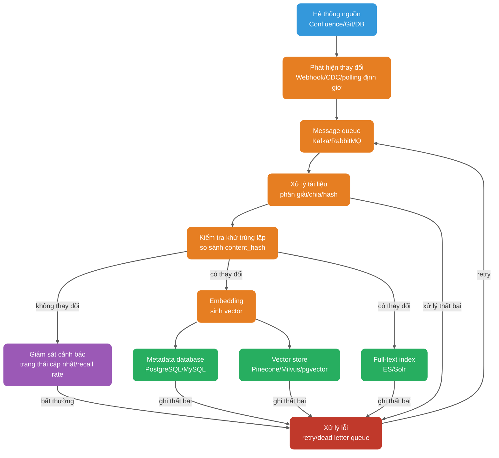
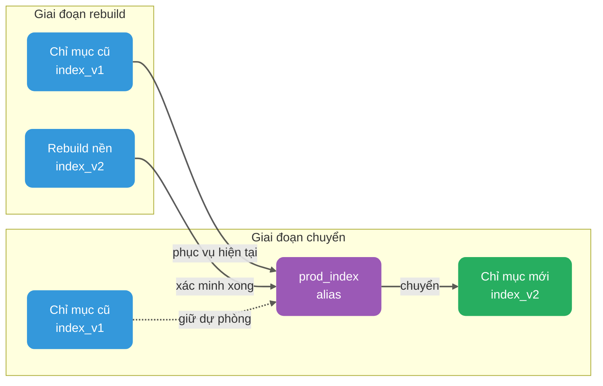

Sau khi hệ thống RAG knowledge base doanh nghiệp đầu tiên lên production, nhiều team đều gặp một vấn đề rất thực: tài liệu rõ ràng đã cập nhật, câu trả lời vẫn như cũ.

Lúc này đừng vội đổ lỗi cho LLM. Nguyên nhân phổ biến hơn là knowledge base không đồng bộ cập nhật, hoặc chuỗi cập nhật chỉ làm "ghi nội dung mới", không xử lý các chi tiết như phiên bản cũ, quyền, nhất quán chỉ mục. Sau khi tài liệu thay đổi thường xuyên, vấn đề càng rõ: mỗi lần xây dựng lại toàn bộ chỉ mục, chi phí và thời gian chịu không nổi; chỉ cập nhật phần thay đổi, lại sợ sót khối cũ; chỉ chèn vector mới, không dọn phiên bản cũ, nội dung quá hạn còn tiếp tục được recall; đổi Embedding model, dữ liệu lịch sử có cần re-index toàn bộ không, cũng không né được.

Phía sau những vấn đề này, thực ra là các mặt tính động, tính chính xác, tính nhất quán, khả năng rollback, khả năng quan sát của knowledge base RAG chưa được xử lý tốt.

Bài viết này nói về thực hành engineering cập nhật knowledge base RAG, toàn văn gần 8000 chữ. Trọng điểm xem mấy vấn đề:

1. Cập nhật knowledge base rốt cuộc phải giải quyết gì;
2. Vì sao tính nhất quán Embedding model là quy tắc cứng đầu tiên;
3. Metadata thiết kế thế nào, mới hỗ trợ được cập nhật gia tăng và rollback phiên bản;
4. Tài liệu thêm mới, sửa đổi, xóa đồng bộ vào vector store và full-text index thế nào;
5. Cập nhật gia tăng và xây dựng lại toàn bộ mỗi loại phù hợp kịch bản nào; gray release, rollback và khả năng quan sát triển khai thế nào;
6. Mấy cái hố dễ vấp nhất trong production.

## Cập nhật knowledge base phải giải quyết những vấn đề gì?

Trước khi nói giải pháp cụ thể, trước tiên nói rõ mục tiêu.

**Cập nhật knowledge base không phải giải quyết "viết thế nào một tác vụ đồng bộ", mà là sau khi cập nhật, câu trả lời của hệ thống vẫn giữ được chính xác, nhanh, không vượt quyền, và khi có vấn đề định vị được, phục hồi được.**

Tính động chỉ, tài liệu đổi, chỉ mục phải theo kịp. "Kịp thời" này không nhất thiết là cấp giây, có thể cấp phút, cũng có thể cấp ngày, tùy thuộc yêu cầu thời gian thực của nghiệp vụ. Kho quy chế nội bộ có lẽ đồng bộ một lần một ngày là đủ, knowledge base CSKH và điều khoản tuân thủ có thể cần nhanh hơn.

Tính chính xác chỉ, sau khi cập nhật nội dung recall phải khớp tài liệu hiện tại, không thể tài liệu đã đổi mà model còn trích dẫn phiên bản cũ. Vấn đề này một khi xảy ra, cảm nhận của người dùng rất rõ.

Tính nhất quán phiền to hơn. Cùng một tài liệu có nhiều phiên bản, vector store, metadata database, full-text search lại là các hệ thống khác nhau, bất kỳ một đầu nào bỏ sót hoặc trễ, đều có thể dẫn đến kết quả không nhất quán.

Khả năng rollback là để khi có sự cố có thể nhanh chóng quay về trạng thái lành mạnh trước đó, thay vì dựa vào người sửa dữ liệu tạm thời. Khả năng quan sát thì yêu cầu quá trình cập nhật giám sát được, kết quả cập nhật đánh giá được, nguyên nhân thất bại truy được đến khâu cụ thể.

Những mục tiêu này trông như tri thức thông thường, nhưng nhiều project chỉ làm bước đầu "cập nhật", mấy bước sau đều dựa vào may mắn. Kết quả là tài liệu sửa mười bản, câu trả lời còn dừng ở bản một; xóa một tài liệu nhạy cảm, vài tháng sau vẫn recall được ra.

## Vì sao Embedding model phải giữ nhất quán?

Điểm này phải tách riêng ra nói: Embedding model dùng lúc lập chỉ mục, phải khớp với model dùng lúc truy vấn.

Embedding model chuyển văn bản thành vector, không gian vector của các model khác nhau không dùng chung. Cùng một câu dùng `text-embedding-3-small` của OpenAI mã hóa, và dùng `all-MiniLM-L6-v2` của sentence-transformers mã hóa, vector nhận được không so sánh được. Nếu chỉ mục dùng model A, truy vấn dùng model B, khác gì trong hai không gian khác nhau tính độ tương tự.

Biểu hiện cụ thể còn phải xem chiều vector. Nếu chiều khác nhau, thường không đưa vào cùng một chỉ mục được, nhiều vector store sẽ trực tiếp từ chối chèn hoặc truy vấn. Nếu chiều giống nhưng model khác, điểm độ tương tự cũng không so sánh được, kết quả recall không tin được. Nó không phải "ngẫu nhiên" đơn giản, mà nền móng sắp xếp toàn bộ đã hỏng.

Hai kịch bản dễ bỏ qua nhất trong production.

**Kịch bản một là nâng cấp model.** Phía nghiệp vụ thấy model mới hiệu quả hơn, muốn chuyển từ `text-embedding-3-small` sang `text-embedding-3-large`. Điều này nghĩa là dữ liệu lịch sử phải mã hóa lại, re-index lại. Về mặt engineering có thể dùng song song hai chỉ mục và gray cut-credit để giảm rủi ro, nhưng bước xây dựng lại không né được.

**Kịch bản hai là dùng lẫn model local và model API.** Môi trường test dùng sentence-transformers local, môi trường production dùng OpenAI API. Khác biệt này rất phổ biến trong hợp tác team, test trông bình thường, lên production recall rate trực tiếp chặt một nửa.

Cách vững là viết thông tin Embedding model vào metadata, mỗi lần truy vấn đều kiểm tra phiên bản model. Không khớp thì hoặc từ chối truy vấn, hoặc đánh log cảnh báo và hạ cấp sang chiến lược recall thận trọng hơn.

| Trường                     | Giải thích     | Ví dụ                     |
| -------------------------- | -------------- | ------------------------- |
| `embedding_model`          | Tên model      | `text-embedding-3-large`  |
| `embedding_model_version`  | Phiên bản model| `2025-01-15`              |
| `embedding_dimension`      | Chiều vector   | `3072`                    |

Khi Embedding model cần nâng cấp, khuyên đi theo quy trình sau:

1. Trong chỉ mục mới dùng model mới xây dựng lại toàn bộ dữ liệu.
2. Chỉ mục cũ mới song song chạy một thời gian, so sánh recall rate và chất lượng câu trả lời.
3. Xác nhận chỉ mục mới ổn định rồi, qua index alias chuyển traffic sang chỉ mục mới.
4. Giữ chỉ mục cũ một thời gian, dùng để rollback nhanh.
5. Xác nhận không còn vấn đề rồi, mới xóa chỉ mục cũ.

Tư duy này rất giống blue-green deploy của database: đừng sửa tại chỗ, trước tiên dựng một bộ mới, xác minh xong rồi mới cắt.

## Thiết kế hệ thống metadata hỗ trợ cập nhật như thế nào?

Metadata thiết kế tốt, là tiền đề của cập nhật gia tăng và rollback. Nhiều hệ thống RAG chạy mãi rồi "mất trí nhớ", không phải vì không biết nội dung tài liệu, mà vì không biết vector này tương ứng với tài liệu nào, phiên bản nào, lưu kho lúc nào, quyền gì.

Mỗi Chunk ít nhất nên mang những metadata này:

```json
{
  "doc_id": "doc-uuid-001",
  "chunk_id": "chunk-uuid-001",
  "content_hash": "sha256:abc123...",
  "version_id": 3,
  "chunk_strategy": "semantic",
  "chunk_size": 512,
  "chunk_overlap": 50,
  "source_id": "confluence-page-123",
  "source_type": "confluence",
  "title": "Tài liệu interface trung tâm đơn hàng",
  "section_path": "Tài liệu kỹ thuật / Hệ thống đơn hàng / Quy phạm interface",
  "page": 5,
  "tenant_id": "tenant-001",
  "acl": ["role:admin", "team:order-team"],
  "created_at": "2025-03-01T10:00:00Z",
  "updated_at": "2025-04-15T14:30:00Z",
  "embedding_model": "text-embedding-3-large",
  "embedding_model_version": "2025-01-15",
  "embedding_dimension": 3072,
  "is_deleted": false
}
```

Chiến lược chia cũng phải version hóa. Cách chia, tỷ lệ chồng lấp, cách phân giải một khi thay đổi, ảnh hưởng không nhỏ hơn Embedding model, cũng nên kích hoạt rebuild hoặc gray hai chỉ mục. Ghi các trường `chunk_strategy`, `chunk_size`, `chunk_overlap`, sau này đánh giá và rollback mới có căn cứ.

`content_hash` là cốt lõi của cập nhật gia tăng. Nó không phải hash file, mà là hash nội dung chính hoặc nội dung Chunk. Có vài thuật toán phổ biến: MD5 nhanh, nhưng có rủi ro đụng độ, phù hợp kịch bản không nhạy đụng độ; SHA-256 rủi ro đụng độ cực thấp, production khuyến nghị hơn; SimHash phù hợp phán đoán nội dung có gần như giống nhau không, thường dùng khử trùng lặp web, nhưng không chỉ chính xác được điểm thay đổi cụ thể.

Trong môi trường production, `content_hash` chủ yếu dùng phán đoán "đoạn văn bản này có đổi chưa". Lúc lưu kho tính hash, so với bản ghi đã có trong database. Nếu khớp, nghĩa là nội dung chưa đổi, có thể bỏ qua Embedding; nếu không khớp, phải mã hóa lại.

`version_id` ghi số lần sửa tài liệu. Mỗi lần tài liệu cập nhật, `version_id` cộng một. Nó phối hợp `content_hash` dùng, có thể truy vết lịch sử thay đổi, cũng tiện rollback.

`is_deleted` là cờ soft-delete, cũng là điểm hay vấp tần suất cao. Nhiều team xóa tài liệu, trực tiếp xóa bản ghi khỏi vector store. Vấn đề là sự kiện xóa không được giữ lại, khi cùng một tài liệu được upload lại, hệ thống rất khó phán đoán đây là tài liệu mới, hay tài liệu lịch sử upload lại. Thêm `is_deleted` vào, logic rõ hơn nhiều: nhận sự kiện xóa, đặt `is_deleted` thành `true`; nhận sự kiện upload lại, đặt lại thành `false`, và tính lại `content_hash`; khi truy vấn mặc định chỉ giữ bản ghi `is_deleted = false`.

Soft-delete không chỉ để phân biệt tài liệu mới cũ, nó còn để lại cửa sổ đệm cho audit, phục hồi xóa nhầm, xóa vật lý trễ, nhất quán xuyên hệ thống.

`tenant_id` và `acl` là nền tảng của multi-tenant và kiểm soát quyền. Khi truy vấn ưu tiên trong giai đoạn truy vấn làm lọc trước tenant và ACL thô, tránh tài liệu không có quyền chiếm Top-K, ảnh hưởng chất lượng recall. Quyền phức tạp, như quyền động, kế thừa xuyên tenant, có thể trước khi trả về trích dẫn làm xác thực lần hai, phòng trích dẫn vượt quyền.

## Thêm mới, sửa đổi, xóa tài liệu đồng bộ thế nào?

Tài liệu từ hệ thống nguồn đến vector store, giữa có nhiều khâu. Bất kỳ một khâu nào có vấn đề, đều dẫn đến dữ liệu không nhất quán.



Đây phải đặc biệt chú ý thành công một phần. Vector store, metadata database, full-text index thường không cùng một domain transaction, một lần ghi ba đầu rất có thể thành công một phần. Cách vững hơn là lấy metadata database làm source of truth, ghi trạng thái chỉ mục của mỗi Chunk, ví dụ `index_status = 'ready' / 'partial_failed'`. Tác vụ bù trừ nền định kỳ retry đầu thất bại, rồi qua reconciliation quét chênh lệch.

### Tài liệu thêm mới

Thêm mới là đơn giản nhất trong ba loại thao tác. Quy trình chung: phân giải tài liệu, trích nội dung chính, tiêu đề, cấu trúc cấp; theo chiến lược đã định chia Chunk; tính `content_hash` của mỗi Chunk; kiểm tra hash đã tồn tại chưa; chưa tồn tại thì sinh vector, và ghi vào vector store, metadata database, full-text index.

Tính idempotent rất quan trọng. Thao tác thêm mới phải thực thi lặp được. Dù message queue gửi trùng một message, hoặc worker sập khởi động lại rồi xử lý lại, cũng không được tạo bản ghi trùng lặp.

### Tài liệu sửa đổi

Sửa đổi phức tạp hơn thêm mới, vấn đề then chốt là dữ liệu phiên bản cũ xử lý thế nào.

Cách khuyến nghị hơn là soft-delete phiên bản cũ, rồi ghi phiên bản mới:

1. Theo `doc_id` truy vấn metadata database, tìm danh sách `chunk_id` của phiên bản cũ.
2. Đánh dấu Chunk cũ `is_deleted = true`, hoặc trực tiếp xóa vật lý.
3. Ghi Chunk và vector của phiên bản mới.

Nếu vector store hỗ trợ cập nhật nguyên tử dựa trên primary key, như upsert của Milvus, có thể trực tiếp ghi đè bản ghi cùng primary key. Nhưng lưu ý, upsert chỉ ghi đè được entity cùng primary key. Nếu tài liệu chia lại làm Chunk số lượng hoặc `chunk_id` thay đổi, vẫn phải theo `doc_id + version_id` dọn tàn dư phiên bản cũ.

Nếu không hỗ trợ cập nhật nguyên tử, chỉ có thể trước tiên xóa bản ghi cũ, rồi ghi bản ghi mới. Giữa hai bước có một cửa sổ rất ngắn, truy vấn có thể đồng thời trúng nội dung cũ mới. Vậy nên nghiệp vụ rủi ro cao phải phối hợp lọc phiên bản hoặc đổi alias, tránh người dùng thấy kết quả lẫn lộn.

Một cái hố rất phổ biến là chỉ ghi vector mới, không xóa vector cũ.

Tôi từng thấy không chỉ một project hỏng kiểu này: tài liệu sửa 10 bản, trong vector store để lại 10 phiên bản. Người dùng truy vấn, bản khớp nhất có thể lại là nội dung cũ bản 3, model sẽ dựa trên thông tin quá hạn trả lời. Thao tác sửa phải bao gồm bước dọn vector cũ, nếu không knowledge base sẽ méo mó liên tục.

### Tài liệu xóa

Xóa có thể chia soft-delete và xóa vật lý.

Soft-delete là đặt cờ `is_deleted` thành `true`. Đây là cách khuyến nghị hơn, vì nó giữ lịch sử thay đổi, hỗ trợ phục hồi xóa nhầm.

Xóa vật lý là loại hoàn toàn khỏi vector store, metadata database, full-text index. Thường khuyên sau soft-delete chờ một thời gian, ví dụ 30 ngày, xác nhận không còn vấn đề rồi mới xóa vật lý.

Soft-delete tiện phục hồi và audit, nhưng tăng chi phí lưu trữ và chi phí lọc. Xóa vật lý triệt để hơn, phù hợp xóa tuân thủ, xóa dữ liệu nhạy cảm, nhưng chi phí phục hồi cao. Trong production phổ biến hơn là "soft-delete + xóa vật lý trễ + log audit xóa". Nếu là tài liệu nhạy cảm, còn phải dọn cache nexus như rerank cache, LLM context cache.

Xóa còn có một vấn đề kín: "dữ liệu ma" sau khi quyền thay đổi. Ví dụ một tài liệu vốn mọi nhân viên đều thấy được, sau đổi thành "chỉ lãnh đạo cấp cao thấy". Nếu `acl` cũ trong vector store không cập nhật, nhân viên thường khi truy vấn vẫn có thể recall được tài liệu này. Cách làm đúng là thay đổi quyền kích hoạt tài liệu re-index, đảm bảo `acl` trong metadata là mới nhất. Nếu vector store hỗ trợ cập nhật nguyên tử trường ACL, cũng có thể không rebuild vector, chỉ cập nhật metadata.

## Cập nhật gia tăng và xây dựng lại toàn bộ mỗi loại phù hợp kịch bản nào?

Trong môi trường production, câu hỏi này rất phổ biến. Kinh nghiệm của tôi là: cập nhật gia tăng đảm nhận thay đổi hằng ngày, xây dựng lại toàn bộ định kỳ đảm nhận sức khỏe dài hạn.

| Chiều       | Cập nhật gia tăng       | Xây dựng lại toàn bộ                             |
| ----------- | ----------------------- | ------------------------------------------------ |
| Điều kiện kích hoạt | Sự kiện thay đổi tài liệu | Tác vụ định giờ hoặc kích hoạt thủ công          |
| Phạm vi bao phủ | Chỉ tài liệu thay đổi      | Toàn bộ knowledge base                           |
| Chi phí tính toán | Thấp, chỉ xử lý phần thay đổi | Cao, phải xử lý toàn bộ dữ liệu                  |
| Độ trễ cập nhật | Thấp, có thể gần thời gian thực | Cao, có thể cần vài giờ                          |
| Nhất quán dữ liệu | Phụ thuộc độ chính xác phát hiện thay đổi | Cần dựa trên snapshot hoặc timestamp phiên bản hệ thống nguồn đảm bảo khớp hệ thống nguồn |
| Kịch bản phù hợp | Thay đổi hằng ngày, cập nhật tần suất cao | Nâng cấp model, điều chỉnh chiến lược, phục hồi sự cố |
| Rủi ro chính | Bỏ sót phát hiện thay đổi gây dữ liệu cũ | Trong lúc rebuild dịch vụ không khả dụng         |

### Cập nhật gia tăng phù hợp kịch bản nào?

Cập nhật gia tăng phù hợp kịch bản tần suất thay đổi tài liệu vừa phải, có yêu cầu thời gian thực, quy mô knowledge base lớn. Ví dụ mỗi ngày vài chục đến vài trăm lần thay đổi tài liệu, nghiệp vụ chấp nhận đồng bộ cấp phút, chi phí xây dựng lại toàn bộ lại khá cao.

Cập nhật gia tăng phụ thuộc cơ chế phát hiện thay đổi. Có ba giải pháp phổ biến:

1. Webhook / event-driven: hệ thống nguồn, như Confluence, Git, database, chủ động gửi thông báo thay đổi, hệ thống RAG đăng ký và xử lý. Độ trễ thấp nhất, nhưng yêu cầu hệ thống nguồn hỗ trợ.
2. CDC (Change Data Capture): nghe binlog hoặc log thay đổi của database, chụp sự thay đổi dữ liệu. Phù hợp nguồn dữ liệu có cấu trúc.
3. Polling định giờ: theo khoảng cố định, ví dụ mỗi 5 phút quét hệ thống nguồn, so sánh timestamp `updated_at`. Triển khai đơn giản, nhưng có độ trễ, cũng gây áp lực cho hệ thống nguồn.

Trong production vững hơn là event-driven + polling chốt lại. Event-driven xử lý tăng dần hằng ngày, polling dùng phòng bỏ sót phát hiện. Giữa thêm message queue, như Kafka, RocketMQ, dùng để tách rời hệ thống nguồn và quy trình xử lý RAG.

### Xây dựng lại toàn bộ phù hợp kịch bản nào?

Xây dựng lại toàn bộ thường dùng cho mấy loại tình huống:

- Nâng cấp Embedding model. Đây là yêu cầu cứng, không né được.
- Điều chỉnh chiến lược Chunk. Ví dụ từ cố định 500 Token đổi thành chia ngữ nghĩa, dữ liệu lịch sử cũng phải theo chiến lược mới chia lại.
- Thay đổi cấu trúc dữ liệu. Ví dụ thêm hoặc sửa trường metadata.
- Phục hồi sự cố nghiêm trọng. Chuỗi gia tăng trục trặc lâu ngày, dữ liệu đã cũ rõ rệt.
- Bảo trì sức khỏe định kỳ. Một số vector store sau khi xóa tần suất cao sẽ để lại tombstone marker xóa, mảnh vỡ chỉ mục, thậm chí xuất hiện suy thoái recall. Biểu hiện cụ thể và loại chỉ mục, cách triển khai sản phẩm có liên quan, ví dụ sản phẩm dựa trên HNSW + cơ chế dọn tombstone, tốt nhất tra tài liệu vector store tương ứng xác nhận.

Xây dựng lại toàn bộ sợ nhất gián đoạn dịch vụ. Cách vững là đổi index alias:



Các bước đại khái:

1. Dịch vụ truy vấn qua index alias `prod_index` truy cập, chỉ mục cũ là `index_v1`.
2. Nền khởi động tác vụ rebuild, xây dựng chỉ mục mới `index_v2`.
3. Chỉ mục mới xác minh xong, đổi alias `prod_index` trỏ về `index_v2`. Cơ chế alias của Milvus / Zilliz hỗ trợ chuyển giữa collection, các vector store khác có năng lực tương đương không phải xác nhận riêng.
4. Giữ chỉ mục cũ `index_v1` một thời gian, như 7 ngày, dùng rollback nhanh.
5. Xác nhận không còn vấn đề rồi, xóa chỉ mục cũ.

### Chiến lược trạng thái ổn định khuyến nghị production

Tổ hợp vững hơn là: cập nhật gia tăng thời gian thực + xây dựng lại toàn bộ định kỳ + rebuild khẩn cấp event-driven.

Cập nhật gia tăng thời gian thực qua Webhook hoặc CDC chụp sự kiện thay đổi, cập nhật vector store sớm nhất có thể. Xây dựng lại toàn bộ định kỳ dọn dữ liệu tàn dư, sửa lỗi tích lũy, đảm bảo tính toàn vẹn dữ liệu, có thể theo tuần hoặc tháng thực thi. Rebuild khẩn cấp thì dùng cho những thay đổi rủi ro cao như nâng cấp model, thay đổi chiến lược, điều chỉnh quyền quy mô lớn.

Tổ hợp này không màu mè, nhưng đồng thời đảm bảo được thời gian thực và sức khỏe dài hạn.

## Làm thế nào khiến chuỗi cập nhật ổn định đáng tin?

### Cập nhật idempotent: bạn đồng hành tốt của message queue

Message queue tự nhiên sẽ gửi lặp. Giật mạng, consumer sập khởi động lại, offset chưa commit, đều có thể khiến cùng một message bị tiêu thụ lặp.

Trọng điểm của cập nhật idempotent là căn cứ khử trùng lặp. Đáng tin hơn là dựa trên `doc_id + content_hash` hoặc `doc_id + version_id` làm ràng buộc duy nhất. Nhưng lưu ý, trong kịch bản đồng thời, "trước tiên tra rồi ghi" đơn giản chưa đủ an toàn, hai message giống nhau hoặc lộn thứ tự cùng đến lúc đó, vẫn có thể ghi đè lẫn nhau hoặc ghi lặp.

Có vài cách vững hơn:

1. Dựa vào ràng buộc duy nhất: lấy `doc_id + content_hash` hoặc `doc_id + version_id` dựng unique index, khi chèn để database từ chối trùng lặp.
2. Optimistic lock / distributed lock: trước khi ghi phiên bản mới lấy lock trước, phòng ghi đè đồng thời.
3. Transaction outbox: sự kiện thay đổi trước tiên ghi vào bảng outbox, rồi consumer xử lý idempotent.

Dưới đây là ví dụ dựa trên ràng buộc duy nhất:

```python
def process_document_change(event):
    doc_id = event['doc_id']
    content = event['content']
    version_id = event.get('version_id', 1)
    chunk_hash = compute_hash(content)

    # Dựa trên doc_id + chunk_hash cấu tạo chunk_id duy nhất (xác định)
    chunk_id = f"{doc_id}_{version_id}_{compute_hash(content[:100])}"

    # Thử chèn, tận dụng ràng buộc duy nhất database chốt idempotent
    try:
        db.execute("""
            INSERT INTO chunks (doc_id, chunk_id, content_hash, version_id, is_deleted)
            VALUES (:doc_id, :chunk_id, :content_hash, :version_id, false)
            ON CONFLICT (doc_id, chunk_id) DO NOTHING
        """, {
            'doc_id': doc_id,
            'chunk_id': chunk_id,
            'content_hash': chunk_hash,
            'version_id': version_id
        })
        # Chỉ chèn thành công mới tiếp tục xử lý (xung đột nghĩa là nội dung chưa đổi)
        if db.rowcount == 0:
            logger.info(f"Doc {doc_id} already exists, skipping")
            return

        # Sinh vector và ghi
        embedding = embedding_model.encode(content)
        vector_db.upsert(doc_id, chunk_id, embedding, {
            'doc_id': doc_id,
            'content_hash': chunk_hash,
            'version_id': version_id,
            'updated_at': now()
        })
    except Exception as e:
        logger.error(f"Failed to process {doc_id}: {e}")
        raise
```

Trọng điểm đoạn code này là tận dụng ràng buộc duy nhất database đảm bảo idempotent, chứ không phải tra rồi ghi. Trong kịch bản đồng thời, hai message cùng đến, database sẽ từ chối chèn trùng, không để tầng ứng dụng tự đoán ai trước ai sau.

### Xử lý sự kiện lộn thứ tự

Thứ tự gửi của message queue không phải lúc nào cũng khớp kỳ vọng. Trong chuỗi cập nhật RAG, trước tiên nhận v3 rồi nhận v2 rất phổ biến. Nếu không xử lý lộn thứ tự, phiên bản cũ có thể ghi đè phiên bản mới.

Thường phải làm vài việc:

1. Mỗi event tài liệu mang `source_version`, `updated_at` hoặc `revision` đơn điệu tăng, dùng phán đoán cũ mới.
2. Trước khi ghi kiểm tra `event.version >= current_version`, event cũ trực tiếp bỏ hoặc ghi log audit.
3. Với cùng `doc_id` làm tiêu thụ có thứ tự theo partition, ví dụ Kafka key dùng `doc_id`, đảm bảo message cùng một tài liệu rơi vào cùng partition.
4. Với việc bỏ event lộn thứ tự làm monitor đếm, tiện phát hiện sự kiện hệ thống nguồn bất thường.

### Retry thất bại và dead letter queue

Bất kỳ khâu nào trong chuỗi xử lý đều có thể thất bại: giật mạng, API rate-limit, vector store tạm thời không khả dụng, parser bất thường, đều xảy ra.

Chiến lược vững hơn là exponential backoff retry + dead letter queue chốt lại.

```python
def process_with_retry(event, max_retries=3):
    for attempt in range(max_retries):
        try:
            process_document_change(event)
            return  # Thành công, trả về trực tiếp
        except TransientError as e:
            wait_time = 2 ** attempt  # Exponential backoff: 2s, 4s, 8s
            logger.warning(f"Attempt {attempt + 1} failed: {e}, retrying in {wait_time}s")
            time.sleep(wait_time)
        except PermanentError as e:
            # Lỗi vĩnh viễn (như sai format), không retry, đưa thẳng vào DLQ
            logger.error(f"Permanent error, sending to DLQ: {e}")
            dlq.send(event, reason=str(e))
            return

    # Vượt số retry tối đa, đưa vào DLQ và cảnh báo
    logger.error(f"Max retries exceeded for {event['doc_id']}")
    dlq.send(event, reason="max_retries_exceeded")
    alert.trigger(f"Document update failed after {max_retries} retries: {event['doc_id']}")
```

Phân loại lỗi rất quan trọng. Lỗi tạm thời như timeout mạng, API rate-limit có thể retry; lỗi vĩnh viễn như sai format, thiếu trường không nên retry lặp, retry bao nhiêu cũng không thành công, chỉ lãng phí tài nguyên.

Message trong dead letter queue không thể chất mãi. Khuyên định kỳ Review, như mỗi tuần xem một lần, sửa xong nguyên nhân rồi gửi lại.

### Cơ chế rollback: kênh ứng phó khẩn cấp khi có vấn đề

Rollback không phải thuốc hối hận, mà là kênh ứng phó khẩn cấp. Cơ chế rollback tốt nên để người thao tác nhanh chóng quay về trạng thái lành mạnh trước đó.

Rollback đổi index alias đơn giản nhất. Sau khi đổi alias, nếu chỉ mục mới có vấn đề, đổi alias trỏ về chỉ mục cũ là xong. Tiền đề là chỉ mục cũ chưa xóa.

Rollback nâng cấp model, phải trước khi nâng cấp ghi lại `model_name` và `model_version` của model cũ. Nếu model mới biểu hiện bất thường, chuyển về model cũ, đồng thời kích hoạt rebuild toàn bộ dựa trên model cũ.

Rollback phiên bản dữ liệu có thể tận dụng trường `updated_at` và `version_id`. Cần rollback đến một thời điểm nào đó, thì từ snapshot lịch sử phục hồi. Snapshot có thể là snapshot vector store, cũng có thể đặt trong object storage độc lập.

Rollback quyền phải thận trọng hơn. Nếu thay đổi quyền gây rò rỉ dữ liệu, bước đầu không phải từ từ sửa chỉ mục, mà lập tức chặn phạm vi ảnh hưởng: đóng cổng truy vấn knowledge base hoặc tenant liên quan, vô hiệu chỉ mục có vấn đề, bắt buộc xác thực quyền trước khi trích dẫn. Chỉ khi không xác định được phạm vi ảnh hưởng, mới cân nhắc dừng dịch vụ toàn cục.

```python
def rollback_to_version(target_version_id):
    # Truy vấn snapshot phiên bản mục tiêu
    snapshot = get_snapshot(version_id=target_version_id)
    if not snapshot:
        raise ValueError(f"No snapshot found for version {target_version_id}")

    # Dừng dịch vụ
    service.set_status('maintenance')

    # Phục hồi snapshot
    vector_db.restore(snapshot)

    # Khởi động lại dịch vụ
    service.set_status('active')

    # Gửi cảnh báo
    alert.trigger(f"System rolled back to version {target_version_id}")
```

### Gray release: chiến lược mới trước tiên xác minh trên traffic nhỏ

Chiến lược cập nhật knowledge base cũng phải gray như phát hành APP, đừng một phát tung hết.

Các cách gray phổ biến: gray theo số lượng tài liệu, ví dụ trước tiên cập nhật 10% tài liệu; gray theo người dùng, ví dụ trước tiên cho 5% người dùng thấy kết quả chỉ mục mới; gray theo loại câu hỏi, ví dụ trước tiên xác minh truy vấn chính xác là loại nhạy cảm với thay đổi chỉ mục hơn.

Trong thời gian gray phải trọng điểm theo dõi các chỉ số này. Ngưỡng dưới chỉ là ví dụ, môi trường production phải hiệu chuẩn dựa trên baseline lịch sử, tập đánh giá offline và kết quả A/B online, không thể chép thẳng.

| Chỉ số                        | Ý nghĩa                                 | Ngưỡng cảnh báo |
| ----------------------------- | --------------------------------------- | --------------- |
| `retrieval_hit_rate@10`       | Tỷ lệ trong 10 kết quả recall đầu chứa câu trả lời đúng | giảm > 5%       |
| `avg_answer_latency`          | Độ trễ câu trả lời trung bình            | tăng > 20%      |
| `citation_accuracy`           | Độ chính xác trích dẫn                   | giảm > 3%       |
| `user_feedback_negative_rate` | Tỷ lệ phản hồi tiêu cực người dùng       | tăng > 2%       |

Bất kỳ chỉ số then chốt nào kích hoạt cảnh báo, đều nên tạm dừng gray, trước tiên truy vấn vấn đề. Đừng đợi lên hết production mới phát hiện chất lượng recall giảm.

## Cập nhật knowledge base có những cái hố thường gặp nào?

### Hố một: chỉ chèn vector mới, không xóa vector cũ

Đây là vấn đề phổ biến nhất. Tài liệu bị sửa 5 lần, vector store để lại 5 phiên bản. Người dùng truy vấn recall phiên bản cũ, model dựa trên thông tin quá hạn trả lời.

Cách giải quyết rất đơn giản, nhưng phải làm: khi sửa tài liệu đồng thời xử lý vector cũ. Có thể trước khi ghi vector mới, trước tiên theo `doc_id` dọn bản ghi cũ.

### Hố hai: dùng lẫn Embedding model

Chỉ mục dùng model A, truy vấn dùng model B, không gian vector hoàn toàn không tương thích.

Cách giải quyết là đặt `embedding_model` và `embedding_model_version` làm metadata bắt buộc. Trước khi truy vấn kiểm tra phiên bản model, không khớp thì từ chối hoặc hạ cấp.

### Hố ba: chiến lược Chunk đổi, nhưng dữ liệu lịch sử không rebuild

Từ chia độ dài cố định đổi thành chia ngữ nghĩa, từ 500 Token đổi thành 800 Token, chỉ có hiệu lực với tài liệu mới, dữ liệu lịch sử vẫn chiến lược cũ. Điều này khiến một knowledge base trộn nhiều bộ logic chia, đánh giá recall cũng trở nên rất loạn.

Cách giải quyết là thay đổi chiến lược Chunk kích hoạt rebuild toàn bộ. Đây không phải thứ gia tăng giải quyết được.

### Hố bốn: tài liệu xóa rồi vẫn bị recall

Soft-delete làm không tốt, hoặc logic xóa chỉ xử lý vector store, không xử lý full-text index.

Thao tác xóa phải nhất quán ba đầu: vector store, metadata database, full-text index đều phải đồng bộ xử lý. Cách vững hơn là dùng outbox pattern ghi sự kiện thay đổi, consumer thực thi idempotent; rồi qua reconciliation định kỳ so sánh hệ thống nguồn, metadata database, vector store, full-text index, sửa bỏ sót xóa, bỏ sót ghi và sự kiện lộn thứ tự.

### Hố năm: metadata quyền không đồng bộ

Quyền tài liệu từ "công khai" đổi thành "chỉ admin thấy", nhưng trường `acl` trong vector store không cập nhật.

Thay đổi quyền phải kích hoạt tài liệu re-index. Nếu vector store hỗ trợ cập nhật nguyên tử trường ACL, có thể chỉ cập nhật metadata không rebuild vector, nhưng tiền đề là vector store có năng lực đó.

### Hố sáu: bỏ sót phát hiện thay đổi

Webhook gửi thiếu, CDC trễ, khoảng polling quá lớn, đều khiến tài liệu đã đổi nhưng chỉ mục không đổi.

Cách giải quyết là event-driven + polling chốt lại. Đồng thời xây dựng giám sát độ tươi dữ liệu, định kỳ kiểm tra `updated_at` trong hệ thống nguồn và vector store. Nếu thời gian hệ thống nguồn mới hơn thời gian chỉ mục vượt ngưỡng, kích hoạt cảnh báo, cần thiết tự động re-index.

## Làm thế nào đảm bảo khả năng quan sát của cập nhật knowledge base?

Chuỗi cập nhật knowledge base phải có giám sát, nếu không là chạy mù. Tài liệu có cập nhật không, bước nào thất bại, sau khi thất bại có bù trừ không, không thể dựa vào khiếu nại người dùng phát hiện.

Các chỉ số giám sát then chốt có thể bắt đầu từ những cái này:

| Chỉ số                        | Giải thích                                     | Ngưỡng cảnh báo khuyến nghị |
| ----------------------------- | ---------------------------------------------- | --------------------------- |
| `index_lag_seconds`           | Thời gian từ khi tài liệu thay đổi đến lúc chỉ mục xong | > 5 phút                    |
| `failed_updates_total`        | Số tích lũy thao tác cập nhật thất bại         | > 0 duy trì 10 phút          |
| `dlq_size`                    | Lượng tích tụ hiện tại dead letter queue       | > 100                        |
| `retrieval_hit_rate`          | Độ chính xác recall                            | so với kỳ trước giảm > 5%    |
| `stale_docs_count`            | Số tài liệu cũ, hệ thống nguồn đã cập nhật nhưng chỉ mục chưa | > 10                         |
| `source_to_queue_lag_seconds` | Độ trễ từ thay đổi hệ thống nguồn đến event vào queue | > 1 phút                     |
| `queue_to_index_lag_seconds`  | Độ trễ từ event vào queue đến lúc chỉ mục xong | > 5 phút                     |
| `index_success_rate`          | Tỷ lệ thành công chỉ mục                       | < 99%                        |
| `partial_index_count`         | Số tài liệu ghi một phần thành công nhưng chưa xong | > 0 duy trì 30 phút          |
| `acl_mismatch_count`          | Số không khớp giữa ACL hệ thống nguồn và ACL chỉ mục | > 0                          |

Mỗi thao tác cập nhật đều nên ghi log audit, gồm `doc_id`, `change_type` (thêm mới / sửa đổi / xóa), `timestamp`, `operator` (tự động / thủ công), `result` (thành công / thất bại), `error_message`. Khi thật sự có vấn đề, những trường này giúp bạn nhanh chóng định vị là bản ghi nào, khâu nào, thất bại lúc nào.

## Tổng kết

Cập nhật knowledge base RAG không chỉ là viết một tác vụ định giờ re-index. Nó liên quan đến phát hiện thay đổi, nhất quán dữ liệu, ghi idempotent, kiểm soát phiên bản, gray release, cơ chế rollback và khả năng quan sát.

Vài kết luận có thể ghi nhớ.

Tính nhất quán Embedding model là quy tắc cứng. Đổi model phải rebuild toàn bộ chỉ mục, không được lười.

Thiết kế metadata là tiền đề của cập nhật gia tăng. Các trường `doc_id`, `content_hash`, `version_id`, `is_deleted` là nền tảng của cập nhật idempotent, truy vết phiên bản và rollback.

Thao tác xóa phải nhất quán ba đầu. Vector store, metadata database, full-text index đều phải đồng bộ xử lý, nếu không sớm muộn sẽ xuất hiện dữ liệu ma.

Cập nhật gia tăng đảm nhận thay đổi hằng ngày, xây dựng lại toàn bộ đảm nhận bảo trì sức khỏe định kỳ. Hai cái phối hợp, hệ thống mới khó trôi dạt dài hạn.

Đổi index alias là cách làm phổ biến cho gray và rollback production-level. Trước tiên dựng chỉ mục mới, xác minh rồi chuyển, giữ chỉ mục cũ một thời gian chốt lại.

Idempotent, retry, dead letter queue là phần cơ bản của độ tin cậy chuỗi cập nhật. Khả năng quan sát là tuyến phòng thủ cuối: không biết cập nhật có thành công không, khác gì chưa cập nhật.

Bảo trì knowledge base RAG không phải làm một lần trước khi lên production là xong, mà sau khi lên production mới thật sự bắt đầu.

## Tài liệu tham khảo

- [How to Update RAG Knowledge Base Without Rebuilding Everything](https://particula.tech/blog/update-rag-knowledge-without-rebuilding)
- [RAG Knowledge Base Management: Updates & Refresh](https://apxml.com/courses/optimizing-rag-for-production/chapter-7-rag-scalability-reliability-maintainability/rag-knowledge-base-updates)
- [RAG in Practice: Versioning, Observability, and Evaluation in Production](https://pub.towardsai.net/rag-in-practice-exploring-versioning-observability-and-evaluation-in-production-systems-85dc28e1d9a8)
- [RAG in Production: Deployment Strategies & Practical Considerations](https://coralogix.com/ai-blog/rag-in-production-deployment-strategies-and-practical-considerations/)
- [23 RAG Pitfalls and How to Fix Them](https://www.nb-data.com/p/23-rag-pitfalls-and-how-to-fix-them)
- [Incremental Indexing Strategies for Large RAG Systems](https://medium.com/@vasanthancomrads/incremental-indexing-strategies-for-large-rag-systems-e3e5a9e2ced7)
- [RAG Series: Embedding Versioning with pgvector](https://www.dbi-services.com/blog/rag-series-embedding-versioning-with-pgvector-why-event-driven-architecture-is-a-precondition-to-ai-data-workflows/)