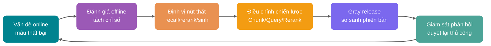
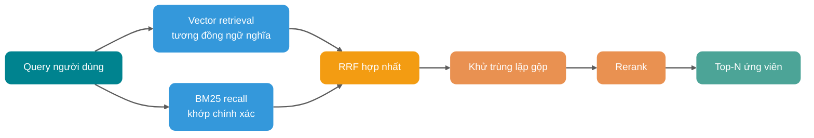
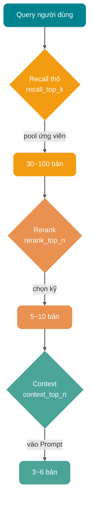
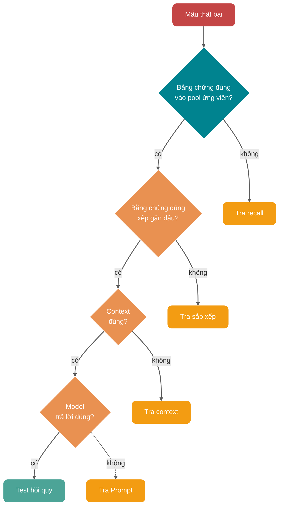

Lần đầu làm RAG, trải nghiệm của nhiều người đều tương tự: tài liệu chia rồi, vector store xây rồi, Top-K cũng chỉnh lớn rồi, model vẫn cứ nghiêm túc nói bậy.

Khó chịu hơn, vấn đề có thể nằm ở nhiều khâu như phân giải tài liệu, chia Chunk, chất lượng context, chứ không đơn thuần là tham số embedding hoặc Top-K.

Khi chỉnh một hệ thống hỏi đáp knowledge base doanh nghiệp, rất dễ rơi vào một ngộ nhận: ban đầu điên cuồng đổi model embedding, kết quả tỷ lệ lỗi online không giảm rõ. Tách mẫu thất bại ra xem mới phát hiện, 60% vấn đề căn bản không phải độ tương đồng vector không đủ, mà là bảng PDF bị phân giải hỏng, Chunk cắt điều kiện và kết luận ra, trong pool ứng viên trước rerank không có đoạn đúng.

Kinh nghiệm đầu tiên của tối ưu hóa RAG: **về bản chất nó là một công trình hệ thống do dữ liệu, chia, chỉ mục, recall, rerank, context, sinh, đánh giá cùng tạo thành, không phải chỉnh tham số đơn điểm.**

Bài viết này tách phương pháp tối ưu từng khâu trên chuỗi này ra nói. Gần 1.5w chữ, khuyên nên lưu lại. Nội dung chính:

1. Vì sao tối ưu hóa RAG không thể chỉ nhìn embedding, Top-K và tham số LLM
2. Vai trò từng khâu của Chunk, Metadata, Hybrid Search, Query Rewrite, Rerank, nén context, đánh giá câu trả lời
3. Khi gặp hiệu quả RAG kém trong production, nên theo đường nào truy vấn và thu hẹp

## Tối ưu hóa RAG rốt cuộc đang tối ưu gì?

Trước tiên đặt đúng mental model.

RAG giống một chuỗi gia công bằng chứng hơn: tài liệu gốc trước tiên được phân giải, làm sạch, chia khối, gắn nhãn, lập chỉ mục; câu hỏi người dùng vào rồi, lại qua hiểu truy vấn, recall, rerank, xây dựng context, cuối cùng mới giao LLM sinh câu trả lời.

Bất kỳ khâu nào trong chuỗi này có vấn đề, đều lây sang hạ nguồn.

| Khâu       | Vấn đề điển hình                        | Biểu hiện cuối cùng                    |
| ---------- | --------------------------------------- | -------------------------------------- |
| Phân giải tài liệu | Bảng lệch, mất tiêu đề, thiếu số trang | Trích dẫn câu trả lời không chính xác, mất điều kiện then chốt |
| Chia Chunk  | Khối quá to, quá nhỏ, cắt đứt ranh giới ngữ nghĩa | Recall nhiều nhiễu, hoặc đoạn recall thiếu context |
| Metadata   | Không lưu nguồn, thời gian, quyền, chương | Không lọc được, không trích dẫn được, dễ vượt quyền |
| Recall     | Chỉ dùng vector retrieval, bỏ qua từ khóa và điều kiện có cấu trúc | Bỏ lỡ mã lỗi, SKU, số phiên bản, danh từ riêng |
| Rerank     | Trực tiếp nhét Top-K cho model           | Đoạn đúng xếp sau, model không thấy trọng điểm |
| Context    | Không khử trùng lặp, không nén, không sắp xếp | Lãng phí Token, model bị nhiễu ảnh hưởng |
| Sinh       | Prompt không giới hạn ranh giới bằng chứng | Câu trả lời trông trôi chảy, nhưng trích dẫn và sự thật không khớp |
| Đánh giá   | Chỉ nhìn trải nghiệm chủ quan, không xây tập test | Đổi theo cảm giác, online lui tới lặp |

**Mục tiêu của tối ưu hóa RAG là tăng tính khả dụng, khả năng truy vết và độ ổn định của câu trả lời cuối, chứ không phải khiến mỗi khâu trông cấp cao.**

Một tiêu chuẩn phán đoán thô nhưng dễ dùng:

- Câu hỏi người dùng hỏi, bằng chứng đúng có được recall không?
- Bằng chứng đúng có xếp đủ gần đầu không?
- Nội dung cho vào context có đủ ít, đủ chính xác không?
- Model có nghiêm ngặt dựa trên bằng chứng trả lời không?
- Mỗi lần đổi có qua tập mẫu cố định xác minh không?

5 câu hỏi này, quan trọng hơn nhiều "dùng vector store nào tốt hơn".

```mermaid
flowchart LR
    %% ========== Khai báo màu classDef ==========
    classDef client fill:#00838F,color:#FFFFFF,stroke:none,rx:10,ry:10
    classDef business fill:#E99151,color:#FFFFFF,stroke:none,rx:10,ry:10
    classDef infra fill:#9B59B6,color:#FFFFFF,stroke:none,rx:10,ry:10
    classDef success fill:#4CA497,color:#FFFFFF,stroke:none,rx:10,ry:10

    %% ========== Khai báo node ==========
    Doc[/Tài liệu gốc/]:::client
    Parse[Phân giải tài liệu]:::business
    Chunk[Chia Chunk]:::business
    Meta[Gắn nhãn Metadata]:::infra
    Index[Lập chỉ mục]:::infra
    Query[Query người dùng]:::client
    Recall[Hybrid recall]:::business
    Rerank[Rerank sắp xếp lại]:::business
    Compress[Nén context]:::business
    LLM[LLM sinh]:::business
    Answer[Câu trả lời cuối]:::success

    %% ========== Nối ==========
    Doc --> Parse --> Chunk --> Meta --> Index
    Query --> Recall
    Index --> Recall
    Recall --> Rerank --> Compress --> LLM --> Answer

    linkStyle default stroke-width:2px,stroke:#333333,opacity:0.8
```

## Vòng khép kín tối ưu hóa RAG

RAG production-level nhất định phải có vòng khép kín. Không có đánh giá và replay, nhiều kỹ thuật nữa cũng là huyền học.

Then chốt của hình này không phải bản thân quy trình, mà hai chữ: **replay**.

Mỗi lần điều chỉnh kích thước Chunk, chiến lược rewrite, model Rerank, tham số Top-K, đều nên đưa cùng một loạt câu hỏi chạy một lần, so sánh Context Recall, Context Precision, Faithfulness, Answer Relevancy, độ trễ và chi phí.

Không có replay, không biết là đã tốt lên hay chỉ đổi một cách sai khác.

## Trước tiên làm quản trị dữ liệu, rồi mới nói tối ưu retrieval

Nhiều hệ thống RAG thất bại vì "dữ liệu bị retrieval từ đầu đã sai", chứ không phải "retrieval không chính xác".

### Phân giải tài liệu quyết định trần

PDF, Word, HTML, Markdown, bản ghi database, log ticket, trông đều là văn bản, thực ra cấu trúc khác rất nhiều. Đặc biệt là bảng PDF, ảnh, đầu cuối trang, chú thích chân trang, bảng xuyên trang, nếu chỉ dùng trích văn bản thường, kết quả phổ biến là:

- Quan hệ cột bảng mất, giá cả, phiên bản, điều kiện trộn vào nhau.
- Đầu cuối trang bị ghi lặp vào mỗi Chunk, làm bẩn không gian vector.
- Ảnh và sơ đồ luồng mất hoàn toàn, câu trả lời thiếu bước then chốt.
- Cấp tiêu đề biến mất, model không biết một đoạn thuộc chương nào.

Với tài liệu phát triển, tài liệu chính sách, sổ tay sản phẩm, **chất lượng phân giải thường quan trọng hơn đổi model embedding**.

Một gợi ý thực dụng:

| Loại tài liệu      | Cách xử lý khuyến nghị               | Mục tiêu cốt lõi      |
| ------------------ | ------------------------------------ | --------------------- |
| Markdown / HTML    | Giữ cấp tiêu đề, danh sách, khối code | Không phá vỡ cấu trúc tự nhiên |
| Tài liệu PDF       | Phân giải nội dung chính, bảng, số trang, chú thích ảnh | Giữ ranh giới bằng chứng |
| Tài liệu dạng bảng | Chuyển thành bản ghi hàng có cấu trúc hoặc bảng Markdown | Giữ quan hệ trường |
| Tài liệu code      | Phân theo package, class, method, comment | Giữ ngữ nghĩa gọi     |
| Ticket / chat log  | Chia theo phiên, thời gian, vai trò  | Giữ thứ tự context     |

Nếu nguồn dữ liệu có nhiều bảng và ảnh, cần thiết có thể đưa OCR hoặc model đa phương thức làm mô tả có cấu trúc, nhưng phải chú ý chi phí và độ trễ. Đây đừng mê tín "tất cả đưa cho vision model", ưu tiên xử lý tài liệu giá trị cao và mẫu thất bại tần suất cao.

### Vai trò của Metadata

Metadata không phải để hiển thị cho trang backend, nó là ràng buộc cứng của retrieval và chuỗi bằng chứng của câu trả lời.

Ít nhất khuyên mỗi Chunk lưu các trường này:

- `source_id`: ID tài liệu gốc, tiện truy vết và khử trùng lặp.
- `source_type`: PDF, trang web, ticket, code, bản ghi database...
- `title`: tiêu đề tài liệu.
- `section_path`: đường dẫn chương, ví dụ "Chính sách đổi trả / Phạm vi sau bán hàng / Hàng đặc biệt".
- `page`: số trang hoặc vị trí đoạn.
- `created_at` / `updated_at`: lọc thời gian và phán đoán cũ mới.
- `tenant_id` / `acl`: multi-tenant và kiểm soát quyền.
- `business_tags`: dòng sản phẩm, ngôn ngữ, khu vực, phiên bản, module.

Một điểm mù tần suất cao là: **trước tiên vector retrieval, rồi mới lọc quyền**.

Điều này rất nguy hiểm. Giả sử vector store trả về Top-10, trong đó 8 bản người dùng không có quyền, lọc xong chỉ còn 2 bản, hệ thống sẽ tưởng "chỉ recall được 2 bản nội dung liên quan". Tệ hơn, nếu logic lọc viết sai, còn có thể nhét nội dung vượt quyền vào context.

Cách vững hơn là: **có thể lọc trước thì lọc trước**. Trước tiên dùng Metadata thu nhỏ phạm vi retrieval, rồi làm vector hoặc hybrid retrieval. Ví dụ trước tiên giới hạn `tenant_id`, loại tài liệu, phạm vi phiên bản, thời gian cập nhật, rồi mới vào tính độ tương tự.

## Chiến lược Chunk: đừng cắt vụn tri thức

Chunking là nền móng của RAG. Nền móng lệch, đằng sau rerank mạnh đến đâu cũng khó cứu.

### Kích thước Chunk không có giá trị vạn năng

Nhiều tutorial thích đưa một giá trị mặc định: 512, 800, 1000 Token. Giá trị này chỉ làm được điểm khởi đầu, không làm được kết luận.

Chunk quá nhỏ, dễ mất context. Ví dụ một câu "trường hợp trên không áp dụng đổi trả 7 ngày không cần lý do" bị cắt sang khối tiếp theo, khối trước sẽ thành bằng chứng gây hiểu lầm.

Chunk quá to, lại kéo theo nhiều nội dung không liên quan. Điểm retrieval có thể vì một câu rất liên quan mà cao, nhưng model đọc được là cả một đoạn lẫn lộn, tỷ lệ tín trên nhiễu ngược lại giảm.

Kinh nghiệm của Tiểu G là:

- FAQ, chính sách ngắn, mô tả interface: có thể bắt đầu từ 200 đến 500 Token.
- Tài liệu kỹ thuật, hướng dẫn, tài liệu giải pháp: có thể bắt đầu từ 400 đến 800 Token.
- Quy chế, hợp đồng, chính sách tài chính: quan tâm tính toàn vẹn điều khoản hơn, ưu tiên chia theo tiêu đề, điều, khoản, mục.
- Knowledge base code: đừng chỉ chia theo Token, ưu tiên chia theo file, class, hàm, khối comment.

Câu trả lời thật sự vẫn do tập đánh giá cho. Xây 3 đến 5 nhóm tham số Chunk thành các chỉ mục khác nhau, dùng cùng một loạt câu hỏi so sánh Context Recall, Context Precision, độ chính xác câu trả lời và Token context trung bình.

### Chia ngữ nghĩa phù hợp tài liệu ổn định

Tư duy của chia ngữ nghĩa là: không cơ giới cắt theo số ký tự, mà theo tiêu đề, đoạn, độ tương đồng câu hoặc ranh giới ngữ nghĩa để chia.

Nó phù hợp các kịch bản này:

- Chủ đề tài liệu lẫn lộn, một trang liên tục nói nhiều khái niệm.
- Câu hỏi người dùng thiên về khái niệm, thay vì tra một trường.
- Knowledge base tần suất cập nhật không cao, có thể chấp nhận tiền xử lý offline phức tạp hơn.

Nó không phù hợp các kịch bản này:

- Tài liệu cập nhật gia tăng thường xuyên, mỗi lần re-cluster chi phí cao.
- Bản thân cấu trúc tài liệu đã rất rõ, ví dụ cấp tiêu đề Markdown.
- Truy vấn chủ yếu là tra chính xác số hiệu, trường, trạng thái, mục cấu hình.

Chia ngữ nghĩa không nhất thiết càng thông minh càng tốt. Nếu knowledge base của bạn là tài liệu interface, chia theo OpenAPI path, method, bảng tham số, thường đáng tin hơn embedding clustering câu.

### Parent-Child Chunk là thỏa hiệp rất thực dụng

Một mô hình phổ biến là: **khối nhỏ đảm nhận recall, khối lớn đảm nhận sinh**.

Ví dụ cắt tài liệu thành Chunk con 300 Token dùng cho vector retrieval, nhưng mỗi Chunk con đều treo vào một đoạn cha 1200 Token. Khi truy vấn trước tiên trúng khối nhỏ, rồi đưa đoạn cha tương ứng vào context.

Ưu điểm rất rõ:

- Khối nhỏ dễ trúng chính xác câu hỏi hơn.
- Khối cha giữ context cần thiết, giảm đứt câu rời ý.
- So với mù quáng mở rộng Top-K, kiểm soát được hơn.

Phù hợp tài liệu dài, hướng dẫn, giải thích chính sách, sổ tay xử lý sự cố.

### Cho Chunk thêm cửa ngõ ngữ nghĩa

Một số câu hỏi người dùng và cách diễn đạt văn bản gốc khác nhau rất lớn. Người dùng hỏi "tiền rút thế nào", tài liệu viết "đường dẫn yêu cầu hoàn tiền". Lúc này có thể trong giai đoạn chỉ mục thêm biểu diễn phụ:

- Cho mỗi Chunk sinh tóm tắt, tóm tắt và nội dung chính đều vào chỉ mục.
- Cho mỗi Chunk sinh câu hỏi có thể trả lời, dùng vector câu hỏi hỗ trợ recall.
- Cho chương sinh vector tiêu đề, để câu hỏi khái niệm trước tiên trúng chủ đề.
- Với code hoặc bảng sinh mô tả có cấu trúc, tránh văn bản gốc khó embedding.

Loại phương pháp này về bản chất là mở cho Chunk thêm vài cửa vào. Cái giá là chi phí xây kho tăng, nên khuyên ưu tiên dùng cho knowledge base giá trị cao, chứ không phải mở không não toàn bộ.

## Tối ưu recall: đừng chỉ dựa vào độ tương đồng vector

Recall của RAG naive thường là: chuyển câu hỏi người dùng thành embedding, rồi vector store Top-K. Giải pháp này chạy được demo, nhưng trong production rất nhanh gặp ranh giới.

### Hybrid Search là mặc định production

Vector retrieval giỏi tương đồng ngữ nghĩa, BM25 giỏi khớp từ chính xác. Hai cái là quan hệ bổ trợ, không phải thay thế.

| Loại truy vấn                  | Thể hiện vector retrieval | Thể hiện BM25 | Gợi ý               |
| ------------------------------ | ------------------------- | ------------- | --------------------- |
| "Làm thế nào hủy đăng ký"      | Khớp được "tắt tự động gia hạn" | Có thể khớp không thấy | Giữ lại vector recall |
| "Mã lỗi E1027"                 | Có thể recall lỗi tổng quát | Trúng chính xác mã lỗi | Phải giữ lại recall từ khóa |
| "Tham số model ABX-4421"       | Dễ tìm thấy model tương tự | Trúng chính xác SKU  | Phải giữ lại recall từ khóa |
| "Khác biệt chính sách từ chối Java thread pool" | Hiểu ngữ nghĩa tốt hơn | Khớp được từ khóa  | Hybrid ổn định hơn |
| "Chính sách giá mới nhất v3.2" | Cần ngữ nghĩa và điều kiện thời gian | Khớp được số phiên bản | Metadata + Hybrid |

Cách làm phổ biến của Hybrid Search là recall hai đường rồi hợp nhất:

- Vector retrieval trả về ứng viên tương đồng ngữ nghĩa.
- BM25 hoặc sparse vector trả về ứng viên từ khóa.
- Dùng RRF hoặc điểm số trọng số chuẩn hóa gộp.
- Khử trùng lặp ứng viên đã gộp, rồi vào Rerank.

Tài liệu chính thức của Microsoft Azure AI Search, Google Vertex AI Vector Search, Weaviate... đều coi Hybrid Search và RRF là cách hợp nhất phổ biến. Ưu điểm của RRF là không cần cưỡng ép so sánh điểm BM25 với điểm cosine vector, hợp nhất theo vị trí xếp hạng, gánh nặng chỉnh tham số thấp hơn.

Nhưng đừng thần thánh hóa Hybrid Search.

Nếu tài liệu của bạn có cấu trúc cao, từ khóa ít, lợi ích Hybrid mang lại có thể có hạn; nếu truy vấn của bạn chứa nhiều mã lỗi, model sản phẩm, mục cấu hình, danh từ riêng, vector retrieval thuần rất dễ lật xe.

### Query Rewrite: trước tiên khiến câu hỏi truy vấn được

Câu hỏi của người dùng thường không viết cho hệ thống truy vấn.

Họ sẽ nói:

- "Cái báo lỗi này làm sao đây?"
- "Có trả lại tiền không?"
- "Vấn đề rate-limit online hình như lại đến rồi?"

Những câu hỏi này với con người thì có context, với hệ thống truy vấn thì rất mơ hồ. Mục tiêu của Query Rewrite là: **không thay đổi ý định người dùng, đổi câu hỏi thành cách diễn đạt thích hợp để recall hơn.**

Các chiến lược phổ biến như sau:

| Chiến lược          | Kịch bản phù hợp                | Ví dụ                                                        |
| ------------------- | ------------------------------- | ------------------------------------------------------------ |
| Viết lại chuẩn hóa | Khẩu ngữ, viết tắt, thiếu context | "Có trả lại tiền không" đổi thành "chính sách hoàn tiền, điều kiện hoàn tiền, quy trình hoàn tiền" |
| Multi-Query         | Diễn đạt có thể nhiều cách      | Đồng thời truy vấn "hủy đăng ký" "tắt tự động gia hạn" "dừng gói thành viên" |
| Query Decomposition | Câu hỏi chứa nhiều câu hỏi con  | Tách "so sánh phí và xử lý tranh chấp của Stripe và Square" thành 4 câu hỏi con |
| Step-back Query     | Câu hỏi quá nhỏ, thiếu bối cảnh | Trước tiên truy vấn "quy tắc tính phí đăng ký", rồi trả lời câu hỏi hủy cụ thể |
| HyDE                | Truy vấn quá ngắn, khác biệt lớn với hình thái tài liệu | Trước tiên sinh câu trả lời giả định, rồi dùng vector câu trả lời giả định recall tài liệu thật |
| Self-Query          | Câu hỏi chứa điều kiện lọc      | Từ "tra chính sách Java năm 2025" trích xuất lọc năm và loại |

Các component như MultiQueryRetriever, SelfQueryRetriever của LangChain chính là triển khai engineering hóa của loại tư duy này.

Đây có một cái bẫy: **Query Rewrite phải giữ lại câu hỏi gốc.** Đừng chỉ dùng truy vấn đã viết lại. Về mặt kỹ thuật có thể để truy vấn gốc và truy vấn viết lại cùng recall, rồi hợp nhất kết quả. Nếu không, một khi model viết lại hiểu sai ý định, phía sau recall đều lệch hết.

### Top-K không phải càng lớn càng tốt

Mù quáng mở rộng Top-K là thao tác phổ biến nhất trong điều chỉnh RAG, cũng là thao tác dễ tạo nhiễu nhất.

Top-K lớn hơn, quả thực có thể tăng recall rate. Nhưng nó cũng mang 3 tác dụng phụ:

- Ứng viên nhiều lên, độ trễ Rerank tăng.
- Context dài lên, chi phí Token tăng.
- Nội dung không liên quan nhiều lên, model dễ bị nhiễu.

Cách hợp lý hơn là đặt theo tầng:

- `recall_top_k`: pool ứng viên recall thô, ví dụ 30 đến 100.
- `rerank_top_n`: giữ lại sau rerank, ví dụ 5 đến 10.
- `context_top_n`: cuối cùng vào context, ví dụ 3 đến 6.

Nói cách khác, Top-K nên quản lý theo tầng, chứ không một tham số quản đến cùng.

## Rerank: sắp xếp lại "liên quan" thành "có thể trả lời"

Vector retrieval dùng tư duy model hai tháp: query và document lần lượt mã hóa, rồi tính khoảng cách vector. Nó nhanh, nhưng chưa đủ tinh.

Rerank thường dùng Cross-Encoder hoặc model xếp hạng lại chuyên dụng, đặt query và tài liệu ứng viên cùng nhau chấm điểm. Nó chậm hơn, nhưng phán đoán được chi tiết hơn "đoạn văn bản này có thực sự trả lời được câu hỏi này không".

### Vì sao Rerank có ích?

Độ tương đồng vector giống như "hai đoạn này ngữ nghĩa có gần nhau không", Rerank giống như "đoạn này có thể trả lời câu hỏi này không".

Lấy ví dụ:

Người dùng hỏi: "Vì sao thread pool sẽ kích hoạt chính sách từ chối?"

Vector recall có thể tìm ra các đoạn này:

1. Giải thích tham số cốt lõi thread pool.
2. Danh sách enum chính sách từ chối.
3. Điều kiện kích hoạt chính sách từ chối sau khi hàng đợi đầy, số thread đạt maximumPoolSize.
4. Ví dụ code sử dụng thread pool.

Điều 1, 2 ngữ nghĩa rất gần, nhưng điều 3 mới là cốt lõi câu trả lời. Giá trị của Rerank chính là đưa điều 3 lên đầu.

### Rerank đặt ở đâu?

Chuỗi khuyến nghị là:

1. Lọc trước bằng Metadata.
2. Hybrid Search recall thô 30 đến 100 bản.
3. Khử trùng lặp và gộp đoạn liền kề.
4. Rerank chọn 5 đến 10 bản.
5. Nén context rồi đưa vào Prompt.

Nếu trong pool ứng viên không có câu trả lời đúng, Rerank cũng cứu không nổi. Vậy nên trước Rerank phải xem Context Recall. Nhiều người trực tiếp lên reranker, phát hiện không hiệu quả, nguyên nhân gốc là giai đoạn recall thô đã không tìm ra tài liệu đúng.

### LLM Rerank và Reranker chuyên dụng chọn thế nào?

| Giải pháp             | Ưu điểm                   | Nhược điểm                       | Kịch bản phù hợp                |
| --------------------- | ------------------------- | -------------------------------- | ------------------------------- |
| Cross-Encoder Reranker | Phán đoán liên quan tinh, chi phí kiểm soát được | Cần chọn model, có thể có lệch ngôn ngữ và lĩnh vực | Chuỗi production phổ thông      |
| LLM chấm điểm         | Khả năng giải thích mạnh, quy tắc linh hoạt | Chậm, đắt, độ ổn định chịu ảnh hưởng của Prompt | Traffic nhỏ, giá trị cao, phán đoán phức tạp |
| Rerank quy tắc        | Rẻ, kiểm soát được         | Chỉ xử lý quy tắc rõ             | Ưu tiên thời gian, quyền, phiên bản, nguồn |
| Rerank hỗn hợp        | Linh hoạt, phù hợp nghiệp vụ phức tạp | Độ phức tạp engineering cao      | Knowledge base doanh nghiệp, CSKH, kịch bản tuân thủ |

Gợi ý của Tiểu G: **mặc định dùng reranker chuyên dụng làm chuỗi chính, quy tắc bù ràng buộc nghiệp vụ, LLM chấm điểm làm đánh giá offline hoặc chốt lại giá trị cao.**

## Context engineering: đừng coi model như thùng rác

Chặng cuối của RAG là xây dựng context, chứ không phải bản thân retrieval.

Kết quả retrieval không phải càng nhiều càng tốt. Context window của LLM tuy ngày càng dài, nhưng sự chú ý, độ trễ, chi phí và tỷ lệ tín trên nhiễu vẫn là ràng buộc cứng. Context không liên quan nhét càng nhiều, model càng dễ xuất hiện các vấn đề sau:

- Chụp nhầm bằng chứng, lấy đoạn tương tự nhưng không liên quan làm căn cứ.
- Bỏ qua thông tin quan trọng ở vị trí giữa.
- Câu trả lời dài ra nhưng không tập trung.
- Trích dẫn sai nguồn.
- Chi phí và độ trễ chữ đầu tăng rõ.

**Mục tiêu của context engineering, là để Token có hạn cho bằng chứng trả lời được câu hỏi nhất.**

### Nén context

Nén context không phải tóm tắt đơn giản, mà xoay quanh query hiện tại lọc bằng chứng.

Có 3 cách phổ biến:

| Cách nén     | Cách làm                     | Rủi ro                 |
| ------------ | ---------------------------- | ---------------------- |
| Trích có chọn lọc | Chỉ giữ câu gốc liên quan câu hỏi | Có thể bỏ sót điều kiện ẩn |
| Tóm tắt theo query | Ép đoạn dài thành tóm tắt xoay quanh câu hỏi | Có thể đưa lệch viết lại |
| Trích có cấu trúc | Trích trường, điều kiện, kết luận, ngoại lệ | Phụ thuộc thiết kế extraction Schema |

ContextualCompressionRetriever của LangChain là tư duy tổ hợp "retriever cơ bản + compressor". Khi triển khai thực tế, có thể trước tiên làm lọc quy tắc rẻ và khử trùng lặp, rồi với đoạn dài làm nén LLM, tránh mỗi Chunk đều gọi model.

### Sắp xếp context cũng ảnh hưởng câu trả lời

Đừng tùy tiện nối kết quả retrieval theo thứ tự trả về.

Chiến lược sắp xếp hợp lý hơn:

- Bằng chứng liên quan nhất để đầu.
- Đoạn liền kề cùng một tài liệu cố giữ thứ tự gốc.
- Đoạn mâu thuẫn nhau đánh dấu thời gian cập nhật và phiên bản.
- Đoạn bị trích dẫn giữ thông tin nguồn.
- Bằng chứng độ tin cậy thấp đừng trộn với độ tin cậy cao.

Nếu câu hỏi cần so sánh xuyên tài liệu, có thể theo "nhóm chủ đề" tổ chức context; nếu câu hỏi cần phân tích theo thời gian, có thể theo dòng thời gian tổ chức context; nếu câu hỏi là xử lý sự cố, có thể theo "hiện tượng, nguyên nhân, bước xử lý, lưu ý" tổ chức context.

Đây chính là điểm rơi cụ thể của Context Engineering trong RAG: **không chỉ quyết định retrieval gì, mà còn quyết định kết quả retrieval vào model với cấu trúc gì.**

### Prompt phải giới hạn ranh giới bằng chứng

Prompt sinh RAG ít nhất phải nêu rõ 4 quy tắc:

- Chỉ dựa trên context đã cho trả lời.
- Context không đủ thì nói rõ không phán đoán được.
- Mỗi kết luận then chốt cố gắng đính kèm nguồn.
- Đừng coi tài liệu tương tự là sự thật phiên bản hiện tại.

Mấy quy tắc này trông đơn giản, nhưng rất quan trọng. Nhiều hallucination không phải model không biết, mà là Prompt không bảo nó "khi bằng chứng không đủ có thể từ chối trả lời".

## Đánh giá: không đánh giá, tối ưu là huyền học

Đánh giá RAG phải tách ra xem. Chỉ nhìn điểm câu trả lời cuối, rất khó biết rốt cuộc khâu nào hỏng.

### Xây một tập đánh giá tối thiểu

Không cần ngay từ đầu làm mấy nghìn mẫu. Bắt đầu từ 50 đến 100 câu hỏi giá trị cao:

- Câu hỏi người dùng tần suất cao.
- Câu hỏi thất bại online.
- Câu hỏi then chốt nghiệp vụ.
- Câu hỏi suy luận nhiều chặng.
- Câu hỏi khớp chính xác, ví dụ mã lỗi, số phiên bản, SKU.
- Câu hỏi dễ vượt quyền hoặc quá hạn.
- Câu hỏi nên từ chối trả lời.

Mỗi mẫu tốt nhất nên gồm:

- `question`: câu hỏi gốc người dùng.
- `golden_answer`: câu trả lời lý tưởng.
- `golden_context`: đoạn bằng chứng hoặc tài liệu nên trúng.
- `metadata_filter`: điều kiện lọc cần thiết.
- `answer_type`: hỏi đáp sự kiện, diễn giải quy trình, so sánh, từ chối, tóm tắt...

### Chỉ số retrieval và chỉ số sinh tách riêng

| Chỉ số            | Đối tượng đo | Giải thích                              |
| ----------------- | ------------ | --------------------------------------- |
| Hit Rate@K        | recall       | Bằng chứng đúng có xuất hiện trong K kết quả đầu không |
| MRR               | sắp xếp      | Bằng chứng đúng đầu tiên xếp gần đầu đến đâu |
| Context Recall    | độ đầy recall | Bằng chứng cần cho câu trả lời có tìm đủ không |
| Context Precision | độ tinh context | Nội dung vào context có bao nhiêu thật sự liên quan |
| Faithfulness      | độ trung thành sinh | Câu trả lời có được context chống đỡ không |
| Answer Relevancy  | độ liên quan câu trả lời | Câu trả lời có thật sự đáp câu hỏi người dùng không |
| Citation Accuracy | độ chính xác trích dẫn | Vị trí trích dẫn có chống đỡ kết luận tương ứng không |
| Latency / Cost    | chỉ số engineering | Độ trễ P95, Token, thời gian rerank, tỷ lệ trúng cache |

RAGAS, DeepEval, LangSmith và các công cụ khác đều hỗ trợ đánh giá quanh độ liên quan context, độ trung thành, độ liên quan câu trả lời. Tài liệu RAGAS tách khá rõ Context Precision, Context Recall, Faithfulness, Response Relevancy; DeepEval cũng hỗ trợ tổ hợp chỉ số retrieval và sinh thành test end-to-end.

Nhưng phải nhớ: **LLM-as-a-Judge không phải chân lý trọng tài, nó chỉ là tín hiệu hỗ trợ.**

Trước khi lên production phải ít nhất lấy mẫu duyệt lại thủ công một loạt kết quả, hiệu chuẩn xem bộ đánh giá tự động có thiên về câu trả lời dài không, có bỏ sót lỗi trích dẫn không, có không nhạy với thuật ngữ lĩnh vực tiếng Trung không.

### Mỗi lần đổi đều phải version hóa

Khuyên ghi các phiên bản này:

- Phiên bản document parser.
- Phiên bản chiến lược Chunk.
- Phiên bản Embedding model.
- Phiên bản tham số chỉ mục.
- Phiên bản Query Rewrite Prompt.
- Phiên bản Rerank model.
- Phiên bản Prompt sinh.
- Phiên bản tập đánh giá.

Nếu không, hôm nay hiệu quả tốt hơn, ngày mai cập nhật knowledge base lại tệ đi, bạn rất khó biết là bước nào đưa về hồi quy.

## Lỗi thường gặp

### Lỗi một: chỉ chỉnh embedding

Embedding rất quan trọng, nhưng nó không phải tất cả.

Nếu bảng PDF phân giải sai, Chunk cắt mất điều kiện, Metadata không lọc quyền, pool ứng viên recall không có tài liệu đúng, đổi model embedding đắt hơn nữa cũng chỉ khiến lỗi ổn định hơn.

Cách đúng: trước tiên dùng tập đánh giá phán đoán là vấn đề recall, vấn đề sắp xếp, vấn đề context hay vấn đề sinh, rồi mới quyết định có đổi embedding không.

### Lỗi hai: không đánh giá

"Tôi cảm thấy tốt hơn rồi" không phải chỉ số.

Thay đổi RAG thường là cục bộ tốt hơn, tổng thể tệ hơn. Ví dụ Top-K lớn lên một số câu trả lời được, nhưng một số câu khác bắt đầu bị nhiễu ảnh hưởng. Nếu không có tập mẫu cố định, bạn chỉ nhớ được trường hợp tốt lên.

Cách đúng: xây tập đánh giá tối thiểu, ít nhất bao phủ câu hỏi tần suất cao, câu hỏi thất bại, câu hỏi khớp chính xác, câu hỏi từ chối.

### Lỗi ba: mù quáng mở rộng Top-K

Top-K lớn lên không miễn phí.

Nó tăng chi phí rerank, Prompt Token, độ trễ model, còn giảm tỷ lệ tín trên nhiễu context. Nhiều khi nên tăng pool ứng viên recall thô, rồi dùng Rerank và nén lọc nhiễu, chứ không phải đưa thêm nội dung trực tiếp cho model.

Cách đúng: phân biệt Top-K recall thô, Top-N rerank, Top-N context.

### Lỗi bốn: nhét context không liên quan cho model

Context window không phải kho, càng không phải thùng rác.

Context không liên quan sẽ pha loãng sự chú ý, cũng tạo căn cứ sai cho model. Đặc biệt khi chính sách nhiều phiên bản, tài liệu sản phẩm tương tự, đoạn liền kề nhưng không liên quan trộn vào nhau, model rất dễ tổng hợp ra một câu trả lời trông hợp lý nhưng sự thật sai.

Cách đúng: khử trùng lặp, nén, sắp xếp theo độ mạnh bằng chứng, và nêu rõ phiên bản và nguồn.

### Lỗi năm: bỏ qua khả năng từ chối trả lời

RAG không nên lúc nào cũng đưa câu trả lời.

Khi độ tin cậy kết quả retrieval thấp, bằng chứng mâu thuẫn nhau, người dùng không có quyền truy cập tài liệu then chốt, hệ thống nên từ chối, hỏi lại hoặc nâng lên người, chứ không phải bịa một câu trả lời trôi chảy.

Cách đúng: sau retrieval thêm phán đoán chất lượng bằng chứng, độ tin cậy thấp thì kích hoạt viết lại truy vấn, mở rộng phạm vi, tìm kiếm ngoài hoặc từ chối.

## Một đường truy vấn triển khai được

Cuối cùng cho một đường truy vấn mà Tiểu G khá khuyến nghị. Khi hiệu quả RAG online tệ, đừng vừa lên đã sửa Prompt hoặc đổi model, đi theo thứ tự dưới.

### Bước một: phân loại mẫu thất bại

Trước tiên xem 20 đến 50 câu hỏi thất bại, chia chúng thành vài loại:

- Hoàn toàn không recall được tài liệu đúng.
- Recall được tài liệu đúng, nhưng xếp gần sau.
- Tài liệu đúng vào context, nhưng câu trả lời không dùng.
- Câu trả lời dùng context, nhưng hiểu sai.
- Trích dẫn nguồn không tồn tại hoặc không liên quan.
- Nên từ chối lại cưỡng ép trả lời.
- Quyền, thời gian, lọc phiên bản sai.

Giá trị của bước này rất cao, vì mỗi loại vấn đề hướng sửa hoàn toàn khác.

### Bước hai: trước tiên xem bằng chứng đúng có vào pool ứng viên không

Nếu recall thô Top-50 không có bằng chứng đúng, ưu tiên tra:

- Tài liệu có vào kho không.
- Phân giải tài liệu có đúng không.
- Chunk có cắt đứt sự kiện then chốt không.
- Lọc Metadata có quá nghiêm không.
- Query có cần rewrite, decompose hoặc HyDE không.
- Có cần BM25 hoặc Hybrid Search không.

Lúc này đừng lên Rerank trước. Pool ứng viên không có câu trả lời, sắp xếp lại chỉ là sắp lại lỗi.

### Bước ba: bằng chứng đúng trong pool ứng viên nhưng không vào context

Nếu bằng chứng đúng trong Top-50, nhưng không trong context cuối, trọng điểm tra:

- Model Rerank có thích ứng ngôn ngữ và lĩnh vực không.
- Input Rerank có quá dài bị cắt cụt không.
- Hợp nhất điểm có khiến kết quả từ khóa bị ép xuống không.
- Gộp Chunk liền kề có kéo theo nhiễu không.
- `rerank_top_n` có quá nhỏ không.

Loại vấn đề này thường qua rerank, trọng số hợp nhất, kích thước pool ứng viên và chiến lược khử trùng lặp giải quyết.

### Bước bốn: context đúng nhưng câu trả lời sai

Nếu bằng chứng đúng đã đưa vào Prompt, model vẫn trả lời sai, trọng điểm tra:

- Prompt có yêu cầu dựa trên context trả lời không.
- Context có phiên bản mâu thuẫn nhau không.
- Bằng chứng có bị nhấn chìm ở vị trí giữa context không.
- Câu hỏi có cần suy luận nhiều chặng hoặc bảng so sánh không.
- Có cần output có cấu trúc và ràng buộc trích dẫn không.
- Có cần nén trước rồi mới sinh không.

Lúc này mới nên trọng điểm điều chỉnh Prompt, sắp xếp context, nén và model sinh.

### Bước năm: xây test hồi quy

Mỗi lần sửa một mẫu thất bại, đều đưa nó vào tập đánh giá.

Hệ thống RAG sợ nhất "sửa A hỏng B". Chỉ khi mẫu thất bại lắng đọng liên tục, hệ thống mới càng chỉnh càng ổn.

## Gợi ý điều chỉnh production

Nếu bạn muốn dựng từ con số 0 một RAG doanh nghiệp, Tiểu G khuyên theo ưu tiên này triển khai:

1. Trước tiên làm quản trị dữ liệu: đảm bảo phân giải tài liệu, khử nhiễu, cấp tiêu đề, số trang, bảng, Metadata đúng.
2. Xây tập đánh giá tối thiểu: trước tiên dùng 50 câu hỏi thật chạy thông quy trình replay.
3. Chỉnh chiến lược Chunk: so sánh độ dài cố định, chia có cấu trúc, Parent-Child, chia ngữ nghĩa.
4. Đưa Hybrid Search: vector recall đảm nhận ngữ nghĩa, BM25 hoặc sparse vector đảm nhận từ chính xác.
5. Thêm Query Rewrite: ưu tiên xử lý khẩu ngữ, viết tắt, đa ý định và câu hỏi nhiều chặng.
6. Thêm Rerank: recall thô mở rộng pool ứng viên, rerank xong chỉ giữ bằng chứng chất lượng cao.
7. Làm nén context: khử trùng lặp, cắt bớt, tóm tắt, trích có cấu trúc, kiểm soát Token và nhiễu.
8. Hoàn thiện ràng buộc sinh: bằng chứng không đủ thì từ chối, kết luận then chốt kèm trích dẫn.
9. Gray và giám sát: ghi chỉ số theo phiên bản, liên tục thu gom mẫu thất bại.

Đường này không màu mè, nhưng có thể thu hẹp.

## Ôn lại điểm chính

Tối ưu hóa RAG không phải "đổi một model embedding mạnh hơn" đơn giản như vậy. Điều chỉnh thật sự hiệu quả, phải tách theo chuỗi hoàn chỉnh:

- **Dữ liệu quyết định trần**: phân giải, làm sạch, giữ cấu trúc, Metadata là nền móng.
- Chunk quyết định độ hạt recall: đừng mê tín kích thước mặc định, phải dùng tập đánh giá chọn tham số.
- Hybrid Search tăng độ vững: vector đảm nhận ngữ nghĩa, BM25 đảm nhận khớp chính xác.
- Query Rewrite giải quyết khác biệt diễn đạt: rewrite, decompose, HyDE, Self-Query đều để câu hỏi truy vấn được hơn.
- Rerank quyết định thứ tự bằng chứng: recall thô phải đầy, rerank phải chính xác.
- Context engineering quyết định tỷ lệ tín trên nhiễu: nén, khử trùng lặp, sắp xếp, trích dẫn quan trọng hơn nhét nội dung mù quáng.
- Đánh giá quyết định có thể tối ưu bền vững không: không có tập test, không có replay, không có chỉ số, chỉ có thể dựa vào cảm giác chỉnh tham số.

Cuối cùng nhớ một câu: **nút thắt của RAG thường không nằm ở một tham số nào, mà nằm trên toàn bộ đường đi bằng chứng từ tài liệu gốc đến câu trả lời cuối.**

## Tài liệu tham khảo

- [Production RAG: The Five Decisions Behind Every System That Works](https://www.bestblogs.dev/article/899eff0a)
- [Từ điển tối ưu RAG: phân tích đầy đủ 20 phương pháp tối ưu RAG](https://cloud.tencent.com/developer/article/2634637)
- [Weaviate Hybrid Search Documentation](https://docs.weaviate.io/weaviate/concepts/search/hybrid-search)
- [Microsoft Azure AI Search: Hybrid Search RRF](https://learn.microsoft.com/en-us/azure/search/hybrid-search-ranking)
- [Google Vertex AI Vector Search: Hybrid Search](https://docs.cloud.google.com/vertex-ai/docs/vector-search/about-hybrid-search)
- [Cohere Rerank Documentation](https://docs.cohere.com/docs/rerank-overview)
- [LangChain Retriever API Documentation](https://api.python.langchain.com/en/latest/langchain/retrievers.html)
- [RAGAS Metrics Documentation](https://docs.ragas.io/en/stable/concepts/metrics/available_metrics/context_precision/)
- [DeepEval RAG Evaluation Guide](https://deepeval.com/guides/guides-rag-evaluation)