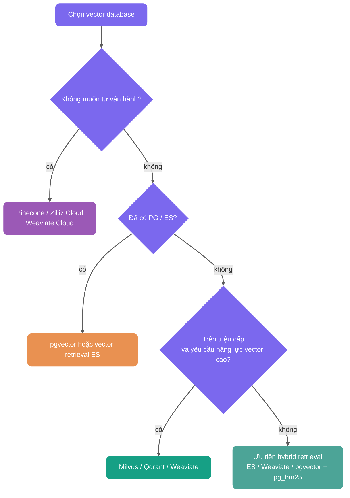

Hồi trước khi phỏng vấn một công ty lớn, interviewer hỏi tôi: "Vector retrieval của hệ thống RAG các bạn làm như thế nào?"

Lúc đó tôi trả lời: "Dùng MySQL lưu Embedding, khi truy vấn duyệt hết tính độ tương tự."

Vẻ mặt interviewer đã nói rõ vấn đề. Lúc đó knowledge base chúng tôi có hơn 50 vạn Chunk, mỗi lần truy vấn đều phải full-table scan, thời gian phản hồi trung bình trên 3 giây. Với một hệ thống hỏi đáp, độ trễ này gần như là đuổi khách.

Sau này mới nhận ra, đó là brute-force search điển hình. Giai đoạn Demo chạy được, môi trường production căn bản chịu không nổi. Khi thật sự lên production, ít nhất phải xét vector database và ANN index.

Lưu trữ vector và chỉ mục vector là hạ tầng không né được của hầu hết ứng dụng RAG. Quy mô dữ liệu, yêu cầu độ trễ, yêu cầu recall vừa nâng lên, dựa vào duyệt hết tính độ tương tự rất nhanh sẽ ra vấn đề.

Bài viết này khai triển quanh vài câu hỏi phỏng vấn tần suất cao:

1. Vì sao RAG cần vector database;
2. Embedding và vector retrieval quan hệ gì;
3. Khoảng cách cosine, tích vô hướng, khoảng cách Euclid chọn thế nào;
4. Thuật toán chỉ mục vector là gì, có những thuật toán phổ biến nào;
5. Trong project vì sao dùng HNSW, HNSW và IVFFLAT khác gì;
6. Có những vector database nào, vì sao chọn PostgreSQL + pgvector, vì sao không trực tiếp dùng MySQL làm.

## Embedding và vector retrieval quan hệ gì?

Vector database không trực tiếp hiểu văn bản. Nó lưu trữ và truy vấn Embedding.

Quá trình Embedding là: đưa một đoạn văn bản cho Embedding model, model xuất ra một vector dày đặc chiều cố định. Có thể hiểu thô là "tọa độ ngữ nghĩa văn bản". Hai đoạn văn bản ngữ nghĩa càng gần, khoảng cách của chúng trong không gian vector thường cũng càng gần.


Chuỗi vector retrieval của RAG có thể đơn giản hóa thành:

```text
Document Chunk -> Embedding model -> vector tài liệu -> ghi vào vector database
Câu hỏi người dùng -> Embedding model -> query vector -> truy vấn vector tài liệu Top-K giống nhất
```

Khái niệm cơ bản có thể xem [Bài nền tảng RAG](./rag-basis.md). Bài này trọng điểm đặt nửa sau: những vector này lưu trữ, chỉ mục và truy vấn hiệu quả như thế nào.

## Vì sao kịch bản RAG cần vector database?

Cốt lõi của RAG (Retrieval-Augmented Generation) là semantic retrieval. Hệ thống chuyển tài liệu và câu hỏi người dùng thành vector chiều cao, rồi tìm đoạn Top-K giống nhất, làm context cho LLM.

Vậy nên trong kịch bản RAG việc thật sự cần giải quyết, không chỉ là "có lưu được Embedding không", mà là trong vector chiều cao quy mô lớn, có truy vấn ra Top-K liên quan nhất với độ trễ thấp không.

Database quan hệ truyền thống có thể lưu vector, cũng có thể qua hàm hoặc biểu thức SQL tính độ tương tự. Nhưng nếu không có chỉ mục vector chuyên dụng, thường chỉ có thể full-table scan, rất khó chống đỡ retrieval độ trễ thấp production-level. Khi số lượng Chunk đạt vài chục vạn, triệu hay cao hơn, cần đưa vector database, vector search engine, hoặc bản mở rộng database có năng lực chỉ mục vector như PostgreSQL + pgvector.


### Tìm kiếm độ tương tự vector chiều cao

Embedding thường là vector dày đặc 768 đến 3072 chiều. Không có chỉ mục vector, dù database tính được cosine similarity, tích vô hướng hay khoảng cách Euclid, cũng rất khó nhanh chóng hoàn thành Top-K retrieval trên dữ liệu quy mô lớn.

Brute-force search là duyệt hết bảng tính khoảng cách, độ phức tạp O(n). Lấy 100 vạn vector 1024 chiều làm ví dụ, một lần truy vấn đại khái phải làm:

```text
1,000,000 × 1,024 lần phép nhân
```

Độ trễ thực tế rất dễ lên đến cấp giây, cụ thể phụ thuộc phần cứng và cách triển khai. Với hệ thống hỏi đáp thời gian thực, độ trễ cấp giây cơ bản không chấp nhận được.

Retrieval ANN (Approximate Nearest Neighbor, lân cận gần nhất xấp xỉ) chính là để giải quyết vấn đề này. Vector database qua điều hướng graph, phân chia không gian, lượng tử hóa và các cách giảm số lần tính khoảng cách, không còn mỗi lần đều tính hết tất cả vector.

Giá trị của ANN không nằm ở chỗ luôn trả về lân cận gần nhất 100% chính xác, mà là đánh đổi engineering giữa recall rate, độ trễ và tiêu hao tài nguyên. Trong điều kiện tham số chỉ mục và phần cứng phù hợp, ANN thường có thể tối ưu retrieval vector triệu cấp từ brute-force quét cấp giây xuống vài chục mili giây hoặc thấp hơn. Nhưng hiệu quả cụ thể phải dùng dữ liệu nghiệp vụ, Top-K, điều kiện lọc, độ đồng thời và mục tiêu recall rate để đo, không thể chỉ nhìn độ phức tạp lý thuyết.

| Chỉ số     | Brute-force search| Retrieval ANN index              |
| ---------- | ----------------- | -------------------------------- |
| Cách truy vấn | Tính toàn bộ khoảng cách | Chỉ tìm kiếm tập ứng viên        |
| Recall rate   | Lý thuyết 100%    | Phụ thuộc loại và tham số chỉ mục |
| Độ trễ     | Dữ liệu càng nhiều càng chậm | Thường thấp hơn nhiều            |
| Cái giá    | Chi phí tính toán cao | Cần xây dựng chỉ mục, chiếm thêm bộ nhớ hoặc đĩa |

Bảng trên chỉ là mô tả bậc độ lớn. Hiệu suất thực tế và thông số phần cứng, tải đồng thời, phân bố dữ liệu, điều kiện lọc, Top-K, tham số chỉ mục (như `ef_search`, `nprobe`) đều có quan hệ. Khi chọn loại và chỉnh tham số, khuyên tham khảo [ann-benchmarks.com](https://ann-benchmarks.com), quan trọng hơn là trong môi trường nghiệp vụ của mình xác minh.

### Năng lực gánh dữ liệu quy mô lớn

Knowledge base RAG thường từ vài chục vạn đến trăm triệu Chunk. Vector database thường cung cấp các năng lực persist, cập nhật gia tăng, sharding, xây dựng chỉ mục. Database truyền thống tuy cũng có thể lưu vector như field, nhưng khi không có chỉ mục và khả năng mở rộng chuyên dụng, quy mô vừa lên sẽ khá vất vả.

### Semantic retrieval và keyword retrieval khác gì?

Keyword retrieval và vector semantic search giải quyết hai loại vấn đề.

| Cách truy vấn     | Nguyên lý                     | Hạn chế                                                  |
| ----------------- | ----------------------------- | -------------------------------------------------------- |
| BM25 keyword      | Khớp chữ viết, dựa trên thống kê tần suất từ | Gặp từ đồng nghĩa hoặc viết lại dễ thất bại, ví dụ "trả hàng" và "quy trình hoàn tiền" |
| Vector semantic search | Embedding nắm bắt độ tương đồng ngữ nghĩa | Xử lý được từ đồng nghĩa, context và ý định ẩn, nhưng phụ thuộc chất lượng Embedding |

Chiến lược chia tài liệu và Embedding model cùng nhau quyết định trần lý thuyết của semantic recall, vector database chịu trách nhiệm trong độ trễ chấp nhận được hiện thực hóa trần này ra.

RAG production-level thường còn cần vài năng lực:

- Lọc metadata, ví dụ `WHERE category='Java' AND version>='v2'`, và truy vấn độ tương tự vector kết hợp.
- Hybrid Search, hợp nhất vector, BM25 và RRF.
- Cập nhật động, hỗ trợ ghi gia tăng. Nhưng cập nhật tần suất cao và xóa sẽ khiến chỉ mục vector phình, tích lũy dữ liệu vô hiệu, recall hoặc độ trễ dao động, cần kết hợp `VACUUM`, `REINDEX`, execution plan và tập đánh giá nghiệp vụ liên tục quan sát.
- Cô lập quyền và multi-tenant, đây là yêu cầu cơ bản của RAG cấp doanh nghiệp.

## Độ tương tự vector và độ đo khoảng cách chọn thế nào?

Vector database làm không phải khớp từ khóa, mà tính khoảng cách hoặc độ tương tự giữa query vector và vector tài liệu. Trong kịch bản RAG phổ biến là khoảng cách cosine, tích vô hướng và khoảng cách Euclid.

Lấy pgvector làm ví dụ, ba cách viết phổ biến như sau:

| Cách đo                      | Operator pgvector | operator class  | Đặc điểm                                                          | Kịch bản phù hợp             |
| ---------------------------- | ----------------- | --------------- | ----------------------------------------------------------------- | ---------------------------- |
| L2 Distance (khoảng cách Euclid) | `<->`             | `vector_l2_ops` | Đo khoảng cách tuyệt đối trong không gian vector, giá trị càng nhỏ càng giống | Model hoặc chỉ mục tối ưu rõ theo L2 |
| Inner Product (tích vô hướng) | `<#>`             | `vector_ip_ops` | pgvector trả về âm tích vô hướng, giá trị càng nhỏ càng giống     | Vector đã chuẩn hóa, theo đuổi hiệu quả tính |
| Cosine Distance (khoảng cách cosine) | `<=>`             | `vector_cosine_ops` | Không nhạy với độ dài vector, giá trị càng nhỏ càng giống; cosine similarity tính bằng `1 - distance` | Semantic retrieval văn bản, RAG dùng nhiều nhất |

Nếu trong phỏng vấn bị hỏi "vì sao RAG thường dùng cosine similarity", có thể trả lời như vậy: semantic retrieval văn bản quan tâm hướng có gần không, thay vì bản thân độ dài vector; khoảng cách cosine không nhạy với độ dài, phù hợp phán đoán tương đồng ngữ nghĩa hơn. Nếu output Embedding model đã chuẩn hóa, tích vô hướng và cosine trong sắp xếp thường tương đương, tính tích vô hướng trực tiếp hơn.

Dùng cái nào cụ thể, đừng chọn theo cảm giác. Phải xem Embedding model có chuẩn hóa không, metric nhà cung cấp khuyến nghị, và chỉ mục vector store có hỗ trợ operator class tương ứng không.

Hố dễ vấp nhất trong thực hành là: operator truy vấn phải khớp operator class của chỉ mục. Ví dụ chỉ mục dùng `vector_cosine_ops`, truy vấn cũng phải dùng `<=>`, nếu không PostgreSQL có thể không dùng được chỉ mục vector này.

## Thuật toán chỉ mục vector là gì?

Thuật toán chỉ mục vector phải giải quyết một vấn đề rất đơn giản: trong vô vàn vector chiều cao, làm thế nào nhanh chóng tìm được vài cái giống query vector nhất.

Không có chỉ mục, chỉ có thể so tất cả vector trong database một lượt, đó là brute-force search. Dữ liệu triệu, trăm triệu cấp, độ trễ này không chấp nhận được.

Mục tiêu của chỉ mục vector, là sắp xếp trước dữ liệu, để khi truy vấn có thể bỏ qua phần lớn vector không liên quan, chỉ trong một tập ứng viên nhỏ hơn nhiều làm so sánh chính xác.

Lấy ví dụ sinh động:

- Không có chỉ mục: trong cả thành phố đi gõ cửa từng nhà tìm một người.
- Có chỉ mục: trước tiên định vị khu, rồi định vị đường, rồi định vị tòa nhà.

Trong thực hành, thuật toán chỉ mục vector đại khái có thể chia thành hai loại.


Phần lớn thời gian chúng ta nói chỉ mục vector, là nói thuật toán ANN. Chọn đúng và chỉnh tốt chỉ mục ANN, ảnh hưởng trực tiếp đến hiệu suất và chi phí của hệ thống RAG hoặc vector search. Chỉnh tốt, tăng hiệu suất có thể trăm thậm chí nghìn lần; chỉnh không tốt, recall cũng có thể rớt rất khó xem.

### Exact Nearest Neighbor (ENN)

Mục tiêu của ENN là 100% tìm được vector giống nhất. KD-Tree, VP-Tree và các cấu trúc cây không gian truyền thống thuộc hướng này.

Vấn đề là, chúng hiệu quả tốt trong không gian chiều thấp, ví dụ trong 10 chiều. Nhưng vector trong lĩnh vực AI thường vài trăm đến vài nghìn chiều, rất dễ gặp lời nguyền chiều (dimension curse), cuối cùng thoái hóa giống brute-force search.

### Approximate Nearest Neighbor (ANN)

ANN là chủ lưu của vector retrieval hiện đại. Nó chấp nhận một đánh đổi engineering: không đảm bảo 100% tìm được lân cận gần nhất tuyệt đối, mà với xác suất cao tìm được kết quả đủ giống, dùng một chút tổn thất recall đổi lấy tăng tốc độ nhiều bậc độ lớn.

Thuật toán ANN phổ biến chủ yếu có ba loại:

- Thuật toán dựa trên graph, như HNSW. Nó tổ chức vector thành mạng đồ thị nhiều tầng, khi truy vấn giống điều hướng trên đồ thị. HNSW thường cân bằng tốt giữa tốc độ truy vấn và recall rate, hiện là loại thuật toán biểu hiện tổng thể rất mạnh.
- Thuật toán dựa trên lượng tử hóa, như IVF-PQ. Nó qua clustering và nén, ép vô vàn vector thành dữ liệu nhỏ hơn, giảm chiếm bộ nhớ, phù hợp kịch bản quy mô siêu lớn.
- Thuật toán dựa trên hash, như LSH. Nó qua hàm hash đặc biệt, để vector tương tự có xác suất lớn rơi vào cùng một bucket, từ đó thu nhỏ phạm vi tìm kiếm.

## Có những thuật toán chỉ mục vector nào?

Trong ứng dụng RAG, thuật toán chỉ mục ảnh hưởng trực tiếp đến recall rate, độ trễ phản hồi và tiêu hao tài nguyên.

Đây trước tiên phân biệt hai cấp:

| Cấp             | Ví dụ                        | Giải thích                           |
| --------------- | ---------------------------- | ------------------------------------ |
| Vector database | Milvus, Qdrant, pgvector     | Hệ thống hoàn chỉnh chịu trách nhiệm lưu trữ, truy vấn và quản lý vector |
| Thuật toán chỉ mục mà nó hỗ trợ | HNSW, IVF-PQ, IVFFLAT, Flat | Cách triển khai nội bộ quyết định hiệu suất truy vấn và recall rate |

Các thuật toán chỉ mục chủ lưu có thể xem trước bảng này:

| Tên thuật toán    | Cơ chế nguyên lý            | Ưu điểm cốt lõi                    | Nhược điểm chính                | Mô tả áp dụng chắc hơn                                                 |
| ----------------- | --------------------------- | ---------------------------------- | ------------------------------- | --------------------------------------------------------------------- |
| Flat (brute-force) | Duyệt tất cả vector tính khoảng cách | Chính xác 100% không mất mát       | Dữ liệu nhiều thì truy vấn chậm  | Quy mô nhỏ, QPS thấp, đánh giá offline, baseline recall               |
| HNSW (chỉ mục graph) | Đồ thị thế giới nhỏ điều hướng phân tầng | Truy vấn nhanh, recall rate cao     | Tiêu hao bộ nhớ lớn, xây dựng lâu | Kịch bản quy mô trung-cao, recall cao, độ trễ thấp; triệu cấp phổ biến, chục triệu cấp cần trọng điểm đánh giá bộ nhớ |
| IVFFLAT (inverted clustering) | Clustering + bucket inverted index | Hiệu quả bộ nhớ tốt, xây dựng khá nhanh | Cần huấn luyện trước, recall rate hơi thấp | Chú ý bộ nhớ và tốc độ xây dựng hơn, chấp nhận một mức tổn thất recall |
| IVF-PQ (product quantization) | Clustering + nén cực độ vector | Hỗ trợ dữ liệu khổng lồ, chi phí thấp | Tổn thất độ chính xác khá lớn | Quy mô siêu lớn, nhạy bộ nhớ, chấp nhận lỗi lượng tử hóa |
| IVF_RABITQ | Clustering + lượng tử hóa bit xoay ngẫu nhiên | Chiếm bộ nhớ thấp, recall rate tốt hơn PQ truyền thống | Thuật toán khá mới, hỗ trợ hệ sinh thái đang tiến hóa | Quy mô siêu lớn, nhạy bộ nhớ, chấp nhận lỗi lượng tử hóa |

Về IVF_RABITQ bổ sung một câu ngắn. Đây là thuật toán lượng tử hóa thế hệ mới đề xuất năm 2024, tư tưởng cốt lõi là Random Rotation (xoay ngẫu nhiên) + Bit Quantization (lượng tử hóa bit). So với PQ truyền thống cắt vector thành sub-vector rồi phân clustering riêng, RABITQ trước tiên xoay ngẫu nhiên vector, để phân bố các chiều đồng đều hơn, rồi lượng tử hóa mỗi chiều thành 1 bit, chỉ giữ bit dấu. Như vậy có thể trong khi giữ recall rate khá cao nén mạnh bộ nhớ, và tính khoảng cách có thể dùng phép toán bit tăng tốc. Milvus 2.6.x đã cung cấp loại chỉ mục `IVF_RABITQ`.

## Project của bạn dùng thuật toán chỉ mục vector nào?

Đây lấy project [《SpringAI nền tảng phỏng vấn thông minh + RAG knowledge base》](https://javaguide.cn/zhuanlan/interview-guide.html) làm ví dụ.

Trong project dùng bản mở rộng pgvector của PostgreSQL, và cấu hình chỉ mục HNSW.

Vì sao chọn HNSW? Vì trong quy mô nghiệp vụ hiện tại, nó cân bằng khá đều giữa tốc độ truy vấn, recall rate và độ phức tạp engineering.

Có thể hiểu HNSW như một mạng cao tốc nhiều tầng.


Cơ chế cốt lõi của HNSW có ba điểm.

Thứ nhất là xây dựng phân tầng. Cấp cao nhất của node do công thức `level = floor(-ln(random()) * mL)` quyết định, trong đó `mL` là hệ số cấp. Điều này khiến số lượng node tầng cao giảm theo cấp số mũ, hình thành cấu trúc giống kim tự tháp.

Thứ hai là greedy search. Truy vấn bắt đầu từ tầng cao nhất, mỗi tầng đều di chuyển đến node hàng xóm gần điểm truy vấn nhất.

Thứ ba là từ thô đến tinh. Tầng trên chịu trách nhiệm định vị nhanh vùng ngữ nghĩa, tầng dưới chịu trách nhiệm tìm kiếm tinh ứng viên lân cận.

Cách tìm này định vị nhanh ứng viên lân cận, không cần như brute-force so từng điểm.

HNSW về bản chất là thuật toán ANN, nên nó theo đuổi cân bằng tốc độ và recall, không đảm bảo recall 100%. Nhưng trong thực hành có thể qua điều chỉnh tham số đưa recall rate lên khá cao, đủ hay không phải xem tập đánh giá nghiệp vụ và chất lượng câu trả lời cuối.

HNSW có ba tham số chỉnh phổ biến:

- `m`: số kết nối tối đa mỗi node. `m` càng lớn, graph càng dày, recall rate càng cao, nhưng thời gian xây dựng và tiêu hao bộ nhớ cũng lên.
- `ef_construction`: phạm vi tìm kiếm khi xây dựng chỉ mục. Giá trị càng lớn, chất lượng chỉ mục càng tốt, nhưng xây dựng càng chậm.
- `ef_search`: phạm vi tìm kiếm khi truy vấn. Tham số runtime này quan trọng nhất, ảnh hưởng trực tiếp tốc độ truy vấn và recall rate.

Tham số mặc định HNSW của pgvector là `m = 16`, `ef_construction = 64`, `ef_search = 40`. Có thể chỉnh theo hướng này:

| Tham số          | Khoảng phổ biến | Ảnh hưởng khi chỉnh lớn                  | Gợi ý chỉnh                        |
| ---------------- | --------------- | ---------------------------------------- | ---------------------------------- |
| `m`              | 8-64            | Graph dày hơn, recall cao hơn, nhưng bộ nhớ và thời gian xây dựng tăng | Trước tiên dùng mặc định, recall không đủ thì chỉnh 24 hoặc 32 |
| `ef_construction`| 64-256+         | Chất lượng chỉ mục tốt hơn, nhưng xây dựng chậm hơn | Xây dựng offline chấp nhận chậm hơn mới chỉnh lớn |
| `ef_search`      | 40-200+         | Recall truy vấn cao hơn, nhưng độ trễ tăng | Phù hợp nhất chỉnh online, dùng tập đánh giá tìm điểm cân bằng recall và độ trễ |

Một cách thực dụng là trước tiên cố định `m` và `ef_construction` xây xong chỉ mục, rồi qua tham số phiên chỉnh `ef_search`:

```sql
SET hnsw.ef_search = 100;
```

Rồi dùng `EXPLAIN ANALYZE` xác nhận có trúng chỉ mục không, rồi dùng một loạt câu hỏi gán nhãn thủ công so sánh recall rate, độ trễ và chất lượng câu trả lời cuối ở các `ef_search` khác nhau. `ef_search` không cần chỉnh vô hạn, đạt recall chấp nhận được của nghiệp vụ là nên dừng, nếu không chỉ là dùng độ trễ và CPU đổi một chút lợi ích rất nhỏ.

Khả năng mở rộng cũng phải nghĩ trước. HNSW tốn bộ nhớ. Nếu quy mô dữ liệu tương lai tăng lên chục triệu hoặc trăm triệu, hoặc yêu cầu throughput ghi cao hơn, chiếm bộ nhớ và chi phí xây dựng của HNSW có thể thành nút thắt.

Lúc này có thể xét IVFFLAT. IVFFLAT dựa trên tư tưởng inverted index, clustering không gian vector thành nhiều bucket, từ đó thu nhỏ phạm vi tìm kiếm. Cũng có thể đưa vector database chuyên nghiệp như Milvus, chúng trưởng thành hơn trong kịch bản phân tán và quy mô lớn.

Còn một điểm dễ bỏ qua: điều kiện lọc.

Chỉ mục HNSW của pgvector gặp điều kiện `WHERE` lọc, phải trọng điểm xem execution plan. Chỉ mục xấp xỉ thường trước tiên theo khoảng cách vector tìm ứng viên, rồi áp điều kiện lọc. Nếu điều kiện lọc rất nghiêm, kết quả cuối có thể ít hơn kỳ vọng Top-K, trong một số hình thái truy vấn thậm chí thoái hóa thành scan chậm hơn.

Ví dụ truy vấn "trả về 10 bản tài liệu tương tự trong đó `category='Java'`", nếu trong tập ứng viên chỉ có 3 bản thỏa điều kiện, thì chỉ có thể trả về 3 bản.

Có vài cách xử lý phổ biến:

1. Tăng tập ứng viên: đặt `ef_search` hoặc `LIMIT` lớn hơn, để nhiều ứng viên vào giai đoạn lọc hơn.
2. Pre-filtering: trước tiên theo metadata lọc, rồi làm vector search, nhưng có thể khiến chỉ mục vô hiệu, thoái hóa thành brute-force search.
3. Partial Index: PostgreSQL hỗ trợ chỉ mục HNSW có điều kiện, ví dụ `CREATE INDEX ... WHERE category = 'Java'`, nhưng cần cho điều kiện lọc phổ biến tạo chỉ mục độc lập.
4. Iterative Index Scan: pgvector 0.8.0+ hỗ trợ khi kết quả sau lọc không đủ thì tiếp tục scan thêm chỉ mục, giảm nhẹ vấn đề "trước ANN sau lọc khiến Top-K không đủ". Nhưng nó vẫn cần phối hợp `hnsw.max_scan_tuples`, `ivfflat.max_probes` và các tham số kiểm soát chi phí.

## Chỉ mục HNSW và chỉ mục IVFFLAT khác gì?

Khác biệt cốt lõi của hai cái rất đơn giản: HNSW dựa vào tính liên thông của graph tìm hàng xóm, IVFFLAT dựa vào clustering thu nhỏ phạm vi tìm kiếm.

HNSW sẽ xây cấu trúc graph nhiều tầng. Khi truy vấn như đi trên cao tốc, trước tiên ở tầng trên nhảy bước dài, rồi xuống tầng dưới tìm kiếm tinh cục bộ. Ưu điểm của nó là truy vấn nhanh, recall rate thường cao và ổn định; nhược điểm là tiêu hao bộ nhớ lớn, ngoài vector gốc còn phải lưu nhiều quan hệ kết nối node, xây dựng chỉ mục thường cũng chậm hơn.

IVFFLAT dùng K-Means cắt không gian vector thành nhiều bucket. Khi truy vấn trước tiên tìm vài bucket gần nhất, chỉ trong bucket làm brute-force search. Ưu điểm của nó là thân thiện bộ nhớ hơn, cấu trúc đơn giản, xây dựng thường nhanh hơn; nhược điểm là với cùng mục tiêu recall, hiệu suất truy vấn và độ ổn định thường kém HNSW. Nếu phân bố dữ liệu thay đổi rõ, còn có thể cần huấn luyện lại tâm clustering.

| Đặc tính   | HNSW (chỉ mục graph)                          | IVFFLAT (inverted clustering)             |
| ---------- | --------------------------------------------- | ----------------------------------------- |
| Nguyên lý tầng dưới | Cấu trúc graph thế giới nhỏ phân tầng        | Cấu trúc clustering + inverted bucket     |
| Tốc độ truy vấn | Thường nhanh hơn, recall ổn định hơn          | Phụ thuộc `lists` và `probes`             |
| Tiêu hao bộ nhớ | Khá cao, vector gốc + con trỏ kết nối graph  | Thường thấp hơn HNSW                      |
| Tốc độ xây dựng | Chậm hơn, cần từng node chèn                 | Thường nhanh hơn, nhưng cần huấn luyện clustering |
| Tính động dữ liệu | Thêm gia tăng tiện, sau cập nhật/xóa nhiều cần quan sát sức khỏe chỉ mục | Khi phân bố dữ liệu thay đổi rõ có thể cần rebuild chỉ mục |
| Kịch bản phù hợp | Kịch bản quy mô trung-cao, recall cao, độ trễ thấp | Chú ý bộ nhớ và tốc độ xây dựng hơn, chấp nhận một mức tổn thất recall |

Chọn thế nào?

Theo đuổi độ trễ thấp và recall cao, và bộ nhớ server đủ, ưu tiên HNSW. Chú ý bộ nhớ, tốc độ xây dựng hơn, chấp nhận một mức tổn thất recall, và sẵn sàng chỉnh `lists` / `probes`, có thể xét IVFFLAT.

## Có những vector database nào?

Chọn vector database không có viên đạn bạc, phù hợp project mới là giải pháp tốt.

### Mở rộng database truyền thống

Giải pháp đại diện gồm PostgreSQL + pgvector, và MongoDB Atlas Vector Search.

Ưu điểm loại giải pháp này là tech stack thống nhất, không cần đưa thêm một hệ database; dữ liệu vector và dữ liệu nghiệp vụ có thể trong cùng một transaction quản lý; team đã có kinh nghiệm SQL có thể tái dùng; cũng tiện tổ hợp điều kiện lọc SQL và vector search.

Nó phù hợp giai đoạn đầu project hoặc project quy mô trung-nhỏ. Đặc biệt khi dữ liệu nghiệp vụ và dữ liệu vector cần nhất quán mạnh, có thể trong cùng một transaction quản lý, ưu thế của PostgreSQL + pgvector rất rõ. Với team đã dùng PostgreSQL, chi phí học và vận hành đều thấp.

### Tiến hóa từ search engine

Giải pháp đại diện là Elasticsearch và OpenSearch.

Ưu điểm loại giải pháp này là khả năng hybrid search mạnh, có thể kết hợp keyword retrieval BM25 và vector semantic search. Nó cũng giữ được ưu thế của search engine truyền thống trong văn bản dài, phân đoạn từ, highlight, phân tích tổng hợp, và kiến trúc phân tán trưởng thành.

Nếu nghiệp vụ của bạn vốn phụ thuộc keyword retrieval, như tìm kiếm e-commerce, tìm kiếm tài liệu, lọc phức tạp và phân tích tổng hợp, hoặc team đã có tech stack ES, thì tái dùng năng lực vector của ES / OpenSearch sẽ tự nhiên.

### Vector database chuyên nghiệp bản địa

Giải pháp đại diện gồm Milvus, Weaviate, Qdrant.

Milvus chức năng khá đầy đủ, cộng đồng cũng lớn; Weaviate tích hợp module AI nội bộ, hỗ trợ truy vấn GraphQL, độ dễ dùng khá tốt; Qdrant viết bằng Rust, hiệu quả bộ nhớ cao, năng lực lọc cũng khá mạnh.

Loại database này chuyên tối ưu cho vector retrieval, thường hỗ trợ nhiều thuật toán chỉ mục, như HNSW, IVF, LSH..., trong phân vùng, multi-tenant, cập nhật động, độ đo khoảng cách cũng chuyên nghiệp hơn.

Khi quy mô vector đạt trăm triệu hoặc cao hơn, hoặc yêu cầu QPS và độ trễ rất khắc nghiệt, vector database bản địa thường phù hợp hơn pgvector. Cái giá cũng rõ: thêm một hệ thống, là thêm một bộ chi phí vận hành, giám sát, backup và học.

### Dịch vụ vector database cloud managed

Giải pháp đại diện gồm Pinecone, Zilliz Cloud, Weaviate Cloud...

Ưu điểm của chúng là gánh nặng vận hành thấp, lên nhanh, thường cung cấp auto-scaling và SLA high availability. Khi ngân sách đủ, team không muốn tự vận hành, loại giải pháp này rất hấp dẫn.

Nhưng "managed" không nghĩa là không cần quản. Tham số chỉ mục, đánh giá recall, cô lập quyền, giám sát chi phí vẫn phải tự chịu trách nhiệm.

## Chọn vector database như thế nào?

Có thể trước tiên theo hình dưới phán đoán đại khái:



Nói khẩu ngữ hơn:

- Quy mô dữ liệu dưới 100 vạn, team đã có PostgreSQL, ưu tiên pgvector.
- Quy mô dữ liệu dưới 100 vạn, team đã có Elasticsearch / OpenSearch, ưu tiên tái dùng vector retrieval ES và hybrid retrieval BM25.
- Quy mô dữ liệu từ triệu đến tỷ, và cần năng lực vector chuyên nghiệp, cân nhắc Milvus, Qdrant, Weaviate.
- Không muốn tự vận hành, cân nhắc Pinecone, Zilliz Cloud, Weaviate Cloud.
- Phụ thuộc mạnh hybrid retrieval, ưu tiên ES / OpenSearch, Weaviate, hoặc tổ hợp PostgreSQL + pgvector + pg_bm25.

## Vì sao bạn chọn PostgreSQL + pgvector?

Đây lấy project [《SpringAI nền tảng phỏng vấn thông minh + RAG knowledge base》](https://javaguide.cn/zhuanlan/interview-guide.html) làm ví dụ. Project này cần đồng thời lưu dữ liệu có cấu trúc, như CV, hồ sơ phỏng vấn, cũng cần lưu dữ liệu vector, tức document Embedding.

So sánh giải pháp như sau:

| Giải pháp                  | Ưu điểm                     | Nhược điểm                     | Quy mô phù hợp |
| -------------------------- | --------------------------- | ------------------------------ | -------------- |
| PostgreSQL + pgvector      | Một database xong, vận hành đơn giản | Trên triệu cấp hiệu suất giảm rõ | < 100 vạn vector |
| PostgreSQL + Milvus        | Hiệu suất vector retrieval tốt hơn | Thêm một component, độ phức tạp vận hành tăng | 100 vạn - 10 tỷ |
| Pinecone / Zilliz Cloud    | Full managed, vận hành thấp | Chi phí cao, dữ liệu ở bên thứ ba | Quy mô bất kỳ |

Lý do chọn pgvector chủ yếu có vài cái.

Thứ nhất, kiến trúc đơn giản. Không đưa component phụ, độ phức tạp triển khai và vận hành thấp.

Thứ hai, hiệu suất đủ dùng. Tốc độ và recall rate của chỉ mục HNSW đáp ứng yêu cầu nghiệp vụ hiện tại.

Thứ ba, nhất quán transaction tốt. Dữ liệu vector và dữ liệu nghiệp vụ trong cùng database, tự nhiên hỗ trợ transaction.

Thứ tư, SQL truy vấn tiện. Có thể kết hợp điều kiện `WHERE` lọc, nhưng phải chú ý điều kiện lọc có thể ảnh hưởng trúng chỉ mục vector, cho nên nhất định phải check execution plan.

```sql
-- Ví dụ tìm kiếm cosine similarity pgvector
-- <=> là toán tử khoảng cách cosine (0 = hoàn toàn giống, 2 = hoàn toàn ngược)
-- cosine similarity = 1 - khoảng cách cosine
SELECT content, 1 - (embedding <=> $1) as cosine_similarity
FROM vector_store
WHERE metadata->>'category' = 'Java'
ORDER BY embedding <=> $1  -- Sắp theo khoảng cách tăng, càng nhỏ càng giống
LIMIT 5;

-- ⚠️ Tiền đề then chốt: toán tử khoảng cách dùng lúc truy vấn phải với operator class
-- (ví dụ vector_cosine_ops) chỉ định khi tạo chỉ mục HNSW giữ nhất quán nghiêm ngặt, nếu không truy vấn sẽ
-- không trúng chỉ mục, trực tiếp thoái hóa thành full-table scan.
-- Cách xác minh: EXPLAIN ANALYZE kiểm tra execution plan có chứa Index Scan không.
```

## Chi tiết thực hành pgvector có những gì?

Cốt lõi của pgvector không phải "lưu được vector không", mà chỉ mục, độ đo khoảng cách và câu truy vấn phải đi kèm nhau.

### Ví dụ tạo chỉ mục HNSW

```sql
-- ví dụ loại embedding: vector(1536)
CREATE INDEX idx_document_embedding_hnsw
ON document_chunk
USING hnsw (embedding vector_cosine_ops)
WITH (m = 16, ef_construction = 64);
```

Nếu truy vấn dùng `<=>` khoảng cách cosine, chỉ mục phải dùng `vector_cosine_ops`. Nếu truy vấn dùng `<->`, chỉ mục phải đổi thành `vector_l2_ops`.

### Ví dụ tạo chỉ mục IVFFLAT

```sql
CREATE INDEX idx_document_embedding_ivfflat
ON document_chunk
USING ivfflat (embedding vector_cosine_ops)
WITH (lists = 100);

-- Khi truy vấn kiểm soát quét bao nhiêu bucket clustering
SET ivfflat.probes = 10;
```

IVFFLAT cần trước tiên có một lượng dữ liệu nhất định rồi mới tạo chỉ mục, vì nó phải clustering trước. `lists` có thể từ `rows / 1000` đến `sqrt(rows)` bắt đầu đánh giá; `probes` càng lớn, recall rate càng cao, truy vấn cũng càng chậm.

### Bảo trì chỉ mục

Sau khi xóa hoặc cập nhật nhiều, chỉ mục vector có thể xuất hiện phình, tích lũy dữ liệu vô hiệu, thậm chí dao động recall và độ trễ. Có thể trong giờ thấp điểm nghiệp vụ làm `VACUUM`, `REINDEX`, đồng thời quan sát execution plan và tập đánh giá nghiệp vụ.

`VACUUM` vẫn quan trọng, nhưng nó không phải công cụ sửa recall rate vạn năng. Sức khỏe chỉ mục vector, phải qua độ trễ truy vấn, đánh giá recall rate và execution plan cùng nhìn.

Mỗi lần điều chỉnh toán tử khoảng cách, operator class, điều kiện lọc hoặc tham số chỉ mục, đều phải dùng `EXPLAIN ANALYZE` kiểm tra có trúng chỉ mục không.

### Đặc tính phiên bản

- pgvector 0.5+ hỗ trợ chỉ mục HNSW.
- pgvector 0.7+ thêm các loại `halfvec`, `sparsevec`, `bit` và nhiều năng lực khoảng cách hơn, phù hợp nén thêm lưu trữ hoặc xử lý sparse vector.
- pgvector 0.8.0+ hỗ trợ iterative index scans, có thể khi kết quả sau lọc không đủ tiếp tục scan thêm chỉ mục, giảm nhẹ vấn đề Top-K không đủ. Môi trường production khuyên cố định phiên bản, trước khi nâng cấp chạy đánh giá hồi quy.

## Vì sao không chọn MySQL phối hợp vector database?

Ưu thế lớn nhất của PostgreSQL trong loại kịch bản này, là khả năng mở rộng mạnh. Nhà phát triển có thể không sửa kernel database, qua bản mở rộng bổ sung rất nhiều năng lực.

Ví dụ:

- Vector retrieval AI: bản mở rộng pgvector, kết hợp chặt với hệ sinh thái bản địa PostgreSQL, hỗ trợ ACID, JOIN, phục hồi backup và lọc SQL, phù hợp project RAG quy mô trung-nhỏ, muốn đơn giản hóa tech stack.
- Full-text search: `tsvector` nội bộ đáp ứng nhu cầu cơ bản, cấp cao hơn có thể xét pg_bm25.
- Dữ liệu chuỗi thời gian: TimescaleDB.
- Thông tin địa lý: PostGIS.

Mô hình "một PG gánh nhiều năng lực cơ bản" này rất thân thiện với project quy mô trung-nhỏ. Trước tiên dùng PostgreSQL đơn giản hóa tech stack, chờ yêu cầu quy mô dữ liệu, QPS, cô lập multi-tenant tiếp tục tăng, rồi tách Elasticsearch, Milvus, Qdrant, Weaviate và các component chuyên nghiệp ra, sẽ vững hơn.

Phía MySQL phải phân theo phiên bản xem. Series MySQL 8.x, gồm 8.4 LTS, không có kiểu dữ liệu `VECTOR` chính thức. MySQL 9.x đã đưa kiểu dữ liệu `VECTOR` và hàm liên quan, nhưng từ năng lực chính thức, nó thiên về lưu trữ vector và hỗ trợ hàm cơ bản, chưa phải giải pháp retrieval ANN production-level trưởng thành.

Nếu project đã ràng buộc sâu với MySQL, có thể tiếp tục dùng MySQL lưu dữ liệu nghiệp vụ, rồi phối hợp pgvector, Milvus, Qdrant, Weaviate, Elasticsearch / OpenSearch và các component vector retrieval bên ngoài. Không cần vì RAG mà cưỡng ép nhét mọi thứ vào MySQL.


Về so sánh chi tiết MySQL và PostgreSQL, có thể tham khảo bài tôi viết: [MySQL vs PostgreSQL, chọn thế nào?](https://mp.weixin.qq.com/s/APWD-PzTcTqGUuibAw7GGw).

<!-- @include: @rag-project.snippet.md -->

## Tổng kết

Lưu trữ vector và chỉ mục vector là hạ tầng không né được của hệ thống RAG. Chọn loại sai, phía sau rất dễ thành "retrieval chậm, recall kém, chi phí cao".

Khi không có chỉ mục vector chuyên dụng, truy vấn Top-K vector chiều cao quy mô lớn thường chỉ có thể full-table scan. Chỉ mục ANN qua hy sinh một chút độ chính xác, đánh đổi engineering giữa recall rate, độ trễ và tiêu hao tài nguyên.

Trong các thuật toán chỉ mục chủ lưu, Flat là brute-force search, phù hợp quy mô nhỏ, QPS thấp, đánh giá offline và baseline recall; HNSW là chỉ mục graph, truy vấn nhanh, recall cao, nhưng tiêu hao bộ nhớ lớn; IVFFLAT là inverted clustering, thân thiện bộ nhớ hơn, xây dựng khá nhanh, nhưng cần chỉnh tham số và chấp nhận một mức tổn thất recall; IVF-PQ qua product quantization hỗ trợ dữ liệu khổng lồ, nhưng mang lại tổn thất độ chính xác.

HNSW phù hợp độ trễ thấp và recall cao hơn, IVFFLAT phù hợp kịch bản nhạy bộ nhớ và chi phí xây dựng. Về chọn database, PostgreSQL + pgvector phù hợp quy mô trung-nhỏ, Milvus, Qdrant, Weaviate phù hợp quy mô lớn hơn hoặc vector retrieval chuyên nghiệp, Pinecone, Zilliz Cloud phù hợp kịch bản vận hành thấp.

Trong phỏng vấn thường hỏi:

- Embedding là gì? Vì sao cần chuyển văn bản thành vector?
- Vì sao kịch bản RAG cần vector database?
- Cosine similarity và khoảng cách Euclid khác gì? Trong kịch bản RAG dùng cái nào?
- Vì sao thuật toán ANN chấp nhận được kết quả không chính xác 100%?
- Có những thuật toán chỉ mục vector nào? Ưu nhược điểm mỗi loại là gì?
- HNSW và IVFFLAT khác gì?
- Tham số `ef_search` của HNSW chỉnh thế nào? Chỉnh lớn và nhỏ lần lượt sẽ ra sao?
- Khác biệt cốt lõi nhất giữa vector database và database truyền thống là gì?
- Nếu dữ liệu vector từ 100 vạn tăng lên 1 tỷ, kiến trúc cần làm gì?
- Chỉ mục HNSW của pgvector trong trường hợp nào sẽ vô hiệu hoặc thoái hóa thành scan chậm hơn?
- Vì sao chọn PostgreSQL + pgvector?

Khi hành động khuyên trước tiên hiểu rõ cấu trúc graph của HNSW, nguyên lý clustering của IVF, rồi dùng pgvector hoặc Milvus dựng một Demo tối thiểu, so sánh recall rate và độ trễ ở các tham số chỉ mục khác nhau. Các tham số `ef_search`, `nprobe` đừng chỉnh theo cảm giác, tốt nhất lấy câu hỏi nghiệp vụ thật làm đánh giá.

Chọn vector database và chỉnh chỉ mục, trực tiếp quyết định hệ thống RAG có đứng vững được trong môi trường production không. Chọn sai, là "retrieval chậm, recall kém, chi phí nổ" ba thứ liền.