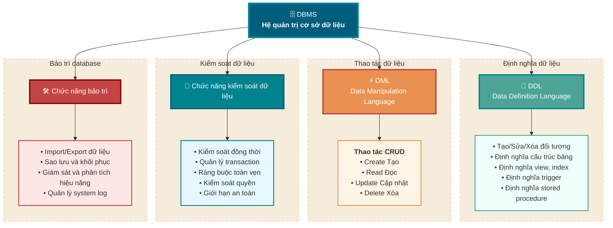
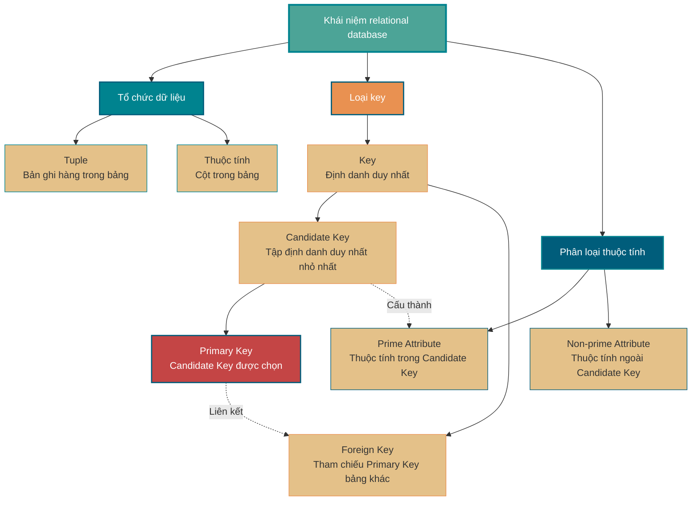
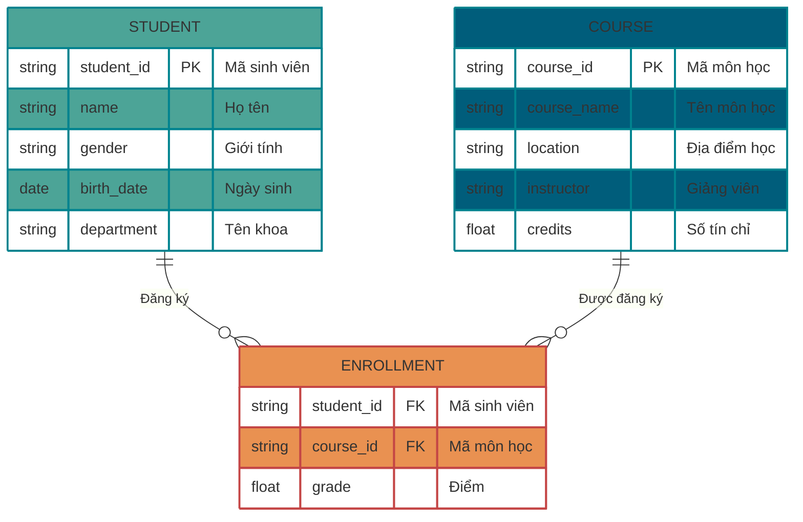
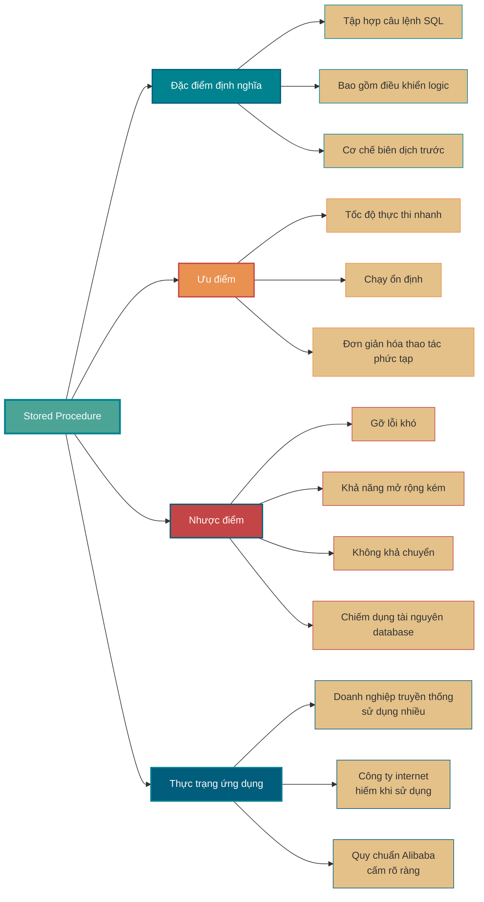
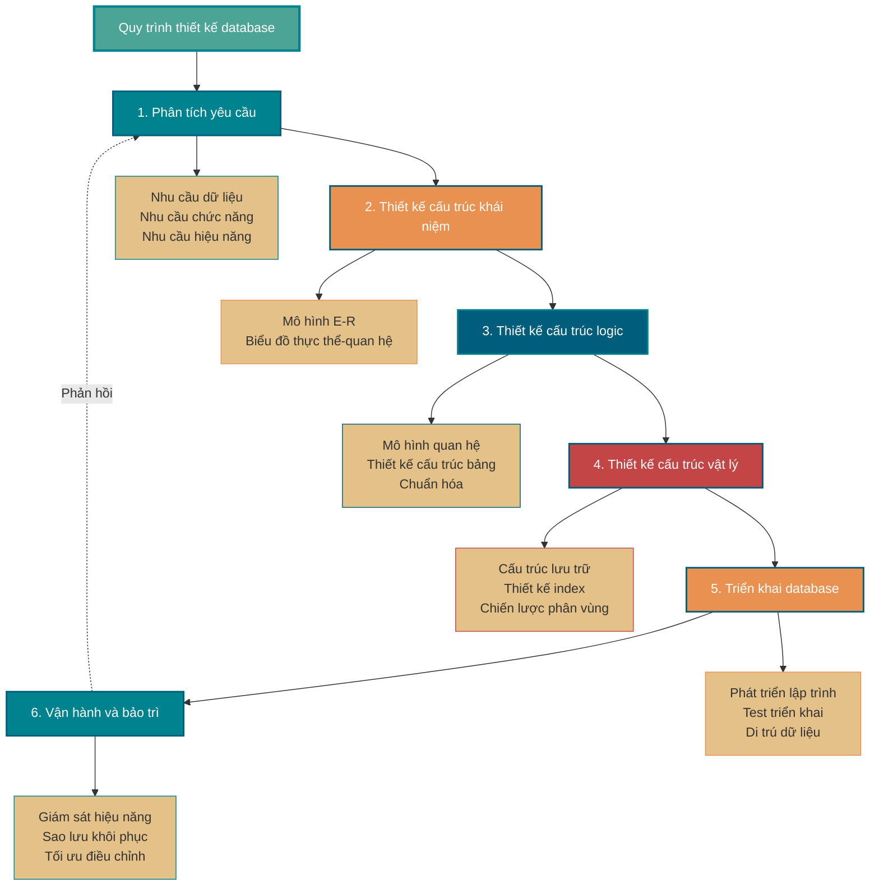

<!-- @include: @small-advertisement.snippet.md -->

Kiến thức cơ bản về database, phần nội dung này nhất định phải hiểu và ghi nhớ. Mặc dù phần nội dung này chỉ là kiến thức lý thuyết, nhưng nó rất quan trọng, đây là nền tảng cho việc học database MySQL sau này. PS: vì phần nội dung này liên quan đến quá nhiều nội dung mang tính khái niệm, nên đã tham khảo phần giới thiệu tương ứng của Wikipedia và Baidu Baike.

## Database, Database Management System, Database System, Database Administrator là gì?

Bốn khái niệm này mô tả các tầng khác nhau từ bản thân dữ liệu đến việc quản lý toàn bộ hệ thống, chúng ta thường dùng một ví dụ về thư viện để nối chúng lại với nhau mà hiểu.

- **Database (DB):** nó giống như trong thư viện, tất cả sách và tài liệu được lưu trên giá sách. Về mặt kỹ thuật, database là tập hợp dữ liệu có cấu trúc được tổ chức, mô tả và lưu trữ theo một mô hình dữ liệu (data model) nhất định, có thể được chia sẻ bởi nhiều người dùng khác nhau. Nó chính là thứ cốt lõi cuối cùng mà chúng ta phải lưu trữ và truy xuất — bản thân thông tin.
- **Database Management System (DBMS):** nó giống như hệ thống quản lý của toàn bộ thư viện, bao gồm quy tắc phân loại biên mục sách, quy trình mượn-trả, hệ thống kiểm tra an ninh, v.v. Về mặt kỹ thuật, DBMS là một phần mềm cỡ lớn, ví dụ như MySQL, Oracle, PostgreSQL mà chúng ta thường dùng. Trách nhiệm cốt lõi của nó là tổ chức và lưu trữ dữ liệu một cách khoa học, thu thập và duy trì dữ liệu hiệu quả; nó che giấu sự phức tạp của thao tác tệp cấp thấp, cung cấp một bộ interface chuẩn (như SQL) để điều khiển dữ liệu, và chịu trách nhiệm về các vấn đề phức tạp như concurrent control, transaction management, permission control.
- **Database System (DBS):** nó chính là thư viện đang hoạt động bình thường hoàn chỉnh. Đây là một khái niệm lớn hơn, không chỉ bao gồm sách (DB) và hệ thống quản lý (DBMS), mà còn bao gồm cả phần cứng, ứng dụng và con người sử dụng.
- **Database Administrator (DBA):** anh ấy chính là giám đốc thư viện, phụ trách toàn bộ database system hoạt động bình thường. Trách nhiệm của anh ấy rất rộng, bao gồm thiết kế, cài đặt, giám sát, tinh chỉnh hiệu năng, sao lưu và khôi phục database, quản lý an toàn, v.v., đảm bảo hệ thống ổn định, hiệu quả và an toàn.

DB và DBMS chúng ta thường hay nhầm lẫn, ở đây nhắc lại đơn giản: **thường khi chúng ta nói "dùng MySQL database", thực ra là dùng MySQL (DBMS) để quản lý một hoặc nhiều database (DB).**

## DBMS có những chức năng chính nào

DBMS thường cung cấp bốn chức năng cốt lõi:

1. **Data definition (định nghĩa dữ liệu):** đây là nền tảng của DBMS. Nó cung cấp một bộ ngôn ngữ định nghĩa dữ liệu (Data Definition Language - DDL), giúp chúng ta có thể tạo, sửa đổi và xóa các đối tượng khác nhau trong database. Điều này không chỉ là định nghĩa cấu trúc bảng (ví dụ tên field, kiểu dữ liệu), mà còn bao gồm định nghĩa view, index, trigger, stored procedure, v.v.
2. **Data manipulation (thao tác dữ liệu):** đây là chức năng mà chúng ta với tư cách developer sử dụng nhiều nhất hằng ngày. Nó cung cấp một bộ ngôn ngữ thao tác dữ liệu (Data Manipulation Language - DML), cốt lõi chính là thêm, xóa, sửa, tra (CRUD) mà chúng ta quen thuộc. Nó giúp chúng ta thuận tiện thao tác và truy xuất dữ liệu trong database.
3. **Data control (kiểm soát dữ liệu):** đây là yếu tố then chốt đảm bảo dữ liệu đúng đắn, an toàn, tin cậy. Thường bao gồm concurrent control, transaction management, integrity constraint, permission control, giới hạn an toàn, v.v.
4. **Database maintenance (bảo trì database):** phần chức năng này nhằm đảm bảo database system vận hành ổn định lâu dài. Nó bao gồm import/export dữ liệu, sao lưu và khôi phục database, giám sát và phân tích hiệu năng, cũng như quản lý system log, v.v.

## Bạn biết những loại DBMS nào?

### Relational database

Ngoài relational database (RDBMS) thường dùng nhất, ví dụ MySQL (lựa chọn mã nguồn mở hàng đầu), PostgreSQL (đầy đủ chức năng nhất), Oracle (cấp doanh nghiệp), chúng dựa trên cấu trúc bảng và SQL chặt chẽ, rất phù hợp với dữ liệu có cấu trúc và các kịch bản cần transaction, ví dụ giao dịch ngân hàng, hệ thống đơn hàng.

Trong những năm gần đây, để đáp ứng nhu cầu dữ liệu khổng lồ, độ đồng thời cao và cấu trúc dữ liệu đa dạng do ứng dụng internet mang lại, một loạt database NoSQL và NewSQL đã xuất hiện.

### NoSQL database

Đặc điểm chung của chúng là để đạt được hiệu năng tối đa và khả năng mở rộng ngang (horizontal scaling), đã thỏa hiệp ở một số khía cạnh nhất định (thường là transaction).

**1. Key-value database, đại diện là Redis.**

- **Đặc điểm:** mô hình dữ liệu cực kỳ đơn giản, chính là một Map khổng lồ, thông qua Key để lưu-trữ và truy xuất Value. Hoạt động trên bộ nhớ, hiệu năng cực cao.
- **Kịch bản áp dụng:** rất phù hợp làm cache, session storage, counter và các kịch bản yêu cầu hiệu năng đọc-ghi cực cao.

**2. Document database, đại diện là MongoDB.**

- **Đặc điểm:** nó lưu trữ các tài liệu bán cấu trúc (ví dụ JSON/BSON), cấu trúc linh hoạt, không cần định nghĩa trước cấu trúc bảng.
- **Kịch bản áp dụng:** đặc biệt phù hợp với các nghiệp vụ có cấu trúc dữ liệu thay đổi nhiều, lặp nhanh, ví dụ user profile, content management system, log storage, v.v.

**3. Columnar database, đại diện là HBase, Cassandra.**

- **Đặc điểm:** dữ liệu được lưu trữ theo column family chứ không phải theo hàng. Điều này khiến nó có hiệu năng cực cao khi đọc một số ít cột trên một lượng lớn hàng.
- **Kịch bản áp dụng:** được thiết kế riêng cho việc lưu trữ và phân tích dữ liệu khổng lồ, rất phù hợp cho phân tích dữ liệu lớn, lưu trữ dữ liệu giám sát, hệ thống gợi ý và các kịch bản cần thông lượng ghi cao và quét theo dải (range scan).

**4. Graph database, đại diện là Neo4j.**

- **Đặc điểm:** mô hình dữ liệu là Nodes (nút) và Edges (cạnh), chuyên dùng để lưu trữ và truy vấn các mối quan hệ phức tạp giữa các thực thể.
- **Kịch bản áp dụng:** trong các kịch bản như mạng xã hội (mối quan hệ bạn bè), recommendation engine (mối quan hệ user-sản phẩm), knowledge graph, phát hiện gian lận (mối quan hệ dòng tiền), hiệu năng vượt xa relational database.

### NewSQL database

Vì NoSQL không hỗ trợ transaction, nên nhiều hệ thống yêu cầu rất cao về an toàn dữ liệu (ví dụ hệ thống tài chính, hệ thống đơn hàng, hệ thống giao dịch) không còn phù hợp để sử dụng. Tuy nhiên, loại hệ thống này thường có nhu cầu lưu trữ lượng lớn dữ liệu.

Những hệ thống này thường chỉ có thể thông qua việc mua máy tính có hiệu năng mạnh hơn, hoặc thông qua database middleware để nâng cao khả năng lưu trữ. Tuy nhiên, chi phí tiền bạc của loại trước quá cao, chi phí phát triển của loại sau quá cao.

Thế là, **NewSQL** đã xuất hiện!

Nói một cách đơn giản, NewSQL chính là: **distributed storage + SQL + transaction**. NewSQL không chỉ có khả năng quản lý lưu trữ dữ liệu khổng lồ của NoSQL, mà còn giữ nguyên các đặc tính như hỗ trợ ACID và SQL của database truyền thống. Vì vậy, NewSQL cũng có thể gọi là **distributed relational database**.

Một số mục tiêu thiết kế của NewSQL database:

1. Mở rộng ngang (Scale Out): nâng cao khả năng chịu tải của hệ thống bằng cách tăng số lượng máy. Tương tự là Scale Up (mở rộng dọc), nâng cao khả năng chịu tải của hệ thống bằng cách nâng cấp thiết bị phần cứng.
2. Tính nhất quán mạnh (Strict Consistency): tại bất kỳ thời điểm nào, dữ liệu trong tất cả các nút đều giống nhau.
3. Tính sẵn sàng cao (High Availability): hệ thống gần như có thể liên tục cung cấp dịch vụ.
4. Hỗ trợ SQL chuẩn (Structured Query Language): các relational database như PostgreSQL, MySQL, Oracle đều hỗ trợ SQL.
5. Transaction (ACID): Atomicity (tính nguyên tử), Consistency (tính nhất quán), Isolation (tính cô lập); Durability (tính bền vững).
6. Tương thích với các relational database chủ đạo: tương thích các relational database phổ biến như MySQL, Oracle, PostgreSQL.
7. Cloud Native: có thể triển khai công cụ hóa, tự động hóa trên public cloud, private cloud, hybrid cloud.
8. HTAP (Hybrid Transactional/Analytical Processing): hỗ trợ xử lý kết hợp OLTP và OLAP.

Đại diện NewSQL database: F1/Spanner của Google, [OceanBase](https://open.oceanbase.com/) của Alibaba, [TiDB](https://pingcap.com/zh/product-community/) của PingCAP.

## Tuple, Key, Candidate Key, Primary Key, Foreign Key, Prime Attribute, Non-prime Attribute là gì?

Trong lý thuyết relational database, việc hiểu các khái niệm cốt lõi như tuple, key, candidate key, primary key, foreign key, prime attribute và non-prime attribute là vô cùng quan trọng đối với việc thiết kế và chuẩn hóa database. Các khái niệm này tạo thành nền tảng lý thuyết của relational database.

### Khái niệm cơ bản

- **Tuple (元组):** tuple là đơn vị cơ bản trong relational database, trong bảng hai chiều tương ứng với một bản ghi hàng. Mỗi tuple chứa thông tin hoàn chỉnh của một thực thể. Ví dụ, trong bảng sinh viên, thông tin hoàn chỉnh của mỗi sinh viên (mã sinh viên, họ tên, tuổi, v.v.) tạo thành một tuple.
- **Key (码):** key là tập hợp một hoặc nhiều thuộc tính có thể xác định duy nhất tuple trong quan hệ. Tác dụng chính của key là đảm bảo tính duy nhất và tính toàn vẹn của dữ liệu.

### Phân loại key

- **Candidate Key (候选码):** candidate key là tập hợp thuộc tính nhỏ nhất có thể xác định duy nhất tuple, bất kỳ tập con thực sự nào của nó đều không thể xác định duy nhất tuple. Một quan hệ có thể có nhiều candidate key. Ví dụ, trong bảng sinh viên, nếu "mã sinh viên" có thể xác định duy nhất sinh viên, đồng thời "số CMND" cũng có thể xác định duy nhất sinh viên, thì {mã sinh viên} và {số CMND} đều là candidate key.
- **Primary Key (主码/主键):** primary key là một key được chọn từ các candidate key, dùng để xác định duy nhất tuple trong quan hệ. Mỗi quan hệ chỉ có thể có một primary key, nhưng có thể có nhiều candidate key. Khi chọn primary key thường xem xét: tính đơn giản, tính ổn định, không mang ý nghĩa nghiệp vụ, v.v.
- **Foreign Key (外码/外键):** foreign key là một thuộc tính hoặc nhóm thuộc tính trong một quan hệ, nó tương ứng với primary key của một quan hệ khác. Foreign key dùng để thiết lập và duy trì mối liên hệ giữa hai quan hệ, là cơ chế quan trọng để thực hiện referential integrity (tính toàn vẹn tham chiếu). Ví dụ, trong bảng đăng ký môn học, nếu "mã sinh viên" tham chiếu primary key "mã sinh viên" của bảng sinh viên, thì "mã sinh viên" trong bảng đăng ký môn học chính là foreign key.

### Phân loại thuộc tính

- **Prime Attribute (主属性):** prime attribute là thuộc tính được chứa trong bất kỳ candidate key nào. Nếu một quan hệ có nhiều candidate key, thì tất cả thuộc tính xuất hiện trong các candidate key đó đều là prime attribute. Ví dụ, trong quan hệ công nhân (mã công nhân, số CMND, họ tên, giới tính, bộ phận), nếu {mã công nhân} và {số CMND} đều là candidate key, thì "mã công nhân" và "số CMND" đều là prime attribute.
- **Non-prime Attribute (非主属性):** non-prime attribute là thuộc tính không được chứa trong bất kỳ candidate key nào. Các thuộc tính này hoàn toàn phụ thuộc vào candidate key để xác định giá trị của mình. Trong quan hệ công nhân nêu trên, "họ tên", "giới tính", "bộ phận" đều là non-prime attribute.

## ER diagram là gì?

Khi làm một dự án, chúng ta nhất định phải thử vẽ ER diagram để làm rõ thiết kế database, đây cũng là thứ mà interviewer thường hỏi khi hỏi về dự án của bạn.

**ER diagram** tên đầy đủ là Entity Relationship Diagram (biểu đồ quan hệ thực thể), cung cấp phương pháp biểu diễn loại thực thể, thuộc tính và mối liên hệ.

ER diagram được cấu thành từ 3 yếu tố dưới đây:

- **Thực thể (Entity):** thường là đối tượng nghiệp vụ trong thế giới thực, tất nhiên dùng một số đối tượng logic cũng được. Ví dụ đối với một hệ thống quản lý khuôn viên, sẽ liên quan đến các thực thể như sinh viên, giáo viên, môn học, lớp học, v.v. Trong ER diagram, thực thể được biểu diễn bằng khung hình chữ nhật.
- **Thuộc tính (Attribute):** tức là thuộc tính mà một thực thể sở hữu, thuộc tính dùng để mô tả các yếu tố cấu thành thực thể, đối với thiết kế sản phẩm có thể hiểu là field. Trong ER diagram, thuộc tính được biểu diễn bằng hình elip.
- **Mối liên hệ (Relationship):** tức là mối quan hệ giữa thực thể và thực thể, trong ER diagram được biểu diễn bằng hình thoi, mối quan hệ này không chỉ có mối quan hệ ràng buộc nghiệp vụ, mà còn có thể thông qua con số để biểu thị mối quan hệ tương ứng về số lượng giữa các thực thể. Ví dụ, một lớp học sẽ có nhiều sinh viên chính là một mối liên hệ giữa các thực thể.

Hình dưới đây là ER diagram sinh viên đăng ký môn học, mỗi sinh viên có thể chọn nhiều môn học, cùng một môn học cũng có thể được nhiều người chọn, vì vậy mối quan hệ giữa chúng là nhiều-nhiều (M: N). Ngoài ra, còn có hai loại mối quan hệ khác giữa các thực thể: 1 với 1 (1:1), 1 với nhiều (1: N).

## Bạn có biết về database normalization form (chuẩn hóa database) không?

Database normalization form có 3 loại:

- 1NF (First Normal Form): thuộc tính không thể chia nhỏ thêm nữa.
- 2NF (Second Normal Form): trên cơ sở 1NF, loại bỏ sự phụ thuộc hàm cục bộ (partial functional dependency) của thuộc tính không khóa (non-prime attribute) đối với mã.
- 3NF (Third Normal Form): 3NF trên cơ sở 2NF, loại bỏ sự phụ thuộc hàm truyền (transitive functional dependency) của non-prime attribute đối với mã.

### 1NF (First Normal Form)

Thuộc tính (tương ứng với field trong bảng) không thể bị chia nhỏ nữa, tức là field này chỉ có thể là một giá trị, không thể chia thành nhiều field khác nữa. **1NF là yêu cầu cơ bản nhất của mọi relational database**, tức là bảng được tạo trong relational database nhất định phải thỏa mãn first normal form.

### 2NF (Second Normal Form)

2NF trên cơ sở 1NF, loại bỏ sự phụ thuộc hàm cục bộ của non-prime attribute đối với mã. Như hình dưới đây, thể hiện sự chuyển tiếp từ first normal form sang second normal form. Second normal form trên cơ sở first normal form thêm một cột, cột này gọi là primary key, các non-prime attribute đều phụ thuộc vào primary key.

Một số khái niệm quan trọng:

- **Functional dependency (phụ thuộc hàm):** nếu trong một bảng, khi giá trị của thuộc tính (hoặc nhóm thuộc tính) X được xác định, nhất định có thể xác định được giá trị của thuộc tính Y, thì có thể nói Y phụ thuộc hàm vào X, viết là X → Y.
- **Partial functional dependency (phụ thuộc hàm cục bộ):** nếu X→Y, và tồn tại một tập con thực sự X0 của X, khiến X0→Y, thì gọi là Y phụ thuộc hàm cục bộ vào X. Ví dụ trong bảng thông tin cơ bản sinh viên R (学号, 身份证号, 姓名), tất nhiên giá trị thuộc tính "学号" là duy nhất, trong quan hệ R, (学号, 身份证号)->(姓名), (学号)->(姓名), (身份证号)->(姓名); vì vậy 姓名 phụ thuộc hàm cục bộ vào (学号, 身份证号);
- **Full functional dependency (phụ thuộc hàm đầy đủ):** trong một quan hệ, nếu một mục dữ liệu thuộc tính không khóa nào đó phụ thuộc vào toàn bộ key thì gọi là full functional dependency. Ví dụ bảng thông tin cơ bản sinh viên R (学号, 班级, 姓名) giả sử các lớp khác nhau có thể có mã sinh viên giống nhau, trong cùng một lớp mã sinh viên không thể giống nhau, trong quan hệ R, (学号, 班级)->(姓名), nhưng (学号)->(姓名) không đúng, (班级)->(姓名) không đúng, vì vậy 姓名 phụ thuộc hàm đầy đủ vào (学号, 班级);
- **Transitive functional dependency (phụ thuộc hàm truyền):** trong relation schema R(U), giả sử X, Y, Z là các tập con thuộc tính khác nhau của U, nếu X xác định Y, Y xác định Z, và X không chứa Y, Y không xác định X, (X∪Y)∩Z = tập rỗng, thì gọi là Z phụ thuộc hàm truyền vào X. Transitive functional dependency sẽ gây ra dư thừa và bất thường dữ liệu. Các tập con Y và Z của transitive functional dependency thường cùng thuộc về một sự vật nào đó, vì vậy có thể gộp chúng lại đặt vào một bảng. Ví dụ trong quan hệ R(学号, 姓名, 系名, 系主任), 学号 → 系名, 系名 → 系主任, vì vậy tồn tại non-prime attribute 系主任 phụ thuộc hàm truyền vào 学号.

### 3NF (Third Normal Form)

3NF trên cơ sở 2NF, loại bỏ sự phụ thuộc hàm truyền của non-prime attribute đối với mã. Thiết kế database đáp ứng yêu cầu 3NF, **về cơ bản** đã giải quyết các vấn đề dư thừa dữ liệu quá lớn, bất thường khi chèn, bất thường khi sửa đổi, bất thường khi xóa. Ví dụ trong quan hệ R(学号, 姓名, 系名, 系主任), 学号 → 系名, 系名 → 系主任, vì vậy tồn tại non-prime attribute 系主任 phụ thuộc hàm truyền vào 学号, do đó thiết kế của bảng này không đáp ứng yêu cầu 3NF.

## Primary key và foreign key khác nhau ở điểm nào?

Từ định nghĩa và thuộc tính, sự khác biệt của chúng là:

- **Primary Key (主键):** tác dụng cốt lõi của nó là xác định duy nhất mỗi hàng dữ liệu trong bảng. Vì vậy, giá trị của cột primary key phải là duy nhất (Unique) và không được rỗng (Not Null). Một bảng chỉ có thể có một primary key. Primary key đảm bảo entity integrity (tính toàn vẹn thực thể).
- **Foreign Key (外键):** tác dụng cốt lõi của nó là thiết lập và ép buộc mối quan hệ liên kết giữa hai bảng. Giá trị của cột foreign key trong một bảng, phải tương ứng với giá trị candidate key của một hàng trong bảng khác (thường là primary key, cũng có thể là unique key), hoặc là một giá trị NULL. Vì vậy, giá trị của foreign key có thể lặp lại, cũng có thể rỗng. Một bảng có thể có nhiều foreign key, lần lượt liên kết đến các bảng khác nhau. Foreign key đảm bảo referential integrity (tính toàn vẹn tham chiếu).

Dùng một ví dụ thương mại điện tử đơn giản để minh họa: giả sử chúng ta có hai bảng: `users` (bảng người dùng) và `orders` (bảng đơn hàng).

- Trong bảng `users`, cột `user_id` là **primary key**. `user_id` của mỗi người dùng là duy nhất, chúng ta dùng nó để phân biệt Trương Tam và Lý Tứ.
- Trong bảng `orders`, `order_id` là **primary key** của chính nó. Đồng thời, nó sẽ có một cột `user_id`, cột này chính là một **foreign key**, nó tham chiếu primary key `user_id` của bảng `users`.

Ràng buộc foreign key này đảm bảo:

1. Bạn không thể tạo một đơn hàng không thuộc về bất kỳ người dùng đã biết nào (`user_id` không tồn tại trong bảng `users`).
2. Bạn không thể xóa một người dùng đã đặt hàng (trừ khi thiết lập các quy tắc đặc biệt như cascade delete).

## Tại sao không khuyến khích sử dụng foreign key và cascade?

Đối với foreign key và cascade, sổ tay phát triển Alibaba đã nói như thế này:

> 【Bắt buộc】không được dùng foreign key và cascade, mọi khái niệm foreign key phải được giải quyết ở tầng ứng dụng.
>
> Giải thích: lấy mối quan hệ giữa sinh viên và điểm số làm ví dụ, student_id trong bảng sinh viên là primary key, thì student_id trong bảng điểm số là foreign key. Nếu cập nhật student_id trong bảng sinh viên, đồng thời kích hoạt cập nhật student_id trong bảng điểm số, đó là cascade update. Foreign key và cascade update phù hợp với máy đơn độc lập, độ đồng thời thấp, không phù hợp với distributed (phân tán), cụm độ đồng thời cao; cascade update là blocking mạnh, có rủi ro database update storm (bão cập nhật); foreign key ảnh hưởng đến tốc độ chèn của database.

Tại sao không nên dùng foreign key? Hầu hết mọi người có thể trả lời như thế này:

1. **Làm tăng độ phức tạp:** a. mỗi lần làm DELETE hoặc UPDATE đều phải xem xét ràng buộc foreign key, sẽ khiến việc phát triển rất đau khổ, việc test dữ liệu cực kỳ bất tiện; b. mối quan hệ chủ-tớ của foreign key là cố định, giả sử ngày nào đó yêu cầu thay đổi, field này trong database căn bản không cần liên quan đến các bảng khác nữa thì sẽ thêm nhiều phiền phức.
2. **Tăng khối lượng công việc thêm:** database cần thêm công việc bảo trì foreign key, ví dụ khi chúng ta thực hiện các thao tác thêm, xóa, cập nhật liên quan đến foreign key field, cần kích hoạt các thao tác liên quan để kiểm tra, đảm bảo tính nhất quán và đúng đắn của dữ liệu, như vậy sẽ không thể không tiêu hao tài nguyên database. Nếu duy trì ở tầng ứng dụng, có thể giảm áp lực database;
3. **Không thân thiện với sharding (phân mảnh bảng):** vì dưới sharding, foreign key không thể có hiệu lực.
4. ……

Cá nhân tôi cảm thấy cách trả lời trên không đặc biệt toàn diện, chỉ nói về một vấn đề phổ biến mà foreign key tồn tại. Trên thực tế, chúng ta biết foreign key cũng có rất nhiều lợi ích, ví dụ:

1. Đảm bảo tính nhất quán và toàn vẹn của dữ liệu database;
2. Thao tác cascade tiện lợi, giảm nhẹ khối lượng code chương trình;
3. ……

Cho nên, đừng nhất loạt vứt bỏ khái niệm foreign key này đi, nó tồn tại tất nhiên có lý do tồn tại của nó, nếu hệ thống không liên quan đến sharding, mức độ đồng thời không quá cao thì vẫn có thể cân nhắc sử dụng foreign key.

## Stored procedure là gì?

Stored procedure là tập hợp các câu lệnh SQL đã được biên dịch sẵn trong database, nó đóng gói nhiều câu lệnh SQL và các câu lệnh điều khiển logic chương trình (như IF-ELSE, vòng lặp WHILE, v.v.) lại với nhau, tạo thành một đối tượng database có thể gọi lặp lại được.

**Ưu điểm của stored procedure:**

Trong các ứng dụng cấp doanh nghiệp truyền thống, stored procedure có một giá trị thực dụng nhất định. Khi logic nghiệp vụ phức tạp, cần thực thi một lượng lớn câu lệnh SQL mới hoàn thành được một thao tác nghiệp vụ, lúc này có thể đóng gói các câu lệnh này thành stored procedure, đơn giản hóa quy trình gọi. Vì stored procedure đã được biên dịch và lưu trữ trong database tại thời điểm tạo, khi thực thi không cần biên dịch lại, vì vậy so với câu lệnh SQL động có hiệu năng thực thi tốt hơn. Đồng thời, một khi stored procedure đã gỡ lỗi xong, sự chạy của nó tương đối ổn định và tin cậy.

**Hạn chế của stored procedure:**

Tuy nhiên, trong kiến trúc internet hiện đại, việc sử dụng stored procedure ngày càng ít. Nguyên nhân chính bao gồm: khó gỡ lỗi, thiếu công cụ gỡ lỗi hoàn thiện; khả năng mở rộng kém, sửa đổi logic nghiệp vụ cần trực tiếp sửa đổi đối tượng database; tính khả chuyển kém, cú pháp stored procedure của các hệ thống database khác nhau khác biệt khá lớn; chiếm dụng tài nguyên database, tăng gánh nặng cho máy chủ database; khó quản lý version, bất tiện cho việc kiểm soát version code.

**Chuẩn mực ngành:**

Dựa trên các nguyên nhân trên, quy định phát triển của nhiều công ty internet rõ ràng hạn chế hoặc cấm sử dụng stored procedure. Ví dụ, 《Sổ tay phát triển Java Alibaba》 quy định rõ ràng cấm sử dụng stored procedure, khuyến nghị đặt logic nghiệp vụ ở tầng ứng dụng để thực hiện, giữ cho database đơn giản và hiệu quả.

## DROP、DELETE、TRUNCATE khác nhau ở điểm nào?

Trong thao tác database, `DROP`,`DELETE` và `TRUNCATE` là ba lệnh xóa dữ liệu thường dùng, chúng có sự khác biệt rõ rệt về chức năng, hiệu năng và kịch bản sử dụng.

**Lệnh DROP:**

- Cú pháp: `DROP TABLE 表名`
- Tác dụng: xóa hoàn toàn toàn bộ bảng, bao gồm cấu trúc bảng, dữ liệu, index, trigger, constraint và tất cả các đối tượng liên quan khác
- Kịch bản sử dụng: sử dụng khi bảng không còn cần thiết nữa

**Lệnh TRUNCATE:**

- Cú pháp: `TRUNCATE TABLE 表名`
- Tác dụng: xóa sạch toàn bộ dữ liệu trong bảng, nhưng giữ lại cấu trúc bảng
- Đặc điểm: trường tự tăng (AUTO_INCREMENT) sẽ được đặt lại về giá trị khởi tạo (thường là 1)
- Kịch bản sử dụng: sử dụng khi cần nhanh chóng xóa sạch dữ liệu bảng nhưng giữ lại cấu trúc bảng

**Lệnh DELETE:**

- Cú pháp: `DELETE FROM 表名 WHERE 条件`
- Tác dụng: xóa các hàng dữ liệu thỏa mãn điều kiện, không có mệnh đề WHERE thì xóa toàn bộ dữ liệu
- Đặc điểm: trường tự tăng không bị đặt lại, tiếp tục tăng từ giá trị trước đó
- Kịch bản sử dụng: sử dụng khi cần xóa một cách có chọn lọc một phần dữ liệu

`TRUNCATE` và `DELETE` không có mệnh đề `WHERE`, cùng với `DROP` đều sẽ xóa dữ liệu trong bảng, nhưng **`TRUNCATE` và `DELETE` chỉ xóa dữ liệu không xóa cấu trúc (định nghĩa) của bảng, còn thực thi câu lệnh `DROP` thì cấu trúc của bảng này cũng sẽ bị xóa, tức là sau khi thực thi `DROP` thì bảng tương ứng không còn tồn tại nữa.**

### Ảnh hưởng đến cấu trúc bảng

- `DROP`: xóa cấu trúc bảng và toàn bộ dữ liệu, bảng sẽ không còn tồn tại
- `TRUNCATE`: chỉ xóa dữ liệu, giữ lại cấu trúc và định nghĩa bảng
- `DELETE`: chỉ xóa dữ liệu, giữ lại cấu trúc và định nghĩa bảng

### Trigger

- Thao tác `DELETE` sẽ kích hoạt trigger DELETE liên quan
- `TRUNCATE` và `DROP` không kích hoạt trigger DELETE

### Transaction và rollback

- `DROP` và `TRUNCATE` thuộc về thao tác DDL, sau khi thực thi có hiệu lực ngay, không thể rollback
- `DELETE` thuộc về thao tác DML, có thể rollback (trong transaction)

### Tốc độ thực thi

Nói chung: `DROP` > `TRUNCATE` > `DELETE` (điều này tôi chưa thực sự test qua).

- Khi lệnh `DELETE` thực thi sẽ tạo ra log `binlog` của database, mà việc ghi log cần tiêu hao thời gian, nhưng cũng có lợi là tiện cho việc rollback và khôi phục dữ liệu.
- Khi lệnh `TRUNCATE` thực thi sẽ không tạo ra log database, vì vậy nhanh hơn `DELETE`. Ngoài ra, nó còn đặt lại giá trị tự tăng của bảng và khôi phục index về kích thước ban đầu, v.v.
- Lệnh `DROP` sẽ giải phóng toàn bộ không gian mà bảng chiếm dụng.

Tips: bạn nên quan tâm nhiều hơn đến kịch bản sử dụng, thay vì hiệu quả thực thi.

## Câu lệnh DML và câu lệnh DDL khác nhau ở điểm nào?

- DML là viết tắt của Data Manipulation Language (ngôn ngữ thao tác dữ liệu), chỉ thao tác trên các bản ghi của bảng trong database, chủ yếu bao gồm chèn, cập nhật, xóa và truy vấn bản ghi trong bảng, là thao tác mà developer sử dụng thường xuyên nhất hằng ngày.
- DDL (Data Definition Language) là viết tắt của Data Definition Language (ngôn ngữ định nghĩa dữ liệu), nói một cách đơn giản, là ngôn ngữ thao tác để tạo, xóa, sửa đổi các đối tượng bên trong database. Sự khác biệt lớn nhất giữa nó và ngôn ngữ DML là DML chỉ thao tác trên dữ liệu bên trong bảng, không liên quan đến việc định nghĩa bảng, sửa đổi cấu trúc, càng không liên quan đến các đối tượng khác. Câu lệnh DDL được sử dụng nhiều hơn bởi database administrator (DBA), developer thông thường ít khi sử dụng.

Ngoài ra, vì `SELECT` không phá hoại bảng, nên có nơi còn tách riêng `SELECT` ra gọi là database query language DQL (Data Query Language).

## Thiết kế database thường được chia thành những bước nào?

### 1. Giai đoạn phân tích yêu cầu

**Mục tiêu:** tìm hiểu và phân tích sâu nhu cầu của người dùng, xác định rõ ranh giới hệ thống
**Công việc chính:**

- Thu thập và phân tích nhu cầu dữ liệu: xác định cần lưu trữ những dữ liệu nào, kích thước dữ liệu, tần suất cập nhật dữ liệu
- Làm rõ nhu cầu chức năng: hệ thống cần hỗ trợ những thao tác nghiệp vụ nào, thứ tự ưu tiên của từng thao tác
- Định nghĩa nhu cầu hiệu năng: yêu cầu thời gian phản hồi, số lượng người dùng đồng thời, thông lượng dữ liệu
- Xác định nhu cầu an toàn: quyền truy cập dữ liệu, yêu cầu mã hóa, yêu cầu kiểm toán
  **Sản phẩm tạo ra:** tài liệu đặc tả yêu cầu, bản nháp data dictionary (từ điển dữ liệu)

### 2. Giai đoạn thiết kế cấu trúc khái niệm

**Mục tiêu:** chuyển nhu cầu thành mô hình khái niệm của thế giới thông tin
**Công việc chính:**

- Nhận diện thực thể: xác định các đối tượng chính trong hệ thống
- Định nghĩa thuộc tính: làm rõ đặc điểm của mỗi thực thể
- Thiết lập mối liên hệ: xác định mối quan hệ giữa các thực thể (một-một, một-nhiều, nhiều-nhiều)
- Vẽ biểu đồ E-R (biểu đồ thực thể-quan hệ)
  **Sản phẩm tạo ra:** biểu đồ E-R, tài liệu mô hình dữ liệu khái niệm

### 3. Giai đoạn thiết kế cấu trúc logic

**Mục tiêu:** chuyển mô hình khái niệm thành mô hình logic mà DBMS cụ thể hỗ trợ
**Công việc chính:**

- Chuyển biểu đồ E-R sang mô hình quan hệ: chuyển thực thể thành bảng, thuộc tính thành field
- Xử lý chuẩn hóa: thông qua normalization (chuẩn hóa) để loại bỏ dư thừa dữ liệu và bất thường cập nhật (thường đạt đến 3NF)
- Định nghĩa ràng buộc toàn vẹn: primary key, foreign key, ràng buộc duy nhất, ràng buộc kiểm tra
- Tối ưu hóa mô hình: theo nhu cầu hiệu năng tiến hành denormalization (phi chuẩn hóa) thích hợp
  **Sản phẩm tạo ra:** mô hình dữ liệu logic, tài liệu thiết kế cấu trúc bảng

### 4. Giai đoạn thiết kế cấu trúc vật lý

**Mục tiêu:** xác định phương án lưu trữ vật lý và phương thức truy cập của dữ liệu
**Công việc chính:**

- Chọn storage engine: ví dụ InnoDB, MyISAM của MySQL, v.v.
- Thiết kế chiến lược index: xác định loại index và field cần thiết lập
- Thiết kế phân vùng: phân vùng các bảng lớn để nâng cao hiệu năng
- Xác định tham số lưu trữ: kích thước tablespace, vị trí file dữ liệu, cấu hình buffer
- Xây dựng chiến lược sao lưu: tần suất và cách thức sao lưu toàn bộ, sao lưu gia tăng
  **Sản phẩm tạo ra:** tài liệu thiết kế vật lý, phương án thiết kế index

### 5. Giai đoạn triển khai database

**Mục tiêu:** chuyển thiết kế thành database system chạy thực tế
**Công việc chính:**

- Tạo database và cấu trúc bảng: viết và thực thi câu lệnh DDL
- Phát triển stored procedure và trigger (nếu cần)
- Viết interface ứng dụng
- Nhập dữ liệu ban đầu
- Kiểm thử tích hợp hệ thống: kiểm thử chức năng, kiểm thử hiệu năng, kiểm thử áp lực
- Đào tạo người dùng và viết tài liệu
  **Sản phẩm tạo ra:** script database, báo cáo kiểm thử, sổ tay người dùng

### 6. Giai đoạn vận hành và bảo trì

**Mục tiêu:** đảm bảo database system vận hành ổn định và hiệu quả
**Công việc chính:**

- Giám sát hằng ngày: giám sát hiệu năng, giám sát không gian, phân tích error log
- Tối ưu hóa hiệu năng: tối ưu hóa truy vấn, điều chỉnh index, tinh chỉnh tham số
- Sao lưu và khôi phục dữ liệu: sao lưu định kỳ, diễn tập khôi phục
- Quản lý an toàn: quản lý quyền, cập nhật bản vá an toàn, kiểm toán
- Lập kế hoạch dung lượng: dự đoán tăng trưởng dữ liệu, mở rộng trước
- Quản lý thay đổi: đánh giá và triển khai các thay đổi yêu cầu
  **Sản phẩm tạo ra:** báo cáo vận hành, phương án tối ưu hóa, bản ghi thay đổi

### Nguyên tắc thiết kế

Trong toàn bộ quá trình thiết kế nên tuân theo: nguyên tắc độc lập dữ liệu, nguyên tắc toàn vẹn, nguyên tắc an toàn, nguyên tắc khả năng mở rộng và nguyên tắc chuẩn hóa.

## Tham khảo

- <https://blog.csdn.net/rl529014/article/details/48391465>
- <https://www.zhihu.com/question/24696366/answer/29189700>
- <https://blog.csdn.net/bieleyang/article/details/77149954>

<!-- @include: @article-footer.snippet.md -->