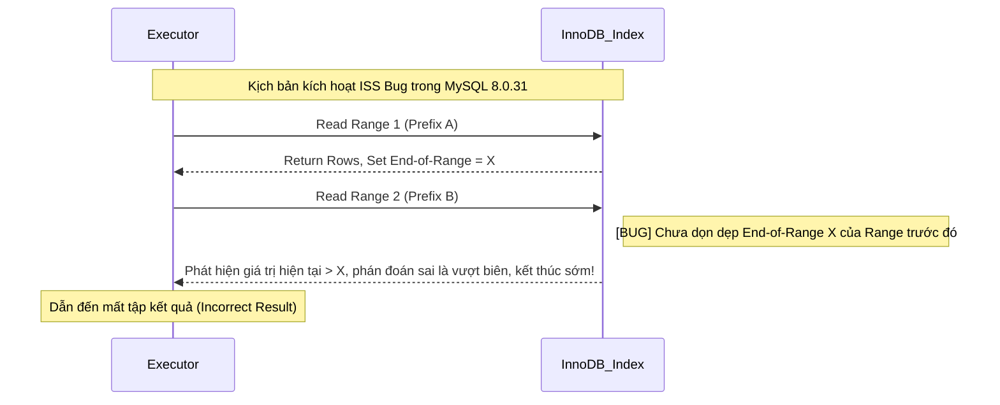

Trong tối ưu hiệu năng cơ sở dữ liệu, Index là một trong những phương pháp tối ưu trực tiếp và hiệu quả nhất. Tuy nhiên, **đã tạo Index không có nghĩa là chắc chắn sẽ dùng được Index**. Trong quá trình phát triển thực tế, chúng ta thường gặp phải những băn khoăn như thế này: rõ ràng đã tạo Index trên trường dữ liệu, nhưng truy vấn vẫn chậm như rùa, phân tích bằng `EXPLAIN` thì phát hiện ra lại là quét toàn bảng (full table scan).

Nguyên nhân khiến Index mất hiệu lực rất đa dạng, có cả vấn đề về cách viết câu lệnh SQL, cũng có yếu tố thiết kế Index không hợp lý. Một số tình huống mất hiệu lực là rõ ràng (như vi phạm nguyên tắc Leftmost Prefix), một số lại rất khó phát hiện (như chuyển đổi kiểu ngầm định). Nếu không hiểu sâu các tình huống mất hiệu lực này, rất dễ để lại mầm mống về hiệu năng trong môi trường production.

Bài viết này sẽ tổng kết một cách có hệ thống các tình huống thường gặp khiến Index trong MySQL mất hiệu lực, phân tích cơ chế nguyên lý đằng sau sự mất hiệu lực, và đưa ra các gợi ý tối ưu tương ứng, giúp bạn nhanh chóng định vị và giải quyết vấn đề Index mất hiệu lực trong quá trình phát triển và xử lý sự cố hằng ngày.

### Truy vấn SELECT \* (đánh đổi chi phí)

- **Định nghĩa cốt lõi**: Bản thân `SELECT *` **không trực tiếp khiến Index mất hiệu lực**. Đây là dạng truy vấn "không được Index bao phủ" (non-covering index), nếu điều kiện `WHERE` trúng Index, Index vẫn sẽ được cân nhắc ban đầu.
- **Quyết định chi phí Back to Table**: Khi các trường mà truy vấn cần không nằm trong cây Index, MySQL phải cầm Primary Key quay lại Clustered Index để tìm toàn bộ dữ liệu hàng (Back to Table). Optimizer sẽ so sánh chi phí giữa "quét Index + Back to Table" và "quét toàn bảng trực tiếp". Nếu tỷ lệ kết quả truy vấn chiếm khá lớn trong tổng dữ liệu (thường ngưỡng khoảng 20%~30%), optimizer sẽ cho rằng I/O tuần tự của quét toàn bảng hiệu quả hơn I/O ngẫu nhiên của Back to Table, từ đó **chủ động từ bỏ Index**.
- **Cân nhắc tình huống**:
  - **Tình huống Covering Index**: Nếu truy vấn chỉ cần các trường được Index bao phủ, sử dụng Covering Index có thể tránh Back to Table, hiệu năng tối ưu nhất.
  - **Khi Back to Table không thể tránh khỏi**: Nếu nghiệp vụ thực sự cần nhiều trường không có trong Index, chỉ cần `SELECT các trường cần thiết` là được. Khi cần phần lớn các trường, tính dễ đọc của code có thể quan trọng hơn việc tối ưu vi mô "tiết kiệm vài trường", lúc này dùng `SELECT *` cũng không sao.
- **Gợi ý áp dụng**: Ưu tiên `SELECT các trường cần thiết`, nếu bao phủ được Index thì càng tốt; nếu cần nhiều trường và Back to Table không thể tránh khỏi, không cần giáo điều "tiết kiệm trường".

### Vi phạm nguyên tắc Leftmost Prefix (tiền tố trái nhất)

- **Định nghĩa cốt lõi**: Nguyên tắc khớp tiền tố trái nhất chỉ rằng khi sử dụng Composite Index (chỉ mục kết hợp), MySQL sẽ dựa vào thứ tự các trường trong Index, lần lượt khớp các trường trong điều kiện truy vấn từ trái sang phải. Nếu điều kiện truy vấn khớp với trường ngoài cùng bên trái của Index, thì MySQL sẽ sử dụng Index để lọc dữ liệu.
- **Hiệu ứng gián đoạn của truy vấn phạm vi**: Trong Composite Index, nếu một trường nào đó sử dụng truy vấn phạm vi (ví dụ >, <, BETWEEN, khớp tiền tố LIKE "abc%"), bản thân trường đó và các cột trước nó vẫn có thể khớp bình thường và dùng để định vị chính xác trong Index, nhưng các cột sau trường đó sẽ không thể tận dụng
  Index để định vị nhanh (tức không thể sử dụng tìm kiếm nhị phân kiểu ref). Nguyên nhân là trong cấu trúc B+Tree Index, chỉ khi các cột dẫn đầu hoàn toàn bằng nhau thì các cột tiếp theo mới có thứ tự. Một khi cột dẫn đầu trở thành một phạm vi, các cột tiếp theo sẽ ở trạng thái vô thứ tự tương đối trong toàn bộ vùng quét, từ đó làm gián đoạn khả năng định vị chính xác. Tuy nhiên, trong MySQL 5.6 trở lên, các cột tiếp theo này không hoàn toàn mất hiệu lực, mà được giáng cấp xuống sử dụng **cơ chế Index Condition Pushdown (ICP, đẩy điều kiện xuống Index)**, trực tiếp lọc điều kiện trong quá trình quét phạm vi, nhằm giảm số lần Back to Table.
- **Index Skip Scan (quét nhảy Index)**: MySQL 8.0.13 đã giới thiệu **Index Skip Scan**, cho phép khi thiếu tiền tố trái nhất, thông qua việc liệt kê tất cả các giá trị Distinct của cột dẫn đầu để quét nhảy qua các cây Index tiếp theo.
  - **Hướng dẫn tránh lỗi phiên bản**: Trong **MySQL 8.0.31**, ISS tồn tại Bug nghiêm trọng ([[Bug #109145]](https://bugs.mysql.com/bug.php?id=109145)), khi đọc xuyên Range không dọn dẹp giá trị biên cũ, dẫn đến truy vấn trực tiếp **mất dữ liệu**.
  - **Gợi ý áp dụng**: ISS có hiệu năng tối ưu khi Cardinality (số lượng giá trị phân biệt) của cột dẫn đầu cực thấp (như giới tính, enum trạng thái), vì optimizer cần liệt kê tất cả các giá trị distinct của cột dẫn đầu để quét nhảy từng cái một — giá trị distinct càng ít, số lần nhảy càng ít. Nhưng bản thân "Cardinality thấp" không phải là điều kiện giới hạn chính thức, optimizer sẽ đánh giá tổng hợp chi phí để quyết định có kích hoạt ISS hay không. Trong môi trường production, **nghiêm cấm dựa vào ISS để bù đắp cho thiết kế Index tồi**, phải thông qua việc điều chỉnh thứ tự Composite Index hoặc bổ sung điều kiện cột dẫn đầu để thỏa mãn Leftmost Prefix.

**Sơ đồ đường dẫn thất bại của Index Skip Scan:**



Ví dụ mất hiệu lực:

```sql
-- Index: (sname, s_code, address)
SELECT * FROM students WHERE s_code = 1;                  -- Bỏ qua cột ngoài cùng bên trái sname, Index mất hiệu lực
SELECT * FROM students WHERE sname = 'A' AND address = 'Shanghai'; -- Bỏ qua cột ở giữa, chỉ sname đi qua Index (Index Condition Pushdown ICP có thể tối ưu việc lọc)
SELECT * FROM students WHERE sname = 'A' AND s_code > 1 AND address = 'Shanghai'; -- Sau truy vấn phạm vi, address không thể dùng để định vị, chỉ dùng để lọc
```

### Thực hiện tính toán, hàm hoặc chuyển đổi kiểu trên cột Index

- **Định nghĩa cốt lõi**: B+Tree Index lưu trữ **giá trị gốc** của trường. Một khi áp dụng hàm (như `ABS()`, `DATE()`) hoặc phép toán số học lên cột Index trong điều kiện `WHERE`, giá trị của cột đó đã bị thay đổi về mặt logic.
- **Hiệu ứng phá vỡ tính có thứ tự**: Vì B+Tree được sắp xếp dựa trên giá trị gốc, kết quả sau khi xử lý bằng hàm sẽ **vô thứ tự** trong cây Index. Cơ sở dữ liệu không thể sử dụng tìm kiếm nhị phân để định vị nhanh, chỉ có thể buộc phải quét toàn bảng.
- **Functional Index (chỉ mục hàm)**: MySQL 8.0 hỗ trợ **Functional Index**, có thể tạo Index trên giá trị sau tính toán, nhưng tình huống sử dụng có hạn, ưu tiên hàng đầu vẫn là tối ưu cách viết SQL.

Ví dụ mất hiệu lực:

```sql
SELECT * FROM students WHERE height + 1 = 170;            -- Thực hiện tính toán trên cột Index
SELECT * FROM students WHERE DATE(create_time) = '2022-01-01'; -- Sử dụng hàm trên cột Index
```

Gợi ý tối ưu:

```sql
SELECT * FROM students WHERE height = 169;                -- Chuyển phép tính sang bên phải dấu bằng
SELECT * FROM students WHERE create_time BETWEEN '2022-01-01 00:00:00' AND '2022-01-01 23:59:59';
```

### Truy vấn mờ LIKE bắt đầu bằng ký tự đại diện

- **Định nghĩa cốt lõi**: Truy vấn `LIKE` phải bắt đầu bằng ký tự cụ thể thì mới tận dụng được tính có thứ tự của Index, ví dụ `WHERE sname LIKE 'Guide%';`. Nguyên nhân là vì B+ Tree được sắp xếp từ trái sang phải. Ký tự đại diện tiền tố (`%`) phá vỡ tính có thứ tự, không thể định vị điểm bắt đầu.
- **Cơ chế mất hiệu lực của ký tự đại diện tiền tố**: Nếu bắt đầu bằng `%` (như `'%abc'`), do Index được sắp xếp theo ký tự từ trái sang phải, tiền tố không xác định đồng nghĩa với việc có thể xuất hiện ở bất kỳ vị trí nào trong cây Index, dẫn đến không thể định vị điểm bắt đầu của vùng tìm kiếm.
- **Gợi ý áp dụng**:
  - Nếu bắt buộc phải truy vấn mờ toàn phần, hãy cố gắng chỉ truy vấn các cột được Index bao phủ, lúc này `EXPLAIN` sẽ hiển thị `type: index` (**Index Full Scan**), tuy quét cả cây nhưng không cần Back to Table, hiệu năng vẫn tốt hơn `ALL`.
  - Tìm kiếm mờ quy mô lớn của nghiệp vụ cốt lõi nên được thực hiện thông qua **ElasticSearch** hoặc các công cụ tìm kiếm khác.

Ví dụ mất hiệu lực:

```sql
SELECT * FROM students WHERE sname LIKE '%Guide';          -- Mờ phần đầu, quét toàn bảng
SELECT * FROM students WHERE sname LIKE '%Guide%';         -- Mờ cả đầu và cuối, quét toàn bảng
```

### Nối bằng OR và Index Merge

- **Định nghĩa cốt lõi**: Trong nhiều điều kiện được nối bằng `OR`, chỉ cần **bất kỳ cột nào không có Index**, MySQL sẽ từ bỏ tất cả Index và chuyển sang thực hiện quét toàn bảng.
- **Cơ chế Index Merge**: Nếu cả hai phía của `OR` đều có Index, MySQL 5.1+ có thể kích hoạt tối ưu hóa **Index Merge (gộp Index)**, lần lượt quét hai Index rồi lấy hợp nhất. Tuy nhiên, nếu lượng dữ liệu sau khi lọc của cả hai Index đều lớn, chi phí gộp tập kết quả có thể cao hơn quét toàn bảng, vẫn sẽ từ bỏ Index.
- **Gợi ý áp dụng**:
  - Ưu tiên viết lại `OR` thành `UNION ALL`. `UNION ALL` cho phép mỗi đoạn truy vấn độc lập sử dụng Index, và tránh được vấn đề optimizer ước lượng chi phí `OR` không chính xác.
  - Lưu ý: Chỉ dùng `UNION ALL` khi chắc chắn tập kết quả không trùng lặp, nếu không cần dùng `UNION` (liên quan đến việc khử trùng lặp bằng bảng tạm, có chi phí bổ sung).

Ví dụ mất hiệu lực:

```sql
-- Giả sử sname và address đều có Index, nhưng mỗi bên khớp hơn 30% dữ liệu
SELECT * FROM students WHERE sname = '学生 1' OR address = '上海'; -- Có thể từ bỏ Index, quét toàn bảng

-- Gợi ý viết lại thành
SELECT * FROM students WHERE sname = '学生 1'
UNION ALL
SELECT * FROM students WHERE address = '上海'; -- Mỗi bên tự đi qua Index
```

**Cách xác minh**: Nếu trong `EXPLAIN` xuất hiện `type: index_merge` và `Extra: Using union; Using where`, nghĩa là đã sử dụng Index Merge.

### Sử dụng IN / NOT IN không đúng cách

**Độ dài danh sách `IN`**:

- `eq_range_index_dive_limit` (mặc định **200**) không trực tiếp khiến Index mất hiệu lực, mà ảnh hưởng đến **chiến lược ước lượng số hàng**:
  - **<= 200**: MySQL sử dụng **Index Dive** (thăm dò sâu vào cây Index) để ước lượng chính xác số hàng, ước lượng chi phí chính xác, Index phần lớn có hiệu quả.
  - **> 200**: Khi độ dài danh sách `IN` vượt quá `eq_range_index_dive_limit` (MySQL 5.7.4+ mặc định là 200), optimizer chuyển từ Index Dive chính xác sang ước lượng dựa trên `index_statistics`. Nếu thống kê Cardinality (số lượng giá trị phân biệt) của dữ liệu bảng đã lỗi thời, có thể dẫn đến ước lượng chi phí bất thường, từ đó từ bỏ quét phạm vi (Range Scan) mà chọn quét toàn bảng.
- Có thể tăng `eq_range_index_dive_limit` hoặc viết lại thành `JOIN` với bảng tạm để tránh.

**`NOT IN`** :

- **Danh sách hằng số** (như `NOT IN (1,2,3)`): Thường quét toàn bảng, vì cần duyệt toàn bộ cây B+ để chứng minh "không nằm trong tập hợp".
- **Subquery liên quan đến cột Index**: `WHERE id NOT IN (SELECT user_id FROM orders WHERE user_id > 1000)` có thể sử dụng Index `user_id` của bảng `orders`.
- **Phương án thay thế được khuyến nghị**: Ưu tiên sử dụng `NOT EXISTS` hoặc `LEFT JOIN / IS NULL`, hiệu năng tốt hơn và ngữ nghĩa rõ ràng hơn.

Ví dụ mất hiệu lực:

```sql
SELECT * FROM students WHERE s_code IN (1, 2, 3, ..., 500); -- Danh sách quá dài, có thể chuyển sang ước lượng thống kê dẫn đến phán đoán sai
SELECT * FROM students WHERE s_code NOT IN (1, 2, 3);     -- Danh sách hằng số, quét toàn bảng
```

### Chuyển đổi kiểu ngầm định (Implicit Type Conversion)

Đây là cái bẫy khó phát hiện nhất trong quá trình phát triển, **hướng chuyển đổi quyết định sự sống còn của Index**.

| Tình huống                       | Ví dụ               | Hướng chuyển đổi                              | Index có hiệu lực không |
| -------------------------------- | ------------------- | --------------------------------------------- | ----------------------- |
| **Cột chuỗi + giá trị số**      | `varchar_col = 123` | Chuỗi chuyển thành số (xảy ra trên cột Index) | ❌ Mất hiệu lực         |
| **Cột số + giá trị chuỗi**      | `int_col = '123'`   | Chuỗi chuyển thành số (xảy ra trên hằng số)   | ✅ Có hiệu lực          |

**Điểm mấu chốt**:

- Chỉ khi **chuyển đổi xảy ra trên cột Index**, Index mới mất hiệu lực.
- Khi chuỗi và số được so sánh với nhau, MySQL mặc định chuyển chuỗi thành **số dấu phẩy động (DOUBLE)** để so sánh (xem chi tiết tại [quy tắc 7 trong tài liệu chính thức của MySQL](https://dev.mysql.com/doc/refman/8.0/en/type-conversion.html)). Chuyển đổi kiểu ngầm định xảy ra trên cột Index tương đương với việc áp dụng một hàm chuyển đổi không thể đảo ngược lên cột Index, phá vỡ tính có thứ tự của cây B+, dẫn đến chỉ có thể quét toàn bảng.
- `int_col = '123'` sẽ được chuyển thành `int_col = CAST('123' AS DOUBLE)`, chuyển đổi xảy ra ở phía hằng số, không ảnh hưởng đến việc sử dụng Index.

**Giới thiệu chi tiết**: [Index mất hiệu lực do chuyển đổi ngầm định trong MySQL](https://javaguide.cn/database/mysql/index-invalidation-caused-by-implicit-conversion.html)

### Bẫy tối ưu hóa sắp xếp ORDER BY

Ngay cả khi điều kiện `WHERE` chính xác, nếu xử lý `ORDER BY` không tốt, vẫn sẽ xuất hiện truy vấn chậm.

**Điều kiện kích hoạt `Using filesort`**:

- Trường sắp xếp không nằm trong Index
- Thứ tự Index không khớp với `ORDER BY` (như Index `(a,b)` nhưng `ORDER BY b,a`)
- `WHERE` và `ORDER BY` lần lượt sử dụng các Index khác nhau
- Cột sắp xếp chứa cột không có trong Index của `SELECT *` (cần Back to Table để sắp xếp)

**Phương án tối ưu**:

- Tận dụng **Covering Index** để đồng thời thỏa mãn `WHERE` và `ORDER BY`. Ví dụ Index là `(name, age)`, truy vấn `SELECT name, age FROM users WHERE name = 'A' ORDER BY age`.
- Điều chỉnh thứ tự Index để khớp với `ORDER BY`.

**Cách xác minh**: Nếu cột `Extra` trong `EXPLAIN` xuất hiện `Using filesort` nghĩa là đã kích hoạt sắp xếp.

### Tổng kết

Bài viết này đã hệ thống hóa các tình huống thường gặp khiến Index trong MySQL mất hiệu lực, từ cơ chế bên dưới có thể tổng kết thành hai loại cốt lõi sau:

**1. Cách viết SQL xung đột với logic bên dưới (phá vỡ tính có thứ tự của B+Tree)**

Loại vấn đề này phổ biến nhất, bản chất là điều kiện truy vấn khiến B+Tree bên dưới mất đi khả năng định vị nhanh bằng "tìm kiếm nhị phân".

- **Vi phạm nguyên tắc Leftmost Prefix**: Bỏ qua cột dẫn đầu của Composite Index, hoặc gặp truy vấn phạm vi (như `>`, `<`, `BETWEEN`, `LIKE "abc%"`) khiến các cột tiếp theo bị gián đoạn khả năng định vị chính xác, bị giáng cấp thành quét phạm vi kèm lọc.
- **Xử lý trên cột Index**: Thực hiện tính toán số học hoặc áp dụng hàm lên cột Index ở vế trái của `WHERE`, khiến dữ liệu gốc bị thay đổi về mặt logic, trở nên vô thứ tự trong cây Index.
- **Chuyển đổi kiểu ngầm định (ẩn và chết người)**: Khi "cột kiểu chuỗi" so sánh với "giá trị kiểu số", MySQL sẽ mặc định áp hàm chuyển đổi lên cột, trực tiếp phá vỡ tính có thứ tự của cây.
- **Ký tự đại diện đứng trước trong truy vấn mờ LIKE**: Như `LIKE "%abc"`, tính không xác định của ký tự tiền tố khiến optimizer không thể xác định điểm bắt đầu của vùng quét.
- **Bẫy sắp xếp ORDER BY**: Cột sắp xếp không trúng Index, hướng sắp xếp không khớp với cấu trúc Index, v.v. sẽ kích hoạt sắp xếp bổ sung trong bộ nhớ hoặc trên đĩa (`Using filesort`).

**2. Quyết định chi phí của optimizer (sự đánh đổi dựa trên chi phí I/O)**

Loại vấn đề này không phải bản thân Index không dùng được, mà là optimizer của MySQL sau khi tính toán cho rằng "không đi qua Index thông thường" thì tổng chi phí lại nhỏ hơn. **Cần đặc biệt nói rõ rằng: optimizer chọn quét toàn bảng hoặc Back to Table, thường là quyết định chi phí đúng đắn, chứ không phải "vấn đề hiệu năng"**.

- **Back to Table là hiện tượng bình thường**: Khi truy vấn cần các trường không được Index bao phủ, Back to Table là thao tác bình thường không thể tránh khỏi. Lọc bằng Index + Back to Table để lấy trường nghiệp vụ là mô hình truy vấn chuẩn, không phải biểu hiện của "hiệu năng kém". Chỉ khi số lần Back to Table quá nhiều (như lượng dữ liệu trúng vượt quá 20%~30%) và tồn tại phương án quét toàn bảng tối ưu hơn, thì mới cần quan tâm.
- **Quét toàn bảng có thể là lựa chọn tối ưu nhất**: Optimizer chọn quét toàn bảng thường là quyết định lý tính dựa trên tính toán chi phí. Khi tỷ lệ chọn của Index thấp (lượng dữ liệu trúng lớn), quét toàn bảng với I/O tuần tự thường hiệu quả hơn Back to Table qua Index với I/O ngẫu nhiên. Đây không phải Index "mất hiệu lực", mà là optimizer đã chọn đường dẫn thực thi tối ưu hơn.
- **Cân nhắc tình huống của `SELECT *`**: Ưu tiên `SELECT các trường cần thiết`, nếu trúng Covering Index thì càng tốt. Nếu cần nhiều trường không có trong Index và Back to Table không thể tránh khỏi, không cần giáo điều "tiết kiệm trường" — khi cần phần lớn các trường, tính dễ đọc của code có thể quan trọng hơn việc tối ưu vi mô "truyền ít vài trường".
- **Điều kiện `OR` dẫn đến quét toàn bảng**: Chỉ cần một trong hai phía của điều kiện nối bằng `OR` không có Index tương ứng, sẽ kích hoạt quét toàn bảng. Ngay cả khi cả hai phía đều có Index, nếu chi phí dự kiến của Index Merge (gộp Index) quá cao, vẫn sẽ bị từ bỏ.
- **Danh sách `IN` quá dài gây sai lệch ước lượng**: Khi độ dài danh sách `IN` vượt ngưỡng hệ thống (mặc định 200), optimizer sẽ chuyển từ thăm dò chính xác (Index Dive) sang ước lượng thống kê thô, rất dễ do thông tin thống kê lỗi thời mà phán đoán sai chi phí thực thi.

**Gợi ý thực chiến**:

1. **Hình thành thói quen phân tích bằng `EXPLAIN`**: Sau khi viết SQL phức tạp, nhất định phải sử dụng `EXPLAIN` để phân tích kế hoạch thực thi, tập trung vào các trường `type`, `key`, `rows`, `Extra`. **Lưu ý**: `type: ALL` không nhất định là vấn đề, có thể là quyết định đúng đắn của optimizer.
2. **Chọn chiến lược truy vấn theo tình huống**:
   - Nếu các trường truy vấn có thể được Index bao phủ, ưu tiên sử dụng Covering Index để tránh Back to Table
   - Nếu bắt buộc phải lấy nhiều trường không có trong Index, tránh vì "tiết kiệm trường" mà chia thành nhiều lần truy vấn, giảm số lần đi lại trên mạng
3. **Chuẩn hóa việc sử dụng kiểu dữ liệu**: Giữ điều kiện truy vấn nhất quán với kiểu của trường, tránh chuyển đổi kiểu ngầm định.
4. **Thiết kế Composite Index hợp lý**: Sắp xếp thứ tự trường theo tần suất truy vấn và độ chọn lọc, ưu tiên thỏa mãn các tình huống truy vấn tần suất cao.
5. **Tìm kiếm mờ quy mô lớn nên cân nhắc ES**: Đối với truy vấn mờ cả đầu và cuối (`%keyword%`), nên sử dụng các công cụ tìm kiếm như Elasticsearch.

Tối ưu Index là bài tập cơ bản của tối ưu hiệu năng cơ sở dữ liệu, nhưng cũng cần kết hợp với tình huống nghiệp vụ thực tế và phân bố dữ liệu để đánh đổi. Hiểu được nguyên nhân gốc rễ của việc Index mất hiệu lực, mới có thể nhanh chóng định vị và giải quyết khi gặp vấn đề hiệu năng.

**Đọc thêm**:

- [Giải thích chi tiết Index trong MySQL](https://javaguide.cn/database/mysql/mysql-index.html)
- [Phân tích kế hoạch thực thi trong MySQL](https://javaguide.cn/database/mysql/mysql-query-execution-plan.html)
- [Index mất hiệu lực do chuyển đổi ngầm định trong MySQL](https://javaguide.cn/database/mysql/index-invalidation-caused-by-implicit-conversion.html)
