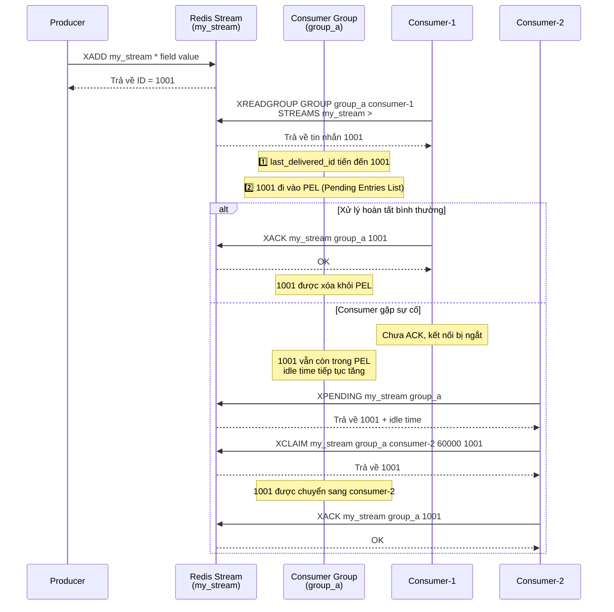

Nói kết luận trước: **Có thể, nhưng phải xem kịch bản cụ thể. So với các Message Queue chuyên nghiệp (như Kafka, RabbitMQ) thì vẫn còn một số điểm chưa đạt.**

Trước khi chính thức giới thiệu, chúng ta cùng xem: **Một MQ cấp production cần có những năng lực cốt lõi nào?**

| Chiều năng lực | Định nghĩa | Chỉ số/đặc trưng chính |
| :--- | :--- | :--- |
| **Persistence** | Tin nhắn sau khi ghi không bị mất do sự cố tiến trình/node | Ghi đĩa đồng bộ/xác nhận đa bản sao, RPO ≈ 0 |
| **At-least-once delivery** | Tin nhắn cuối cùng được tiêu thụ, cho phép trùng lặp | Cần kết hợp với tính idempotent của consumer |
| **Xác nhận tiêu thụ** | Consumer thông báo rõ ràng đã xử lý thành công | Cơ chế ACK, retry khi timeout, Dead Letter Queue |
| **Retry tin nhắn** | Tiêu thụ thất bại có thể tự động gửi lại | Chiến lược backoff, số lần retry tối đa, chuyển vào dead letter |
| **Consumer Group** | Nhiều consumer hợp tác tiêu thụ, tự động chuyển đổi khi gặp sự cố | Cân bằng tải trong nhóm, phân chia partition, Rebalance |
| **Khả năng tích lũy tin nhắn** | Năng lực đệm khi tốc độ sản xuất > tốc độ tiêu thụ | Lưu trữ đĩa, TTL, cảnh báo tích lũy |
| **Đảm bảo thứ tự** | Tin nhắn được tiêu thụ theo thứ tự gửi | Có thứ tự theo partition/có thứ tự toàn cục, phạt khi sai thứ tự |
| **Khả năng mở rộng** | Mở rộng theo chiều ngang để tăng thông lượng hoặc phòng chống thảm họa | Cơ chế sharding, Broker stateless, mở rộng/thu hẹp động |

Redis cung cấp nhiều cách triển khai MQ, từ `List` thời kỳ đầu đến `Pub/Sub`, rồi đến cấu trúc dữ liệu `Stream` được thêm vào từ Redis 5.0 (triển khai dựa trên danh sách liên kết có thứ tự, hỗ trợ Consumer Group và cơ chế ACK, có thể dùng để xây dựng Message Queue hạng nhẹ).

### Giai đoạn 1: Thời kỳ đầu dùng cấu trúc dữ liệu List

**Trước Redis 2.0, nếu muốn dùng Redis để làm Message Queue thì chỉ có thể triển khai thông qua List.**

Thông qua `RPUSH/LPOP` hoặc `LPUSH/RPOP` là có thể triển khai phiên bản Message Queue đơn giản:

```bash
# Producer sản xuất tin nhắn
> RPUSH myList msg1 msg2
(integer) 2
> RPUSH myList msg3
(integer) 3
# Consumer tiêu thụ tin nhắn
> LPOP myList
"msg1"
```

Tuy nhiên, cách dùng `RPUSH/LPOP` hoặc `LPUSH/RPOP` như vậy tồn tại vấn đề hiệu năng, chúng ta cần liên tục polling gọi `RPOP` hoặc `LPOP` để tiêu thụ tin nhắn. Khi List trống, phần lớn các request polling đều là request vô ích, cách này lãng phí rất nhiều tài nguyên hệ thống.

Vì vậy, Redis còn cung cấp các lệnh đọc kiểu Blocking như `BLPOP`, `BRPOP` (lệnh có chữ B-Blocking đều là kiểu Blocking), và còn hỗ trợ một tham số timeout. Nếu List trống, phía server Redis sẽ không trả về kết quả ngay, nó sẽ chờ cho đến khi có dữ liệu mới trong List rồi trả về, hoặc chờ tối đa một khoảng thời gian timeout rồi trả về null. Nếu đặt timeout là 0 thì có thể chờ vô hạn cho đến khi lấy được tin nhắn.

```bash
# Thời gian timeout là 10s
# Nếu có dữ liệu thì trả về ngay, nếu không thì chờ tối đa 10 giây
> BRPOP myList 10
null
```

List triển khai chức năng Message Queue quá đơn giản, các chức năng như cơ chế xác nhận tin nhắn vẫn cần chúng ta tự triển khai. **Chí mạng nhất là nó không hỗ trợ một tin nhắn được nhiều consumer tiêu thụ (broadcast), hơn nữa tin nhắn một khi đã được lấy ra là mất, nếu consumer xử lý thất bại thì tin nhắn mất vĩnh viễn.**

### Giai đoạn 2: Đưa vào mô hình Pub/Sub (Publish/Subscribe)

**Redis 2.0 đưa vào chức năng Publish/Subscribe (Pub/Sub), giải quyết vấn đề List triển khai Message Queue không có cơ chế broadcast.**


Trong Pub/Sub đưa vào một khái niệm gọi là **Channel (kênh)**, việc triển khai cơ chế Publish/Subscribe chính là dựa trên Channel này.

Pub/Sub liên quan đến hai vai trò: Publisher (bên phát hành) và Subscriber (bên đăng ký, cũng gọi là consumer):

- Publisher thông qua `PUBLISH` để gửi tin nhắn đến Channel chỉ định.
- Subscriber thông qua `SUBSCRIBE` để đăng ký Channel mà nó quan tâm. Hơn nữa, Subscriber có thể đăng ký một hoặc nhiều Channel.

Nói cách khác, nhiều consumer có thể đăng ký cùng một Channel, producer gửi tin nhắn đến Channel này thì tất cả Subscriber đều nhận được.

Ở đây chúng ta khởi động 3 Redis client để demo đơn giản:


Pub/Sub vừa hỗ trợ unicast vừa hỗ trợ broadcast, còn hỗ trợ khớp regex đơn giản cho Channel.

Pub/Sub có một khiếm khuyết chí mạng: **nó fire-and-forget (gửi xong là bỏ), hoàn toàn không có Persistence và đảm bảo độ tin cậy**. Nếu khi tin nhắn được phát hành mà một consumer nào đó không online, hoặc mạng bị chập chờn một chút, thì tin nhắn đó đối với nó sẽ mất vĩnh viễn. Ngoài ra, nó cũng **không có cơ chế ACK**, không thể biết consumer đã xử lý thành công hay chưa, càng không cần nói đến vấn đề **tích lũy tin nhắn**. Vì vậy, Pub/Sub chỉ phù hợp làm thông báo thời gian thực có yêu cầu độ tin cậy cực thấp, tuyệt đối không được dùng cho bất kỳ Message Queue nghiệp vụ nghiêm túc nào.

### Giai đoạn 3: Redis 5.0 thêm Stream

Redis 5.0 thêm cấu trúc dữ liệu `Stream`. Đây là một log tin nhắn có thứ tự được triển khai dựa trên Radix Tree (cây cơ số), hỗ trợ sẵn Consumer Group và cơ chế ACK, có thể dùng để xây dựng Message Queue hạng nhẹ.

**Tại sao phải dùng Radix Tree?** Rất nhiều người tò mò, tại sao không tiếp tục dùng `List/LinkedList`?

1. **Bộ nhớ được nén cực tốt**: ID tin nhắn của `Stream` (như `1625000000000-0`) có thứ tự cao và phần tiền tố trùng nhau nhiều. Radix Tree là một cây tiền tố nén (compressed prefix tree), nó sẽ gộp các node có cùng tiền tố. Còn List/LinkedList
   mỗi phần tử đều cần chi phí đầy đủ của một node danh sách liên kết, và không thể lợi dụng đặc tính tiền tố trùng nhau của ID để tiết kiệm không gian.
2. **Truy vấn hiệu quả**: Khi xử lý tích lũy tin nhắn ở mức hàng triệu, Radix Tree vẫn giữ được hiệu quả truy vấn cực cao, đây cũng là nền tảng để `Stream` hỗ trợ truy vấn phạm vi dữ liệu lớn (`XRANGE`). Ngược lại, `List/LinkedList` chỉ có thể thao tác ở đầu/cuối, không thể truy vấn hiệu quả theo phạm vi ID, thực thi `XRANGE` cần duyệt toàn bộ danh sách.

Nó tham khảo các khái niệm cốt lõi của các MQ chuyên nghiệp như Kafka:

1. **Consumer Group**: Triển khai cân bằng tải tin nhắn giữa nhiều consumer, hỗ trợ tự động chuyển đổi khi gặp sự cố.
2. **Persistence**: Có thể thông qua RDB và AOF để đảm bảo tin nhắn không bị mất sau khi Redis khởi động lại (tùy thuộc vào cấu hình `appendfsync`, ở chế độ `everysec` thường mất tối đa 1 giây dữ liệu).
3. **Cơ chế ACK**: Sau khi consumer xử lý xong tin nhắn, cần `XACK` xác nhận thủ công, nếu không tin nhắn sẽ được giữ lại trong `Pending List`. Điều này đảm bảo tin nhắn được tiêu thụ thành công ít nhất một lần.
4. **Truy lại và chuyển tin nhắn**: Hỗ trợ `XRANGE` để truy lại tin nhắn theo phạm vi thời gian, và `XCLAIM` để chuyển tin nhắn đang pending sang consumer khác xử lý.

> 🌈 Tiến hóa phiên bản:
>
> - Redis 8.2: Các lệnh `XACKDEL`, `XDELEX`, `XADD` và `XTRIM cung cấp khả năng kiểm soát chi tiết cách các thao tác trên Stream tương tác với nhiều Consumer Group, đơn giản hóa việc điều phối xử lý tin nhắn giữa các ứng dụng khác nhau.
> - Redis 8.6: Hỗ trợ xử lý tin nhắn idempotent (sản xuất tối đa một lần), ngăn chặn các bản ghi trùng lặp khi sử dụng chế độ phân phối at-least-once. Chức năng này cho phép commit tin nhắn đáng tin cậy và tự động loại bỏ trùng lặp.

Cấu trúc của `Stream` như sau:


Đây là một danh sách tin nhắn có thứ tự, mỗi tin nhắn đều có một ID duy nhất và nội dung tương ứng. ID là sự kết hợp của timestamp và số thứ tự (sequence number), dùng để đảm bảo tính duy nhất và tính tăng dần của tin nhắn. Nội dung là một hoặc nhiều cặp key-value (tương tự kiểu dữ liệu cơ bản Hash), dùng để lưu dữ liệu của tin nhắn.

Ở đây giải thích đơn giản thêm về một số khái niệm liên quan trong hình:

- `Consumer Group`: Consumer Group dùng để tổ chức và quản lý nhiều consumer. Bản thân Consumer Group không xử lý tin nhắn, mà phân phối tin nhắn cho các consumer, do consumer thực hiện tiêu thụ thật sự.
- `last_delivered_id`: Con trỏ (cursor) đánh dấu vị trí tiêu thụ hiện tại của Consumer Group, bất kỳ consumer nào trong Consumer Group đọc tin nhắn đều sẽ làm last_delivered_id tiến lên.
- `pending_ids`: Ghi lại ID của các tin nhắn đã được client tiêu thụ nhưng chưa ack.

Dưới đây là các lệnh thường dùng khi sử dụng `Stream` làm Message Queue:

- `XADD`: Thêm tin nhắn mới vào Stream.
- `XREAD`: Đọc tin nhắn từ Stream.
- `XREADGROUP`: Đọc tin nhắn từ Consumer Group.
- `XRANGE`: Đọc tin nhắn trong Stream theo phạm vi ID tin nhắn.
- `XREVRANGE`: Tương tự `XRANGE`, nhưng trả về kết quả theo thứ tự ngược lại.
- `XDEL`: Xóa tin nhắn khỏi Stream.
- `XTRIM`: Cắt tỉa độ dài của Stream, có thể chỉ định chiến lược cắt tỉa (`MAXLEN`/`MINID`).
- `XLEN`: Lấy độ dài của Stream.
- `XGROUP CREATE`: Tạo Consumer Group.
- `XGROUP DESTROY`: Xóa Consumer Group.
- `XGROUP DELCONSUMER`: Xóa một consumer khỏi Consumer Group.
- `XGROUP SETID`: Thiết lập ID tin nhắn được phân phối cuối cùng mới cho Consumer Group.
- `XACK`: Xác nhận tin nhắn trong Consumer Group đã được xử lý.
- `XPENDING`: Truy vấn tin nhắn đang pending (chưa xác nhận) trong Consumer Group.
- `XCLAIM`: Chuyển tin nhắn đang pending từ consumer này sang consumer khác.
- `XINFO`: Lấy thông tin chi tiết của Stream (`XINFO STREAM`), Consumer Group (`XINFO GROUPS`) hoặc consumer (`XINFO CONSUMERS`).

Sơ đồ trình tự dưới đây thể hiện luồng tin nhắn của Consumer Group trong Stream và cơ chế ACK:



Nhìn chung, `Stream` đã có thể đáp ứng các yêu cầu cơ bản của một Message Queue. Tuy nhiên, khi sử dụng `Stream` trong thực tế cần chú ý mấy điểm sau:

1. **Giới hạn Persistence**: Stream của Redis 5.0 phụ thuộc vào Persistence bất đồng bộ RDB/AOF, khi khôi phục sự cố có thể mất các tin nhắn gần nhất chưa được Persistence (tùy thuộc vào cấu hình `appendfsync`). Ở chế độ `everysec` của AOF thường mất tối đa 1 giây dữ liệu.
2. **Tích lũy tin nhắn bị giới hạn**: Dữ liệu của Redis Stream lưu trong bộ nhớ, bị giới hạn bởi dung lượng bộ nhớ của máy chủ. So với lưu trữ dựa trên đĩa của Kafka, Redis Stream không phù hợp với kịch bản tích lũy khối lượng lớn.
3. **Quản lý Consumer Group**: Thông tin trạng thái của Consumer Group (như `last_delivered_id`) cần được bảo trì định kỳ, tin nhắn Pending lâu ngày chưa xử lý sẽ chiếm dụng bộ nhớ.

Bảng dưới đây là so sánh giữa Redis Stream và các MQ phổ biến:

| Chiều | Redis Stream | RabbitMQ | Kafka | Hàng đợi trong bộ nhớ |
| :--- | :--- | :--- | :--- | :--- |
| **Thông lượng** | Cao (QPS cấp trăm nghìn) | Trung bình (QPS cấp vạn) | **Cực cao (cấp triệu, mở rộng ngang bằng partition)** | Cực cao (giới hạn bởi CPU/bộ nhớ) |
| **Độ trễ** | **Cực thấp (cấp dưới mili giây)** | **Thấp (cấp micro/mili giây, thời gian thực mạnh)** | Trung bình (cấp mili giây, chịu ảnh hưởng của batch processing) | Cực thấp (cấp nano/micro giây) |
| **Persistence** | Hỗ trợ (RDB/AOF bất đồng bộ) | Hỗ trợ (đĩa) | **Hỗ trợ mạnh (ghi đĩa tuần tự native)** | Không |
| **Tích lũy tin nhắn** | Bình thường (giới hạn bởi bộ nhớ) | Trung bình (tích lũy nhiều thì hiệu năng giảm rõ rệt) | **Cực mạnh (lưu trữ đĩa cấp TB, hiệu năng ổn định)** | Kém (dễ OOM) |
| **Truy lại tin nhắn** | Hỗ trợ (theo ID/thời gian) | **Không hỗ trợ (ở chế độ queue truyền thống)** | **Hỗ trợ mạnh (theo Offset/thời gian)** | Không hỗ trợ |
| **Độ tin cậy** | Trung bình (rủi ro mất dữ liệu AOF) | **Cao (cơ chế Confirm/xác nhận đã trưởng thành)** | **Cực cao (đa bản sao + cấu hình nhất quán mạnh)** | Thấp |
| **Độ phức tạp vận hành** | Thấp (vận hành Redis là đủ) | Trung bình (môi trường Erlang, quản lý Cluster) | Cao (phụ thuộc ZK hoặc KRaft) | Cực thấp |
| **Kịch bản phù hợp** | Hạng nhẹ, độ trễ thấp, đã có sẵn Redis | **Định tuyến phức tạp, độ tin cậy cao, nghiệp vụ tài chính** | **Big Data, tổng hợp log, xử lý luồng thông lượng cao** | Tách ghép trong tiến trình, yêu cầu hiệu năng cực hạn |

### Tổng kết

**Quay lại câu hỏi ban đầu: Redis rốt cuộc có thể làm MQ không?**

- **Nếu nghiệp vụ đơn giản, lượng nhỏ, theo đuổi hiệu năng cực hạn**, và chấp nhận được xác suất mất dữ liệu cực nhỏ, thì dùng **Redis Stream** là giải pháp tối ưu, vì nó tiết kiệm chi phí triển khai và bảo trì MQ, có thể tái sử dụng thành phần Redis hiện có (phần lớn các dự án cần dùng đến MQ thường cũng cần Redis).
- **Nếu là nghiệp vụ cấp tài chính, dữ liệu khối lượng lớn, cần đảm bảo nghiêm ngặt không mất tin nhắn**, bắt buộc phải chọn các MQ trưởng thành hơn như **Kafka, RabbitMQ**.

Để biết thêm tổng hợp các kiến thức Redis tần suất cao và câu hỏi phỏng vấn, có thể đọc mấy bài viết này của tác giả:

- [Tổng hợp câu hỏi phỏng vấn Redis thường gặp (Phần 1)](https://javaguide.cn/database/redis/redis-questions-01.html "Tổng hợp câu hỏi phỏng vấn Redis thường gặp (Phần 1)") (Redis cơ bản, ứng dụng, kiểu dữ liệu, cơ chế Persistence, thread model, v.v.)
- [Tổng hợp câu hỏi phỏng vấn Redis thường gặp (Phần 2)](https://javaguide.cn/database/redis/redis-questions-02.html "Tổng hợp câu hỏi phỏng vấn Redis thường gặp (Phần 2)") (Redis Transaction, tối ưu hiệu năng, vấn đề production, Cluster, quy tắc sử dụng, v.v.)
- [Làm thế nào để triển khai Delayed Task dựa trên Redis](https://javaguide.cn/database/redis/redis-delayed-task.html "Làm thế nào để triển khai Delayed Task dựa trên Redis")
- [Giải thích chi tiết 5 kiểu dữ liệu cơ bản của Redis](https://javaguide.cn/database/redis/redis-data-structures-01.html "Giải thích chi tiết 5 kiểu dữ liệu cơ bản của Redis")
- [Giải thích chi tiết 3 kiểu dữ liệu đặc biệt của Redis](https://javaguide.cn/database/redis/redis-data-structures-02.html "Giải thích chi tiết 3 kiểu dữ liệu đặc biệt của Redis")
- [Tại sao Redis dùng Skip List để triển khai Sorted Set](https://javaguide.cn/database/redis/redis-skiplist.html "Tại sao Redis dùng Skip List để triển khai Sorted Set")
- [Giải thích chi tiết cơ chế Persistence của Redis](https://javaguide.cn/database/redis/redis-persistence.html "Giải thích chi tiết cơ chế Persistence của Redis")
- [Giải thích chi tiết Memory Fragmentation của Redis](https://javaguide.cn/database/redis/redis-memory-fragmentation.html "Giải thích chi tiết Memory Fragmentation của Redis")
- [Tổng hợp các nguyên nhân gây Blocking thường gặp trong Redis](https://javaguide.cn/database/redis/redis-common-blocking-problems-summary.html "Tổng hợp các nguyên nhân gây Blocking thường gặp trong Redis")

Dự án [《Nền tảng phỏng vấn thông minh SpringAI + Kho tri thức RAG》](https://javaguide.cn/zhuanlan/interview-guide.html) của tôi chính là dùng Redis Stream làm Message Queue. Trong kịch bản dự án của tôi, nó gần như là lựa chọn phù hợp nhất, hoàn toàn đủ dùng.


