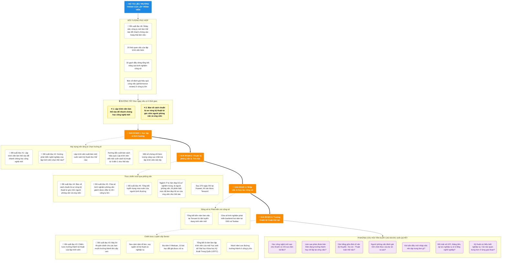

<!-- @include: @small-advertisement.snippet.md -->

Bộ **tuyển chọn bài viết kỹ thuật chất lượng cao** này tổng hợp các nội dung liên quan đến sự trưởng thành của lập trình viên, kinh nghiệm làm việc, tổng kết phỏng vấn, lựa chọn nghề nghiệp và phương pháp học tập kỹ thuật. Đây không phải danh sách các điểm kỹ thuật cụ thể, mà phù hợp để đọc đi đọc lại trong các giai đoạn như học tập, tìm việc, nhập việc, chuyển vị trí, thăng tiến.

Nếu bạn có ít thời gian, nên đọc trước [Lập trình viên làm thế nào để nhanh chóng học công nghệ mới](./advanced-programmer/programmer-quickly-learn-new-technology.md) và [Bàn về cách chuẩn bị sơ vòng kỹ thuật từ góc nhìn người phỏng vấn và ứng viên](./interview/technical-preliminary-preparation.md), một bài giải quyết phương pháp học tập, một bài giải quyết chuẩn bị phỏng vấn.

## Phù hợp với ai

- Các bạn đang chuyển từ sinh viên sang kỹ sư, cần xây dựng nhận thức nghề nghiệp.
- Độc giả chuẩn bị phỏng vấn, muốn hiểu góc nhìn của người phỏng vấn và kinh nghiệm thực tế của ứng viên.
- Lập trình viên làm việc từ 1 đến 5 năm, muốn nâng cao hiệu quả học tập, hiểu biết nghiệp vụ và tốc độ trưởng thành kỹ thuật.
- Kỹ sư đang đối mặt với thích nghi khi nhập việc, đánh giá hiệu quả công việc (KPI), lựa chọn nghề nghiệp, nút thắt trưởng thành.

## Trọng tâm học tập

- Trưởng thành kỹ thuật không chỉ là học thêm nhiều framework, mà còn bao gồm phương pháp học tập, hiểu biết nghiệp vụ, khả năng diễn đạt và khả năng phán đoán kỹ thuật.
- Chuẩn bị phỏng vấn phải đồng thời đứng trên góc nhìn ứng viên và người phỏng vấn, vừa phải trả lời được câu hỏi, vừa phải trình bày được năng lực dự án thực tế.
- Các bài viết về kinh nghiệm cá nhân phù hợp để hiểu cách lựa chọn, thử sai và tổng kết ở các giai đoạn khác nhau.
- Các bài viết về kinh nghiệm làm việc tập trung vào "làm thế nào nhanh chóng vào trạng thái, làm thế nào hợp tác với đội nhóm, làm thế nào đối mặt với hiệu quả công việc và phản hồi".
- Phát triển nghề nghiệp cần tổng kết dài hạn, đừng coi offer ngắn hạn, cấp bậc hay hiệu quả công việc là mục tiêu duy nhất.

## Thứ tự đọc đề xuất

1. [Lập trình viên làm thế nào để nhanh chóng học công nghệ mới](./advanced-programmer/VN/programmer-quickly-learn-new-technology_VN.md): Trước tiên xây dựng phương pháp học công nghệ mới.
2. [Hướng phát triển nghề nghiệp của lập trình viên chọn thế nào?](./programmer/VN/programmer-career-directions_VN.md): Trước khi vào nghề, chuyển vị trí hay đổi hướng, trước tiên hiểu nội dung công việc và rào cản của một số hướng phổ biến.
3. [Chiến lược trưởng thành kỹ thuật của lập trình viên](./advanced-programmer/VN/the-growth-strategy-of-the-technological-giant_VN.md) và [Bảy lời khuyên dành cho các bạn muốn trưởng thành lên cấp cao](./advanced-programmer/VN/seven-tips-for-becoming-an-advanced-programmer_VN.md): Hiểu lộ trình dài hạn của sự trưởng thành kỹ thuật.
4. [Bàn về cách chuẩn bị sơ vòng kỹ thuật từ góc nhìn người phỏng vấn và ứng viên](./interview/VN/technical-preliminary-preparation_VN.md): Dùng góc nhìn người phỏng vấn để hiệu chỉnh hướng chuẩn bị.
5. [Chia sẻ kinh nghiệm phỏng vấn giành được offer từ 20+ công ty lớn](./interview/the-experience-of-get-offer-from-over-20-big-companies.md) và [Tổng kết tuyển dụng mùa xuân của người bình thường](./interview/summary-of-spring-recruitment.md): Tham khảo quá trình tìm việc và tổng kết thực tế.
6. [Nhập việc công ty mới làm thế nào để nhanh chóng vào trạng thái làm việc](./work/get-into-work-mode-quickly-when-you-join-a-company.md): Sau khi nắm được cơ hội, tiếp tục quan tâm đến nhập việc, hợp tác và trưởng thành dài hạn.

## Bài viết cốt lõi

### Lộ trình luyện cấp

- [Lập trình viên làm thế nào để nhanh chóng học công nghệ mới](./advanced-programmer/programmer-quickly-learn-new-technology.md): Nói về lộ trình học tập, lựa chọn tài liệu, kiểm chứng thực hành và tránh học tập kém hiệu quả.
- [Chiến lược trưởng thành kỹ thuật của lập trình viên](./advanced-programmer/the-growth-strategy-of-the-technological-giant.md): Hiểu sự trưởng thành kỹ thuật và tích lũy năng lực từ góc nhìn dài hạn.
- [Mười năm con đường trưởng thành ở công ty lớn](./advanced-programmer/ten-years-of-dachang-growth-road.md): Tổng kết các lựa chọn và tích lũy trong phát triển nghề nghiệp dài hạn.
- [Ba năm ở Meituan, 10 bài học đắt giá được rút ra](./advanced-programmer/meituan-three-year-summary-lesson-10.md): Nhìn từ kinh nghiệm thực tế các cái bẫy thường gặp trong trưởng thành của kỹ sư.
- [Bảy lời khuyên dành cho các bạn muốn trưởng thành lên cấp cao](./advanced-programmer/seven-tips-for-becoming-an-advanced-programmer.md): Tập trung vào các năng lực mà kỹ sư cấp cao cần có.
- [20 thói quen xấu của lập trình viên kém](./advanced-programmer/20-bad-habits-of-bad-programmers.md): Giúp nhận diện các thói quen xấu ảnh hưởng đến trưởng thành và hợp tác.
- [Sau năm năm đi làm, suy ngẫm về kỹ thuật và nghiệp vụ](./advanced-programmer/thinking-about-technology-and-business-after-five-years-of-work.md): Hiểu mối quan hệ giữa kỹ thuật, nghiệp vụ và phát triển cá nhân.

### Kinh nghiệm cá nhân

- [Tổng kết bốn năm làm việc tại Tencent từ đợt tuyển dụng sinh viên mới](./personal-experience/four-year-work-in-tencent-summary.md): Tổng kết công việc, trưởng thành và lựa chọn ở công ty lớn.
- [Chia sẻ kinh nghiệm phát triển backend hai năm tại DiDi và Toutiao](./personal-experience/two-years-of-back-end-develop--experience-in-didi-and-toutiao.md): Hiểu kinh nghiệm phát triển backend trong các đội nhóm và môi trường nghiệp vụ khác nhau.
- [Tổng kết 8 năm làm lập trình viên của một "học sinh dở" Đại học Khoa học Kỹ thuật Trung Quốc (USTC)](./personal-experience/8-years-programmer-work-summary.md): Nhìn lộ trình trưởng thành của lập trình viên từ chu kỳ dài hơn.
- [Sau 275 ngày OD tại Huawei, tôi vào được Tencent!](./personal-experience/huawei-od-275-days.md): Tham khảo kinh nghiệm tìm việc và chuyển đổi nghề nghiệp thực tế.

### Lập trình viên

- [Hướng phát triển nghề nghiệp của lập trình viên chọn thế nào?](./programmer/programmer-career-directions.md): So sánh các hướng như backend, frontend, full-stack, phát triển ứng dụng AI, nhân cơ sở dữ liệu (database kernel), thuật toán, middleware, kiểm thử phát triển (test development), kỹ thuật nền tảng (platform engineering) và kiến trúc sư.
- [Một số chứng chỉ hàm lượng vàng cao nhất mà lập trình viên nên lấy](./programmer/high-value-certifications-for-programmers.md): Hiểu bối cảnh phù hợp của các chứng chỉ như kỳ thi kỹ sư mềm (软考), PMP, chứng chỉ cloud.
- [Lập trình viên xuất bản một cuốn sách kỹ thuật như thế nào](./programmer/how-do-programmers-publish-a-technical-book.md): Hiểu quy trình xuất bản sách kỹ thuật và những lưu ý.
- [Hướng dẫn xuất bản sách hiệu quả: Lập trình viên viết một cuốn sách kỹ thuật từ 0 đến 1 như thế nào](./programmer/efficient-book-publishing-and-practice-guide.md): Bổ sung thực hành về viết lách và xuất bản kỹ thuật.

### Phỏng vấn và công việc

- [Bàn về cách chuẩn bị sơ vòng kỹ thuật từ góc nhìn người phỏng vấn và ứng viên](./interview/technical-preliminary-preparation.md): Hiểu sơ vòng kỹ thuật thực sự kiểm tra điều gì.
- [Chia sẻ kinh nghiệm phỏng vấn giành được offer từ 20+ công ty lớn](./interview/the-experience-of-get-offer-from-over-20-big-companies.md): Tham khảo quy trình chuẩn bị và cách tổng kết hoàn chỉnh khi tìm việc.
- [Ngành IT bị "làm đẹp hồ sơ" nghiêm trọng, là người phỏng vấn, tôi phân biệt mức độ làm đẹp hồ sơ của ứng viên như thế nào](./interview/screen-candidates-for-packaging.md): Hiểu người phỏng vấn nhận diện tính xác thực của dự án như thế nào.
- [Nhập việc công ty mới làm thế nào để nhanh chóng vào trạng thái làm việc](./work/get-into-work-mode-quickly-when-you-join-a-company.md): Giúp nhanh chóng quen thuộc nghiệp vụ, code và nhịp độ đội nhóm sau khi nhập việc.
- [32 gạch đầu dòng tổng kết nâng cao kinh nghiệm công sở](./work/32-tips-improving-career.md): Bổ sung các chi tiết về giao tiếp, hợp tác, báo cáo và trưởng thành.
- [Bàn về đánh giá hiệu quả công việc (performance review) ở công ty lớn](./work/employee-performance.md): Hiểu cơ chế đánh giá hiệu quả công việc và phản hồi công việc.

## Câu hỏi tần suất cao

- Lập trình viên làm thế nào để nhanh chóng học một công nghệ mới, thay vì chỉ sưu tầm tài liệu?
- Sau khi làm việc vài năm, làm thế nào để phán đoán mình đang trưởng thành hay đang lặp lại công việc?
- Khi chuẩn bị phỏng vấn kỹ thuật, nên cân bằng "bát cổ văn" (kiến thức lý thuyết), dự án và thuật toán như thế nào?
- Người phỏng vấn đánh giá dự án có phải ứng viên thực sự làm qua không?
- Khi mới nhập việc một công ty, vài tuần đầu nên tập trung làm gì?
- Làm thế nào đối mặt với hiệu quả công việc, thăng tiến, áp lực nghiệp vụ và lo lắng nghề nghiệp?
- Năng lực kỹ thuật và hiểu biết nghiệp vụ cái nào quan trọng hơn? Ở các giai đoạn khác nhau nên ưu tiên như thế nào?

## Chuyên đề liên quan

- [Chuẩn bị phỏng vấn](../interview-preparation/)
- [Hệ thống kiến thức Java](../java/)
- [Hệ thống kiến thức nền tảng máy tính](../cs-basics/)
- [Tuyển chọn sách kỹ thuật](../books/)
- [Tuyển chọn dự án mã nguồn mở Java](../open-source-project/)
- [Chuyên mục chất lượng đặc quyền của hành tinh](../zhuanlan/)

<!-- @include: @article-footer.snippet.md -->

