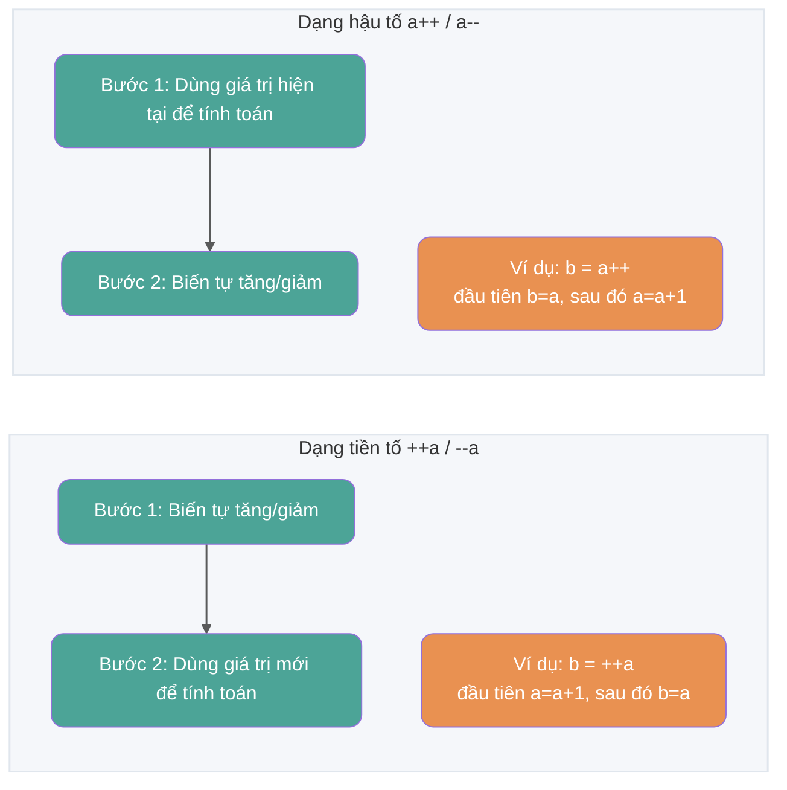
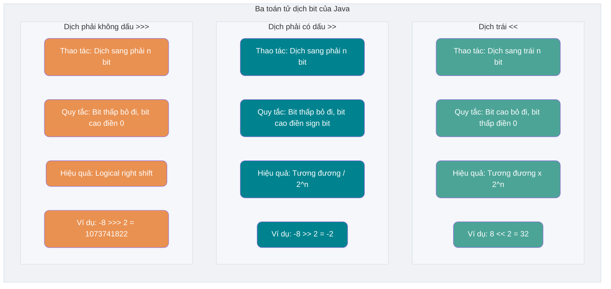
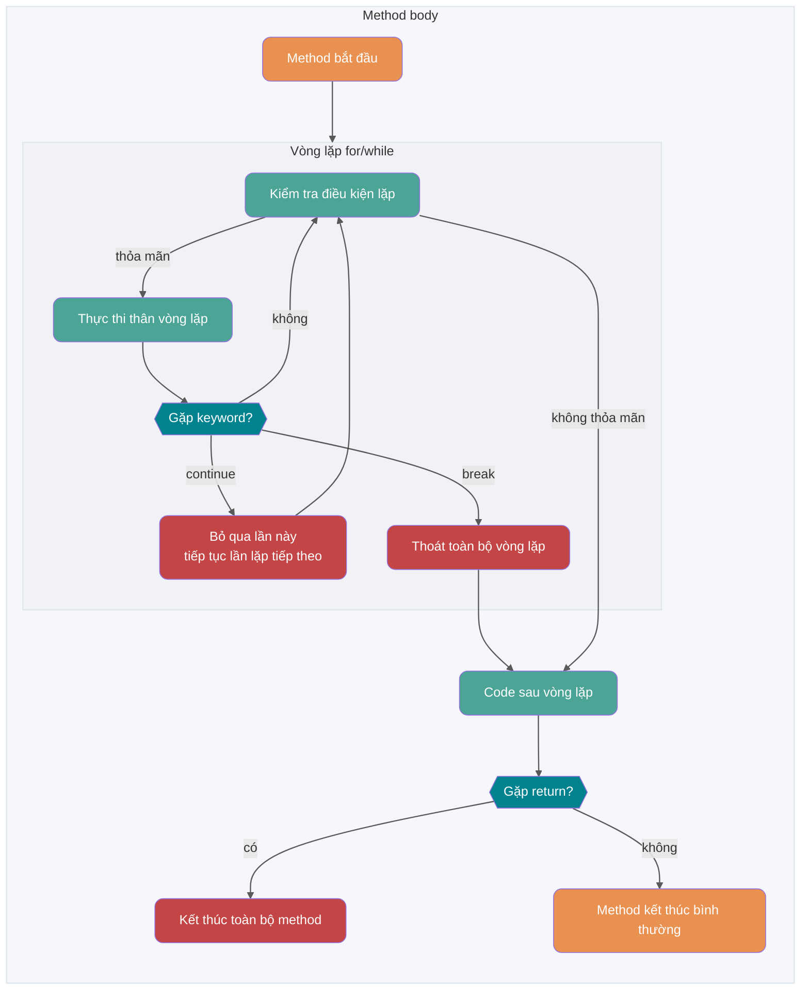
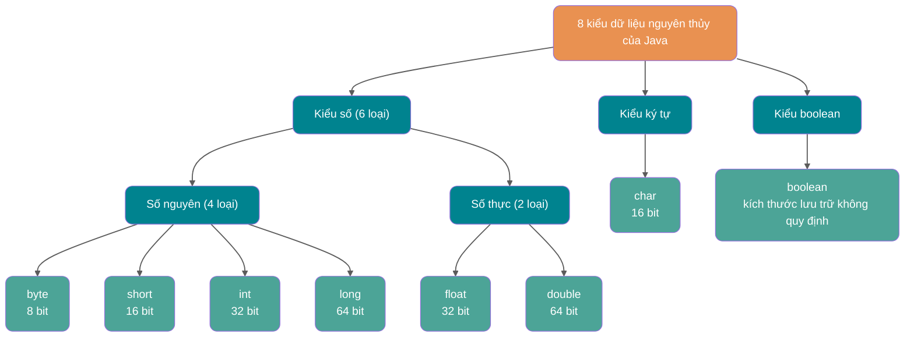
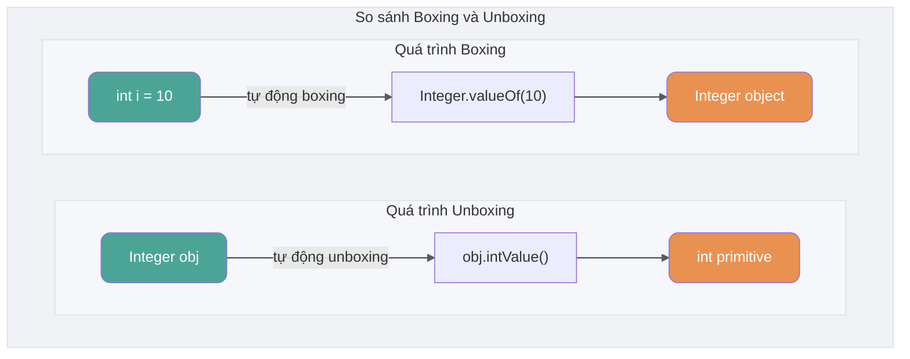

## Khái niệm cơ bản và kiến thức chung

### Ngôn ngữ Java có những đặc điểm gì?

1. Đơn giản, dễ học (cú pháp đơn giản, dễ tiếp cận);
2. Hướng đối tượng (đóng gói, kế thừa, đa hình);
3. Độc lập nền tảng (JVM giúp Java đạt được tính độc lập nền tảng);
4. Hỗ trợ đa luồng (C++ không có cơ chế đa luồng tích hợp sẵn, phải gọi chức năng đa luồng của hệ điều hành, trong khi Java cung cấp hỗ trợ đa luồng trực tiếp);
5. Đáng tin cậy (có cơ chế xử lý ngoại lệ và quản lý bộ nhớ tự động);
6. Bảo mật (bản thân thiết kế của Java đã cung cấp nhiều lớp bảo vệ như access modifier, hạn chế chương trình truy cập trực tiếp tài nguyên hệ điều hành);
7. Hiệu quả cao (nhờ tối ưu từ Just In Time compiler và các công nghệ khác, hiệu suất chạy của Java vẫn rất tốt);
8. Hỗ trợ lập trình mạng rất tiện lợi;
9. Biên dịch và thông dịch song song;
10. ……

> **🐛 Chỉnh sửa (xem: [issue#544](https://github.com/Snailclimb/JavaGuide/issues/544))**: Từ C++11 (năm 2011), C++ đã giới thiệu thư viện đa luồng, có thể sử dụng `std::thread` và `std::async` trên Windows, Linux, macOS để tạo thread. Tham khảo: <http://www.cplusplus.com/reference/thread/thread/?kw=thread>

🌈 Mở rộng:

"Write Once, Run Anywhere" là một khẩu hiệu thực sự kinh điển, đã được lưu truyền suốt nhiều năm! Đến mức ngày nay vẫn còn rất nhiều người cho rằng đa nền tảng là ưu thế lớn nhất của Java. Trên thực tế, đa nền tảng không còn là điểm bán hàng lớn nhất của Java nữa, các tính năng mới của JDK cũng vậy. Hiện nay công nghệ ảo hóa trên thị trường đã rất trưởng thành, ví dụ bạn có thể dễ dàng đạt được đa nền tảng thông qua Docker. Theo tôi, hệ sinh thái mạnh mẽ mới chính là thế mạnh của Java!

### Java SE vs Java EE

- Java SE (Java Platform, Standard Edition): Phiên bản chuẩn của Java Platform, là nền tảng của ngôn ngữ lập trình Java, bao gồm các core class library và các thành phần cốt lõi như JVM cần thiết cho việc phát triển và chạy ứng dụng Java. Java SE có thể được dùng để xây dựng desktop application hoặc server application đơn giản.
- Java EE (Java Platform, Enterprise Edition): Phiên bản doanh nghiệp của Java Platform, được xây dựng trên nền tảng Java SE, bao gồm các tiêu chuẩn và đặc tả hỗ trợ phát triển và triển khai ứng dụng cấp doanh nghiệp (như Servlet, JSP, EJB, JDBC, JPA, JTA, JavaMail, JMS). Java EE có thể được dùng để xây dựng các server-side Java application phân tán, portable, mạnh mẽ, có khả năng mở rộng và bảo mật, ví dụ như Web application.

Nói đơn giản, Java SE là phiên bản cơ bản của Java, Java EE là phiên bản nâng cao. Java SE phù hợp hơn để phát triển desktop application hoặc server application đơn giản, Java EE phù hợp hơn để phát triển enterprise application phức tạp hoặc Web application.

Ngoài Java SE và Java EE, còn có Java ME (Java Platform, Micro Edition). Java ME là phiên bản vi mô của Java, chủ yếu dùng để phát triển ứng dụng cho thiết bị điện tử tiêu dùng nhúng, như điện thoại di động, PDA, set-top box, tủ lạnh, điều hòa, v.v. Java ME không cần quá chú trọng, biết là có thứ đó là được, hiện nay không còn dùng nữa.

### ⭐️ JVM vs JDK vs JRE

#### JVM

Java Virtual Machine (JVM) là một máy ảo dùng để chạy Java bytecode. JVM có các triển khai cụ thể cho từng hệ thống khác nhau (Windows, Linux, macOS), mục tiêu là với cùng một bytecode, chúng đều cho ra kết quả giống nhau. Bytecode và các triển khai JVM cho các hệ thống khác nhau chính là chìa khóa cho triết lý "biên dịch một lần, chạy ở mọi nơi" của Java.

Như hình dưới đây, các ngôn ngữ lập trình khác nhau (Java, Groovy, Kotlin, JRuby, Clojure ...) được biên dịch bởi compiler của riêng chúng thành file `.class`, và cuối cùng chạy trên JVM ở các nền tảng khác nhau (Windows, Mac, Linux).


**JVM không chỉ có một loại! Miễn là đáp ứng JVM specification, mỗi công ty, tổ chức hoặc cá nhân đều có thể phát triển JVM của riêng mình.** Nói cách khác, HotSpot VM mà chúng ta thường tiếp xúc chỉ là một trong những hiện thực của JVM specification.

Ngoài HotSpot VM quen thuộc nhất, còn có J9 VM, Zing VM, JRockit VM và các JVM khác. Wikipedia có bảng so sánh các JVM phổ biến: [Comparison of Java virtual machines](https://en.wikipedia.org/wiki/Comparison_of_Java_virtual_machines), bạn nào quan tâm có thể xem thêm. Ngoài ra, bạn có thể tìm thấy JVM specification tương ứng với từng phiên bản JDK tại [Java SE Specifications](https://docs.oracle.com/javase/specs/index.html).


#### JDK và JRE

JDK (Java Development Kit) là bộ công cụ phát triển Java đầy đủ tính năng, dành cho developer, dùng để tạo và biên dịch chương trình Java. Nó bao gồm JRE (Java Runtime Environment), cùng với compiler `javac` và các công cụ khác như `javadoc` (trình tạo tài liệu), `jdb` (debugger), `jconsole` (công cụ giám sát), `javap` (trình decompile), v.v.

JRE là môi trường cần thiết để chạy chương trình Java đã biên dịch, chủ yếu bao gồm hai phần:

1. **JVM**: Chính là Java Virtual Machine đã đề cập ở trên.
2. **Java Class Library**: Bộ thư viện class tiêu chuẩn, cung cấp các chức năng và API thường dùng (như thao tác I/O, giao tiếp mạng, cấu trúc dữ liệu, v.v.).

Nói đơn giản, JRE chỉ chứa môi trường và class library để chạy chương trình Java, còn JDK không chỉ chứa JRE mà còn bao gồm các công cụ để phát triển và debug chương trình Java.

Nếu cần viết, biên dịch chương trình Java hoặc sử dụng các công cụ phát triển đi kèm JDK, bạn cần cài đặt JDK. Một số ứng dụng biên dịch Java source code trong thời gian chạy (ví dụ JSP chuyển đổi sang Servlet) cũng có thể cần JDK. Java Core Reflection API thuộc về runtime class library, chỉ sử dụng reflection không yêu cầu cài đặt JDK đầy đủ.

Hình dưới đây thể hiện rõ mối quan hệ giữa JDK, JRE và JVM.


Tuy nhiên, từ JDK 9 trở đi, không cần phân biệt mối quan hệ giữa JDK và JRE nữa, thay vào đó là module system (JDK được tổ chức lại thành 94 module) + công cụ [jlink](http://openjdk.java.net/jeps/282) (công cụ dòng lệnh mới ra mắt cùng Java 9, dùng để tạo custom Java runtime image chỉ chứa các module cần thiết cho ứng dụng). Hơn nữa, từ JDK 11, Oracle không còn cung cấp bản tải JRE riêng lẻ.

Trong bài viết [Tổng quan tính năng mới Java 9](https://javaguide.cn/java/new-features/java9.html), khi giới thiệu về module system, tôi đã đề cập:

> Sau khi giới thiệu module system, JDK được tổ chức lại thành 94 module. Ứng dụng Java có thể sử dụng công cụ jlink mới để tạo custom runtime image chỉ chứa các JDK module cần thiết. Điều này có thể giảm đáng kể kích thước của Java runtime environment.

Nói cách khác, có thể dùng jlink để tạo một runtime nhỏ hơn tùy theo nhu cầu, thay vì bất kể ứng dụng nào cũng dùng chung một JRE.

Custom, modular Java runtime image giúp đơn giản hóa việc triển khai ứng dụng Java, tiết kiệm bộ nhớ và tăng cường bảo mật cũng như khả năng bảo trì. Điều này rất quan trọng để đáp ứng nhu cầu của kiến trúc ứng dụng hiện đại như ảo hóa, containerization, microservices và cloud-native development.

### ⭐️ Bytecode là gì? Lợi ích của việc sử dụng bytecode?

Trong Java, code mà JVM có thể hiểu được gọi là bytecode (tức là file có phần mở rộng `.class`), nó không hướng đến bất kỳ bộ xử lý cụ thể nào, mà chỉ hướng đến máy ảo. Java thông qua bytecode đã giải quyết được ở một mức độ nhất định vấn đề hiệu suất thực thi thấp của ngôn ngữ thông dịch truyền thống, đồng thời giữ được đặc tính portable của ngôn ngữ thông dịch. Vì vậy, khi chạy, chương trình Java tương đối hiệu quả (tuy nhiên vẫn có khoảng cách nhất định so với C, C++, Rust, Go). Hơn nữa, vì bytecode không nhắm đến một máy cụ thể, chương trình Java không cần biên dịch lại mà vẫn có thể chạy trên nhiều hệ điều hành khác nhau.

**Quá trình chương trình Java từ source code đến khi chạy như hình dưới đây**:


Chúng ta cần đặc biệt chú ý đến bước `.class->mã máy`. Lấy HotSpot làm ví dụ, sau khi JVM tải bytecode, nó có thể thực thi bằng interpreter trước, đồng thời nhận diện các method và code block được gọi thường xuyên (tức hotspot code), sau đó **JIT (Just in Time Compilation)** compiler sẽ biên dịch hotspot bytecode thành machine code. Khi JVM process tiếp tục thực thi các đoạn code này sau đó, nó có thể trực tiếp sử dụng machine code đã biên dịch. Điều này cũng giải thích tại sao chúng ta thường nói **Java là ngôn ngữ cùng tồn tại biên dịch và thông dịch**. Tuy nhiên, JVM specification không yêu cầu hiện thực cụ thể phải bao gồm interpreter hoặc JIT compiler.

> 🌈 Mở rộng:
>
> - [Kiến thức nền tảng | Phân tích nguyên lý và thực tiễn của trình biên dịch tức thời Java - Đội ngũ Kỹ thuật Meituan](https://mp.weixin.qq.com/s/7PH8o1tbjLsM4-nOnjbwLw)
> - [Xây dựng ứng dụng Microservices bằng phương pháp biên dịch tĩnh – Alibaba Middleware](https://mp.weixin.qq.com/s/4haTyXUmh8m-dBQaEzwDJw)


> HotSpot áp dụng cách tiếp cận Lazy Evaluation, dựa trên nguyên lý 80/20, chỉ một phần nhỏ code (hotspot code) tiêu tốn phần lớn tài nguyên hệ thống, và đây chính là phần mà JIT cần biên dịch. JVM thu thập thông tin mỗi khi code được thực thi và thực hiện các tối ưu tương ứng, vì vậy số lần thực thi càng nhiều, tốc độ càng nhanh.

Mối quan hệ giữa JDK, JRE, JVM, JIT được thể hiện trong hình dưới đây.


Hình dưới đây là mô hình cấu trúc tổng quan của JVM.


### ⭐️ Tại sao nói Java là ngôn ngữ "biên dịch và thông dịch song song"?

Thực ra chúng ta đã đề cập vấn đề này khi nói về bytecode, nhưng vì nó khá quan trọng nên nhắc lại ở đây.

Chúng ta có thể phân loại ngôn ngữ lập trình bậc cao theo cách thực thi chương trình thành hai loại:

- **Compiled language (biên dịch)**: [Compiled language](https://zh.wikipedia.org/wiki/%E7%B7%A8%E8%AD%AF%E8%AA%9E%E8%A8%80) sẽ thông qua [compiler](https://zh.wikipedia.org/wiki/%E7%B7%A8%E8%AD%AF%E5%99%A8) dịch toàn bộ source code một lần thành machine code mà nền tảng đó có thể thực thi. Thông thường, compiled language có tốc độ thực thi nhanh, nhưng hiệu quả phát triển thấp. Các compiled language phổ biến gồm C, C++, Go, Rust, v.v.
- **Interpreted language (thông dịch)**: [Interpreted language](https://zh.wikipedia.org/wiki/%E7%9B%B4%E8%AD%AF%E8%AA%9E%E8%A8%80) sẽ thông qua [interpreter](https://zh.wikipedia.org/wiki/%E7%9B%B4%E8%AD%AF%E5%99%A8) thông dịch (interpret) từng dòng code thành machine code rồi thực thi. Interpreted language có hiệu quả phát triển nhanh, nhưng tốc độ thực thi chậm. Các interpreted language phổ biến gồm Python, JavaScript, PHP, v.v.


Theo Wikipedia:

> Để cải thiện hiệu quả của interpreted language, [JIT compilation](https://zh.wikipedia.org/wiki/%E5%8D%B3%E6%99%82%E7%B7%A8%E8%AD%AF) đã được phát triển, thu hẹp khoảng cách giữa hai loại ngôn ngữ này. Công nghệ này kết hợp ưu điểm của compiled language và interpreted language: giống compiled language, trước tiên biên dịch source code thành [bytecode](https://zh.wikipedia.org/wiki/%E5%AD%97%E8%8A%82%E7%A0%81). Đến thời điểm thực thi, bytecode được thông dịch và chạy. [Java](https://zh.wikipedia.org/wiki/Java) và [LLVM](https://zh.wikipedia.org/wiki/LLVM) là những đại diện tiêu biểu cho công nghệ này.
>
> Đọc thêm: [基本功 | Java 即时编译器原理解析及实践](https://mp.weixin.qq.com/s/7PH8o1tbjLsM4-nOnjbwLw)

**Tại sao nói Java là ngôn ngữ "biên dịch và thông dịch song song"?**

Đó là vì các hiện thực phổ biến của Java đồng thời sử dụng cả kỹ thuật biên dịch và thông dịch: Java source code trước tiên được compiler sinh ra bytecode (file `.class`), bytecode có thể được JVM thực thi bằng interpreter, cũng có thể được JIT biên dịch thành machine code trong thời gian chạy. Bytecode không nhất thiết phải được interpreter thực thi, chiến lược thực thi cụ thể do JVM implementation quyết định.

### AOT có ưu điểm gì? Tại sao không dùng hoàn toàn AOT?

JDK 9 từng giới thiệu công cụ AOT (Ahead of Time Compilation) thử nghiệm `jaotc` thông qua JEP 295, nhưng công cụ này đã bị loại bỏ trong JDK 17. Do đó, JDK 17 và các phiên bản JDK chuẩn sau này không còn chứa AOT compiler tích hợp này; thảo luận dưới đây nói về AOT theo nghĩa chung, cũng như các công cụ độc lập như GraalVM Native Image (Native Image là một công nghệ AOT do GraalVM cung cấp, sẽ được giới thiệu thêm ở phần sau). Khác với JIT, AOT biên dịch code thành machine code trước khi chương trình thực thi, có thể giảm chi phí khởi động (warm-up) và cải thiện tốc độ khởi động, nhưng mức tiêu thụ bộ nhớ, hiệu suất đỉnh và kịch bản phù hợp cụ thể phụ thuộc vào hiện thực AOT được sử dụng và tải ứng dụng.

So sánh dưới đây lấy HotSpot JIT và GraalVM Native Image phổ biến làm ví dụ. Các công cụ AOT khác nhau có cách triển khai không hoàn toàn giống nhau, hiệu suất thực tế còn bị ảnh hưởng bởi tham số build, tải ứng dụng, và liệu có sử dụng PGO (Profile-Guided Optimization, tức tận dụng thông tin hiệu suất thu thập được trong thời gian chạy thực tế để hỗ trợ tối ưu) hay không.

| Tiêu chí                | JIT (Just in Time Compilation)                              | AOT (Ahead of Time Compilation)                                           |
| ----------------------- | ----------------------------------------------------------- | ------------------------------------------------------------------------- |
| **Thời điểm biên dịch** | Biên dịch trong runtime dựa trên tình hình thực thi code    | Biên dịch trước trong giai đoạn build                                     |
| **Khởi động và warm-up** | Sau khi khởi động thường cần interpreter và biên dịch hotspot code | Thường khởi động nhanh hơn, không cần chờ JIT warm-up                     |
| **Hiệu suất dài hạn**   | Có thể tận dụng thông tin thu thập lúc runtime để liên tục tối ưu hotspot code | Thiếu thông tin runtime đầy đủ, hiệu suất cụ thể phụ thuộc vào hiện thực và cấu hình build |
| **Bộ nhớ runtime**      | Cần lưu compiler, dữ liệu hiệu suất và machine code đã sinh | Các hiện thực như Native Image thường chiếm ít bộ nhớ runtime hơn          |
| **Phụ thuộc runtime**   | Cần JVM và runtime tương ứng                                | Native Image có thể sinh ra native executable độc lập                      |
| **Tính năng động**      | Hỗ trợ runtime loading, reflection và bytecode generation   | Công cụ phân tích closed-world thường cần metadata hoặc xử lý trong giai đoạn build |
| **Kịch bản phổ biến**   | Dịch vụ chạy dài hạn, coi trọng throughput liên tục        | CLI, Serverless, elastic scaling và dịch vụ nhạy cảm với cold start       |


Ưu thế của AOT chủ yếu thể hiện ở tốc độ khởi động và mức tiêu thụ bộ nhớ runtime, phù hợp với các ứng dụng có cold start thường xuyên, vòng đời instance ngắn hoặc cần mở rộng nhanh. JIT thì có thể dựa trên thông tin thu thập được lúc chương trình chạy để tối ưu hotspot code, các dịch vụ chạy dài hạn thường dễ phát huy ưu thế này hơn. Không thể chỉ dựa vào phương thức biên dịch để kết luận về throughput và latency, mà cần kết hợp với toolchain cụ thể và kiểm tra tải thực tế.

Nhắc đến AOT không thể không nhắc đến [GraalVM](https://www.graalvm.org/)! GraalVM là một JDK hiệu suất cao (bản phân phối JDK hoàn chỉnh), nó có thể chạy Java và các ngôn ngữ JVM khác, cũng như các ngôn ngữ không thuộc JVM như JavaScript, Python. GraalVM không chỉ cung cấp AOT compilation mà còn cung cấp cả JIT compilation. Các bạn quan tâm có thể xem tài liệu chính thức của GraalVM: <https://www.graalvm.org/latest/docs/>. Nếu thấy tài liệu chính thức khó hiểu, có thể tìm một số bài viết để đọc, ví dụ:

- [基于静态编译构建微服务应用](https://mp.weixin.qq.com/s/4haTyXUmh8m-dBQaEzwDJw)
- [走向 Native 化：Spring&Dubbo AOT 技术示例与原理讲解](https://cn.dubbo.apache.org/zh-cn/blog/2023/06/28/%e8%b5%b0%e5%90%91-native-%e5%8c%96springdubbo-aot-%e6%8a%80%e6%9c%af%e7%a4%ba%e4%be%8b%e4%b8%8e%e5%8e%9f%e7%90%86%e8%ae%b2%e8%a7%a3/)

**AOT có nhiều ưu điểm như vậy, tại sao không dùng hoàn toàn phương thức biên dịch này?**

Lấy GraalVM Native Image làm ví dụ, khi build native executable, nó thực hiện phân tích closed-world: builder bắt đầu từ điểm vào chương trình, phân tích những class, method và field nào có thể được truy cập trong runtime, chỉ đưa code có thể reachable và metadata cần thiết vào sản phẩm cuối cùng. Chương trình vẫn có thể nhận input động và tạo object; code hoàn toàn không được biết đến trong giai đoạn build sẽ không tự động xuất hiện trong kết quả phân tích.

Đoạn code dưới đây có class name đến từ runtime parameter, builder không thể chỉ dựa vào mối quan hệ gọi tĩnh để xác định những class nào cần giữ lại:

```java
String className = args[0];
Class<?> clazz = Class.forName(className);
Object instance = clazz.getDeclaredConstructor().newInstance();
```

Reflection, dynamic proxy và JNI vẫn có thể được sử dụng trong Native Image. Đối với các truy cập động mà phân tích tĩnh không thể suy luận, thường cần [reachability metadata](https://www.graalvm.org/latest/reference-manual/native-image/metadata/), khai báo trước các class, method, field, proxy interface và JNI element có thể được truy cập trong runtime. Các hạn chế đối với việc runtime load class không xác định, sinh và load bytecode mới sẽ nghiêm ngặt hơn, vì code liên quan không tồn tại trong giai đoạn build.

Spring sử dụng AOT processing để thích ứng với cách thực thi này. Nó sẽ phân tích application context trong giai đoạn build, sinh ra Java source code, proxy bytecode và `RuntimeHints` cần thiết cho reflection, resource và proxy. CGLIB thường dùng ASM để sinh proxy class trong runtime; trong kịch bản Native Image, công việc này có thể được chuyển lên giai đoạn build. Sau khi framework hoặc ứng dụng cung cấp build-time adaptation tương ứng, Spring, CGLIB và ASM vẫn có thể tham gia vào quá trình build và chạy của ứng dụng AOT. Cơ chế cụ thể có thể tham khảo [Spring AOT official documentation](https://docs.spring.io/spring-framework/reference/core/aot.html).

AOT chuyển một phần công việc và thông tin runtime lên giai đoạn build, đồng thời làm tăng thời gian build, chi phí duy trì metadata và chi phí thích ứng tương thích. Đối với các ứng dụng phụ thuộc vào runtime dynamic loading, Java Agent hoặc sinh bytecode động số lượng lớn, chế độ JIT thường đơn giản hơn; đối với các ứng dụng nhạy cảm với cold start và tiêu thụ bộ nhớ, AOT hấp dẫn hơn.

### Oracle JDK vs OpenJDK

Có thể trước khi xem câu hỏi này, nhiều người cũng như tôi chưa từng tiếp xúc và sử dụng OpenJDK. Vậy giữa Oracle JDK và OpenJDK có sự khác biệt đáng kể nào không? Dưới đây tôi tổng hợp từ một số tài liệu thu thập được để giải đáp vấn đề mà nhiều người bỏ qua này.

Trước hết, năm 2006 SUN đã open source Java, từ đó có OpenJDK. Năm 2009 Oracle mua lại Sun, rồi tự mình xây dựng Oracle JDK trên nền tảng OpenJDK. Oracle JDK không open source, và trong một số phiên bản đầu (Java8 ~ Java11) còn bổ sung thêm một số tính năng và công cụ độc quyền so với OpenJDK.

Thứ hai, với Java 7, OpenJDK và Oracle JDK rất gần nhau. Oracle JDK được xây dựng dựa trên OpenJDK 7, chỉ thêm một số tính năng nhỏ, do các kỹ sư của Oracle tham gia bảo trì.

Đoạn dưới đây trích từ một blog của Oracle chính thức xuất bản năm 2012:

> Hỏi: Source code trong OpenJDK repository khác gì so với code dùng để build Oracle JDK?
>
> Đáp: Rất gần - phiên bản Oracle JDK của chúng tôi được build dựa trên OpenJDK 7, chỉ thêm một số phần như deployment code, bao gồm Java plugin và Java WebStart implementation của Oracle, cùng một số closed-source third-party component như graphics rasterizer, một số open-source third-party component như Rhino, và một số thứ linh tinh như tài liệu bổ sung hoặc third-party font. Trong tương lai, mục đích của chúng tôi là open source tất cả các phần của Oracle JDK, ngoại trừ những phần chúng tôi coi là tính năng thương mại.

Cuối cùng, tóm tắt sự khác biệt giữa Oracle JDK và OpenJDK:

1. **Open source hay không**: OpenJDK là một reference model và hoàn toàn open source, còn Oracle JDK được hiện thực dựa trên OpenJDK, không hoàn toàn open source. (Quan điểm cá nhân: ai cũng biết, JDK ban đầu do SUN phát triển, sau đó SUN bán cho Oracle. Oracle nổi tiếng với Oracle database, mà Oracle database lại là closed source. Lúc này Oracle không muốn open source hoàn toàn, nhưng SUN trước đó đã open source JDK rồi, nếu Oracle mua lại xong mà đóng lại ngay, chắc chắn sẽ gây bất mãn cho rất nhiều Java developer, khiến mọi người mất niềm tin vào Java. Thế là Oracle nghĩ ra một chiêu: tôi sẽ open source một phần code lõi cho các bạn chơi, và tôi muốn phân biệt JDK của tôi với JDK các bạn tự làm, các bạn gọi là OpenJDK, tôi gọi là Oracle JDK, tôi phát hành của tôi, các bạn tiếp tục chơi của các bạn. Nếu các bạn làm ra cái gì hay ho, tôi sẽ mang vào Oracle JDK phiên bản sau, một công đôi việc!) OpenJDK open source project: [https://github.com/openjdk/jdk](https://github.com/openjdk/jdk).
2. **Miễn phí hay không**: Giấy phép của Oracle JDK phụ thuộc vào phiên bản và bản cập nhật cụ thể. Oracle JDK 21 và các bản cập nhật cụ thể sau đó được phép sử dụng miễn phí bao gồm cả sản xuất thương mại trong thời hạn hiệu lực của NFTC; ví dụ, Oracle dự định áp dụng NFTC cho JDK 21 update đến tháng 9 năm 2026, cho JDK 25 update đến tháng 9 năm 2028. Sau khi hết thời gian miễn phí, điều thay đổi là giấy phép cho các bản cập nhật tiếp theo, các phiên bản đã tải về vẫn sử dụng theo giấy phép tại thời điểm tải. Oracle OpenJDK build sử dụng GPLv2 + Classpath Exception.
3. **Tính năng**: Oracle JDK bổ sung thêm một số tính năng và công cụ độc quyền trên nền tảng OpenJDK, như Java Flight Recorder (JFR, một công cụ giám sát), Java Mission Control (JMC, một công cụ giám sát), v.v. Tuy nhiên, từ Java 11 trở đi, tính năng của Oracle JDK và OpenJDK về cơ bản là giống nhau, hầu hết các thành phần độc quyền trước đây trong Oracle JDK đã được đóng góp cho các tổ chức open source.
4. **Long-term support**: Bản thân dự án OpenJDK không cam kết dịch vụ LTS thương mại; Oracle và nhiều nhà phân phối OpenJDK khác cung cấp long-term support cho các phiên bản cụ thể. Java 8, 11, 17, 21, 25 là các phiên bản Oracle LTS, Oracle dự định phát hành một phiên bản LTS mỗi hai năm trong tương lai.
5. **License**: Giấy phép của Oracle JDK thay đổi theo phiên bản và bản cập nhật, có thể là NFTC hoặc OTN; BCL chỉ áp dụng cho các phiên bản phát hành trước ngày 16 tháng 4 năm 2019. Oracle OpenJDK sử dụng GPLv2 + Classpath Exception.

> Oracle JDK tốt như vậy, tại sao vẫn cần OpenJDK?
>
> Đáp:
>
> 1. OpenJDK open source, open source có nghĩa là bạn có thể sửa đổi, tối ưu theo nhu cầu của mình, ví dụ Alibaba dựa trên OpenJDK phát triển Dragonwell8: [https://github.com/alibaba/dragonwell8](https://github.com/alibaba/dragonwell8)
> 2. OpenJDK miễn phí thương mại (đây cũng là lý do JDK mặc định cài qua yum package manager là OpenJDK chứ không phải Oracle JDK). Mặc dù Oracle JDK cũng miễn phí thương mại (ví dụ JDK 8), nhưng không phải tất cả các phiên bản đều miễn phí.
> 3. Các phiên bản tính năng của OpenJDK và Oracle JDK đều tuân theo nhịp phát hành sáu tháng; chu kỳ cập nhật và hỗ trợ của các bản phân phối khác nhau có thể khác nhau.
>
> Dựa trên những lý do trên, OpenJDK vẫn có lý do tồn tại!


**Nên chọn Oracle JDK hay OpenJDK?**

Khuyến nghị chọn OpenJDK hoặc các bản phân phối dựa trên OpenJDK, như Amazon Corretto của AWS, Alibaba Dragonwell của Alibaba.

🌈 Mở rộng:

- BCL (Oracle Binary Code License Agreement): Có thể sử dụng JDK (hỗ trợ thương mại), nhưng không được sửa đổi.
- OTN (Oracle Technology Network License Agreement): JDK 11 và các phiên bản mới hơn đều dùng license này, có thể dùng cá nhân, nhưng dùng thương mại cần trả phí.

### Sự khác biệt giữa Java và C++?

Tôi biết nhiều người chưa học C++, nhưng interviewer cứ thích so sánh Java của chúng ta với C++. Không còn cách nào khác!!! Dù chưa học C++ cũng phải nhớ.

Mặc dù Java và C++ đều là ngôn ngữ hướng đối tượng, đều hỗ trợ đóng gói, kế thừa và đa hình, nhưng chúng vẫn có khá nhiều điểm khác nhau:

- Java không cung cấp pointer để truy cập trực tiếp bộ nhớ, bộ nhớ chương trình an toàn hơn
- Class của Java là single inheritance, C++ hỗ trợ multiple inheritance; mặc dù class của Java không thể đa kế thừa, nhưng interface có thể đa kế thừa.
- Java có cơ chế quản lý bộ nhớ tự động (GC - Garbage Collection), không cần lập trình viên tự giải phóng bộ nhớ không dùng đến.
- C++ đồng thời hỗ trợ method overloading và operator overloading, nhưng Java chỉ hỗ trợ method overloading (operator overloading làm tăng độ phức tạp, không phù hợp với triết lý thiết kế ban đầu của Java).
- ……

## Cú pháp cơ bản

### Có những dạng comment nào?

Trong Java có ba loại comment:

1. **Single-line comment**: thường dùng để giải thích chức năng của một dòng code trong method.

2. **Multi-line comment**: thường dùng để giải thích chức năng của một đoạn code.

3. **Documentation comment**: thường dùng để sinh tài liệu phát triển Java.

Thường dùng nhất vẫn là single-line comment và documentation comment, multi-line comment trong thực tế phát triển ít được sử dụng hơn.


Khi chúng ta viết code, nếu lượng code ít, bản thân hoặc thành viên trong team còn có thể dễ dàng hiểu được code, nhưng khi cấu trúc dự án trở nên phức tạp, chúng ta cần dùng đến comment. Comment không được thực thi (compiler sẽ xóa tất cả comment trong code trước khi biên dịch, bytecode không giữ lại comment), là thứ lập trình viên viết cho chính mình xem. Comment là bản hướng dẫn sử dụng code của bạn, giúp người đọc code nhanh chóng nắm bắt được mối quan hệ logic giữa các đoạn code. Vì vậy, khi viết chương trình, thêm comment vào là một thói quen rất tốt.

Cuốn "Clean Code" đã chỉ rõ:

> **Comment của code không phải càng chi tiết càng tốt. Thực tế, code tốt chính là comment, chúng ta nên cố gắng chuẩn hóa và làm đẹp code của mình để giảm thiểu những comment không cần thiết.**
>
> **Nếu ngôn ngữ lập trình đủ khả năng biểu đạt, thì không cần comment, hãy cố gắng diễn đạt thông qua code.**
>
> Ví dụ:
>
> Bỏ comment phức tạp dưới đây, chỉ cần tạo một function có tên mô tả đúng điều comment nói là được
>
> ```java
> // check to see if the employee is eligible for full benefits
> if ((employee.flags & HOURLY_FLAG) && (employee.age > 65))
> ```
>
> Nên thay bằng
>
> ```java
> if (employee.isEligibleForFullBenefits())
> ```

### Identifier và keyword khác nhau như thế nào?

Khi chúng ta viết chương trình, cần đặt tên rất nhiều cho program, class, variable, method, v.v., từ đó có khái niệm **identifier**. Nói đơn giản, **identifier chính là một cái tên**.

Có một số identifier được Java gán cho ý nghĩa đặc biệt, chỉ được dùng ở những nơi cụ thể, những identifier đặc biệt này chính là **keyword**. Nói đơn giản, **keyword là identifier được gán cho ý nghĩa đặc biệt**. Ví dụ, trong cuộc sống hàng ngày, nếu chúng ta muốn mở một cửa hàng, cần đặt tên cho cửa hàng đó, cái "tên" này gọi là identifier. Nhưng chúng ta không thể đặt tên cửa hàng là "đồn cảnh sát", vì "đồn cảnh sát" đã được gán cho ý nghĩa đặc biệt, và "đồn cảnh sát" chính là keyword trong cuộc sống hàng ngày.

### Java có những keyword nào?

| Phân loại                              | Keyword  |            |          |              |            |           |        |
| :------------------------------------- | -------- | ---------- | -------- | ------------ | ---------- | --------- | ------ |
| Access control                         | private  | protected  | public   |              |            |           |        |
| Class, method và variable modifier     | abstract | class      | extends  | final        | implements | interface | native |
|                                        | new      | static     | strictfp | synchronized | transient  | volatile  | enum   |
| Program control                        | break    | continue   | return   | do           | while      | if        | else   |
|                                        | for      | instanceof | switch   | case         | default    | assert    |        |
| Error handling                         | try      | catch      | throw    | throws       | finally    |           |        |
| Package related                        | import   | package    |          |              |            |           |        |
| Primitive type                         | boolean  | byte       | char     | double       | float      | int       | long   |
|                                        | short    |            |          |              |            |           |        |
| Variable reference                     | super    | this       | void     |              |            |           |        |
| Reserved word                          | goto     | const      |          |              |            |           |        |

> Tips: Tất cả keyword đều viết thường, trong IDE sẽ hiển thị với màu đặc biệt.
>
> Keyword `default` rất đặc biệt, vừa thuộc program control, vừa thuộc class, method và variable modifier, vừa thuộc access control.
>
> - Trong program control, khi `switch` không khớp với bất kỳ case nào, có thể dùng `default` để xử lý trường hợp mặc định.
> - Trong class, method và variable modifier, từ JDK8 bắt đầu giới thiệu default method, có thể dùng keyword `default` để định nghĩa một default implementation của method.
> - Trong access control, nếu một method không có bất kỳ modifier nào phía trước, mặc định sẽ có modifier `default`, nhưng nếu thêm modifier này vào sẽ báo lỗi.

⚠️ Lưu ý: mặc dù `true`, `false`, và `null` trông giống keyword nhưng thực chất chúng là literal value, đồng thời bạn cũng không được dùng chúng làm identifier.

Tài liệu chính thức: [https://docs.oracle.com/javase/tutorial/java/nutsandbolts/_keywords.html](https://docs.oracle.com/javase/tutorial/java/nutsandbolts/_keywords.html)

### ⭐️ Toán tử tăng/giảm (++/--)

Trong quá trình viết code, một tình huống phổ biến là cần tăng hoặc giảm một biến kiểu số nguyên đi 1. Java cung cấp toán tử tăng (`++`) và toán tử giảm (`--`) để đơn giản hóa thao tác này.

Toán tử `++` và `--` có thể đặt trước biến hoặc sau biến:

- **Dạng tiền tố** (ví dụ `++a` hoặc `--a`): trước tiên tăng/giảm giá trị của biến, sau đó mới sử dụng biến đó, ví dụ `b = ++a` trước tiên tăng `a` lên 1, rồi gán giá trị đã tăng cho `b`.
- **Dạng hậu tố** (ví dụ `a++` hoặc `a--`): trước tiên sử dụng giá trị hiện tại của biến, sau đó mới tăng/giảm giá trị của biến. Ví dụ `b = a++` trước tiên gán giá trị hiện tại của `a` cho `b`, sau đó mới tăng `a` lên 1.

Để dễ nhớ, có thể dùng câu khẩu quyết sau: **Dấu ở trước thì tăng/giảm trước, dấu ở sau thì tăng/giảm sau**.



Dưới đây là một câu hỏi trắc nghiệm phổ biến về toán tử tăng/giảm: sau khi chạy đoạn code sau, giá trị của `a`, `b`, `c`, `d` và `e` là gì?

```java
int a = 9;
int b = a++;
int c = ++a;
int d = c--;
int e = --d;
```

Đáp án: `a = 11`, `b = 9`, `c = 10`, `d = 10`, `e = 10`.

### ⭐️ Toán tử dịch bit

Toán tử dịch bit là một trong những toán tử cơ bản nhất, hầu như mọi ngôn ngữ lập trình đều có. Trong thao tác dịch bit, dữ liệu được xử lý như số nhị phân, dịch bit là thao tác dịch chuyển nó sang trái hoặc sang phải một số bit nhất định.

Toán tử dịch bit được sử dụng khá rộng rãi trong nhiều framework cũng như source code của chính JDK, method `hash` trong `HashMap` (JDK 1.8) cũng dùng đến toán tử dịch bit:

```java
static final int hash(Object key) {
    int h;
    // key.hashCode(): trả về hash code
    // ^: bitwise XOR
    // >>>: unsigned right shift, bỏ qua sign bit, các vị trí trống đều điền 0
    return (key == null) ? 0 : (h = key.hashCode()) ^ (h >>> 16);
  }

```

**Lý do chính để sử dụng toán tử dịch bit**:

1. **Hiệu quả**: Toán tử dịch bit tương ứng trực tiếp với lệnh dịch bit của processor. Các processor hiện đại có lệnh phần cứng chuyên dụng để thực hiện các thao tác dịch bit này, thường hoàn thành trong một clock cycle. Ngược lại, các phép toán số học như nhân và chia ở cấp phần cứng cần nhiều clock cycle hơn.
2. **Tiết kiệm bộ nhớ**: Thông qua thao tác dịch bit, có thể dùng một số nguyên (như `int` hoặc `long`) để lưu trữ nhiều giá trị boolean hoặc flag, từ đó tiết kiệm bộ nhớ.

Toán tử dịch bit thường được dùng nhất để nhân hoặc chia nhanh cho lũy thừa của 2. Ngoài ra, nó còn đóng vai trò quan trọng trong các lĩnh vực sau:

- **Quản lý bit field**: Ví dụ lưu trữ và thao tác nhiều giá trị boolean.
- **Hash algorithm và mã hóa/giải mã**: Dùng dịch bit kết hợp AND, OR để làm nhiễu dữ liệu.
- **Nén dữ liệu**: Ví dụ Huffman coding có thể xử lý và thao tác dữ liệu nhị phân nhanh chóng thông qua toán tử dịch bit để tạo ra định dạng nén gọn.
- **Kiểm tra dữ liệu**: Ví dụ CRC (Cyclic Redundancy Check) dùng dịch bit và polynomial division để sinh và kiểm tra tính toàn vẹn dữ liệu.
- **Căn chỉnh bộ nhớ (Memory alignment)**: Thông qua thao tác dịch bit, có thể dễ dàng tính toán và điều chỉnh địa chỉ căn chỉnh của dữ liệu.

Nắm vững kiến thức cơ bản nhất về toán tử dịch bit là rất cần thiết, không chỉ giúp chúng ta sử dụng trong code mà còn giúp hiểu source code có liên quan đến toán tử dịch bit.



Java có ba toán tử dịch bit:

- `<<` : Toán tử dịch trái, dịch sang trái một số bit, bit cao bị loại bỏ, bit thấp điền 0. `x << n`, tương đương x nhân với 2 mũ n (trong trường hợp không overflow).
- `>>` : Dịch phải có dấu, dịch sang phải một số bit, bit cao điền sign bit, bit thấp bị loại bỏ. Số dương bit cao điền 0, số âm bit cao điền 1. `x >> n`, tương đương x chia cho 2 mũ n.
- `>>>` : Dịch phải không dấu, bỏ qua sign bit, các vị trí trống đều điền 0.

Mặc dù thao tác dịch bit về bản chất có thể chia thành dịch trái và dịch phải, nhưng trong ứng dụng thực tế, thao tác dịch phải cần xem xét cách xử lý sign bit.

Do `double`, `float` có biểu diễn đặc biệt trong hệ nhị phân, nên không thể thực hiện thao tác dịch bit với chúng.

Toán tử dịch bit thực tế chỉ hỗ trợ kiểu `int` và `long`, compiler khi dịch chuyển `short`, `byte`, `char` sẽ chuyển đổi chúng thành `int` trước rồi mới thao tác.

**Nếu số bit dịch vượt quá số bit của kiểu dữ liệu thì sao?**

Khi kiểu int dịch trái/phải với số bit lớn hơn hoặc bằng 32, trước tiên sẽ tính phần dư (%) rồi mới thực hiện dịch trái/phải. Nói cách khác, dịch trái/phải 32 bit tương đương không dịch (32%32=0), dịch trái/phải 42 bit tương đương dịch trái/phải 10 bit (42%32=10). Khi kiểu long thực hiện dịch trái/phải, do long tương ứng với 64 bit nhị phân, nên cơ số của phép chia lấy dư cũng trở thành 64.

Nói cách khác: `x<<42` tương đương `x<<10`, `x>>42` tương đương `x>>10`, `x >>>42` tương đương `x >>> 10`.

**Ví dụ code toán tử dịch trái**:

```java
int i = -1;
System.out.println("Dữ liệu ban đầu: " + i);
System.out.println("Chuỗi nhị phân tương ứng: " + Integer.toBinaryString(i));
i <<= 10;
System.out.println("Dữ liệu sau khi dịch trái 10 bit: " + i);
System.out.println("Chuỗi nhị phân sau khi dịch trái 10 bit: " + Integer.toBinaryString(i));
```

Output:

```plain
Dữ liệu ban đầu: -1
Chuỗi nhị phân tương ứng: 11111111111111111111111111111111
Dữ liệu sau khi dịch trái 10 bit: -1024
Chuỗi nhị phân sau khi dịch trái 10 bit: 11111111111111111111110000000000
```

Do khi số bit dịch trái >= 32, trước tiên sẽ tính phần dư (%) rồi mới dịch, nên code dưới đây dịch trái 42 bit tương đương dịch trái 10 bit (42%32=10), output giống với code phía trên.

```java
int i = -1;
System.out.println("Dữ liệu ban đầu: " + i);
System.out.println("Chuỗi nhị phân tương ứng: " + Integer.toBinaryString(i));
i <<= 42;
System.out.println("Dữ liệu sau khi dịch trái 10 bit: " + i);
System.out.println("Chuỗi nhị phân sau khi dịch trái 10 bit: " + Integer.toBinaryString(i));
```

Toán tử dịch phải sử dụng tương tự, do giới hạn độ dài nên không minh họa ở đây.

### Phân biệt continue, break và return?

Trong cấu trúc vòng lặp, khi điều kiện lặp không còn thỏa mãn hoặc số lần lặp đạt yêu cầu, vòng lặp sẽ kết thúc bình thường. Tuy nhiên, đôi khi trong quá trình lặp, khi xảy ra một điều kiện nào đó, chúng ta cần kết thúc vòng lặp sớm, lúc này cần dùng đến các keyword sau:

1. `continue`: Nhảy ra khỏi lần lặp hiện tại, tiếp tục lần lặp tiếp theo.
2. `break`: Nhảy ra khỏi toàn bộ vòng lặp, tiếp tục thực thi các câu lệnh bên dưới vòng lặp.

`return` dùng để thoát khỏi method hiện tại, kết thúc quá trình chạy của method đó. return thường có hai cách dùng:

1. `return;`: Dùng trực tiếp return để kết thúc thực thi method, dùng cho method không có giá trị trả về.
2. `return value;`: return một giá trị cụ thể, dùng cho method có giá trị trả về.



Thử nghĩ xem: kết quả chạy của đoạn code sau là gì?

```java
public static void main(String[] args) {
    boolean flag = false;
    for (int i = 0; i <= 3; i++) {
        if (i == 0) {
            System.out.println("0");
        } else if (i == 1) {
            System.out.println("1");
            continue;
        } else if (i == 2) {
            System.out.println("2");
            flag = true;
        } else if (i == 3) {
            System.out.println("3");
            break;
        } else if (i == 4) {
            System.out.println("4");
        }
        System.out.println("xixi");
    }
    if (flag) {
        System.out.println("haha");
        return;
    }
    System.out.println("heihei");
}
```

Kết quả chạy:

```plain
0
xixi
1
2
xixi
3
haha
```

## ⭐️ Kiểu dữ liệu nguyên thủy

### Bạn có biết các kiểu dữ liệu nguyên thủy trong Java?

Java có 8 kiểu dữ liệu nguyên thủy (primitive type), bao gồm:

- 6 kiểu số:
  - 4 kiểu số nguyên: `byte`, `short`, `int`, `long`
  - 2 kiểu số thực (dấu phẩy động): `float`, `double`
- 1 kiểu ký tự: `char`
- 1 kiểu boolean: `boolean`.



Giá trị mặc định và kích thước của 8 kiểu dữ liệu nguyên thủy này như sau:

| Kiểu       | Số bit | Số byte | Giá trị mặc định | Phạm vi giá trị                                                                                          |
| :--------- | :----- | :------ | :--------------- | -------------------------------------------------------------------------------------------------------- |
| `byte`     | 8      | 1       | 0                | -128 ~ 127                                                                                               |
| `short`    | 16     | 2       | 0                | -32768 (-2^15) ~ 32767 (2^15 - 1)                                                                        |
| `int`      | 32     | 4       | 0                | -2147483648 ~ 2147483647                                                                                 |
| `long`     | 64     | 8       | 0L               | -9223372036854775808 (-2^63) ~ 9223372036854775807 (2^63 -1)                                             |
| `char`     | 16     | 2       | ''         | 0 ~ 65535 (2^16 - 1)                                                                                     |
| `float`    | 32     | 4       | 0f               | Khoảng -3.4028235E38 ~ 3.4028235E38, giá trị dương nhỏ nhất khác 0 khoảng 1.4E-45, bao gồm ±0, ±∞, NaN   |
| `double`   | 64     | 8       | 0d               | Khoảng -1.7976931348623157E308 ~ 1.7976931348623157E308, giá trị dương nhỏ nhất khác 0 khoảng 4.9E-324, bao gồm ±0, ±∞, NaN |
| `boolean`  | Không quy định | Không quy định | false        | true, false                                                                                              |

Có thể thấy, các kiểu `byte`, `short`, `int`, `long` có giá trị dương lớn nhất đều trừ đi 1. Tại sao vậy? Đó là vì trong cách biểu diễn two's complement (bù hai), bit cao nhất được dùng để biểu diễn dấu (0 là dương, 1 là âm), các bit còn lại biểu diễn phần giá trị. Vì vậy, nếu muốn biểu diễn số dương lớn nhất, chúng ta cần đặt tất cả các bit ngoại trừ bit cao nhất thành 1. Nếu cộng thêm 1, sẽ gây overflow và trở thành số âm.

Với `boolean`, tài liệu chính thức không định nghĩa rõ ràng, nó phụ thuộc vào hiện thực cụ thể của từng JVM vendor. Về mặt logic có thể hiểu là chiếm 1 bit, nhưng trong thực tế còn phải xét đến yếu tố lưu trữ hiệu quả của máy tính.

Ngoài ra, kích thước lưu trữ của mỗi kiểu dữ liệu nguyên thủy trong Java không thay đổi theo kiến trúc phần cứng của máy như hầu hết các ngôn ngữ khác. Tính bất biến về kích thước lưu trữ này là một trong những lý do khiến chương trình Java có tính portable cao hơn chương trình viết bằng hầu hết các ngôn ngữ khác (được đề cập trong "Thinking in Java" mục 2.2).

**Lưu ý:**

1. Số nguyên literal mặc định được parse theo `int`; khi vượt quá phạm vi `int` hoặc cần biểu diễn rõ ràng là `long` literal, cần thêm hậu tố **L**. Các `int` literal có thể biểu diễn qua phép gán chuyển đổi được thì có thể gán trực tiếp cho `long`, ví dụ `long n = 1;`.
2. Số thực literal có dấu thập phân hoặc số mũ mặc định là `double`, khi gán cho `float` thường cần thêm hậu tố **f hoặc F**; số nguyên literal có thể chuyển đổi được thì gán trực tiếp cho `float`, ví dụ `float n = 1;`.
3. `char a = 'h'` char: dấu nháy đơn, `String a = "hello"` : dấu nháy kép.

Tám kiểu dữ liệu nguyên thủy này đều có wrapper class tương ứng: `Byte`, `Short`, `Integer`, `Long`, `Float`, `Double`, `Character`, `Boolean`.

### Sự khác biệt giữa primitive type và wrapper type?

- **Mục đích sử dụng**: Ngoài việc định nghĩa một số constant và local variable, chúng ta ít khi sử dụng primitive type để định nghĩa biến ở những nơi khác như method parameter, object property. Ngoài ra, wrapper type có thể dùng với Generics, còn primitive type thì không.
- **Cách lưu trữ**: Local variable của primitive type được lưu trong bảng local variable của stack frame hiện tại, instance field của primitive type thuộc về trạng thái của object. Wrapper type thuộc về object type, instance của nó thường được phân bổ trong heap, nhưng JIT có thể loại bỏ phân bổ thực tế thông qua escape analysis và scalar replacement.
- **Kích thước**: So với wrapper type (object type), primitive type thường chiếm ít không gian hơn nhiều.
- **Giá trị mặc định**: Wrapper type nếu là member variable thì không gán giá trị sẽ là `null`, trong khi primitive type có giá trị mặc định và không phải `null`.
- **Cách so sánh**: Với primitive type, `==` so sánh giá trị. Với wrapper type, `==` so sánh xem hai reference có trỏ đến cùng một object (hoặc đều là `null`) hay không. Để so sánh giá trị số mà wrapper object biểu diễn, thường dùng `equals()` hoặc `compare()`/`compareTo()`.

**Tại sao nói object instance thường tồn tại trong heap?** JVM specification định nghĩa heap là vùng dữ liệu runtime dùng để phân bổ class instance và array. Tuy nhiên, JIT có thể loại bỏ việc phân bổ thực tế của một số object thông qua escape analysis và scalar replacement, điều này không đồng nghĩa với việc phân bổ toàn bộ object lên stack.

⚠️ Lưu ý: **"Primitive type được lưu trên stack" là một hiểu lầm phổ biến!** Vị trí lưu trữ của primitive type phụ thuộc vào loại biến: local variable được lưu trong bảng local variable của stack frame, instance field là một phần của object trên heap; static field thuộc về class, cách lưu trữ cụ thể do JVM implementation quyết định, không thể nói chung chung là nằm trong method area hay metaspace.

```java
public class Test {
    // member variable, lưu trong heap
    int a = 10;
    // static field lưu trữ là chi tiết hiện thực của JVM; trong HotSpot JDK 8 trở lên nằm trong Java heap.
    // biến thuộc về class, không thuộc về object.
    static int b = 20;

    public void method() {
        // local variable, lưu trong stack
        int c = 30;
        static int d = 40; // compile error, không thể dùng static cho local variable trong method
    }
}
```

### Bạn có biết về cơ chế cache của wrapper type?

Hầu hết wrapper type của primitive type trong Java đều sử dụng cơ chế cache để nâng cao hiệu suất.

4 wrapper class `Byte`, `Short`, `Integer`, `Long` mặc định tạo sẵn cache cho giá trị trong phạm vi **[-128, 127]**, `Character` tạo cache cho giá trị trong phạm vi **[0, 127]**, `Boolean` trực tiếp trả về `TRUE` hoặc `FALSE`.

Với `Integer`, có thể dùng JVM parameter `-XX:AutoBoxCacheMax=<size>` để thay đổi giới hạn trên của cache, nhưng không thể thay đổi giới hạn dưới -128. Trong thực tế, không nên đặt giá trị quá lớn để tránh lãng phí bộ nhớ, thậm chí OOM.

Với `Byte`, `Short`, `Long`, `Character` không có tham số tương tự như `-XX:AutoBoxCacheMax` để chỉnh sửa, phạm vi cache là cố định và không thể điều chỉnh qua JVM parameter. `Boolean` thì trực tiếp trả về instance đã định nghĩa sẵn là `TRUE` và `FALSE`, không có khái niệm phạm vi cache.

**Integer cache source code:**

```java
public static Integer valueOf(int i) {
    if (i >= IntegerCache.low && i <= IntegerCache.high)
        return IntegerCache.cache[i + (-IntegerCache.low)];
    return new Integer(i);
}
private static class IntegerCache {
    static final int low = -128;
    static final int high;
    static {
        // high value may be configured by property
        int h = 127;
    }
}
```

**`Character` cache source code:**

```java
public static Character valueOf(char c) {
    if (c <= 127) { // must cache
      return CharacterCache.cache[(int)c];
    }
    return new Character(c);
}

private static class CharacterCache {
    private CharacterCache(){}
    static final Character cache[] = new Character[127 + 1];
    static {
        for (int i = 0; i < cache.length; i++)
            cache[i] = new Character((char)i);
    }

}
```

**`Boolean` cache source code:**

```java
public static Boolean valueOf(boolean b) {
    return (b ? TRUE : FALSE);
}
```

Nếu vượt quá phạm vi tương ứng, vẫn sẽ tạo object mới. Kích thước của phạm vi cache là sự cân bằng giữa hiệu suất và tài nguyên.

Hai wrapper class kiểu số thực `Float`, `Double` không hiện thực cơ chế cache.

```java
Integer i1 = 33;
Integer i2 = 33;
System.out.println(i1 == i2);// in ra true

Float i11 = 333f;
Float i22 = 333f;
System.out.println(i11 == i22);// in ra false

Double i3 = 1.2;
Double i4 = 1.2;
System.out.println(i3 == i4);// in ra false
```

Dưới đây là một câu hỏi: output của đoạn code sau là `true` hay `false`?

```java
Integer i1 = 40;
Integer i2 = new Integer(40);
System.out.println(i1==i2);
```

Dòng `Integer i1=40` sẽ xảy ra boxing, tức là dòng này tương đương `Integer i1=Integer.valueOf(40)`. Do đó, `i1` sử dụng trực tiếp object trong cache. Còn `Integer i2 = new Integer(40)` sẽ tạo object mới trực tiếp.

Vì vậy, đáp án là `false`. Bạn đã trả lời đúng chưa?

Hãy nhớ: **Tất cả các phép so sánh giá trị giữa các wrapper object kiểu số nguyên, hãy dùng method equals**.


### Autoboxing và unboxing là gì? Nguyên lý hoạt động?

**Autoboxing và unboxing là gì?**

- **Boxing**: Gói primitive type bằng wrapper type tương ứng của chúng;
- **Unboxing**: Chuyển wrapper type thành primitive type;



Ví dụ:

```java
Integer i = 10;  //boxing
int n = i;   //unboxing
```

Bytecode tương ứng của hai dòng code trên:

```java
   L1

    LINENUMBER 8 L1

    ALOAD 0

    BIPUSH 10

    INVOKESTATIC java/lang/Integer.valueOf (I)Ljava/lang/Integer;

    PUTFIELD AutoBoxTest.i : Ljava/lang/Integer;

   L2

    LINENUMBER 9 L2

    ALOAD 0

    ALOAD 0

    GETFIELD AutoBoxTest.i : Ljava/lang/Integer;

    INVOKEVIRTUAL java/lang/Integer.intValue ()I

    PUTFIELD AutoBoxTest.n : I

    RETURN
```

Từ bytecode, chúng ta phát hiện boxing thực chất là gọi method `valueOf()` của wrapper class, unboxing thực chất là gọi method `xxxValue()`.

Do đó,

- `Integer i = 10` tương đương `Integer i = Integer.valueOf(10)`
- `int n = i` tương đương `int n = i.intValue()`;

Lưu ý: **Nếu boxing/unboxing diễn ra thường xuyên, sẽ ảnh hưởng nghiêm trọng đến hiệu suất hệ thống. Chúng ta nên tránh các thao tác boxing/unboxing không cần thiết.**

```java
private static long sum() {
    // nên dùng long thay vì Long
    Long sum = 0L;
    for (long i = 0; i <= Integer.MAX_VALUE; i++)
        sum += i;
    return sum;
}
```

### Tại sao phép toán số thực có nguy cơ mất độ chính xác?

Code minh họa mất độ chính xác khi tính toán số thực:

```java
float a = 2.0f - 1.9f;
float b = 1.8f - 1.7f;
System.out.printf("%.9f",a);// 0.100000024
System.out.println(b);// 0.099999905
System.out.println(a == b);// false
```

**Tại sao lại xảy ra vấn đề này?**

Điều này liên quan chặt chẽ đến cơ chế lưu trữ số thực của máy tính. Máy tính sử dụng định dạng nhị phân với độ rộng bit hữu hạn để biểu diễn `float` và `double`, nhiều số thập phân khi chuyển sang nhị phân sẽ tạo thành chuỗi vô hạn tuần hoàn, chỉ có thể làm tròn thành số hữu hạn bit, do đó tồn tại rủi ro mất độ chính xác. Tuy nhiên, những giá trị như 0.5, 0.25 có thể biểu diễn thành số nhị phân hữu hạn thì vẫn có thể được biểu diễn chính xác.

Ví dụ, 0.2 trong hệ thập phân không thể chuyển đổi chính xác thành số nhị phân hữu hạn:

```java
// Quá trình chuyển 0.2 sang nhị phân: liên tục nhân với 2 cho đến khi không còn phần thập phân,
// trong quá trình tính toán này, phần nguyên thu được sắp xếp từ trên xuống dưới chính là kết quả nhị phân.
0.2 * 2 = 0.4 -> 0
0.4 * 2 = 0.8 -> 0
0.8 * 2 = 1.6 -> 1
0.6 * 2 = 1.2 -> 1
0.2 * 2 = 0.4 -> 0 (xảy ra lặp)
...
```

Về nội dung chi tiết hơn về số thực, bạn có thể tham khảo bài viết [计算机系统基础（四）浮点数](http://kaito-kidd.com/2018/08/08/computer-system-float-point/).

### Làm thế nào để giải quyết vấn đề mất độ chính xác khi tính toán số thực?

`BigDecimal` có thể biểu diễn chính xác số thập phân, đồng thời cung cấp phép toán với độ chính xác và quy tắc làm tròn có thể chỉ định rõ ràng. Khi sử dụng độ chính xác hữu hạn, phép chia làm tròn hoặc chuyển đổi sang `float`, `double` vẫn có thể xảy ra làm tròn. Thông thường, phần lớn các kịch bản nghiệp vụ yêu cầu kết quả chính xác thập phân (ví dụ các kịch bản liên quan đến tiền tệ) đều sử dụng `BigDecimal`.

```java
BigDecimal a = new BigDecimal("1.0");
BigDecimal b = new BigDecimal("1.00");
BigDecimal c = new BigDecimal("0.8");

BigDecimal x = a.subtract(c);
BigDecimal y = b.subtract(c);

System.out.println(x); /* 0.2 */
System.out.println(y); /* 0.20 */
// so sánh nội dung, không so sánh giá trị
System.out.println(Objects.equals(x, y)); /* false */
// so sánh giá trị bằng compareTo, bằng nhau trả về 0
System.out.println(0 == x.compareTo(y)); /* true */
```

Về `BigDecimal` chi tiết, bạn có thể xem bài viết tôi đã viết: [BigDecimal 详解](https://javaguide.cn/java/basis/bigdecimal.html).

### Dữ liệu vượt quá long integer thì nên biểu diễn như thế nào?

Các kiểu số nguyên thủy đều có phạm vi biểu diễn, nếu vượt quá phạm vi này sẽ có nguy cơ tràn số.

Trong Java, long 64 bit là kiểu số nguyên lớn nhất.

```java
long l = Long.MAX_VALUE;
System.out.println(l + 1); // -9223372036854775808
System.out.println(l + 1 == Long.MIN_VALUE); // true
```

`BigInteger` sử dụng mảng `int[]` nội bộ để lưu trữ dữ liệu số nguyên có kích thước tùy ý.

So với các phép toán trên kiểu số nguyên thông thường, hiệu suất của `BigInteger` sẽ tương đối thấp hơn.

## Biến (Variable)

### ⭐️ Sự khác biệt giữa member variable và local variable?


- **Hình thức cú pháp**: Xét về hình thức cú pháp, member variable thuộc về class, còn local variable là biến được định nghĩa trong code block hoặc method, hoặc là method parameter; member variable có thể được các modifier như `public`, `private`, `static` chỉ định, còn local variable không thể được access control modifier và `static` chỉ định; tuy nhiên, cả member variable và local variable đều có thể được `final` chỉ định.
- **Cách lưu trữ**: Nếu member variable được chỉ định bởi `static`, nó thuộc về class; nếu không dùng `static`, nó thuộc về instance. Instance field là một phần trạng thái của object, method parameter và local variable được lưu trong bảng local variable của stack frame hiện tại. JIT optimization có thể loại bỏ một phần lưu trữ thực tế.
- **Thời gian sống**: Xét về thời gian tồn tại trong bộ nhớ, member variable là một phần của object, nó tồn tại cùng với sự tạo ra của object, còn local variable được tự động sinh ra khi method được gọi, và biến mất khi method kết thúc.
- **Giá trị mặc định**: Xét về việc có giá trị mặc định hay không, member variable nếu không được gán giá trị khởi tạo sẽ tự động được gán giá trị mặc định của kiểu (một ngoại lệ: member variable được `final` chỉ định cũng phải được gán giá trị rõ ràng), còn local variable thì không được tự động gán.

**Tại sao member variable có giá trị mặc định?**

JLS quy định, class variable, instance variable và array element khi được tạo ra sẽ được khởi tạo thành giá trị mặc định của kiểu tương ứng, ví dụ kiểu số là 0, `boolean` là `false`, reference type là `null`. Local variable không được khởi tạo mặc định và chịu sự ràng buộc của quy tắc "definite assignment": trước khi đọc local variable, compiler phải có thể xác định rằng nó đã được gán giá trị. Đây là hai bộ quy tắc khởi tạo do chính language specification quy định trực tiếp, không phải vì compiler không thể dự đoán khi nào member variable được gán.

Ví dụ code member variable và local variable:

```java
public class VariableExample {

    // member variable
    private String name;
    private int age;

    // local variable trong method
    public void method() {
        int num1 = 10; // local variable phân bổ trên stack
        String str = "Hello, world!"; // local variable phân bổ trên stack
        System.out.println(num1);
        System.out.println(str);
    }

    // local variable trong method có tham số
    public void method2(int num2) {
        int sum = num2 + 10; // local variable phân bổ trên stack
        System.out.println(sum);
    }

    // local variable trong constructor
    public VariableExample(String name, int age) {
        this.name = name; // gán giá trị cho member variable
        this.age = age; // gán giá trị cho member variable
        int num3 = 20; // local variable phân bổ trên stack
        String str2 = "Hello, " + this.name + "!"; // local variable phân bổ trên stack
        System.out.println(num3);
        System.out.println(str2);
    }
}

```

### Static variable có tác dụng gì?

Static variable là biến được chỉ định bởi keyword `static`. Nó có thể được tất cả các instance của class chia sẻ, bất kể một class tạo ra bao nhiêu object, chúng đều chia sẻ cùng một static variable. Nói cách khác, static variable chỉ được phân bổ bộ nhớ một lần, ngay cả khi tạo nhiều object, điều này giúp tiết kiệm bộ nhớ.


Static variable được truy cập thông qua tên class, ví dụ `StaticVariableExample.staticVar` (nếu được chỉ định bởi `private` thì không thể truy cập theo cách này).

```java
public class StaticVariableExample {
    // static variable
    public static int staticVar = 0;
}
```

Thông thường, static variable được chỉ định bởi keyword `final` để trở thành constant.

```java
public class ConstantVariableExample {
    // constant
    public static final int constantVar = 0;
}
```

### Sự khác biệt giữa character constant và string constant?

- **Hình thức**: Character constant là một ký tự được bao bởi dấu nháy đơn, string constant là 0 hoặc nhiều ký tự được bao bởi dấu nháy kép.
- **Ý nghĩa**: Character constant là một giá trị `char`, biểu diễn UTF-16 code unit, có thể tham gia phép toán số học; string constant là reference đến `String` object, không phải là địa chỉ bộ nhớ được ngôn ngữ phơi bày.
- **Kích thước**: `char` là số nguyên không dấu 16 bit. Kích thước bộ nhớ của `String` object thuộc về chi tiết hiện thực của JVM, không thể suy ra trực tiếp từ số byte sau khi mã hóa chuỗi.

⚠️ Lưu ý `char` trong Java chiếm hai byte.

Ví dụ code character constant và string constant:

```java
public class StringExample {
    // character constant
    public static final char LETTER_A = 'A';

    // string constant
    public static final String GREETING_MESSAGE = "Hello, world!";
    public static void main(String[] args) {
        System.out.println("Số byte của character constant: " + Character.BYTES);
        System.out.println("Số byte của string constant sau khi mã hóa UTF-8: " + GREETING_MESSAGE.getBytes(java.nio.charset.StandardCharsets.UTF_8).length);
    }
}
```

Output:

```plain
Số byte của character constant: 2
Số byte của string constant sau khi mã hóa UTF-8: 13
```

## Method

### Giá trị trả về của method là gì? Có những loại method nào?

**Giá trị trả về của method** là kết quả sinh ra sau khi code trong thân method thực thi (với điều kiện method đó có thể sinh ra kết quả). Vai trò của giá trị trả về là nhận kết quả, để có thể dùng cho các thao tác khác!

Chúng ta có thể phân loại method theo giá trị trả về và kiểu tham số như sau:

**1. Method không tham số, không giá trị trả về**

```java
public void f1() {
    //......
}
// method dưới đây cũng không có giá trị trả về, mặc dù có dùng return
public void f(int a) {
    if (...) {
        // biểu thị kết thúc thực thi method, câu lệnh output bên dưới sẽ không được thực thi
        return;
    }
    System.out.println(a);
}
```

**2. Method có tham số, không giá trị trả về**

```java
public void f2(Tham số 1, ..., Tham số n) {
    //......
}
```

**3. Method có giá trị trả về, không tham số**

```java
public int f3() {
    //......
    return x;
}
```

**4. Method có giá trị trả về, có tham số**

```java
public int f4(int a, int b) {
    return a * b;
}
```

### Tại sao static method không thể gọi non-static member?

Static method được thực thi trong static context, không có implicit current instance `this`, do đó không thể truy cập trực tiếp instance member. Static method vẫn có thể truy cập instance member của một object thông qua explicit object reference, điều này không liên quan đến class loading hay việc member đã được "phân bổ bộ nhớ" hay chưa.

```java
public class Example {
    // định nghĩa một character constant
    public static final char LETTER_A = 'A';

    // định nghĩa một string constant
    public static final String GREETING_MESSAGE = "Hello, world!";

    public static void main(String[] args) {
        // in giá trị character constant
        System.out.println("Giá trị character constant: " + LETTER_A);

        // in giá trị string constant
        System.out.println("Giá trị string constant: " + GREETING_MESSAGE);
    }
}
```

### ⭐️ Static method và instance method khác nhau như thế nào?

**1. Cách gọi**

Khi gọi static method từ bên ngoài, có thể dùng cách `TênClass.TênMethod`, cũng có thể dùng cách `Object.TênMethod`, trong khi instance method chỉ có cách thứ hai. Nói cách khác, **gọi static method có thể không cần tạo object**.

Tuy nhiên, cần lưu ý rằng thường không khuyến khích dùng cách `Object.TênMethod` để gọi static method. Cách này rất dễ gây nhầm lẫn, static method không thuộc về một object nào của class mà thuộc về chính class đó.

Do đó, thường khuyến nghị dùng cách `TênClass.TênMethod` để gọi static method.

```java
public class Person {
    public void method() {
      //......
    }

    public static void staicMethod(){
      //......
    }
    public static void main(String[] args) {
        Person person = new Person();
        // gọi instance method
        person.method();
        // gọi static method
        Person.staicMethod()
    }
}
```

**2. Có hạn chế gì khi truy cập thành viên của class không**

Static method khi truy cập thành viên của chính class mình, chỉ cho phép truy cập static member (tức static member variable và static method), không cho phép truy cập instance member (tức instance member variable và instance method), còn instance method không có hạn chế này.

### ⭐️ Overloading và Overriding khác nhau như thế nào?

> Overloading là cùng một method có thể đưa ra cách xử lý khác nhau dựa trên input data khác nhau
>
> Overriding là khi subclass kế thừa cùng một method từ superclass, input data giống nhau, nhưng muốn đưa ra phản hồi khác với superclass, bạn phải ghi đè method của superclass

#### Overloading

Xảy ra trong cùng một class (hoặc giữa superclass và subclass), method name phải giống nhau, parameter type khác nhau, số lượng khác nhau, thứ tự khác nhau, method return value và access modifier có thể khác nhau.

Cuốn "Core Java" giới thiệu về overloading như sau:

> Nếu nhiều method (ví dụ constructor của `StringBuilder`) có cùng tên, khác tham số, thì sẽ tạo ra overloading.
>
> ```java
> StringBuilder sb = new StringBuilder();
> StringBuilder sb2 = new StringBuilder("HelloWorld");
> ```
>
> Compiler phải chọn ra method cụ thể để thực thi, nó thực hiện bằng cách khớp parameter type của từng method với value type được sử dụng trong lời gọi method cụ thể. Nếu compiler không tìm thấy tham số khớp, sẽ sinh ra compile-time error, vì không tồn tại sự khớp nào, hoặc không có cái nào tốt hơn những cái khác (quá trình này gọi là overloading resolution).
>
> Java cho phép overloading bất kỳ method nào, không chỉ constructor.

Tổng kết: Overloading là các method cùng tên trong cùng một class, dựa trên tham số truyền vào khác nhau mà thực thi logic xử lý khác nhau.

#### Overriding

Overriding là mối quan hệ khai báo giữa subclass instance method và superclass accessible instance method, do compiler kiểm tra theo quy tắc; thứ diễn ra trong runtime là dynamic dispatch đối với overriding method.

1. Method name, parameter list phải giống nhau, subclass method return type phải nhỏ hơn hoặc bằng superclass method return type, phạm vi exception ném ra nhỏ hơn hoặc bằng superclass, phạm vi access modifier lớn hơn hoặc bằng superclass.
2. Nếu superclass method access modifier là `private/final/static` thì subclass không thể override method đó, nhưng method được `static` chỉ định có thể được khai báo lại.
3. Constructor không thể bị override.

#### Tổng kết

Tổng kết: **Overriding là subclass tái tạo lại method của superclass, hình thức bên ngoài không thể thay đổi, logic bên trong có thể thay đổi.**

| Điểm khác biệt     | Overloading                                                                               | Overriding                                                                                           |
| ------------------ | ----------------------------------------------------------------------------------------- | ---------------------------------------------------------------------------------------------------- |
| **Phạm vi xảy ra**       | Trong cùng một class.                                                                     | Giữa superclass và subclass (có quan hệ kế thừa).                                                    |
| **Method signature**     | Method name **phải giống nhau**, nhưng **parameter list phải khác nhau** (kiểu, số lượng hoặc thứ tự tham số ít nhất một yếu tố khác). | Method name, parameter list **phải hoàn toàn giống nhau**.                                           |
| **Return type**          | **Không liên quan** đến return type, có thể tùy ý thay đổi.                               | Return type của subclass method phải **giống** với return type của superclass method, hoặc là **subclass** của nó. |
| **Access modifier**      | **Không liên quan** đến access modifier, có thể tùy ý thay đổi.                           | Access modifier của subclass method **không được thấp hơn** access modifier của superclass method. (public > protected > default > private) |
| **Thời điểm binding**    | Compile-time binding (static binding)                                                     | Run-time binding (dynamic binding)                                                                   |

**Overriding method cần tuân theo "hai giống, hai nhỏ, một lớn"** (trích từ "Crazy Java讲义", [issue#892](https://github.com/Snailclimb/JavaGuide/issues/892)):

- "Hai giống" là method name giống nhau, parameter list giống nhau;
- "Hai nhỏ" là subclass method return type phải nhỏ hơn hoặc bằng superclass method return type, subclass method khai báo exception class ném ra phải nhỏ hơn hoặc bằng superclass method khai báo exception class ném ra;
- "Một lớn" là access modifier của subclass method phải lớn hơn hoặc bằng access modifier của superclass method.

⭐️ Về **return type của overriding** cần giải thích thêm một chút, cách diễn đạt ở trên chưa đủ rõ ràng và chính xác: nếu return type của method là void và primitive type, thì return type không thể thay đổi khi override. Nhưng nếu return type của method là reference type, khi override có thể trả về subclass của reference type đó.

```java
public class Hero {
    public String name() {
        return "siêu anh hùng";
    }
}
public class SuperMan extends Hero{
    @Override
    public String name() {
        return "siêu nhân";
    }
    public Hero hero() {
        return new Hero();
    }
}

public class SuperSuperMan extends SuperMan {
    @Override
    public String name() {
        return "siêu siêu anh hùng";
    }

    @Override
    public SuperMan hero() {
        return new SuperMan();
    }
}
```

### Variable-length argument (varargs) là gì?

Từ Java 5, Java hỗ trợ định nghĩa variable-length argument, variable-length argument cho phép khi gọi method có thể truyền vào số lượng tham số không cố định. Ví dụ method dưới đây có thể nhận 0 hoặc nhiều tham số.

```java
public static void method1(String... args) {
   //......
}
```

Ngoài ra, variable argument chỉ có thể là tham số cuối cùng của function, nhưng trước nó có thể có hoặc không có bất kỳ tham số nào khác.

```java
public static void method2(String arg1, String... args) {
   //......
}
```

**Vậy khi gặp trường hợp method overloading thì sao? Sẽ ưu tiên khớp với method có tham số cố định hay method có variable argument?**

Đáp án là sẽ ưu tiên khớp với method có tham số cố định, vì method có tham số cố định có mức độ khớp cao hơn.

Chúng ta cùng chứng minh qua ví dụ dưới đây.

```java
/**
 * WeChat tìm JavaGuide trả lời "面试突击" để nhận miễn phí Java面试手册
 *
 * @author Guide哥
 * @date 2021/12/13 16:52
 **/
public class VariableLengthArgument {

    public static void printVariable(String... args) {
        for (String s : args) {
            System.out.println(s);
        }
    }

    public static void printVariable(String arg1, String arg2) {
        System.out.println(arg1 + arg2);
    }

    public static void main(String[] args) {
        printVariable("a", "b");
        printVariable("a", "b", "c", "d");
    }
}
```

Output:

```plain
ab
a
b
c
d
```

Ngoài ra, variable argument của Java sau khi biên dịch thực tế sẽ được chuyển thành một array, chúng ta có thể thấy rõ khi xem file `class` sinh ra sau khi biên dịch.

```java
public class VariableLengthArgument {

    public static void printVariable(String... args) {
        String[] var1 = args;
        int var2 = args.length;

        for(int var3 = 0; var3 < var2; ++var3) {
            String s = var1[var3];
            System.out.println(s);
        }

    }
    // ......
}
```

## Tham khảo

- What is the difference between JDK and JRE?：<https://stackoverflow.com/questions/1906445/what-is-the-difference-between-jdk-and-jre>
- Oracle vs OpenJDK：<https://www.educba.com/oracle-vs-openjdk/>
- Differences between Oracle JDK and OpenJDK：<https://stackoverflow.com/questions/22358071/differences-between-oracle-jdk-and-openjdk>
- 彻底弄懂 Java 的移位操作符：<https://juejin.cn/post/6844904025880526861>

<!-- @include: @article-footer.snippet.md -->
