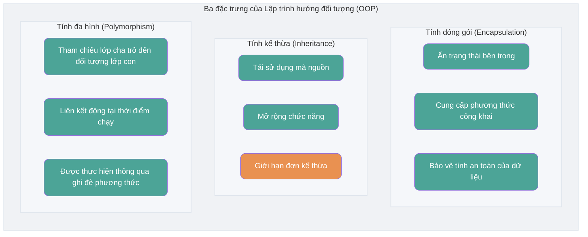
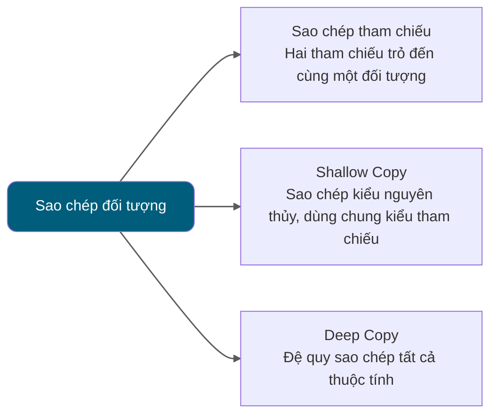

<!-- @include: @article-header.snippet.md -->

## Kiến thức cơ bản về hướng đối tượng

### ⭐️ Sự khác biệt giữa hướng đối tượng và hướng thủ tục

Lập trình hướng thủ tục (Procedural-Oriented Programming, POP) và lập trình hướng đối tượng (Object-Oriented Programming, OOP) là hai mô hình lập trình phổ biến, sự khác biệt chính giữa hai mô hình này nằm ở cách giải quyết vấn đề:

- **Lập trình hướng thủ tục (POP)**: Hướng thủ tục chia quá trình giải quyết vấn đề thành từng method riêng lẻ, giải quyết vấn đề thông qua việc thực thi lần lượt từng method.
- **Lập trình hướng đối tượng (OOP)**: Hướng đối tượng trước tiên trừu tượng hóa thành các object, sau đó dùng object thực thi method để giải quyết vấn đề.

So với POP, chương trình phát triển theo OOP thường có những ưu điểm sau:

- **Dễ bảo trì**: Do cấu trúc tốt và tính encapsulation, chương trình OOP thường dễ bảo trì hơn.
- **Dễ tái sử dụng**: Thông qua inheritance và polymorphism, thiết kế OOP khiến code có tính tái sử dụng cao hơn, thuận tiện cho việc mở rộng chức năng.
- **Dễ mở rộng**: Thiết kế module hóa khiến việc mở rộng hệ thống trở nên dễ dàng và linh hoạt hơn.

Phương thức lập trình POP thường đơn giản và trực tiếp hơn, phù hợp để xử lý các tác vụ đơn giản.

Sự khác biệt về hiệu năng giữa POP và OOP chủ yếu phụ thuộc vào cơ chế vận hành của chúng, chứ không chỉ đơn thuần là bản thân mô hình lập trình. Do đó, so sánh hiệu năng giữa hai mô hình một cách đơn giản là một hiểu lầm phổ biến (issue liên quan: [面向过程：面向过程性能比面向对象高？？](https://github.com/Snailclimb/JavaGuide/issues/431)).


Khi lựa chọn mô hình lập trình, hiệu năng không phải là yếu tố duy nhất cần cân nhắc. Khả năng bảo trì, khả năng mở rộng và hiệu suất phát triển của code cũng quan trọng không kém.

Các ngôn ngữ lập trình hiện đại về cơ bản đều hỗ trợ nhiều mô hình lập trình, có thể dùng cho lập trình hướng thủ tục hoặc lập trình hướng đối tượng.

Dưới đây là một ví dụ tính diện tích và chu vi hình tròn, minh họa hai giải pháp khác nhau theo hướng đối tượng và hướng thủ tục.

**Hướng đối tượng**:

```java
public class Circle {
    // 定义圆的半径
    private double radius;

    // 构造函数
    public Circle(double radius) {
        this.radius = radius;
    }

    // 计算圆的面积
    public double getArea() {
        return Math.PI * radius * radius;
    }

    // 计算圆的周长
    public double getPerimeter() {
        return 2 * Math.PI * radius;
    }

    public static void main(String[] args) {
        // 创建一个半径为3的圆
        Circle circle = new Circle(3.0);

        // 输出圆的面积和周长
        System.out.println("圆的面积为：" + circle.getArea());
        System.out.println("圆的周长为：" + circle.getPerimeter());
    }
}
```

Chúng ta định nghĩa một class `Circle` để biểu diễn hình tròn, class này chứa thuộc tính bán kính và các method tính diện tích, chu vi.

**Hướng thủ tục**:

```java
public class Main {
    public static void main(String[] args) {
        // 定义圆的半径
        double radius = 3.0;

        // 计算圆的面积和周长
        double area = Math.PI * radius * radius;
        double perimeter = 2 * Math.PI * radius;

        // 输出圆的面积和周长
        System.out.println("圆的面积为：" + area);
        System.out.println("圆的周长为：" + perimeter);
    }
}
```

Chúng ta trực tiếp định nghĩa bán kính hình tròn và dùng bán kính đó để tính trực tiếp diện tích và chu vi.

### Dùng toán tử gì để tạo một object? Object instance và object reference khác nhau thế nào?

Dùng toán tử `new` có thể tạo object instance. Heap của JVM dùng để cấp phát class instance và array; reference value có thể được lưu trong biến cục bộ, object field, static field hoặc phần tử array, không nhất thiết phải nằm trong stack.

- Một object reference có thể trỏ đến 0 hoặc 1 object (một sợi dây có thể không buộc bóng bay, cũng có thể buộc một quả bóng bay);
- Một object có thể có n reference trỏ đến nó (có thể dùng n sợi dây buộc một quả bóng bay).

### ⭐️ Sự khác biệt giữa object equality và reference equality

- Object equality thường được định nghĩa bởi `equals()`, dùng để so sánh trạng thái logic hoặc giá trị theo quy ước của kiểu.
- Reference equality được xác định bởi `==`, thể hiện hai reference có trỏ đến cùng một object hay không (hoặc đều là `null`), ngôn ngữ Java không phơi bày hoặc so sánh địa chỉ bộ nhớ vật lý.

Đây là một ví dụ:

```java
String str1 = "hello";
String str2 = new String("hello");
String str3 = "hello";
// 使用 == 比较字符串的引用相等
System.out.println(str1 == str2);
System.out.println(str1 == str3);
// 使用 equals 方法比较字符串的相等
System.out.println(str1.equals(str2));
System.out.println(str1.equals(str3));

```

Kết quả đầu ra:

```plain
false
true
true
true
```

Từ kết quả đầu ra của code trên có thể thấy:

- `str1` và `str2` không bằng nhau, còn `str1` và `str3` bằng nhau. Điều này là do toán tử `==` so sánh reference của string có bằng nhau hay không.
- Nội dung của `str1`, `str2`, `str3` đều bằng nhau. Điều này là do method `equals` so sánh nội dung của string, ngay cả khi object reference của các string này khác nhau, chỉ cần nội dung của chúng bằng nhau thì coi như chúng bằng nhau.

### Nếu một class không khai báo constructor, chương trình có thể thực thi đúng không?

Constructor là một method đặc biệt, chức năng chính là hoàn thành việc khởi tạo object.

Nếu một class không khai báo constructor, chương trình vẫn có thể thực thi! Bởi vì một class ngay cả khi không khai báo constructor cũng sẽ có constructor mặc định không tham số. Nếu chúng ta tự thêm constructor của class (dù có tham số hay không), Java sẽ không thêm constructor mặc định không tham số nữa.

Chúng ta vẫn luôn sử dụng constructor một cách vô thức, đây cũng là lý do tại sao khi tạo object chúng ta thêm một cặp dấu ngoặc đơn phía sau (vì cần gọi constructor không tham số). Nếu chúng ta overload constructor có tham số, hãy nhớ viết cả constructor không tham số (dù có dùng hay không), vì điều này có thể giúp chúng ta tránh được nhiều lỗi khi tạo object.

### Constructor có những đặc điểm gì? Có thể bị override không?

Constructor có những đặc điểm sau:

- **Tên trùng với tên class**: Tên của constructor phải hoàn toàn trùng khớp với tên class.
- **Không có giá trị trả về**: Constructor không có kiểu trả về, và không được dùng `void` để khai báo.
- **Tự động thực thi**: Khi tạo object của class, constructor sẽ tự động thực thi, không cần gọi tường minh.

Constructor **không thể bị override (ghi đè)**, nhưng **có thể bị overload (nạp chồng)**. Do đó, một class có thể có nhiều constructor, các constructor này có thể có danh sách tham số khác nhau để cung cấp các cách khởi tạo object khác nhau.

### ⭐️ Ba đặc trưng của hướng đối tượng

#### Encapsulation (Đóng gói)

Encapsulation là việc ẩn thông tin trạng thái (tức là thuộc tính) của một object bên trong object, không cho phép object bên ngoài truy cập trực tiếp vào thông tin nội bộ của object. Nhưng có thể cung cấp một số method được phép truy cập từ bên ngoài để thao tác với thuộc tính. Cũng giống như chúng ta không nhìn thấy thông tin linh kiện bên trong của chiếc điều hòa treo tường (tức là thuộc tính), nhưng có thể điều khiển điều hòa thông qua remote (method). Nếu thuộc tính không muốn bị truy cập từ bên ngoài, chúng ta không cần cung cấp method cho bên ngoài truy cập. Nhưng nếu một class không có method nào cho bên ngoài truy cập, thì class đó cũng không có ý nghĩa gì. Cũng giống như nếu không có remote điều hòa, chúng ta không thể điều khiển điều hòa làm lạnh, thì bản thân chiếc điều hòa cũng không có ý nghĩa (tất nhiên hiện nay còn nhiều cách khác, ở đây chỉ là ví dụ).

```java
public class Student {
    private int id;//id属性私有化
    private String name;//name属性私有化

    //获取id的方法
    public int getId() {
        return id;
    }

    //设置id的方法
    public void setId(int id) {
        this.id = id;
    }

    //获取name的方法
    public String getName() {
        return name;
    }

    //设置name的方法
    public void setName(String name) {
        this.name = name;
    }
}
```

#### Inheritance (Kế thừa)

Các object thuộc các kiểu khác nhau thường có một số điểm chung nhất định với nhau. Ví dụ, bạn học Tiểu Minh, Tiểu Hồng, Tiểu Lý đều chia sẻ các đặc tính của học sinh (lớp, mã số sinh viên, v.v.). Đồng thời, mỗi object còn định nghĩa thêm các đặc tính khiến chúng khác biệt. Ví dụ Tiểu Minh giỏi toán, Tiểu Hồng có tính cách dễ mến; Tiểu Lý có sức khỏe tốt. Inheritance là kỹ thuật sử dụng định nghĩa của class đã tồn tại làm nền tảng để xây dựng class mới. Định nghĩa của class mới có thể thêm dữ liệu mới hoặc chức năng mới, cũng có thể dùng chức năng của parent class, nhưng không thể kế thừa parent class một cách chọn lọc. Thông qua việc sử dụng inheritance, có thể nhanh chóng tạo ra class mới, nâng cao khả năng tái sử dụng code, khả năng bảo trì của chương trình, tiết kiệm nhiều thời gian tạo class mới, nâng cao hiệu suất phát triển của chúng ta.

**Về inheritance, hãy ghi nhớ 3 điểm sau:**

1. Object của subclass chứa instance state được khai báo bởi parent class, nhưng thành viên `private` của parent class sẽ không được subclass kế thừa, subclass cũng không thể truy cập trực tiếp các thành viên này.
2. Subclass có thể có thuộc tính và method của riêng mình, tức là subclass có thể mở rộng parent class.
3. Subclass có thể triển khai method của parent class theo cách riêng của mình (sẽ giới thiệu sau).

#### Polymorphism (Đa hình)

Polymorphism, đúng như tên gọi, thể hiện một object có nhiều trạng thái, biểu hiện cụ thể là reference của parent class trỏ đến instance của subclass.

**Đặc điểm của polymorphism:**

- Giữa kiểu object và kiểu reference có quan hệ inheritance (class) / implementation (interface);
- Lời gọi method do biến kiểu reference phát ra thực sự là method của class nào, phải đến thời điểm runtime mới xác định được;
- Polymorphism không thể gọi method "chỉ tồn tại trong subclass nhưng không tồn tại trong parent class";
- Nếu subclass override method của parent class, method thực sự được thực thi là method bị override trong subclass; nếu subclass không override method của parent class, method được thực thi là method của parent class.



### ⭐️ Interface và abstract class có điểm chung và khác biệt gì?

#### Điểm chung giữa interface và abstract class

- **Khởi tạo**: Interface và abstract class đều không thể khởi tạo trực tiếp, chỉ có thể được implements (interface) hoặc extends (abstract class) rồi mới tạo ra object cụ thể.
- **Abstract method**: Interface và abstract class đều có thể chứa abstract method. Abstract method không có method body, phải được triển khai trong subclass hoặc implementation class.

#### Sự khác biệt giữa interface và abstract class

- **Mục đích thiết kế**: Interface chủ yếu dùng để ràng buộc hành vi của class, bạn implements một interface nào đó thì sẽ có hành vi tương ứng. Abstract class chủ yếu dùng để tái sử dụng code, nhấn mạnh vào quan hệ sở thuộc.
- **Kế thừa và triển khai**: Một class chỉ có thể kế thừa một class (bao gồm abstract class), vì Java không hỗ trợ đa kế thừa. Nhưng một class có thể implements nhiều interface, một interface cũng có thể extends nhiều interface khác.
- **Biến thành viên**: Biến thành viên trong interface chỉ có thể là kiểu `public static final`, không thể bị sửa đổi và phải có giá trị khởi tạo. Biến thành viên của abstract class có thể có bất kỳ modifier nào (`private`, `protected`, `public`), có thể được định nghĩa lại hoặc gán lại trong subclass.
- **Method**:
  - Trước Java 8, method trong interface mặc định là `public abstract`, tức là chỉ có thể có khai báo method. Từ Java 8 trở đi, có thể định nghĩa `default` method và `static` method trong interface. Từ Java 9 trở đi, interface có thể chứa `private` method.
  - Abstract class có thể chứa abstract method và non-abstract method. Abstract method không có method body, phải được triển khai trong subclass. Non-abstract method có triển khai cụ thể, có thể dùng trực tiếp trong abstract class hoặc override trong subclass.

Java 8 đã giới thiệu `default` method và `static` method cho interface, Java 9 lại cho phép interface khai báo `private` method. Những method này khiến việc sử dụng interface trở nên linh hoạt hơn.

`default` method được giới thiệu trong Java 8 dùng để cung cấp triển khai mặc định cho interface method, có thể bị override trong implementation class. Như vậy có thể thêm chức năng mới vào interface hiện có mà không cần sửa đổi implementation class, từ đó tăng cường khả năng mở rộng và khả năng tương thích ngược của interface.

```java
public interface MyInterface {
    default void defaultMethod() {
        System.out.println("This is a default method.");
    }
}
```

`static` method được giới thiệu trong Java 8 không thể bị override trong implementation class, chỉ có thể gọi trực tiếp thông qua tên interface (`MyInterface.staticMethod()`), tương tự như static method trong class. `static` method thường dùng để định nghĩa một số method tiện ích chung liên quan đến interface, thường ít được dùng.

```java
public interface MyInterface {
    static void staticMethod() {
        System.out.println("This is a static method in the interface.");
    }
}
```

Java 9 cho phép sử dụng `private` method trong interface. `private` method có thể dùng để chia sẻ code trong nội bộ interface, không phơi bày ra bên ngoài.

```java
public interface MyInterface {
    // default 方法
    default void defaultMethod() {
        commonMethod();
    }

    // static 方法
    static void staticMethod() {
        commonMethod();
    }

    // 私有静态方法，可以被 static 和 default 方法调用
    private static void commonMethod() {
        System.out.println("This is a private method used internally.");
    }

      // 实例私有方法，只能被 default 方法调用。
    private void instanceCommonMethod() {
        System.out.println("This is a private instance method used internally.");
    }
}
```

### Bạn có hiểu sự khác biệt giữa deep copy và shallow copy không? Reference copy là gì?



Về sự khác biệt giữa deep copy và shallow copy, tôi đưa ra kết luận trước:

- **Shallow copy**: Shallow copy sẽ tạo một object mới trên heap (điểm khác biệt so với reference copy). Tuy nhiên, nếu thuộc tính bên trong object gốc là kiểu reference, shallow copy sẽ sao chép trực tiếp địa chỉ reference của internal object, nghĩa là object copy và object gốc dùng chung một internal object.
- **Deep copy**: Deep copy sẽ sao chép hoàn toàn toàn bộ object, bao gồm cả internal object mà object này chứa.

Nếu chưa hoàn toàn hiểu kết luận trên cũng không sao, chúng ta hãy xem một ví dụ cụ thể!

#### Shallow copy

Code ví dụ về shallow copy như sau, ở đây chúng ta implements interface `Cloneable` và override method `clone()`.

Cách triển khai của method `clone()` rất đơn giản, gọi trực tiếp method `clone()` của parent class `Object`.

```java
public class Address implements Cloneable{
    private String name;
    // 省略构造函数、Getter&Setter方法
    @Override
    public Address clone() {
        try {
            return (Address) super.clone();
        } catch (CloneNotSupportedException e) {
            throw new AssertionError();
        }
    }
}

public class Person implements Cloneable {
    private Address address;
    // 省略构造函数、Getter&Setter方法
    @Override
    public Person clone() {
        try {
            Person person = (Person) super.clone();
            return person;
        } catch (CloneNotSupportedException e) {
            throw new AssertionError();
        }
    }
}
```

Kiểm thử:

```java
Person person1 = new Person(new Address("武汉"));
Person person1Copy = person1.clone();
// true
System.out.println(person1.getAddress() == person1Copy.getAddress());
```

Từ kết quả đầu ra có thể thấy, object clone của `person1` và `person1` vẫn dùng chung một object `Address`.

#### Deep copy

Ở đây chúng ta sửa đổi đơn giản method `clone()` của class `Person`, đồng thời sao chép cả object `Address` bên trong object `Person`.

```java
@Override
public Person clone() {
    try {
        Person person = (Person) super.clone();
        person.setAddress(person.getAddress().clone());
        return person;
    } catch (CloneNotSupportedException e) {
        throw new AssertionError();
    }
}
```

Kiểm thử:

```java
Person person1 = new Person(new Address("武汉"));
Person person1Copy = person1.clone();
// false
System.out.println(person1.getAddress() == person1Copy.getAddress());
```

Từ kết quả đầu ra có thể thấy rõ ràng, object clone của `person1` và object `Address` chứa trong `person1` đã là khác nhau.

**Vậy reference copy là gì?** Nói đơn giản, reference copy là hai reference khác nhau trỏ đến cùng một object.

Tôi đã vẽ riêng một bức hình để mô tả shallow copy, deep copy và reference copy:


## ⭐️ Object

### Class Object có những method phổ biến nào?

Class Object là một class đặc biệt, là parent class của tất cả các class, chủ yếu cung cấp các method sau. Cần lưu ý, `finalize()` đã bị deprecated từ JDK 9 và bị đánh dấu là sẽ bị loại bỏ trong JDK 18, không nên dùng trong code mới:

```java
/**
 * native 方法，用于返回当前运行时对象的 Class 对象，使用了 final 关键字修饰，故不允许子类重写。
 */
public final native Class<?> getClass()
/**
 * native 方法，用于返回对象的哈希码，主要使用在哈希表中，比如 JDK 中的HashMap。
 */
public native int hashCode()
/**
 * 用于比较 2 个引用是否指向同一个对象，String 类对该方法进行了重写以用于比较字符串的值是否相等。
 */
public boolean equals(Object obj)
/**
 * native 方法，用于创建并返回当前对象的一份拷贝。
 */
protected native Object clone() throws CloneNotSupportedException
/**
 * 返回类的名字实例的哈希码的 16 进制的字符串。建议 Object 所有的子类都重写这个方法。
 */
public String toString()
/**
 * native 方法，并且不能重写。唤醒一个在此对象监视器上等待的线程(监视器相当于就是锁的概念)。如果有多个线程在等待只会任意唤醒一个。
 */
public final native void notify()
/**
 * native 方法，并且不能重写。跟 notify 一样，唯一的区别就是会唤醒在此对象监视器上等待的所有线程，而不是一个线程。
 */
public final native void notifyAll()
/**
 * native方法，并且不能重写。暂停线程的执行。注意：sleep 方法没有释放锁，而 wait 方法释放了锁 ，timeout 是等待时间。
 */
public final native void wait(long timeout) throws InterruptedException
/**
 * 多了 nanos 参数，这个参数表示额外时间（以纳秒为单位，范围是 0-999999）。 所以超时的时间还需要加上 nanos 纳秒。。
 */
public final void wait(long timeout, int nanos) throws InterruptedException
/**
 * 跟之前的2个wait方法一样，只不过该方法一直等待，没有超时时间这个概念
 */
public final void wait() throws InterruptedException
/**
 * 实例被垃圾回收器回收的时候触发的操作
 */
protected void finalize() throws Throwable { }
```
```java
/**

* Phương thức native, dùng để trả về đối tượng Class của đối tượng tại thời điểm runtime. Phương thức này được khai báo với từ khóa final nên không cho phép lớp con ghi đè.
  */*
  *public final native Class<?> getClass()*
  */**
* Phương thức native, dùng để trả về mã băm (hash code) của đối tượng, chủ yếu được sử dụng trong các bảng băm (hash table), chẳng hạn như HashMap trong JDK.
  */*
  *public native int hashCode()*
  */**
* Dùng để so sánh xem 2 tham chiếu có trỏ đến cùng một đối tượng hay không. Lớp String ghi đè phương thức này để so sánh xem giá trị của hai chuỗi có bằng nhau hay không.
  */*
  *public boolean equals(Object obj)*
  */**
* Phương thức native, dùng để tạo và trả về một bản sao của đối tượng hiện tại.
  */*
  *protected native Object clone() throws CloneNotSupportedException*
  */**
* Trả về chuỗi biểu diễn ở dạng thập lục phân của mã băm của instance, dựa trên tên lớp. Khuyến nghị tất cả các lớp con của Object nên ghi đè phương thức này.
  */*
  *public String toString()*
  */**
* Phương thức native và không thể ghi đè. Đánh thức một thread đang chờ trên monitor của đối tượng này (monitor có thể hiểu tương đương với khái niệm lock). Nếu có nhiều thread đang chờ thì chỉ một thread bất kỳ được đánh thức.
  */*
  *public final native void notify()*
  */**
* Phương thức native và không thể ghi đè. Tương tự notify, điểm khác biệt duy nhất là phương thức này đánh thức tất cả thread đang chờ trên monitor của đối tượng này thay vì chỉ một thread.
  */*
  *public final native void notifyAll()*
  */**
* Phương thức native và không thể ghi đè. Tạm dừng việc thực thi của thread. Lưu ý: phương thức sleep không giải phóng lock, trong khi phương thức wait giải phóng lock; timeout là khoảng thời gian chờ.
  */*
  *public final native void wait(long timeout) throws InterruptedException*
  */**
* Có thêm tham số nanos. Tham số này biểu thị khoảng thời gian bổ sung (tính bằng nanosecond, trong phạm vi từ 0 đến 999999). Vì vậy, thời gian timeout thực tế còn phải cộng thêm số nanosecond được chỉ định bởi nanos.
  */*
  *public final void wait(long timeout, int nanos) throws InterruptedException*
  */**
* Tương tự hai phương thức wait trước đó, nhưng phương thức này chờ vô thời hạn, không có khái niệm timeout.
  */*
  *public final void wait() throws InterruptedException*
  */**
* Thao tác được kích hoạt khi instance được Garbage Collector thu hồi.
  */
  protected void finalize() throws Throwable { }

**/
```
### Sự khác biệt giữa == và equals()

**`==`** có tác dụng khác nhau đối với kiểu cơ bản và kiểu reference:

- Đối với kiểu dữ liệu cơ bản (primitive type), `==` so sánh giá trị.
- Đối với kiểu dữ liệu reference (reference type), `==` so sánh reference có trỏ đến cùng một object hay không (hoặc đều là `null`), không phải so sánh địa chỉ bộ nhớ vật lý.

> Đối với `==`, dù so sánh kiểu cơ bản hay kiểu reference, nó đều so sánh giá trị của toán hạng; reference value mô tả object mà nó trỏ đến, nhưng ngôn ngữ Java không định nghĩa nó là địa chỉ bộ nhớ vật lý có thể nhìn thấy.

**`equals()`** không thể dùng để xác định biến kiểu dữ liệu cơ bản, chỉ có thể dùng để xác định hai object có bằng nhau không. Method `equals()` tồn tại trong class `Object`, mà class `Object` là parent class trực tiếp hoặc gián tiếp của tất cả các class, do đó tất cả các class đều có method `equals()`.

Method `equals()` của class `Object`:

```java
public boolean equals(Object obj) {
     return (this == obj);
}
```

Method `equals()` có hai trường hợp sử dụng:

- **Class không override method `equals()`**: Khi so sánh hai object của class này thông qua `equals()`, tương đương với việc so sánh hai object này bằng "==", sử dụng mặc định method `equals()` của class `Object`.
- **Class đã override method `equals()`**: Thông thường chúng ta override method `equals()` để so sánh các thuộc tính trong hai object có bằng nhau hay không; nếu các thuộc tính của chúng bằng nhau, trả về true (tức là coi hai object này bằng nhau).

Ví dụ (ở đây chỉ là để minh họa. Thực tế, nếu bạn viết theo cách dưới đây, những IDE thông minh như IDEA sẽ gợi ý bạn thay `==` bằng `equals()`):

```java
String a = new String("ab"); // a 为一个引用
String b = new String("ab"); // b为另一个引用,对象的内容一样
String aa = "ab"; // 放在常量池中
String bb = "ab"; // 从常量池中查找
System.out.println(aa == bb);// true
System.out.println(a == b);// false
System.out.println(a.equals(b));// true
System.out.println(42 == 42.0);// true
```

Method `equals` trong `String` đã được override, vì method `equals` của `Object` xác định hai reference có trỏ đến cùng một object hay không, còn method `equals` của `String` so sánh giá trị của string.

Khi dùng string literal để tạo object kiểu `String` (như `String aa = "ab"`), virtual machine sẽ tìm trong constant pool xem có object nào đã tồn tại có giá trị giống với giá trị cần tạo không, nếu có thì gán nó cho reference hiện tại; nếu không có, thì tạo một object `String` trong constant pool và gán cho reference hiện tại. Nhưng khi dùng từ khóa `new` để tạo object (như `String a = new String("ab")`), virtual machine luôn **tạo một object mới** trong heap memory và dùng giá trị trong constant pool (nếu không có, sẽ tạo string object "ab" trong string constant pool trước) để khởi tạo, sau đó gán cho reference hiện tại.

Method `equals()` của class `String`:

```java
public boolean equals(Object anObject) {
    if (this == anObject) {
        return true;
    }
    if (anObject instanceof String) {
        String anotherString = (String)anObject;
        int n = value.length;
        if (n == anotherString.value.length) {
            char v1[] = value;
            char v2[] = anotherString.value;
            int i = 0;
            while (n-- != 0) {
                if (v1[i] != v2[i])
                    return false;
                i++;
            }
            return true;
        }
    }
    return false;
}
```

### hashCode() dùng để làm gì?

Tác dụng của `hashCode()` là lấy hash code (số nguyên `int`), còn gọi là散列码. Hash code này có tác dụng xác định vị trí index của object đó trong hash table.


`hashCode()` được định nghĩa trong class `Object` của JDK, điều này có nghĩa là bất kỳ class nào trong Java đều chứa hàm `hashCode()`. Một điều cần lưu ý khác: method `hashCode()` của `Object` là native method, tức là được triển khai bằng ngôn ngữ C hoặc C++.

> ⚠️ Lưu ý: Trong Oracle OpenJDK 8, phương thức này mặc định sử dụng "trạng thái cục bộ của thread để thực hiện việc sinh số ngẫu nhiên bằng Marsaglia's xor-shift", chứ không phải "địa chỉ" hoặc "được chuyển đổi từ địa chỉ". Cách triển khai có thể khác nhau tùy JDK/VM. Trong Oracle OpenJDK 8 có sáu cách sinh mã (trong đó cách thứ năm là trả về địa chỉ). Có thể bật cách thứ năm bằng cách thêm tham số VM: -XX:hashCode=4. Tham khảo mã nguồn:
>
> - <https://hg.openjdk.org/jdk8u/jdk8u/hotspot/file/87ee5ee27509/src/share/vm/runtime/globals.hpp>（1127 行）
> - <https://hg.openjdk.org/jdk8u/jdk8u/hotspot/file/87ee5ee27509/src/share/vm/runtime/synchronizer.cpp>（537 行开始）

```java
public native int hashCode();
```

Hash table lưu trữ các cặp key-value, đặc điểm của nó là: **có thể nhanh chóng truy xuất "value" tương ứng dựa trên "key". Trong đó đã tận dụng hash code! (có thể nhanh chóng tìm thấy object cần thiết)**

### Tại sao cần có hashCode?

Chúng ta lấy ví dụ "HashSet kiểm tra trùng lặp như thế nào" để giải thích tại sao cần có hashCode?

Khi chúng ta thêm object vào HashSet, HashSet sẽ gọi method `hashCode()` của object trước tiên, thu được một "hash value", và thông qua hàm hash nội bộ thực hiện thêm một lần biến đổi đơn giản đối với hash value này (ví dụ như lấy phần dư), để quyết định dữ liệu này nên được đặt vào bucket nào của mảng nền (bucket, tương ứng với một vị trí nào đó trong mảng nền):

1. Nếu bucket đó hiện đang trống, trực tiếp chèn node tương ứng với object vào bucket này.
2. Nếu bucket đó đã có các phần tử khác, HashSet sẽ so sánh lần lượt trong linked list hoặc red-black tree tương ứng với bucket này:
   - Đối với các node có **hash value khác nhau**, trực tiếp bỏ qua;
   - Đối với các node có **hash value giống nhau**, sẽ tiếp tục gọi method equals() để kiểm tra hai object này có "bằng nhau" hay không:
     – Nếu `equals()` trả về true, chứng tỏ trong tập hợp đã tồn tại phần tử tương đương với object hiện tại, `HashSet` sẽ không thêm nó vào nữa;
     – Nếu trả về false, thì coi là phần tử mới, sẽ thêm object đó như một node mới vào trong linked list hoặc red-black tree của **cùng một bucket**.

Bằng cách sử dụng `hashCode()` trước tiên để thu hẹp phạm vi ứng viên vào cùng một bucket, sau đó gọi `equals()` trên một số ít phần tử trong bucket để đưa ra phán đoán chính xác, `HashSet` đã giảm đáng kể số lần gọi `equals()`, từ đó nâng cao hiệu suất thực thi của việc tìm kiếm và chèn.

**Vậy tại sao JDK còn phải cung cấp đồng thời cả hai method này?**

Điều này là do trong một số container (như `HashMap`, `HashSet`), sau khi có `hashCode()`, hiệu suất xác định phần tử có trong container tương ứng hay không sẽ cao hơn (tham khảo quá trình thêm phần tử vào `HashSet`)!

Chúng ta cũng đã đề cập ở trên về quá trình thêm phần tử vào `HashSet`, nếu `HashSet` khi so sánh, cùng một `hashCode` có nhiều object, nó sẽ tiếp tục dùng `equals()` để xác định có thực sự giống nhau không. Điều đó nói lên rằng `hashCode` đã giúp chúng ta thu hẹp đáng kể chi phí tìm kiếm.

**Vậy tại sao không chỉ cung cấp mỗi method `hashCode()`?**

Điều này là do giá trị `hashCode` của hai object bằng nhau không có nghĩa là hai object đó bằng nhau.

**Vậy tại sao hai object có cùng giá trị `hashCode`, chúng cũng không nhất thiết là bằng nhau?**

Bởi vì thuật toán hash mà `hashCode()` sử dụng có thể vừa hay khiến nhiều object trả về cùng một hash value. Thuật toán hash càng tệ thì càng dễ xảy ra collision, nhưng điều này cũng liên quan đến đặc tính phân bố miền giá trị của dữ liệu (cái gọi là hash collision chính là các object khác nhau nhận được cùng một `hashCode`).

Tóm lại:

- Nếu giá trị `hashCode` của hai object bằng nhau, thì hai object đó không nhất thiết bằng nhau (hash collision).
- Nếu giá trị `hashCode` của hai object bằng nhau và method `equals()` cũng trả về `true`, chúng ta mới coi hai object đó bằng nhau.
- Nếu giá trị `hashCode` của hai object không bằng nhau, chúng ta có thể trực tiếp coi hai object đó không bằng nhau.

Tin rằng sau khi đọc phần giới thiệu của tôi về `hashCode()` và `equals()` ở trên, câu hỏi dưới đây sẽ không làm khó được các bạn nữa.

### Tại sao khi override equals() thì phải override hashCode()?

Bởi vì giá trị `hashCode` của hai object bằng nhau thì phải bằng nhau. Nói cách khác, nếu method `equals` xác định hai object là bằng nhau, thì giá trị `hashCode` của hai object đó cũng phải bằng nhau.

Nếu khi override `equals()` mà không override method `hashCode()` thì có thể dẫn đến tình huống method `equals` xác định là hai object bằng nhau, nhưng giá trị `hashCode` lại không bằng nhau.

**Suy nghĩ**: Khi override `equals()` mà không override method `hashCode()`, sử dụng `HashMap` có thể gặp vấn đề gì?

**Tổng kết**:

- Method `equals` xác định hai object là bằng nhau, thì giá trị `hashCode` của hai object đó cũng phải bằng nhau.
- Hai object có cùng giá trị `hashCode`, chúng cũng không nhất thiết là bằng nhau (hash collision).

Thêm nội dung về `hashCode()` và `equals()` có thể xem tại: [Java hashCode() 和 equals()的若干问题解答](https://www.cnblogs.com/skywang12345/p/3324958.html)

## String

### ⭐️ Sự khác biệt giữa String, StringBuffer, StringBuilder?

**Tính khả biến (Mutability)**

`String` là immutable (sẽ phân tích chi tiết nguyên nhân sau), mỗi lần sửa đổi đều tạo ra object mới và trỏ reference đến instance mới, trong khi `StringBuffer` và `StringBuilder` đều là mutable, chúng không tạo object mới khi sửa đổi string mà thao tác trực tiếp trên mảng ký tự gốc.

`StringBuilder` và `StringBuffer` đều kế thừa từ class `AbstractStringBuilder`, trong `AbstractStringBuilder` cũng dùng mảng ký tự để lưu string, nhưng không dùng từ khóa `final` và `private` để修饰. Quan trọng nhất là class `AbstractStringBuilder` này còn cung cấp nhiều method sửa đổi string như method `append`.

```java
abstract class AbstractStringBuilder implements Appendable, CharSequence {
    char[] value;
    public AbstractStringBuilder append(String str) {
        if (str == null)
            return appendNull();
        int len = str.length();
        ensureCapacityInternal(count + len);
        str.getChars(0, len, value, count);
        count += len;
        return this;
    }
    //...
}
```

**Tính an toàn luồng (Thread safety)**

Object trong `String` là immutable, cũng có thể hiểu là constant, thread-safe. `AbstractStringBuilder` là parent class chung của `StringBuilder` và `StringBuffer`, định nghĩa một số thao tác cơ bản của string như `expandCapacity`, `append`, `insert`, `indexOf` và các method chung khác. `StringBuffer` đã thêm synchronized lock cho method hoặc cho method được gọi, nên là thread-safe. `StringBuilder` không thêm synchronized lock cho method, nên là non-thread-safe.


**Hiệu năng**

Sự khác biệt về hiệu năng giữa hai loại chủ yếu đến từ cơ chế thread safety:

- Method của `StringBuffer` thường là synchronized (thread-safe), do đó sẽ mang lại một lượng overhead nhất định về hiệu năng;
- `StringBuilder` không có overhead đồng bộ (non-thread-safe), trong kịch bản single-thread thường có hiệu năng tốt hơn.
  Trong cùng điều kiện, sử dụng `StringBuilder` so với `StringBuffer` chỉ có thể đạt được mức cải thiện hiệu năng khoảng 10%~15%, nhưng lại phải chịu rủi ro không an toàn trong multi-thread.
  Ngoài ra, sự khác biệt hiệu năng cụ thể không phải là cố định, trong JVM hiện đại do lock optimization (như lock elimination), khoảng cách hiệu năng giữa hai loại trong một số kịch bản có thể khá nhỏ.

**Tổng kết về cách sử dụng ba loại:**

- Thao tác với lượng dữ liệu nhỏ: dùng `String`
- Single-thread thao tác lượng dữ liệu lớn trong string buffer: dùng `StringBuilder`
- Multi-thread thao tác lượng dữ liệu lớn trong string buffer: dùng `StringBuffer`

### ⭐️ Tại sao String là immutable?

Class `String` dùng từ khóa `final` để修饰 mảng ký tự nhằm lưu string, ~~因此 `String` 对象是不可变的。~~

```java
public final class String implements java.io.Serializable, Comparable<String>, CharSequence {
    private final char value[];
  //...
}
```

> 🐛 修正：我们知道被 `final` 关键字修饰的类不能被继承，修饰的方法不能被重写，修饰的变量是基本数据类型则值不能改变，修饰的变量是引用类型则不能再指向其他对象。因此，`final` 关键字修饰的数组保存字符串并不是 `String` 不可变的根本原因，因为这个数组保存的字符串是可变的（`final` 修饰引用类型变量的情况）。
>
> `String` 真正不可变有下面几点原因：
>
> 1. 保存字符串的数组被 `final` 修饰且为私有的，并且 `String` 类没有提供/暴露修改这个字符串的方法。
> 2. `String` 类被 `final` 修饰导致其不能被继承，进而避免了子类破坏 `String` 不可变。
>
> 相关阅读：[如何理解 String 类型值的不可变？ - 知乎提问](https://www.zhihu.com/question/20618891/answer/114125846)
>
> 补充（来自[issue 675](https://github.com/Snailclimb/JavaGuide/issues/675)）：在 Java 9 之后，`String`、`StringBuilder` 与 `StringBuffer` 的实现改用 `byte` 数组存储字符串。
>
> ```java
> public final class String implements java.io.Serializable,Comparable<String>, CharSequence {
>     // @Stable 注解表示变量最多被修改一次，称为"稳定的"。
>     @Stable
>     private final byte[] value;
> }
>
> abstract class AbstractStringBuilder implements Appendable, CharSequence {
>     byte[] value;
>
> }
> ```
>
> **Java 9 为何要将 `String` 的底层实现由 `char[]` 改成了 `byte[]` ?**
>
> 新版的 String 内部支持两种编码方案：Latin-1 和 UTF-16。如果字符串中的所有字符都能用 Latin-1 表示，就使用 Latin-1；否则使用 UTF-16。汉字不在 Latin-1 的字符范围内。Latin-1 方案下，每个字符内容使用一个字节存储，相比原来的 `char[]` 可以节省一半的字符数据空间。
>
> JDK 官方就说了绝大部分字符串对象只包含 Latin-1 可表示的字符。
>
> 
>
> 如果字符串包含 Latin-1 无法表示的字符（例如汉字），内部会使用 UTF-16，每个代码单元使用两个字节。
>
> 这是官方的介绍：<https://openjdk.java.net/jeps/254>。

### ⭐️ Nối string dùng "+" hay StringBuilder?

Java 不支持用户自定义运算符重载，但语言规范为字符串连接专门定义了 `+` 和 `+=` 运算符。

```java
String str1 = "he";
String str2 = "llo";
String str3 = "world";
String str4 = str1 + str2 + str3;
```

上面的代码对应的字节码如下：


对于这里展示的 JDK 8 字节码，字符串"+"拼接被 `javac` 转换为 `StringBuilder.append()` 调用。JDK 9 起，`javac` 默认改用 `invokedynamic` 和 `StringConcatFactory`，因此不能把 `StringBuilder` 视为所有版本都必须采用的实现方式。

不过，在循环内使用"+"进行字符串的拼接的话，存在比较明显的缺陷：**编译器不会创建单个 `StringBuilder` 以复用，会导致创建过多的 `StringBuilder` 对象**。

```java
String[] arr = {"he", "llo", "world"};
String s = "";
for (int i = 0; i < arr.length; i++) {
    s += arr[i];
}
System.out.println(s);
```

`StringBuilder` 对象是在循环内部被创建的，这意味着每循环一次就会创建一个 `StringBuilder` 对象。


如果直接使用 `StringBuilder` 对象进行字符串拼接的话，就不会存在这个问题了。

```java
String[] arr = {"he", "llo", "world"};
StringBuilder s = new StringBuilder();
for (String value : arr) {
    s.append(value);
}
System.out.println(s);
```


如果你使用 IDEA 的话，IDEA 自带的代码检查机制也会提示你修改代码。

在 JDK 9 中，字符串相加"+"改为用动态方法 `makeConcatWithConstants()` 来实现，通过提前分配空间从而减少了部分临时对象的创建。然而这种优化主要针对简单的字符串拼接，如： `a+b+c`。对于循环中的大量拼接操作，仍然会逐个动态分配内存（类似于两个两个 append 的概念），并不如手动使用 StringBuilder 来进行拼接效率高。这个改进是 JDK9 的 [JEP 280](https://openjdk.org/jeps/280) 提出的，关于这部分改进的详细介绍，推荐阅读这篇文章：还在无脑用 [StringBuilder？来重温一下字符串拼接吧](https://juejin.cn/post/7182872058743750715) 以及参考 [issue#2442](https://github.com/Snailclimb/JavaGuide/issues/2442)。

### String#equals() 和 Object#equals() 有何区别？

`String` 中的 `equals` 方法是被重写过的，比较的是 String 字符串的值是否相等。`Object` 的 `equals` 方法判断两个引用是否指向同一个对象。

### ⭐️ 字符串常量池的作用了解吗？

**字符串常量池** 是 JVM 为了提升性能和减少内存消耗针对字符串（String 类）专门开辟的一块区域，主要目的是为了避免字符串的重复创建。

```java
// 1.在字符串常量池中查询字符串对象 "ab"，如果没有则创建"ab"并放入字符串常量池
// 2.将字符串对象 "ab" 的引用赋值给 aa
String aa = "ab";
// 直接返回字符串常量池中字符串对象 "ab"，赋值给引用 bb
String bb = "ab";
System.out.println(aa==bb); // true
```

更多关于字符串常量池的介绍可以看一下 [Java 内存区域详解](https://javaguide.cn/java/jvm/memory-area.html) 这篇文章。

### ⭐️ String s1 = new String("abc");这句话创建了几个字符串对象？

先说答案：会创建 1 或 2 个字符串对象。

1. 字符串常量池中不存在 "abc"：会创建 2 个 字符串对象。一个在字符串常量池中，由 `ldc` 指令触发创建。一个在堆中，由 `new String()` 创建，并使用常量池中的 "abc" 进行初始化。
2. 字符串常量池中已存在 "abc"：会创建 1 个 字符串对象。该对象在堆中，由 `new String()` 创建，并使用常量池中的 "abc" 进行初始化。

下面开始详细分析。

下面开始详细分析。

1、如果字符串常量池中不存在字符串对象 "abc"，那么它首先会在字符串常量池中创建字符串对象 "abc"，然后在堆内存中再创建其中一个字符串对象 "abc"。

示例代码（JDK 1.8）：

```java
String s1 = new String("abc");
```

对应的字节码：

```java
// 在堆内存中分配一个尚未初始化的 String 对象。
// #2 是常量池中的一个符号引用，指向 java/lang/String 类。
// 在类加载的解析阶段，这个符号引用会被解析成直接引用，即指向实际的 java/lang/String 类。
0 new #2 <java/lang/String>
// 复制栈顶的 String 对象引用，为后续的构造函数调用做准备。
// 此时操作数栈中有两个相同的对象引用：一个用于传递给构造函数，另一个用于保持对新对象的引用，后续将其存储到局部变量表。
3 dup
// JVM 先检查字符串常量池中是否存在 "abc"。
// 如果常量池中已存在 "abc"，则直接返回该字符串的引用；
// 如果常量池中不存在 "abc"，则 JVM 会在常量池中创建该字符串字面量并返回它的引用。
// 这个引用被压入操作数栈，用作构造函数的参数。
4 ldc #3 <abc>
// 调用构造方法，使用从常量池中加载的 "abc" 初始化堆中的 String 对象
// 新的 String 对象将包含与常量池中的 "abc" 相同的内容，但它是一个独立的对象，存储于堆中。
6 invokespecial #4 <java/lang/String.<init> : (Ljava/lang/String;)V>
// 将堆中的 String 对象引用存储到局部变量表
9 astore_1
// 返回，结束方法
10 return
```

`ldc (load constant)` 指令的确是从常量池中加载各种类型的常量，包括字符串常量、整数常量、浮点数常量，甚至类引用等。对于字符串常量，`ldc` 指令的行为如下：

1. **从常量池加载字符串**：`ldc` 首先检查字符串常量池中是否已经有内容相同的字符串对象。
2. **复用已有字符串对象**：如果字符串常量池中已经存在内容相同的字符串对象，`ldc` 会将该对象的引用加载到操作数栈上。
3. **没有则创建新对象并加入常量池**：如果字符串常量池中没有相同内容的字符串对象，JVM 会在常量池中创建一个新的字符串对象，并将其引用加载到操作数栈中。

2、如果字符串常量池中已存在字符串对象"abc"，则只会在堆中创建 1 个字符串对象"abc"。

示例代码（JDK 1.8）：

```java
// 字符串常量池中已存在字符串对象"abc"
String s1 = "abc";
// 下面这段代码只会在堆中创建 1 个字符串对象"abc"
String s2 = new String("abc");
```

对应的字节码：

```java
0 ldc #2 <abc>
2 astore_1
3 new #3 <java/lang/String>
6 dup
7 ldc #2 <abc>
9 invokespecial #4 <java/lang/String.<init> : (Ljava/lang/String;)V>
12 astore_2
13 return
```

这里就不对上面的字节码进行详细注释了，7 这个位置的 `ldc` 命令不会在堆中创建新的字符串对象"abc"，这是因为 0 这个位置已经执行了一次 `ldc` 命令，已经在堆中创建过一次字符串对象"abc"了。7 这个位置执行 `ldc` 命令会直接返回字符串常量池中字符串对象"abc"对应的引用。

### String#intern 方法有什么作用?

`String.intern()` 是一个 `native`（本地） 方法，用来处理字符串常量池中的字符串对象引用。它的工作流程可以概括为以下两种情况：

1. **常量池中已有相同内容的字符串对象**：如果字符串常量池中已经有一个与调用 `intern()` 方法的字符串内容相同的 `String` 对象，`intern()` 方法会直接返回常量池中该对象的引用。
2. **常量池中没有相同内容的字符串对象**：如果字符串常量池中还没有一个与调用 `intern()` 方法的字符串内容相同的对象，`intern()` 方法会将当前字符串对象的引用添加到字符串常量池中，并返回该引用。

总结：

- `intern()` 方法的主要作用是确保字符串引用在常量池中的唯一性。
- 当调用 `intern()` 时，如果常量池中已经存在相同内容的字符串，则返回常量池中已有对象的引用；否则，将该字符串添加到常量池并返回其引用。

示例代码（JDK 1.8） :

```java
// s1 指向字符串常量池中的 "Java" 对象
String s1 = "Java";
// s2 也指向字符串常量池中的 "Java" 对象，和 s1 是同一个对象
String s2 = s1.intern();
// 在堆中创建一个新的 "Java" 对象，s3 指向它
String s3 = new String("Java");
// s4 指向字符串常量池中的 "Java" 对象，和 s1 是同一个对象
String s4 = s3.intern();
// s1 和 s2 指向的是同一个常量池中的对象
System.out.println(s1 == s2); // true
// s3 指向堆中的对象，s4 指向常量池中的对象，所以不同
System.out.println(s3 == s4); // false
// s1 和 s4 都指向常量池中的同一个对象
System.out.println(s1 == s4); // true
```

### String 类型的变量和常量做"+"运算时发生了什么？

先来看字符串不加 `final` 关键字拼接的情况（JDK1.8）：

```java
String str1 = "str";
String str2 = "ing";
String str3 = "str" + "ing";
String str4 = str1 + str2;
String str5 = "string";
System.out.println(str3 == str4);//false
System.out.println(str3 == str5);//true
System.out.println(str4 == str5);//false
```

> **注意**：比较 String 字符串的值是否相等，可以使用 `equals()` 方法。 `String` 中的 `equals` 方法是被重写过的。 `Object` 的 `equals` 方法判断两个引用是否指向同一个对象，而 `String` 的 `equals` 方法比较的是字符串的值是否相等。如果你使用 `==` 比较两个字符串是否相等的话，IDEA 还是提示你使用 `equals()` 方法替换。


**对于编译期可以确定值的字符串表达式，编译器会进行常量折叠，并把结果作为字符串常量写入 class 文件的常量池；对应的字符串对象在运行时被创建并驻留到字符串池中。**

在编译过程中，Javac 编译器（下文中统称为编译器）会进行一个叫做 **常量折叠(Constant Folding)** 的代码优化。《深入理解 Java 虚拟机》中是也有介绍到：


常量折叠会把常量表达式的值求出来作为常量嵌在最终生成的代码中，这是 Javac 编译器会对源代码做的极少量优化措施之一（代码优化几乎都在即时编译器中进行）。

对于 `String str3 = "str" + "ing";` 编译器会给你优化成 `String str3 = "string";`。

并不是所有的常量都会进行折叠，只有编译器在程序编译期就可以确定值的常量才可以：

- 基本数据类型( `byte`、`boolean`、`short`、`char`、`int`、`float`、`long`、`double`)以及字符串常量。
- `final` 修饰的基本数据类型和字符串变量
- 字符串通过 "+"拼接得到的字符串、基本数据类型之间算数运算（加减乘除）、基本数据类型的位运算（<<、\>>、\>>>）

**引用的值在程序编译期是无法确定的，编译器无法对其进行优化。**

对象引用和"+"的字符串拼接方式，实际上是通过 `StringBuilder` 调用 `append()` 方法实现的，拼接完成之后调用 `toString()` 得到一个 `String` 对象。

```java
String str4 = new StringBuilder().append(str1).append(str2).toString();
```

我们在平时写代码的时候，尽量避免多个字符串对象拼接，因为这样会重新创建对象。如果需要改变字符串的话，可以使用 `StringBuilder` 或者 `StringBuffer`。

不过，字符串使用 `final` 关键字声明之后，可以让编译器当做常量来处理。

示例代码：

```java
final String str1 = "str";
final String str2 = "ing";
// 下面两个表达式其实是等价的
String c = "str" + "ing";// 常量池中的对象
String d = str1 + str2; // 常量池中的对象
System.out.println(c == d);// true
```

被 `final` 关键字修饰之后的 `String` 会被编译器当做常量来处理，编译器在程序编译期就可以确定它的值，其效果就相当于访问常量。

如果，编译器在运行时才能知道其确切值的话，就无法对其优化。

示例代码（`str2` 在运行时才能确定其值）：

```java
final String str1 = "str";
final String str2 = getStr();
String c = "str" + "ing";// 常量池中的对象
String d = str1 + str2; // 在堆上创建的新的对象
System.out.println(c == d);// false
public static String getStr() {
      return "ing";
}
```

## 参考

- 深入解析 String#intern：<https://tech.meituan.com/2014/03/06/in-depth-understanding-string-intern.html>
- Java String 源码解读：<http://keaper.cn/2020/09/08/java-string-mian-mian-guan/>
- R 大（RednaxelaFX）关于常量折叠的回答：<https://www.zhihu.com/question/55976094/answer/147302764>

<!-- @include: @article-footer.snippet.md -->


> 🐛 **Đính chính:** Chúng ta biết rằng class được khai báo với từ khóa `final` thì không thể được kế thừa, method được khai báo với `final` thì không thể bị ghi đè, còn biến được khai báo với `final` nếu là kiểu nguyên thủy thì giá trị không thể thay đổi; nếu là kiểu tham chiếu thì không thể trỏ sang một đối tượng khác. Vì vậy, việc mảng lưu trữ chuỗi được khai báo với `final` **không phải là nguyên nhân cốt lõi khiến `String` bất biến**, bởi vì chuỗi được lưu trong mảng đó vẫn có thể thay đổi (trong trường hợp biến kiểu tham chiếu được khai báo với `final`).
>
> `String` thực sự bất biến vì các nguyên nhân sau:
>
> 1. Mảng lưu trữ chuỗi được khai báo với `final` và `private`, đồng thời class `String` không cung cấp/không công khai phương thức cho phép thay đổi chuỗi này.
> 2. Class `String` được khai báo với `final`, khiến nó không thể được kế thừa, từ đó ngăn class con phá vỡ tính bất biến của `String`.
>
> Đọc thêm: [Hiểu thế nào về tính bất biến của giá trị kiểu String? - Câu hỏi trên Zhihu](https://www.zhihu.com/question/20618891/answer/114125846?utm_source=chatgpt.com)
>
> **Bổ sung** (từ issue 675): Kể từ Java 9, `String`, `StringBuilder` và `StringBuffer` chuyển sang sử dụng mảng `byte` để lưu trữ chuỗi.
>
> ```java
> public final class String implements java.io.Serializable,Comparable<String>, CharSequence {
>     // Annotation @Stable biểu thị rằng biến nhiều nhất chỉ được thay đổi một lần,
>     // được gọi là "ổn định".
>     @Stable
>     private final byte[] value;
> }
>
> abstract class AbstractStringBuilder implements Appendable, CharSequence {
>     byte[] value;
> }
> ```
>
> **Tại sao Java 9 thay đổi cách triển khai bên dưới của** **`String`** **từ** **`char[]`** **sang** **`byte[]`** **?**
>
> Phiên bản mới của `String` hỗ trợ hai cơ chế mã hóa: Latin-1 và UTF-16. Nếu tất cả ký tự trong chuỗi đều có thể biểu diễn bằng Latin-1 thì `String` sử dụng Latin-1; nếu không thì sử dụng UTF-16. Các ký tự tiếng Trung không nằm trong phạm vi ký tự của Latin-1. Với cơ chế Latin-1, mỗi ký tự chỉ cần một byte để lưu trữ, vì vậy so với `char[]` trước đây có thể tiết kiệm một nửa dung lượng dùng để lưu dữ liệu ký tự.
>
> JDK cũng chỉ ra rằng phần lớn các đối tượng chuỗi chỉ chứa những ký tự có thể biểu diễn bằng Latin-1.
>
> Nếu chuỗi chứa các ký tự mà Latin-1 không thể biểu diễn, chẳng hạn như tiếng Trung, thì bên trong sẽ sử dụng UTF-16; mỗi code unit được lưu bằng hai byte.
>
> Đây là phần giới thiệu chính thức về thay đổi này: [JEP 254 - Compact Strings](https://openjdk.java.net/jeps/254?utm_source=chatgpt.com)

### ⭐️ Nối chuỗi bằng `+` hay `StringBuilder`?

Java không hỗ trợ **operator overloading** do người dùng tự định nghĩa, nhưng đặc tả ngôn ngữ Java định nghĩa riêng toán tử `+` và `+=` cho phép nối chuỗi.

```java
String str1 = "he";
String str2 = "llo";
String str3 = "world";
String str4 = str1 + str2 + str3;
```

Bytecode tương ứng với đoạn code trên như sau:

Đối với bytecode của JDK 8 được minh họa ở đây, phép nối chuỗi bằng toán tử `+` được `javac` chuyển đổi thành các lời gọi `StringBuilder.append()`.

Từ JDK 9 trở đi, `javac` mặc định sử dụng `invokedynamic` và `StringConcatFactory`, vì vậy không nên coi `StringBuilder` là cơ chế triển khai bắt buộc cho mọi phiên bản Java.

Tuy nhiên, nếu sử dụng toán tử `+` để nối chuỗi bên trong vòng lặp thì tồn tại một nhược điểm khá rõ ràng: **trình biên dịch không tạo một `StringBuilder` duy nhất để tái sử dụng, dẫn đến việc tạo ra quá nhiều đối tượng `StringBuilder`.**

```java
String[] arr = {"he", "llo", "world"};
String s = "";
for (int i = 0; i < arr.length; i++) {
    s += arr[i];
}
System.out.println(s);
```

Đối tượng `StringBuilder` được tạo bên trong vòng lặp. Điều này có nghĩa là mỗi lần lặp lại tạo ra một đối tượng `StringBuilder`.

Nếu sử dụng trực tiếp đối tượng `StringBuilder` để nối chuỗi thì sẽ không gặp vấn đề này:

```java
String[] arr = {"he", "llo", "world"};
StringBuilder s = new StringBuilder();
for (String value : arr) {
    s.append(value);
}
System.out.println(s);
```

Nếu sử dụng IntelliJ IDEA, cơ chế kiểm tra code tích hợp của IDEA cũng sẽ cảnh báo và đề xuất bạn sửa đoạn code.

Trong JDK 9, phép nối chuỗi bằng toán tử `+` được thay đổi để sử dụng phương thức động `makeConcatWithConstants()`. Cơ chế này phân bổ trước không gian cần thiết, từ đó giảm một phần số lượng object tạm thời được tạo ra.

Tuy nhiên, tối ưu hóa này chủ yếu nhắm đến các phép nối chuỗi đơn giản, chẳng hạn `a+b+c`. Đối với một lượng lớn phép nối chuỗi trong vòng lặp, bộ nhớ vẫn được cấp phát động cho từng lần nối, tương tự như việc thực hiện `append` từng phần, và nhìn chung vẫn không hiệu quả bằng việc chủ động sử dụng `StringBuilder`.

Thay đổi này được đề xuất trong **JEP 280** của JDK 9. [JEP 280 - Indify String Concatenation](https://openjdk.org/jeps/280?utm_source=chatgpt.com)

### `String#equals()` và `Object#equals()` khác nhau như thế nào?

Phương thức `equals` trong `String` đã được **ghi đè (override)**. Nó dùng để so sánh xem **giá trị của hai chuỗi String có bằng nhau hay không**.

Trong khi đó, phương thức `equals` của `Object` mặc định kiểm tra xem **hai tham chiếu có trỏ đến cùng một đối tượng hay không**.

### ⭐️ Bạn có biết tác dụng của String Constant Pool không?

**String Constant Pool (bể hằng chuỗi)** là một khu vực mà JVM dành riêng cho các chuỗi (`String`) nhằm cải thiện hiệu năng và giảm mức tiêu thụ bộ nhớ. Mục đích chính là tránh việc tạo ra các chuỗi trùng lặp.

```java
// 1. Tìm đối tượng chuỗi "ab" trong String Constant Pool.
// Nếu chưa tồn tại thì tạo "ab" và đưa vào String Constant Pool.
//
// 2. Gán tham chiếu đến đối tượng chuỗi "ab" cho aa.
String aa = "ab";

// Trực tiếp trả về đối tượng chuỗi "ab" trong String Constant Pool
// và gán cho tham chiếu bb.
String bb = "ab";

System.out.println(aa == bb); // true
```

Có thể xem thêm phần giới thiệu về String Constant Pool trong bài [Chi tiết về các vùng bộ nhớ Java](https://javaguide.cn/java/jvm/memory-area.html?utm_source=chatgpt.com).

### ⭐️ Câu lệnh `String s1 = new String("abc");` tạo ra bao nhiêu đối tượng String?

Đầu tiên, đáp án là: **có thể tạo 1 hoặc 2 đối tượng String.**

1. **Nếu String Constant Pool chưa tồn tại `"abc"`:** sẽ tạo 2 đối tượng String. Một đối tượng nằm trong String Constant Pool, được tạo/được đảm bảo tồn tại khi thực hiện `ldc`. Một đối tượng nằm trên heap, được tạo bởi `new String()` và được khởi tạo bằng `"abc"` trong String Constant Pool.
2. **Nếu String Constant Pool đã tồn tại `"abc"`:** chỉ tạo 1 đối tượng String. Đối tượng này nằm trên heap, được tạo bởi `new String()` và sử dụng `"abc"` trong String Constant Pool để khởi tạo.

Bây giờ phân tích chi tiết.

#### 1. String Constant Pool chưa tồn tại `"abc"`

Nếu String Constant Pool chưa tồn tại đối tượng chuỗi `"abc"`, JVM trước tiên sẽ đảm bảo đối tượng chuỗi `"abc"` tồn tại trong String Constant Pool, sau đó tạo thêm một đối tượng `String` `"abc"` trên heap.

Code mẫu (JDK 1.8):

```java
String s1 = new String("abc");
```

Bytecode tương ứng:

```java
// Cấp phát một đối tượng String chưa được khởi tạo trên heap.
// #2 là một symbolic reference trong constant pool, trỏ đến class java/lang/String.
// Trong giai đoạn linking của quá trình class loading, symbolic reference này
// sẽ được resolve thành direct reference, tức trỏ đến class java/lang/String thực tế.
0 new #2 <java/lang/String>

// Sao chép reference của đối tượng String trên đỉnh operand stack,
// chuẩn bị cho việc gọi constructor.
// Lúc này operand stack có hai reference giống nhau:
// một dùng để truyền vào constructor,
// một dùng để giữ reference của object mới để sau đó lưu vào local variable table.
3 dup

// JVM kiểm tra String Constant Pool trước xem "abc" đã tồn tại hay chưa.
// Nếu đã tồn tại thì trực tiếp trả về reference của chuỗi đó.
// Nếu chưa tồn tại thì JVM tạo string literal "abc" trong pool
// và trả về reference của nó.
// Reference này được push lên operand stack để làm tham số cho constructor.
4 ldc #3 <abc>

// Gọi constructor, sử dụng "abc" được load từ constant pool
// để khởi tạo đối tượng String trên heap.
// Đối tượng String mới có nội dung giống "abc" trong constant pool,
// nhưng là một object độc lập được lưu trên heap.
6 invokespecial #4 <java/lang/String.<init> : (Ljava/lang/String;)V>

// Lưu reference của đối tượng String trên heap vào local variable table.
9 astore_1

// Trả về và kết thúc method.
10 return
```

Lệnh `ldc` (load constant) thực sự dùng để load nhiều loại constant từ constant pool, bao gồm string constant, integer constant, floating-point constant, thậm chí cả class reference.

Đối với string constant, lệnh `ldc` hoạt động như sau:

1. **Load chuỗi từ constant pool:** `ldc` trước tiên kiểm tra String Constant Pool xem đã có đối tượng chuỗi có cùng nội dung hay chưa.
2. **Tái sử dụng object chuỗi đã tồn tại:** nếu String Constant Pool đã có đối tượng chuỗi có cùng nội dung, `ldc` sẽ load reference của đối tượng đó lên operand stack.
3. **Nếu chưa tồn tại thì tạo và đưa vào pool:** nếu String Constant Pool chưa có đối tượng chuỗi có cùng nội dung, JVM sẽ tạo một đối tượng chuỗi mới trong pool và load reference của nó lên operand stack.

#### 2. String Constant Pool đã tồn tại `"abc"`

Nếu String Constant Pool đã tồn tại đối tượng chuỗi `"abc"` thì chỉ tạo **1 đối tượng String mới trên heap**.

Ví dụ:

```java
// String Constant Pool đã tồn tại đối tượng chuỗi "abc".
String s1 = "abc";

// Đoạn code dưới đây chỉ tạo thêm 1 đối tượng String "abc" trên heap.
String s2 = new String("abc");
```

Bytecode tương ứng:

```java
0 ldc #2 <abc>
2 astore_1
3 new #3 <java/lang/String>
6 dup
7 ldc #2 <abc>
9 invokespecial #4 <java/lang/String.<init> : (Ljava/lang/String;)V>
12 astore_2
13 return
```

Ở đây không cần giải thích chi tiết toàn bộ bytecode phía trên nữa.

Tại vị trí `7`, lệnh `ldc` **không tạo một đối tượng String `"abc"` mới trên heap**, bởi tại vị trí `0`, một lệnh `ldc` đã được thực thi và JVM đã đảm bảo đối tượng chuỗi `"abc"` tương ứng trong String Constant Pool.

Lệnh `ldc` tại vị trí `7` sẽ trực tiếp trả về reference đến đối tượng chuỗi `"abc"` trong String Constant Pool.

### Phương thức `String#intern()` có tác dụng gì?

`String.intern()` là một phương thức `native` (phương thức bản địa), dùng để xử lý reference của các đối tượng chuỗi trong String Constant Pool.

Có thể tóm tắt quy trình hoạt động thành hai trường hợp:

1. **Constant Pool đã có chuỗi có cùng nội dung:** nếu String Constant Pool đã có một đối tượng `String` có nội dung giống với chuỗi gọi `intern()`, phương thức `intern()` sẽ trực tiếp trả về reference của đối tượng đó trong pool.
2. **Constant Pool chưa có chuỗi có cùng nội dung:** nếu String Constant Pool chưa có đối tượng có nội dung giống với chuỗi gọi `intern()`, phương thức `intern()` sẽ đưa reference của đối tượng String hiện tại vào String Constant Pool và trả về reference đó.

**Tóm lại:**

* Tác dụng chính của `intern()` là đảm bảo tính duy nhất của reference chuỗi trong String Constant Pool.
* Khi gọi `intern()`, nếu constant pool đã tồn tại chuỗi có cùng nội dung thì trả về reference của object đã có trong pool; nếu chưa tồn tại thì đưa chuỗi hiện tại vào pool và trả về reference của nó.

Ví dụ (JDK 1.8):

```java
// s1 trỏ đến đối tượng "Java" trong String Constant Pool.
String s1 = "Java";

// s2 cũng trỏ đến đối tượng "Java" trong String Constant Pool,
// cùng là một object với s1.
String s2 = s1.intern();

// Tạo một đối tượng "Java" mới trên heap, s3 trỏ đến object này.
String s3 = new String("Java");

// s4 trỏ đến đối tượng "Java" trong String Constant Pool,
// cùng là một object với s1.
String s4 = s3.intern();

// s1 và s2 trỏ đến cùng một object trong String Constant Pool.
System.out.println(s1 == s2); // true

// s3 trỏ đến object trên heap, s4 trỏ đến object trong String Constant Pool,
// nên hai reference khác nhau.
System.out.println(s3 == s4); // false

// s1 và s4 đều trỏ đến cùng một object trong String Constant Pool.
System.out.println(s1 == s4); // true
```

### Điều gì xảy ra khi biến kiểu `String` và constant thực hiện phép toán `+`?

Trước tiên, xét trường hợp nối chuỗi mà không sử dụng từ khóa `final` (JDK 1.8):

```java
String str1 = "str";
String str2 = "ing";
String str3 = "str" + "ing";
String str4 = str1 + str2;
String str5 = "string";

System.out.println(str3 == str4);// false
System.out.println(str3 == str5);// true
System.out.println(str4 == str5);// false
```

> **Lưu ý:** Để so sánh xem giá trị của hai chuỗi `String` có bằng nhau hay không, nên sử dụng phương thức `equals()`.
>
> Phương thức `equals` trong `String` đã được ghi đè. `equals` của `Object` kiểm tra xem hai reference có trỏ đến cùng một object hay không, trong khi `equals` của `String` so sánh giá trị của hai chuỗi có bằng nhau hay không.
>
> Nếu sử dụng `==` để so sánh hai chuỗi, IntelliJ IDEA cũng sẽ cảnh báo và đề xuất thay thế bằng `equals()`.

**Đối với các biểu thức chuỗi mà giá trị có thể được xác định tại thời điểm biên dịch, compiler sẽ thực hiện Constant Folding và ghi kết quả dưới dạng string constant vào constant pool của file class; đối tượng String tương ứng sẽ được tạo và intern vào String Pool tại runtime.**

Trong quá trình biên dịch, compiler `javac` sẽ thực hiện một tối ưu hóa code gọi là **Constant Folding**.

Constant Folding sẽ tính trước giá trị của một constant expression và đưa giá trị đó trực tiếp vào code được sinh ra. Đây là một trong số rất ít các biện pháp tối ưu hóa mà compiler `javac` thực hiện trên source code (phần lớn tối ưu hóa code được thực hiện bởi JIT compiler).

Ví dụ, với:

```java
String str3 = "str" + "ing";
```

compiler sẽ tối ưu thành:

```java
String str3 = "string";
```

Không phải tất cả constant đều được Constant Folding. Chỉ những constant mà compiler có thể xác định giá trị ngay trong quá trình biên dịch mới có thể được tối ưu:

* Các kiểu dữ liệu nguyên thủy (`byte`, `boolean`, `short`, `char`, `int`, `float`, `long`, `double`) và string constant.
* Biến kiểu dữ liệu nguyên thủy và biến `String` được khai báo với `final`.
* Chuỗi tạo ra bằng phép nối `+`, phép toán số học giữa các kiểu dữ liệu nguyên thủy (cộng, trừ, nhân, chia), và phép toán bit trên các kiểu dữ liệu nguyên thủy (`<<`, `>>`, `>>>`).

**Giá trị của reference không thể được xác định tại thời điểm biên dịch, vì vậy compiler không thể tối ưu nó.**

Cách nối chuỗi giữa object reference và toán tử `+` thực tế được triển khai thông qua việc gọi `append()` của `StringBuilder`. Sau khi nối xong, `toString()` được gọi để tạo ra một đối tượng `String`.

```java
String str4 = new StringBuilder().append(str1).append(str2).toString();
```

Trong quá trình viết code thông thường, nên hạn chế việc nối nhiều đối tượng chuỗi nếu không cần thiết, bởi mỗi lần nối có thể tạo ra object mới. Nếu cần xây dựng hoặc thay đổi nội dung chuỗi, có thể sử dụng `StringBuilder` hoặc `StringBuffer`.

Tuy nhiên, sau khi biến `String` được khai báo với từ khóa `final`, compiler có thể coi nó như một constant để xử lý.

Ví dụ:

```java
final String str1 = "str";
final String str2 = "ing";

// Hai biểu thức dưới đây thực chất tương đương nhau.
String c = "str" + "ing"; // object trong String Constant Pool
String d = str1 + str2;   // object trong String Constant Pool

System.out.println(c == d); // true
```

Sau khi được khai báo với từ khóa `final`, `String` có thể được compiler xử lý như một constant. Compiler có thể xác định giá trị của nó ngay trong quá trình biên dịch, tương đương với việc truy cập một constant.

Nếu compiler chỉ có thể biết giá trị chính xác của biến tại runtime thì không thể thực hiện tối ưu hóa này.

Ví dụ (`str2` chỉ có thể xác định giá trị tại runtime):

```java
final String str1 = "str";
final String str2 = getStr();

String c = "str" + "ing"; // object trong String Constant Pool
String d = str1 + str2;   // tạo object mới trên heap

System.out.println(c == d); // false

public static String getStr() {
    return "ing";
}
```

## Tài liệu tham khảo

* Phân tích chuyên sâu về `String#intern`: [In-depth Understanding String.intern() - Meituan](https://tech.meituan.com/2014/03/06/in-depth-understanding-string-intern.html?utm_source=chatgpt.com)
* Phân tích source code `Java String`: [Java String 源码解读](http://keaper.cn/2020/09/08/java-string-mian-mian-guan/?utm_source=chatgpt.com)
* Câu trả lời của R 大 (RednaxelaFX) về Constant Folding: [Zhihu - Constant Folding](https://www.zhihu.com/question/55976094/answer/147302764?utm_source=chatgpt.com)
